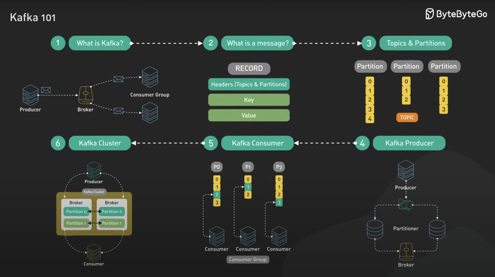

# Concept

## What is Kafka? 

Apache Kafka is a **distributed messaging system** that acts like a **digital post office** for applications. It allows different software systems to send and receive messages (called events) in real-time, without needing to talk directly to each other.

### Kafka in real-world scenario

คุณกำลังนั่งทำงานอยู่ในคาเฟ่แห่งนึง อยู่ดี ๆ คุณก็ได้ยินเสียงสนทนาของผู้หญิง 2 คนกำลังนินทาคนอื่นอยู่ เมื่อคุณเริ่มได้ยินดังนั้นคุณจึงเริ่มแอบฟัง (subscribe) อย่างเงียบ ๆ

---

## 🔑 Key Concepts

### 1. From Things ➝ Events
Traditionally, we think of data as **things** stored in tables:
- Users in a database
- Cars in inventory
- Items in stock

Kafka flips this perspective. It focuses on **events** — things that happen at a point in time:
- 🛒 An item is sold
- 🚘 A driver uses a turn signal
- 👆 A user clicks a button

👉 **Events = What happened + When it happened**

This “event-first” mindset forms the backbone of modern data systems.

---

### 2. Real-Time Processing
In the **batch world**, data is stored first (files/tables) and processed later.  
Kafka is different: it processes data **as soon as it happens**.

**Flow:**  
Event happens → Kafka → Your system reacts immediately

This is why Kafka powers **real-time applications**, not just after-the-fact reports.

---

### 3. Persistence of Events
Kafka is not just a pipe — it **remembers events**.

- Events don’t vanish after consumption.
- Consumers can:
    - Read at their own pace
    - Rewind and replay history
    - Join later and still access past data

👉 Kafka = **real-time + storage in one system**.

---

### 4. Scale
Kafka is built for **massive scale**:
- ⚡ Millions of events per second
- 📈 Billions per hour
- 🌍 Trillions per day

From startups to Fortune 500 companies, Kafka is used to power **mission-critical systems worldwide**.

---

### 5. Ecosystem: Beyond Just a Log
Kafka is more than a log — it’s the **foundation of a streaming data platform**.

- **Stream Processing** → real-time computation on events
- **Schema Governance** → enforce consistent event structures
- **Connectors** → integrate with databases, APIs, cloud systems
- **Cloud-native services** → e.g., Confluent Cloud manages Kafka for you

---

### 6. 🔄 Offsets & Replay

Unlike a queue, Kafka doesn’t delete events once consumed.
- Each consumer tracks its own **offset** (position in the log).
- You can **rewind** to reprocess past events (great for debugging, re-training ML models, or backfilling data).
- Kafka retains events for a set period (or forever, if log compaction is used).

## 🚀 Why Kafka Matters
- Provides a **universal foundation** for modern data systems
- Handles both **real-time streams** and **durable storage**
- Enables **microservices, pipelines, analytics, and event-driven apps**
- Supports an expanding **ecosystem of streaming-first tools**

👉 Kafka = the **backbone of event-driven architecture**.

---

