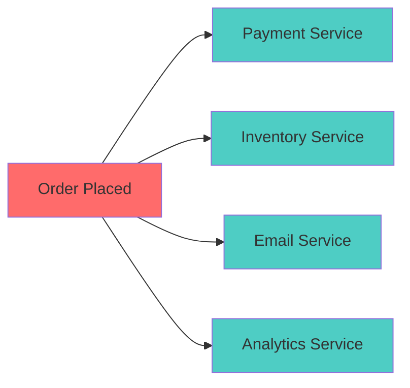
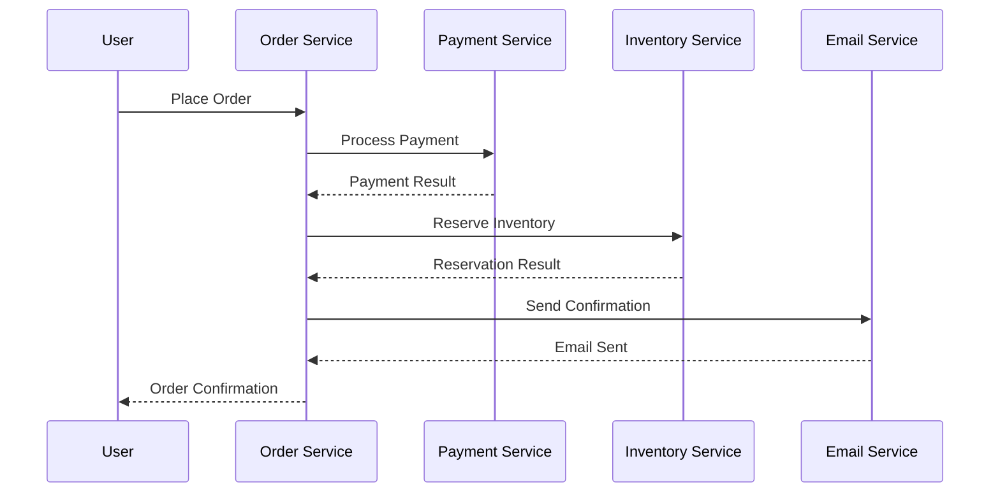
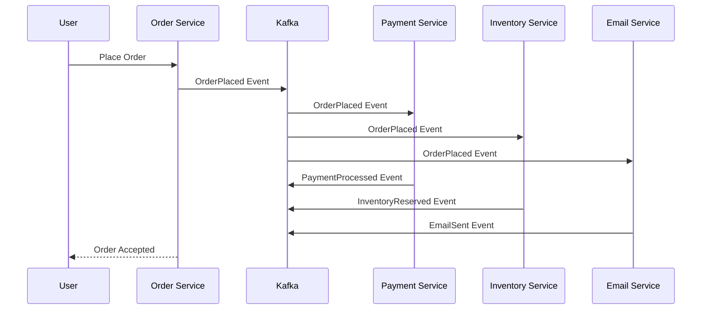
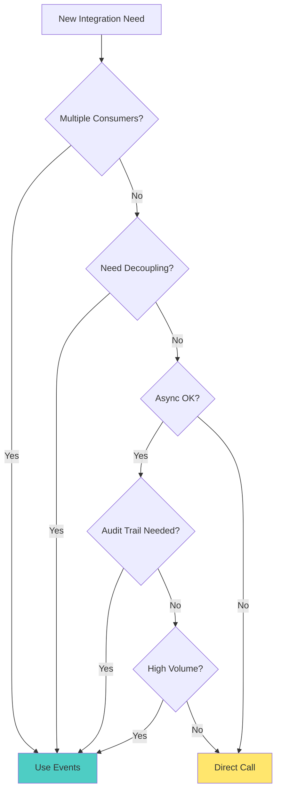

# Concept

## Why Kafka? Understanding Event-Driven Architecture

## 🎯 Learning Objectives

By the end of this lesson, you will:
- **Understand** event-driven architecture principles and benefits
- **Compare** traditional synchronous vs event-driven approaches  
- **Identify** real-world scenarios where Kafka excels
- **Design** basic event flows for business processes
- **Evaluate** when to use events vs direct service calls

## 🧠 Core Concepts

### Imagine
้เราอยู่ในที่สาธารณะ ถ้าเรานั่งเหม่อ ๆ  ก็เหมือนไม่ได้ฟัง topic อะไร ถ้าเราเริ่มสนใจเรื่องของใครซักคนแปลว่าเราเริ่ม subscribe แล้ว

### What is Event-Driven Architecture?

Event-driven architecture (EDA) is a software design pattern where services communicate by producing and consuming events. Instead of direct service-to-service calls, components react to events that represent meaningful business occurrences.



### Key Principles

#### 1. **Loose Coupling**
Services don't need to know about each other directly. They only need to understand the events they care about.

#### 2. **Asynchronous Communication**
Events enable non-blocking communication, improving system responsiveness and scalability.

#### 3. **Event Immutability**
Events represent facts about what happened and cannot be changed, providing a reliable audit trail.

#### 4. **Eventually Consistent**
Systems reach consistency over time through event processing, rather than requiring immediate consistency.

## 🆚 Traditional vs Event-Driven Architecture

### Traditional Synchronous Architecture



**Challenges:**
- **Tight Coupling**: Services must know about and call each other directly
- **Cascading Failures**: If any service fails, the entire operation fails
- **Scaling Complexity**: All services must scale together
- **Limited Flexibility**: Adding new features requires changing existing services

### Event-Driven Architecture



**Benefits:**
- **Loose Coupling**: Services only depend on event contracts
- **Fault Isolation**: Service failures don't immediately impact others
- **Independent Scaling**: Each service scales based on its workload
- **Easy Extension**: New services can subscribe to existing events

## 🏢 Real-World Use Cases

### 1. **E-Commerce Platforms**
**Challenge**: Coordinating order processing across multiple services
**Solution**: Event-driven order lifecycle
- `OrderPlaced` → Payment, Inventory, Shipping services react
- `PaymentProcessed` → Order confirmation and fulfillment
- `OrderShipped` → Tracking notifications and analytics

### 2. **Financial Services**
**Challenge**: Real-time fraud detection and compliance
**Solution**: Event streams for transaction monitoring
- Transaction events processed by ML models
- Real-time risk scoring and decision making
- Regulatory reporting and audit trails

### 3. **IoT and Sensor Data**
**Challenge**: Processing massive sensor data streams
**Solution**: Real-time data ingestion and analytics
- Millions of device events per second
- Stream processing for anomaly detection
- Time-series analytics and alerting

### 4. **Social Media Platforms**
**Challenge**: Real-time activity feeds and recommendations
**Solution**: Event-driven content delivery
- User activity events drive personalization
- Real-time feed updates and notifications
- Content recommendation engines

## 🎯 When to Use Events vs Direct Calls

### Use Events When:
- ✅ **Multiple consumers** need the same information
- ✅ **Decoupling** is important for independent development
- ✅ **Audit trails** and event history are required
- ✅ **Asynchronous processing** is acceptable
- ✅ **Scalability** and fault tolerance are priorities

### Use Direct Calls When:
- ✅ **Immediate response** is required
- ✅ **Simple request-response** pattern suffices
- ✅ **Strong consistency** is critical
- ✅ **Low complexity** and few integrations
- ✅ **Synchronous workflows** are necessary

## 📊 Decision Framework



## 🔄 Common Patterns

### **Event Sourcing**
Store events as the primary source of truth
```
UserRegistered → UserEmailChanged → UserUpgraded
```

### **CQRS (Command Query Responsibility Segregation)**
Separate read and write models using events
```
Commands → Events → Read Models
```

### **Saga Pattern**
Manage distributed transactions through event choreography
```
OrderCreated → PaymentRequested → InventoryReserved → OrderConfirmed
```

## 🎪 Real-World Example: Netflix

Netflix processes trillions of events daily:
- **User Interactions**: Play, pause, seek, rate
- **System Events**: Encoding complete, CDN cache updates
- **Business Events**: Subscription changes, recommendations
- **Operational Events**: Service health, performance metrics

This enables:
- **Personalized Recommendations**: Real-time preference learning
- **Global Content Delivery**: Optimized based on viewing patterns
- **Operational Excellence**: Predictive scaling and maintenance
- **Business Intelligence**: Content investment decisions


## 🚀 What's Next?

Now that you understand **why** event-driven architecture and Kafka matter, let's get hands-on! 

**Next**: [Lesson 2 - Environment Setup](../lesson_2/concept.md) where you'll set up your complete Kafka development environment and see events in action.

---

*"The best way to understand events is to start producing and consuming them. Let's build something real!"*