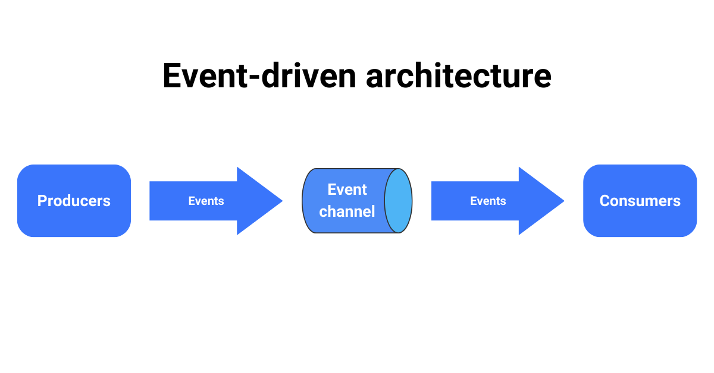
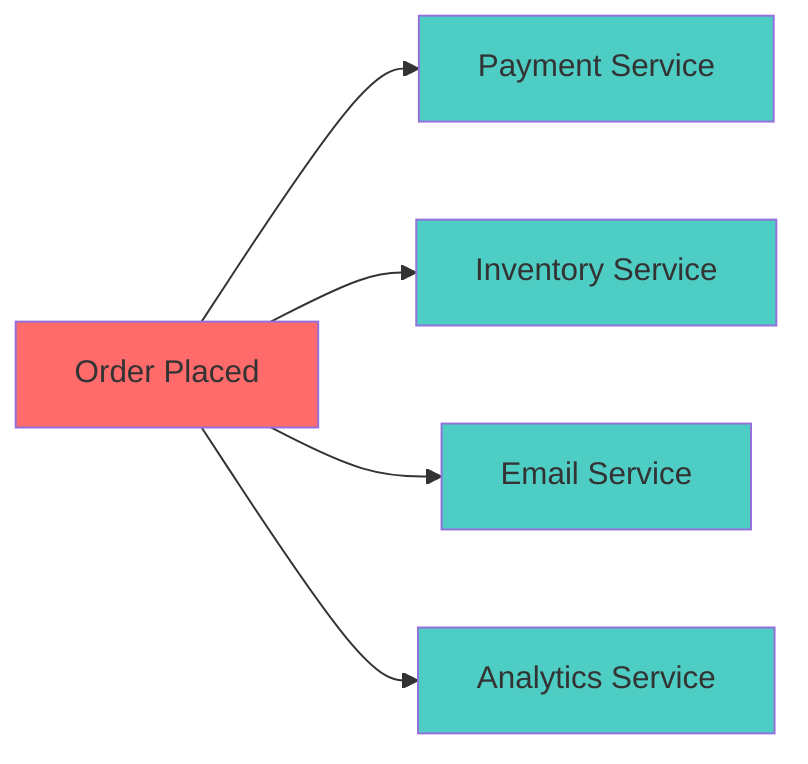
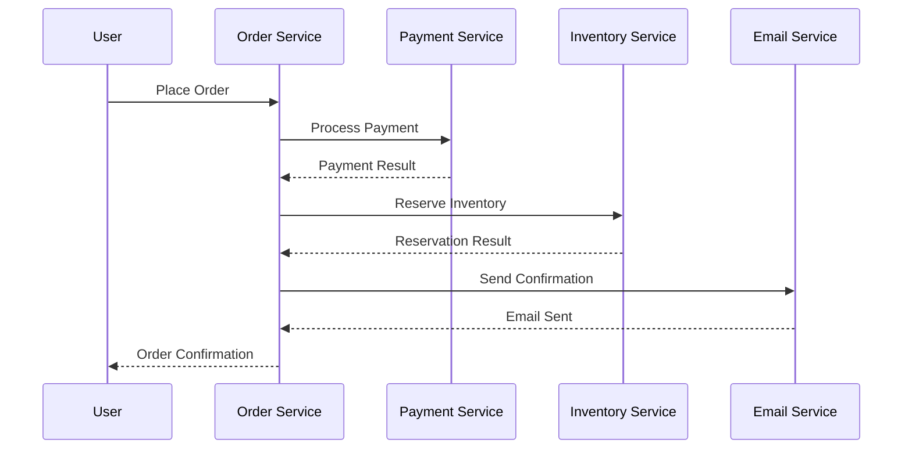
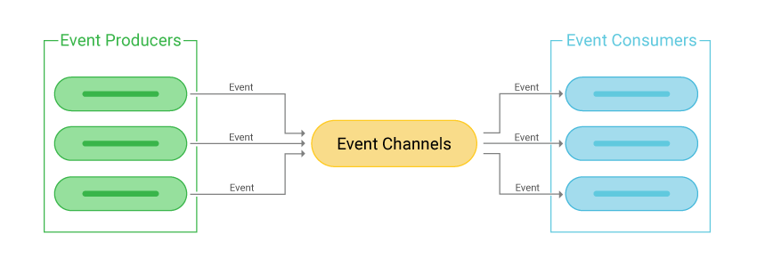
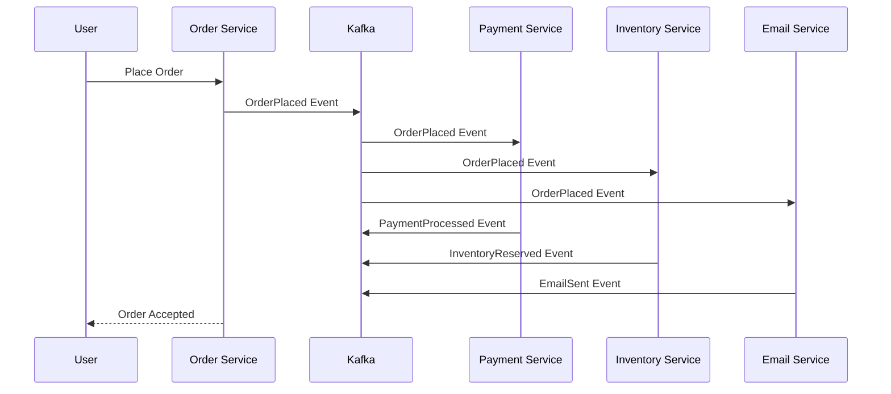
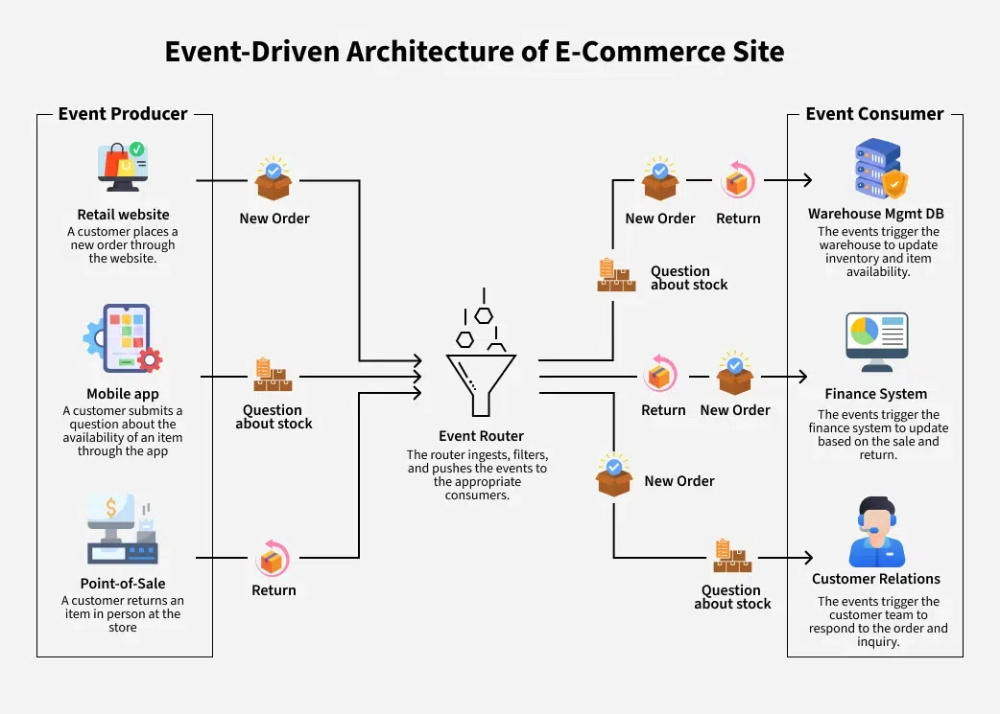

# Event

### What is Event-Driven Architecture?

Event-driven architecture (EDA) is a software design pattern where services communicate by producing and consuming events. 
Instead of direct service-to-service calls, components react to events that represent meaningful business occurrences.

### Key Principles

#### 1. **Loose Coupling**
Services don't need to know about each other directly. They only need to understand the events they care about.

#### 2. **Asynchronous Communication**
Events enable non-blocking communication, improving system responsiveness and scalability.

#### 3. **Event Immutability**
Events represent facts about what happened and cannot be changed, providing a reliable audit trail.

#### 4. **Eventually Consistent**
Systems reach consistency over time through event processing, rather than requiring immediate consistency.

## 🆚 Traditional vs Event-Driven Architecture

### Traditional Synchronous Architecture

**Challenges:**
- **Tight Coupling**: Services must know about and call each other directly
- **Cascading Failures**: If any service fails, the entire operation fails
- **Scaling Complexity**: All services must scale together
- **Limited Flexibility**: Adding new features requires changing existing services

### Event-Driven Architecture

**Benefits:**
- **Loose Coupling**: Services only depend on event contracts
- **Fault Isolation**: Service failures don't immediately impact others
- **Independent Scaling**: Each service scales based on its workload
- **Easy Extension**: New services can subscribe to existing events

| **Without Kafka** | **With Kafka** |
|------------------|----------------|
| Services call each other directly | Services communicate through events |
| If one service fails, others break | Services work independently |
| Hard to add new features | Easy to add new services |
| Tightly connected (rigid) | Loosely connected (flexible) |

## 🏢 Real-World Use Cases

### 1. **E-Commerce Platforms**
**Challenge**: Coordinating order processing across multiple services
**Solution**: Event-driven order lifecycle
- `OrderPlaced` → Payment, Inventory, Shipping services react
- `PaymentProcessed` → Order confirmation and fulfillment
- `OrderShipped` → Tracking notifications and analytics

### 2. **Financial Services**
**Challenge**: Real-time fraud detection and compliance
**Solution**: Event streams for transaction monitoring
- Transaction events processed by ML models
- Real-time risk scoring and decision making
- Regulatory reporting and audit trails

### 3. **IoT and Sensor Data**
**Challenge**: Processing massive sensor data streams
**Solution**: Real-time data ingestion and analytics
- Millions of device events per second
- Stream processing for anomaly detection
- Time-series analytics and alerting

### 4. **Social Media Platforms**
**Challenge**: Real-time activity feeds and recommendations
**Solution**: Event-driven content delivery
- User activity events drive personalization
- Real-time feed updates and notifications
- Content recommendation engines

## 🎪 Real-World Example: Netflix

Netflix processes trillions of events daily:
- **User Interactions**: Play, pause, seek, rate
- **System Events**: Encoding complete, CDN cache updates
- **Business Events**: Subscription changes, recommendations
- **Operational Events**: Service health, performance metrics

This enables:
- **Personalized Recommendations**: Real-time preference learning
- **Global Content Delivery**: Optimized based on viewing patterns
- **Operational Excellence**: Predictive scaling and maintenance
- **Business Intelligence**: Content investment decisions