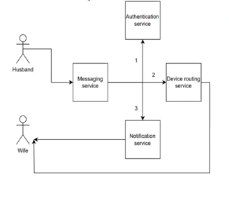

☀️ Workshop: “Good Morning System”

Design a simple system for sending “Good Morning” messages.

No right or wrong — just practice thinking about requirements, processes, and system design.

---

Fist: Simple Messaging
- Requirement: Husband sends “Good Morning” to Wife.

Question: How would you design this system? (e.g., phone app, direct API call, database + notification, etc.)

👉 Keep it very simple, just one sender and one receiver.

---

Next: Handling Many Senders
- Requirement: It’s 7AM worldwide — 10M husbands want to send “Good Morning” at the same time.

Question: How do we make sure the system doesn’t crash and all messages get delivered?

👉 Hint: Think about queues, buffers, or batch processing.

---

Next: Delivery to Multiple Devices

Example: Wife has 2 devices (phone + tablet).

Question: How do we make sure the message arrives on both devices, not just one?

👉 Hint: Think about fan-out or sending to multiple consumers, how we know and store the customer device.

---

Last: Ordering the Messages

Example: Husband sends two messages:

- “I’ll be home early ❤️”

- then: “Oops, sorry, I’ll be late 😭”

Problem: Sometimes the second one arrives first.

Question: How do we make sure messages stay in the right order?
