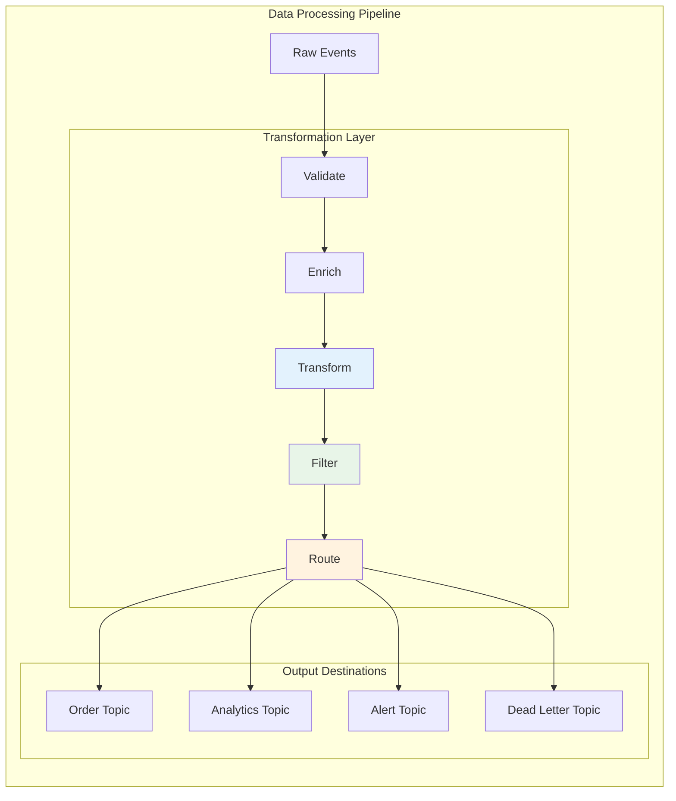

# Concept

## Message Transformation & Filtering - Building Data Processing Pipelines

## 🎯 Objective

Master message transformation and filtering patterns to build powerful data processing pipelines. Learn to transform, enrich, route, and filter messages based on content and business rules, creating flexible and maintainable event-driven architectures.

## 🔄 **The Power of Message Transformation**

Message transformation enables you to:
- **Adapt** message formats between services
- **Enrich** messages with additional data
- **Filter** messages based on business rules
- **Route** messages to appropriate destinations
- **Aggregate** related messages into summaries



## 🔧 **Message Transformation Patterns**

### 1. **Field Mapping and Data Type Conversion**

```kotlin
@Component
class MessageTransformer {
    
    fun transformUserEvent(rawEvent: Map<String, Any>): UserEvent {
        return UserEvent(
            userId = rawEvent["user_id"]?.toString() ?: throw ValidationException("Missing user_id"),
            email = rawEvent["email_address"]?.toString()?.lowercase() ?: "",
            firstName = rawEvent["first_name"]?.toString()?.trim() ?: "",
            lastName = rawEvent["last_name"]?.toString()?.trim() ?: "",
            age = (rawEvent["age"] as? Number)?.toInt() ?: 0,
            isActive = when (rawEvent["status"]?.toString()?.uppercase()) {
                "ACTIVE", "ENABLED", "1", "TRUE" -> true
                else -> false
            },
            registrationDate = parseDate(rawEvent["reg_date"]),
            metadata = extractMetadata(rawEvent)
        )
    }
    
    private fun parseDate(dateValue: Any?): Instant {
        return when (dateValue) {
            is String -> {
                try {
                    Instant.parse(dateValue)
                } catch (e: Exception) {
                    // Try different formats
                    SimpleDateFormat("yyyy-MM-dd").parse(dateValue).toInstant()
                }
            }
            is Number -> Instant.ofEpochMilli(dateValue.toLong())
            else -> Instant.now()
        }
    }
    
    private fun extractMetadata(rawEvent: Map<String, Any>): Map<String, String> {
        return rawEvent.filterKeys { it.startsWith("meta_") }
            .mapKeys { it.key.removePrefix("meta_") }
            .mapValues { it.value.toString() }
    }
}
```

### 2. **Message Enrichment with External Data**

```kotlin
@Component
class MessageEnricher {
    
    @Autowired
    private lateinit var userService: UserService
    
    @Autowired
    private lateinit var locationService: LocationService
    
    @Autowired
    private lateinit var cacheManager: CacheManager
    
    @Cacheable("user-profiles")
    fun enrichWithUserProfile(event: OrderEvent): EnrichedOrderEvent {
        val userProfile = userService.getUserProfile(event.customerId)
        val locationInfo = locationService.getLocationInfo(userProfile.zipCode)
        
        return EnrichedOrderEvent(
            orderId = event.orderId,
            customerId = event.customerId,
            orderAmount = event.orderAmount,
            items = event.items,
            
            // Enriched data
            customerTier = userProfile.tier,
            customerLifetimeValue = userProfile.lifetimeValue,
            customerSegment = userProfile.segment,
            shippingRegion = locationInfo.region,
            timeZone = locationInfo.timeZone,
            estimatedDeliveryDays = calculateDeliveryTime(locationInfo),
            
            // Computed fields
            isHighValueOrder = event.orderAmount > userProfile.averageOrderValue * 2,
            riskScore = calculateRiskScore(event, userProfile),
            eligiblePromotions = findEligiblePromotions(event, userProfile),
            
            originalEvent = event
        )
    }
    
    @Async
    fun enrichWithRealTimeData(event: UserActivityEvent): CompletableFuture<EnrichedUserActivityEvent> {
        return CompletableFuture.supplyAsync {
            val recentActivity = userService.getRecentActivity(event.userId, Duration.ofHours(24))
            val deviceInfo = deviceService.getDeviceInfo(event.deviceId)
            val sessionData = sessionService.getSessionData(event.sessionId)
            
            EnrichedUserActivityEvent(
                userId = event.userId,
                activityType = event.activityType,
                timestamp = event.timestamp,
                
                // Real-time enrichment
                sessionDuration = sessionData.duration,
                pageViewsInSession = sessionData.pageViews,
                deviceType = deviceInfo.type,
                browserInfo = deviceInfo.browser,
                isReturnUser = recentActivity.isNotEmpty(),
                activityScore = calculateActivityScore(recentActivity),
                
                originalEvent = event
            )
        }
    }
}
```

### 3. **Conditional Message Transformation**

```kotlin
@Component
class ConditionalTransformer {
    
    fun transformBasedOnEventType(event: GenericEvent): List<SpecificEvent> {
        return when (event.eventType) {
            "USER_REGISTRATION" -> listOf(
                transformToUserCreatedEvent(event),
                transformToWelcomeEmailEvent(event),
                transformToAnalyticsEvent(event)
            )
            
            "ORDER_PLACED" -> listOf(
                transformToOrderEvent(event),
                transformToInventoryUpdateEvent(event),
                transformToPaymentProcessingEvent(event)
            )
            
            "PAYMENT_COMPLETED" -> listOf(
                transformToOrderConfirmationEvent(event),
                transformToShippingEvent(event),
                transformToLoyaltyPointsEvent(event)
            )
            
            else -> {
                logger.warn("Unknown event type: ${event.eventType}")
                emptyList()
            }
        }
    }
    
    fun transformBasedOnContent(event: OrderEvent): OrderEvent {
        return event.copy(
            // Apply business rules based on content
            priority = when {
                event.orderAmount > 1000 -> OrderPriority.HIGH
                event.items.any { it.category == "URGENT" } -> OrderPriority.HIGH
                event.customerTier == "PREMIUM" -> OrderPriority.MEDIUM
                else -> OrderPriority.NORMAL
            },
            
            shippingMethod = when {
                event.orderAmount > 500 -> ShippingMethod.EXPRESS
                event.deliveryDate.isBefore(LocalDate.now().plusDays(2)) -> ShippingMethod.OVERNIGHT
                else -> ShippingMethod.STANDARD
            },
            
            discountApplied = when {
                event.customerTier == "PREMIUM" && event.orderAmount > 200 -> 0.10
                event.items.size > 5 -> 0.05
                else -> 0.0
            }
        )
    }
}
```

## 🔍 **Message Filtering Patterns**

### 1. **Content-Based Filtering**

```kotlin
@Component
class MessageFilter {
    
    fun isValidOrder(order: OrderEvent): Boolean {
        return order.orderAmount > 0 &&
               order.customerId.isNotBlank() &&
               order.items.isNotEmpty() &&
               order.items.all { it.quantity > 0 && it.price > 0 }
    }
    
    fun shouldProcessForRegion(event: OrderEvent, targetRegion: String): Boolean {
        return event.shippingAddress.region == targetRegion
    }
    
    fun isHighPriorityEvent(event: GenericEvent): Boolean {
        return when {
            event.eventType == "SECURITY_ALERT" -> true
            event.eventType == "PAYMENT_FAILURE" -> true
            event.eventType == "ORDER_CANCELLED" && 
                (event.data["orderAmount"] as? Double ?: 0.0) > 1000 -> true
            event.data["priority"]?.toString()?.uppercase() == "HIGH" -> true
            else -> false
        }
    }
    
    fun filterByTimeWindow(events: List<TimestampedEvent>, windowHours: Int): List<TimestampedEvent> {
        val cutoff = Instant.now().minus(windowHours.toLong(), ChronoUnit.HOURS)
        return events.filter { it.timestamp.isAfter(cutoff) }
    }
}

@Component
class BusinessRuleFilter {
    
    fun shouldProcessPayment(payment: PaymentEvent): PaymentFilterResult {
        val reasons = mutableListOf<String>()
        
        // Amount validation
        when {
            payment.amount <= 0 -> reasons.add("Invalid amount: ${payment.amount}")
            payment.amount > 10000 -> reasons.add("Amount exceeds daily limit")
        }
        
        // Customer validation
        if (payment.customerId.isBlank()) {
            reasons.add("Missing customer ID")
        }
        
        // Currency validation
        if (payment.currency !in listOf("USD", "EUR", "GBP")) {
            reasons.add("Unsupported currency: ${payment.currency}")
        }
        
        // Fraud check
        if (isSuspiciousTransaction(payment)) {
            reasons.add("Transaction flagged for review")
        }
        
        return PaymentFilterResult(
            shouldProcess = reasons.isEmpty(),
            reasons = reasons,
            action = if (reasons.isEmpty()) FilterAction.PROCESS else FilterAction.REJECT
        )
    }
    
    private fun isSuspiciousTransaction(payment: PaymentEvent): Boolean {
        // Implement fraud detection logic
        return payment.amount > 5000 && 
               payment.metadata["deviceFingerprint"] == null
    }
}
```

### 2. **Predicate-Based Filtering**

```kotlin
@Component
class PredicateFilters {
    
    // User activity filters
    val activeUsersOnly: (UserEvent) -> Boolean = { user ->
        user.lastLoginDate.isAfter(Instant.now().minus(30, ChronoUnit.DAYS))
    }
    
    val premiumUsersOnly: (UserEvent) -> Boolean = { user ->
        user.subscriptionTier in listOf("PREMIUM", "ENTERPRISE")
    }
    
    val newUsersOnly: (UserEvent) -> Boolean = { user ->
        user.registrationDate.isAfter(Instant.now().minus(7, ChronoUnit.DAYS))
    }
    
    // Order filters
    val highValueOrders: (OrderEvent) -> Boolean = { order ->
        order.orderAmount > 500.0
    }
    
    val internationalOrders: (OrderEvent) -> Boolean = { order ->
        order.shippingAddress.country != "US"
    }
    
    val rushOrders: (OrderEvent) -> Boolean = { order ->
        order.requestedDeliveryDate.isBefore(LocalDate.now().plusDays(2))
    }
    
    // Composite filters
    fun createCompositeFilter(vararg predicates: (OrderEvent) -> Boolean): (OrderEvent) -> Boolean {
        return { event ->
            predicates.all { it(event) }
        }
    }
    
    fun createAnyFilter(vararg predicates: (OrderEvent) -> Boolean): (OrderEvent) -> Boolean {
        return { event ->
            predicates.any { it(event) }
        }
    }
    
    // Usage example
    fun getFilteredEvents(events: List<OrderEvent>): FilteredEvents {
        val highValueInternational = createCompositeFilter(highValueOrders, internationalOrders)
        val priorityOrders = createAnyFilter(highValueOrders, rushOrders)
        
        return FilteredEvents(
            highValueInternational = events.filter(highValueInternational),
            priorityOrders = events.filter(priorityOrders),
            standardOrders = events.filterNot(priorityOrders)
        )
    }
}
```

## 🎯 **Message Routing Patterns**

### 1. **Content-Based Routing**

```kotlin
@Component
class MessageRouter {
    
    @Autowired
    private lateinit var kafkaTemplate: KafkaTemplate<String, Any>
    
    fun routeOrderEvent(order: OrderEvent) {
        when {
            order.orderAmount > 1000 -> {
                // High-value orders get special processing
                kafkaTemplate.send("high-value-orders", order.orderId, order)
                kafkaTemplate.send("fraud-check-queue", order.orderId, order)
            }
            
            order.shippingAddress.country != "US" -> {
                kafkaTemplate.send("international-orders", order.orderId, order)
            }
            
            order.items.any { it.category == "ELECTRONICS" } -> {
                kafkaTemplate.send("electronics-orders", order.orderId, order)
                kafkaTemplate.send("warranty-processing", order.orderId, order)
            }
            
            else -> {
                kafkaTemplate.send("standard-orders", order.orderId, order)
            }
        }
        
        // Always send to analytics
        kafkaTemplate.send("order-analytics", order.orderId, order)
    }
    
    fun routeUserEvent(user: UserEvent) {
        val routes = mutableListOf<String>()
        
        // Determine routing based on user properties
        when (user.eventType) {
            "USER_CREATED" -> {
                routes.add("welcome-email-queue")
                routes.add("user-analytics")
                if (user.referralCode != null) {
                    routes.add("referral-processing")
                }
            }
            
            "USER_UPGRADED" -> {
                routes.add("subscription-management")
                routes.add("billing-updates")
                routes.add("feature-notifications")
            }
            
            "USER_DELETED" -> {
                routes.add("account-cleanup")
                routes.add("data-purge-queue")
            }
        }
        
        // Send to all determined routes
        routes.forEach { topic ->
            kafkaTemplate.send(topic, user.userId, user)
        }
    }
}
```

### 2. **Dynamic Routing with Rules Engine**

```kotlin
@Component
class RulesBasedRouter {
    
    data class RoutingRule(
        val name: String,
        val condition: (Any) -> Boolean,
        val targetTopics: List<String>,
        val priority: Int = 0
    )
    
    private val routingRules = listOf(
        RoutingRule(
            name = "high-value-payment",
            condition = { event -> 
                (event as? PaymentEvent)?.amount?.let { it > 1000 } == true 
            },
            targetTopics = listOf("high-value-payments", "fraud-analysis"),
            priority = 10
        ),
        
        RoutingRule(
            name = "failed-payment",
            condition = { event ->
                (event as? PaymentEvent)?.status == PaymentStatus.FAILED
            },
            targetTopics = listOf("payment-failures", "retry-queue"),
            priority = 5
        ),
        
        RoutingRule(
            name = "international-user",
            condition = { event ->
                (event as? UserEvent)?.country?.let { it != "US" } == true
            },
            targetTopics = listOf("international-users", "compliance-check"),
            priority = 3
        )
    )
    
    fun routeMessage(event: Any): List<String> {
        return routingRules
            .filter { it.condition(event) }
            .sortedByDescending { it.priority }
            .flatMap { it.targetTopics }
            .distinct()
    }
    
    fun addRoutingRule(rule: RoutingRule) {
        // In a real implementation, this would update the rules in a thread-safe way
        // and possibly persist to a configuration store
    }
}
```

## 🔄 **Stream Processing Implementation**

### 1. **Transformation Pipeline Consumer**

```kotlin
@Component
class TransformationPipelineConsumer {
    
    @Autowired
    private lateinit var messageTransformer: MessageTransformer
    
    @Autowired
    private lateinit var messageEnricher: MessageEnricher
    
    @Autowired
    private lateinit var messageFilter: MessageFilter
    
    @Autowired
    private lateinit var messageRouter: MessageRouter
    
    @KafkaListener(topics = ["raw-events"])
    fun processRawEvent(
        @Payload rawEvent: Map<String, Any>,
        @Header(KafkaHeaders.RECEIVED_TOPIC) topic: String,
        acknowledgment: Acknowledgment
    ) {
        try {
            // Step 1: Transform raw data to structured event
            val structuredEvent = messageTransformer.transformUserEvent(rawEvent)
            
            // Step 2: Enrich with additional data
            val enrichedEvent = messageEnricher.enrichWithUserProfile(structuredEvent)
            
            // Step 3: Apply business rules and filters
            if (messageFilter.isValidOrder(enrichedEvent)) {
                
                // Step 4: Route to appropriate destinations
                messageRouter.routeOrderEvent(enrichedEvent)
                
                logger.info("Successfully processed and routed event: ${enrichedEvent.orderId}")
            } else {
                logger.warn("Event failed validation: ${enrichedEvent.orderId}")
                kafkaTemplate.send("invalid-events", enrichedEvent.orderId, enrichedEvent)
            }
            
            acknowledgment.acknowledge()
            
        } catch (e: Exception) {
            logger.error("Failed to process raw event", e)
            kafkaTemplate.send("processing-errors", rawEvent.toString(), rawEvent)
            acknowledgment.acknowledge() // Acknowledge to prevent retry loops
        }
    }
}
```

### 2. **Parallel Processing Pipeline**

```kotlin
@Component
class ParallelTransformationProcessor {
    
    @Async("kafkaExecutor")
    @KafkaListener(
        topics = ["user-events"],
        concurrency = "3"
    )
    fun processUserEventPipeline(
        @Payload event: UserEvent,
        acknowledgment: Acknowledgment
    ) {
        CompletableFuture.allOf(
            processForAnalytics(event),
            processForNotifications(event),
            processForRecommendations(event)
        ).whenComplete { _, exception ->
            if (exception == null) {
                acknowledgment.acknowledge()
            } else {
                logger.error("Parallel processing failed for user ${event.userId}", exception)
            }
        }
    }
    
    @Async
    private fun processForAnalytics(event: UserEvent): CompletableFuture<Void> {
        return CompletableFuture.runAsync {
            val analyticsEvent = transformToAnalyticsEvent(event)
            kafkaTemplate.send("user-analytics", event.userId, analyticsEvent)
        }
    }
    
    @Async
    private fun processForNotifications(event: UserEvent): CompletableFuture<Void> {
        return CompletableFuture.runAsync {
            if (shouldSendNotification(event)) {
                val notificationEvent = transformToNotificationEvent(event)
                kafkaTemplate.send("notifications", event.userId, notificationEvent)
            }
        }
    }
    
    @Async
    private fun processForRecommendations(event: UserEvent): CompletableFuture<Void> {
        return CompletableFuture.runAsync {
            val recommendationData = transformToRecommendationData(event)
            kafkaTemplate.send("recommendation-engine", event.userId, recommendationData)
        }
    }
}
```

## 📊 **Monitoring and Metrics**

### 1. **Transformation Metrics**

```kotlin
@Component
class TransformationMetrics {
    
    private val transformationCounter = Counter.builder("kafka.transformations")
        .description("Count of message transformations")
        .register(Metrics.globalRegistry)
    
    private val transformationTimer = Timer.builder("kafka.transformation.time")
        .description("Time to transform messages")
        .register(Metrics.globalRegistry)
    
    private val filterCounter = Counter.builder("kafka.filters.applied")
        .description("Count of filter applications")
        .register(Metrics.globalRegistry)
    
    fun recordTransformation(transformationType: String, success: Boolean, duration: Duration) {
        transformationCounter.increment(
            Tags.of(
                Tag.of("type", transformationType),
                Tag.of("status", if (success) "success" else "failure")
            )
        )
        
        transformationTimer.record(duration)
    }
    
    fun recordFilter(filterName: String, passed: Boolean, itemCount: Int) {
        filterCounter.increment(
            Tags.of(
                Tag.of("filter", filterName),
                Tag.of("result", if (passed) "passed" else "filtered"),
                Tag.of("item_count", itemCount.toString())
            )
        )
    }
}
```

### 2. **Pipeline Health Monitoring**

```kotlin
@Component
class PipelineHealthMonitor {
    
    @Scheduled(fixedRate = 60000) // Every minute
    fun monitorPipelineHealth() {
        val metrics = collectPipelineMetrics()
        
        // Check for anomalies
        if (metrics.errorRate > 0.05) { // 5% error rate
            logger.warn("High error rate detected in transformation pipeline: ${metrics.errorRate}")
        }
        
        if (metrics.averageProcessingTime > Duration.ofSeconds(10)) {
            logger.warn("Slow processing detected: ${metrics.averageProcessingTime}")
        }
        
        // Update health metrics
        Metrics.globalRegistry.gauge("kafka.pipeline.error_rate", metrics.errorRate)
        Metrics.globalRegistry.gauge("kafka.pipeline.throughput", metrics.throughput)
        Metrics.globalRegistry.gauge("kafka.pipeline.processing_time", metrics.averageProcessingTime.toMillis())
    }
}
```

## ✅ **Best Practices Summary**

### 🔄 **Transformation Design**
- **Keep transformations simple** and focused on single responsibilities
- **Make transformations idempotent** to handle reprocessing
- **Use schema validation** to ensure data quality
- **Implement comprehensive error handling** with proper logging

### 🔍 **Filtering Strategy**
- **Apply filters early** in the pipeline to reduce processing load
- **Use composable predicates** for flexible filter combinations
- **Monitor filter effectiveness** to optimize rules
- **Provide bypass mechanisms** for testing and debugging

### 🎯 **Routing Efficiency**
- **Use content-based routing** to minimize unnecessary processing
- **Implement dynamic routing** for flexible message flow
- **Cache routing decisions** when possible
- **Monitor routing patterns** to optimize topic design

### 📊 **Pipeline Operations**
- **Monitor transformation performance** and success rates
- **Implement circuit breakers** for external service calls
- **Use async processing** for independent transformations
- **Track message lineage** for debugging and auditing

## 🚀 **What's Next?**

You've mastered message transformation and filtering! Next, learn about implementing fan-out patterns in [Lesson 11: Fan-out Pattern - Notification Systems](../lesson_11/concept.md), where you'll build systems that distribute single events to multiple consumers for parallel processing.

---

*Message transformation and filtering are the building blocks of sophisticated event-driven architectures. These patterns enable you to build flexible, maintainable systems that can adapt to changing business requirements while maintaining data quality and processing efficiency.*