# Concept

## Manual Acknowledgment & Idempotent Consumers - Exactly-Once Processing

## 🎯 Objective

Master exactly-once processing patterns through manual acknowledgment, idempotent consumers, and duplicate prevention strategies. Build resilient systems that handle message processing failures gracefully while maintaining data consistency.

## ⚠️ **The Challenge: At-Least-Once vs Exactly-Once**

Kafka provides **at-least-once delivery** by default, which can lead to duplicate processing:

```mermaid
graph TB
    subgraph "At-Least-Once Delivery Problem"
        PRODUCER[Producer sends message]
        KAFKA[Kafka stores message]
        CONSUMER[Consumer processes message]
        ACK[Consumer commits offset]
        FAILURE[❌ Commit fails]
        REPROCESS[🔄 Message reprocessed]
        DUPLICATE[💥 Duplicate processing]
    end
    
    PRODUCER --> KAFKA
    KAFKA --> CONSUMER
    CONSUMER --> ACK
    ACK --> FAILURE
    FAILURE --> REPROCESS
    REPROCESS --> DUPLICATE
    
    style FAILURE fill:#ffebee
    style DUPLICATE fill:#ffebee
```



**Common scenarios causing duplicates:**
- Network failures during offset commits
- Consumer restarts before committing
- Rebalancing during processing
- Timeout during external service calls

## 🎯 **Manual Acknowledgment: Taking Control**

Manual acknowledgment gives you precise control over when messages are marked as consumed.

### 1. **Enabling Manual Acknowledgment**

```yaml
spring:
  kafka:
    consumer:
      enable-auto-commit: false  # Disable automatic offset commits
      group-id: manual-ack-group
    listener:
      ack-mode: manual_immediate  # Acknowledge immediately when called
      # ack-mode: manual          # Acknowledge when listener method completes
```

### 2. **Basic Manual Acknowledgment Pattern**

```kotlin
@Component
class ManualAckConsumer {
    
    private val logger = LoggerFactory.getLogger(ManualAckConsumer::class.java)
    
    @KafkaListener(topics = ["payment-events"])
    fun processPayment(
        @Payload payment: PaymentEvent,
        @Header(KafkaHeaders.RECEIVED_PARTITION) partition: Int,
        @Header(KafkaHeaders.OFFSET) offset: Long,
        acknowledgment: Acknowledgment
    ) {
        try {
            logger.info("Processing payment ${payment.paymentId} from partition $partition at offset $offset")
            
            // Step 1: Validate payment
            validatePayment(payment)
            
            // Step 2: Process with external service
            val result = paymentGateway.processPayment(payment)
            
            // Step 3: Update database
            paymentRepository.save(result)
            
            // Step 4: Send confirmation
            notificationService.sendConfirmation(payment.customerId, result)
            
            // ✅ Only acknowledge after ALL steps succeed
            acknowledgment.acknowledge()
            logger.info("Successfully processed and acknowledged payment ${payment.paymentId}")
            
        } catch (e: Exception) {
            logger.error("Failed to process payment ${payment.paymentId}, will retry", e)
            // Don't acknowledge - message will be redelivered
        }
    }
}
```

### 3. **Advanced Acknowledgment Patterns**

```kotlin
@Component
class AdvancedAckConsumer {
    
    @KafkaListener(topics = ["order-events"])
    fun processOrder(
        @Payload order: OrderEvent,
        @Header(KafkaHeaders.RECEIVED_PARTITION) partition: Int,
        @Header(KafkaHeaders.OFFSET) offset: Long,
        acknowledgment: Acknowledgment
    ) {
        val processingId = UUID.randomUUID().toString()
        
        try {
            // Create processing record for tracking
            val processingRecord = ProcessingRecord(
                id = processingId,
                messageId = order.orderId,
                partition = partition,
                offset = offset,
                status = ProcessingStatus.IN_PROGRESS,
                startTime = Instant.now()
            )
            
            processingTracker.save(processingRecord)
            
            // Process order
            val result = processOrderWithRetries(order)
            
            // Update processing record
            processingTracker.updateStatus(processingId, ProcessingStatus.COMPLETED)
            
            // Acknowledge only after successful completion and tracking
            acknowledgment.acknowledge()
            
        } catch (e: RetryableException) {
            logger.warn("Retryable error processing order ${order.orderId}", e)
            processingTracker.updateStatus(processingId, ProcessingStatus.FAILED_RETRYABLE)
            // Don't acknowledge - allow retry
            
        } catch (e: NonRetryableException) {
            logger.error("Non-retryable error processing order ${order.orderId}", e)
            processingTracker.updateStatus(processingId, ProcessingStatus.FAILED_PERMANENT)
            
            // Send to dead letter topic
            deadLetterProducer.send(order, e)
            
            // Acknowledge to prevent reprocessing
            acknowledgment.acknowledge()
        }
    }
}
```

## 🔒 **Idempotent Consumers: Preventing Duplicate Processing**

Idempotent processing ensures the same message can be processed multiple times with the same result.

```mermaid
graph TB
    subgraph "Idempotent Processing Pattern"
        MSG[Incoming Message<br/>ID: msg-123]
        CHECK[Check Processing History]
        PROCESS[Process Message]
        STORE[Store Processing Record]
        ACK[Acknowledge Message]
        SKIP[Skip Processing<br/>Already Handled]
        
        subgraph "Deduplication Store"
            DB[(Database<br/>Processing Records)]
            CACHE[Redis Cache<br/>Recent Messages]
            TABLE[message_id | status | timestamp]
        end
    end
    
    MSG --> CHECK
    CHECK -->|Not Found| PROCESS
    CHECK -->|Found: Completed| SKIP
    CHECK -->|Found: In Progress| SKIP
    PROCESS --> STORE
    STORE --> ACK
    SKIP --> ACK
    
    CHECK -.->|Query| DB
    CHECK -.->|Fast Lookup| CACHE
    STORE -.->|Insert/Update| TABLE
    
    style SKIP fill:#e8f5e8
    style PROCESS fill:#fff3e0
    style STORE fill:#e3f2fd
    style CHECK fill:#f3e5f5
```

### 1. **Message Deduplication Strategies**

#### **Strategy 1: Unique Message IDs**

```kotlin
@Component
class IdempotentPaymentProcessor {
    
    private val processedMessages = ConcurrentHashMap<String, PaymentResult>()
    
    @KafkaListener(topics = ["payment-requests"])
    fun processPayment(
        @Payload payment: PaymentEvent,
        acknowledgment: Acknowledgment
    ) {
        val messageId = payment.messageId // Unique identifier
        
        // Check if already processed
        val existingResult = processedMessages[messageId]
        if (existingResult != null) {
            logger.info("Payment $messageId already processed, returning cached result")
            acknowledgment.acknowledge()
            return
        }
        
        try {
            // Process payment
            val result = paymentService.processPayment(payment)
            
            // Cache result for deduplication
            processedMessages[messageId] = result
            
            acknowledgment.acknowledge()
            
        } catch (e: Exception) {
            logger.error("Failed to process payment $messageId", e)
            // Don't acknowledge on failure
        }
    }
}
```

#### **Strategy 2: Database-Based Deduplication**

```kotlin
@Entity
data class ProcessedMessage(
    @Id val messageId: String,
    val topic: String,
    val partition: Int,
    val offset: Long,
    val processedAt: Instant,
    val result: String? = null
)

@Component
class DatabaseIdempotentConsumer {
    
    @Autowired
    private lateinit var processedMessageRepository: ProcessedMessageRepository
    
    @Transactional
    @KafkaListener(topics = ["user-events"])
    fun processUserEvent(
        @Payload event: UserEvent,
        @Header(KafkaHeaders.RECEIVED_TOPIC) topic: String,
        @Header(KafkaHeaders.RECEIVED_PARTITION) partition: Int,
        @Header(KafkaHeaders.OFFSET) offset: Long,
        acknowledgment: Acknowledgment
    ) {
        val messageId = event.eventId
        
        // Check if already processed (atomic check-and-set)
        val existing = processedMessageRepository.findByMessageId(messageId)
        if (existing != null) {
            logger.info("Event $messageId already processed at ${existing.processedAt}")
            acknowledgment.acknowledge()
            return
        }
        
        try {
            // Process the event
            val result = userService.processUserEvent(event)
            
            // Record processing in same transaction
            processedMessageRepository.save(ProcessedMessage(
                messageId = messageId,
                topic = topic,
                partition = partition,
                offset = offset,
                processedAt = Instant.now(),
                result = result.toString()
            ))
            
            acknowledgment.acknowledge()
            
        } catch (e: Exception) {
            logger.error("Failed to process user event $messageId", e)
            // Transaction will rollback, no acknowledgment
        }
    }
}
```

### 2. **Exactly-Once Semantics with Kafka Transactions**

```kotlin
@Configuration
@EnableTransactionManagement
class TransactionalKafkaConfig {
    
    @Bean
    fun transactionalProducerFactory(): ProducerFactory<String, Any> {
        val props = HashMap<String, Any>()
        props[ProducerConfig.BOOTSTRAP_SERVERS_CONFIG] = "localhost:9092"
        props[ProducerConfig.KEY_SERIALIZER_CLASS_CONFIG] = StringSerializer::class.java
        props[ProducerConfig.VALUE_SERIALIZER_CLASS_CONFIG] = JsonSerializer::class.java
        
        // Enable transactions
        props[ProducerConfig.TRANSACTIONAL_ID_CONFIG] = "tx-producer-${UUID.randomUUID()}"
        props[ProducerConfig.ACKS_CONFIG] = "all"
        props[ProducerConfig.RETRIES_CONFIG] = Int.MAX_VALUE
        props[ProducerConfig.ENABLE_IDEMPOTENCE_CONFIG] = true
        
        return DefaultKafkaProducerFactory(props)
    }
    
    @Bean
    fun transactionalKafkaTemplate(): KafkaTemplate<String, Any> {
        return KafkaTemplate(transactionalProducerFactory())
    }
    
    @Bean
    fun transactionalConsumerFactory(): ConsumerFactory<String, Any> {
        val props = HashMap<String, Any>()
        props[ConsumerConfig.BOOTSTRAP_SERVERS_CONFIG] = "localhost:9092"
        props[ConsumerConfig.KEY_DESERIALIZER_CLASS_CONFIG] = StringDeserializer::class.java
        props[ConsumerConfig.VALUE_DESERIALIZER_CLASS_CONFIG] = JsonDeserializer::class.java
        props[ConsumerConfig.GROUP_ID_CONFIG] = "transactional-group"
        
        // Enable read committed for exactly-once
        props[ConsumerConfig.ISOLATION_LEVEL_CONFIG] = "read_committed"
        props[ConsumerConfig.ENABLE_AUTO_COMMIT_CONFIG] = false
        
        return DefaultKafkaConsumerFactory(props)
    }
}

@Component
class TransactionalConsumer {
    
    @Autowired
    private lateinit var transactionalKafkaTemplate: KafkaTemplate<String, Any>
    
    @KafkaListener(
        topics = ["order-events"],
        containerFactory = "kafkaListenerContainerFactory"
    )
    @KafkaTransactional
    fun processOrderTransactionally(
        @Payload order: OrderEvent,
        acknowledgment: Acknowledgment
    ) {
        try {
            // All operations within this method are part of the same transaction
            
            // 1. Process order
            val processedOrder = orderService.processOrder(order)
            
            // 2. Send confirmation message (transactional)
            transactionalKafkaTemplate.send("order-confirmations", processedOrder)
            
            // 3. Send inventory update (transactional)
            val inventoryUpdate = InventoryUpdate(order.items)
            transactionalKafkaTemplate.send("inventory-updates", inventoryUpdate)
            
            // 4. Acknowledge original message
            acknowledgment.acknowledge()
            
            // Transaction commits automatically if no exception
            
        } catch (e: Exception) {
            logger.error("Transaction failed for order ${order.orderId}", e)
            // Transaction will rollback automatically
            throw e
        }
    }
}
```

## 🔄 **Advanced Acknowledgment Modes**

### 1. **Batch Acknowledgment**

```kotlin
@Component
class BatchAckConsumer {
    
    @KafkaListener(
        topics = ["analytics-events"],
        containerFactory = "batchKafkaListenerContainerFactory"
    )
    fun processBatch(
        @Payload batch: List<AnalyticsEvent>,
        acknowledgment: Acknowledgment
    ) {
        val successfullyProcessed = mutableListOf<AnalyticsEvent>()
        val failed = mutableListOf<Pair<AnalyticsEvent, Exception>>()
        
        batch.forEach { event ->
            try {
                analyticsService.processEvent(event)
                successfullyProcessed.add(event)
            } catch (e: Exception) {
                failed.add(event to e)
                logger.error("Failed to process analytics event ${event.eventId}", e)
            }
        }
        
        if (failed.isEmpty()) {
            // All messages processed successfully
            acknowledgment.acknowledge()
            logger.info("Successfully processed batch of ${batch.size} events")
        } else {
            // Some messages failed - decide on strategy
            val failureRate = failed.size.toDouble() / batch.size
            
            if (failureRate < 0.1) { // Less than 10% failure rate
                // Acknowledge batch but send failed messages to DLT
                failed.forEach { (event, exception) ->
                    deadLetterProducer.send(event, exception)
                }
                acknowledgment.acknowledge()
                logger.warn("Processed batch with ${failed.size} failures sent to DLT")
            } else {
                // High failure rate - don't acknowledge, let batch retry
                logger.error("High failure rate in batch (${failed.size}/${batch.size}), will retry entire batch")
            }
        }
    }
}
```

### 2. **Conditional Acknowledgment**

```kotlin
@Component
class ConditionalAckConsumer {
    
    @KafkaListener(topics = ["notification-events"])
    fun processNotification(
        @Payload notification: NotificationEvent,
        @Header(KafkaHeaders.RECEIVED_PARTITION) partition: Int,
        @Header(KafkaHeaders.OFFSET) offset: Long,
        acknowledgment: Acknowledgment
    ) {
        try {
            val result = notificationService.sendNotification(notification)
            
            when (result.status) {
                NotificationStatus.DELIVERED -> {
                    // Success - acknowledge immediately
                    acknowledgment.acknowledge()
                    logger.info("Notification ${notification.id} delivered successfully")
                }
                
                NotificationStatus.RATE_LIMITED -> {
                    // Temporary issue - don't acknowledge, will retry later
                    logger.warn("Rate limited for notification ${notification.id}, will retry")
                    // Don't call acknowledgment.acknowledge()
                }
                
                NotificationStatus.INVALID_RECIPIENT -> {
                    // Permanent failure - acknowledge to prevent retry
                    acknowledgment.acknowledge()
                    deadLetterProducer.send(notification, "Invalid recipient")
                    logger.error("Invalid recipient for notification ${notification.id}")
                }
                
                NotificationStatus.FAILED -> {
                    // Check retry count
                    val retryCount = notification.retryCount ?: 0
                    if (retryCount < 3) {
                        // Retry with backoff
                        scheduleRetry(notification, retryCount + 1)
                        acknowledgment.acknowledge()
                    } else {
                        // Max retries reached
                        acknowledgment.acknowledge()
                        deadLetterProducer.send(notification, "Max retries exceeded")
                    }
                }
            }
            
        } catch (e: Exception) {
            logger.error("Unexpected error processing notification ${notification.id}", e)
            // Don't acknowledge on unexpected errors
        }
    }
}
```

## 📊 **Monitoring & Observability**

### 1. **Acknowledgment Metrics**

```kotlin
@Component
class AckMetricsCollector {
    
    private val ackCounter = Counter.builder("kafka.acknowledgments")
        .description("Count of message acknowledgments")
        .register(Metrics.globalRegistry)
    
    private val processingTimer = Timer.builder("kafka.message.processing.time")
        .description("Time to process messages")
        .register(Metrics.globalRegistry)
    
    private val duplicateCounter = Counter.builder("kafka.duplicates.detected")
        .description("Count of duplicate messages detected")
        .register(Metrics.globalRegistry)
    
    fun recordAcknowledgment(topic: String, success: Boolean) {
        ackCounter.increment(
            Tags.of(
                Tag.of("topic", topic),
                Tag.of("status", if (success) "success" else "failure")
            )
        )
    }
    
    fun recordDuplicateDetected(topic: String, messageId: String) {
        duplicateCounter.increment(Tag.of("topic", topic))
        logger.warn("Duplicate message detected: topic=$topic, messageId=$messageId")
    }
    
    fun <T> timeProcessing(topic: String, operation: () -> T): T {
        return processingTimer.recordCallable(Tags.of(Tag.of("topic", topic)), operation)!!
    }
}
```

### 2. **Consumer Lag and Acknowledgment Tracking**

```kotlin
@Component
class ConsumerLagMonitor {
    
    @Scheduled(fixedRate = 30000) // Every 30 seconds
    fun monitorConsumerLag() {
        val groups = listOf("manual-ack-group", "transactional-group", "idempotent-group")
        
        groups.forEach { groupId ->
            try {
                val lag = calculateConsumerLag(groupId)
                
                if (lag > 1000) {
                    logger.warn("High consumer lag detected for group $groupId: $lag messages")
                    // Could trigger scaling or alerting
                }
                
                // Record metric
                Metrics.globalRegistry.gauge("kafka.consumer.lag", Tags.of(Tag.of("group", groupId)), lag.toDouble())
                
            } catch (e: Exception) {
                logger.error("Failed to monitor consumer lag for group $groupId", e)
            }
        }
    }
    
    @EventListener
    fun handleAcknowledgmentEvent(event: AcknowledgmentEvent) {
        val timeSinceReceived = System.currentTimeMillis() - event.receivedTimestamp
        
        if (timeSinceReceived > 30000) { // More than 30 seconds
            logger.warn("Slow acknowledgment detected: ${timeSinceReceived}ms for message ${event.messageId}")
        }
        
        Metrics.globalRegistry.timer("kafka.acknowledgment.delay")
            .record(timeSinceReceived, TimeUnit.MILLISECONDS)
    }
}
```

## ✅ **Best Practices Summary**

### 🎯 **Manual Acknowledgment**
- **Only acknowledge after complete processing** including all side effects
- **Handle exceptions carefully** - distinguish retryable vs permanent errors
- **Use transactions** when updating multiple systems
- **Monitor acknowledgment delays** to detect processing bottlenecks

### 🔒 **Idempotent Processing**
- **Use unique message IDs** for deduplication
- **Implement atomic check-and-process** operations
- **Cache processing results** when appropriate
- **Clean up old deduplication records** to prevent memory leaks

### 📊 **Monitoring & Operations**
- **Track duplicate detection rates** to measure idempotency effectiveness
- **Monitor consumer lag** specifically for manual ack consumers
- **Alert on acknowledgment delays** that could indicate processing issues
- **Measure processing times** to optimize performance

### 🔧 **Error Handling**
- **Classify errors** as retryable vs permanent
- **Implement proper backoff** for retryable errors
- **Use dead letter topics** for permanent failures
- **Log correlation IDs** for message tracking

## 🚀 **What's Next?**

You've mastered exactly-once processing patterns! Next, learn about transforming and enriching messages in [Lesson 10: Message Transformation & Filtering](../lesson_11/concept.md), where you'll implement data processing pipelines and message routing strategies.

---

*Manual acknowledgment and idempotent processing are critical for building reliable, consistent Kafka applications. These patterns ensure your systems handle failures gracefully while maintaining data integrity and preventing duplicate processing.*