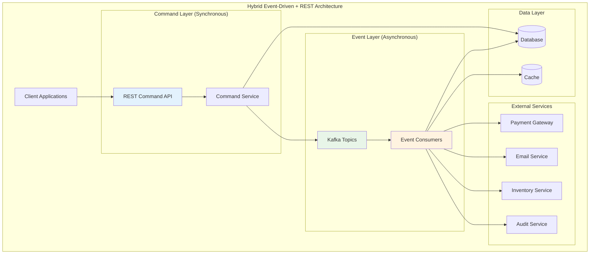

# Lesson 12: Kafka-Triggered REST & Command APIs - Hybrid Event-Driven Architecture

## 🎯 Objective

Master hybrid architectures that combine event-driven messaging with REST APIs, enabling systems that react to events while providing synchronous command interfaces. Learn to build resilient command-query patterns that leverage the best of both paradigms.

## 🔗 **Hybrid Architecture: Best of Both Worlds**

Modern systems often need both asynchronous event processing and synchronous command execution. This lesson shows how to effectively combine these patterns.



**Key Benefits:**
- ✅ **Immediate responses** for urgent operations
- ✅ **Asynchronous processing** for time-consuming tasks
- ✅ **Better user experience** with responsive APIs
- ✅ **Scalable background processing** with Kafka

## 🚀 **Command API with Event Publishing**

### 1. **Command Pattern Implementation**

```kotlin
// Command interface
interface Command {
    val commandId: String
    val timestamp: Instant
    val userId: String
}

// Specific command implementations
data class CreateOrderCommand(
    override val commandId: String = UUID.randomUUID().toString(),
    override val timestamp: Instant = Instant.now(),
    override val userId: String,
    val customerId: String,
    val items: List<OrderItem>,
    val shippingAddress: Address,
    val paymentMethod: PaymentMethod
) : Command

data class CancelOrderCommand(
    override val commandId: String = UUID.randomUUID().toString(),
    override val timestamp: Instant = Instant.now(),
    override val userId: String,
    val orderId: String,
    val reason: String
) : Command

data class UpdateInventoryCommand(
    override val commandId: String = UUID.randomUUID().toString(),
    override val timestamp: Instant = Instant.now(),
    override val userId: String,
    val productId: String,
    val quantityChange: Int,
    val reason: String
) : Command

// Command handler interface
interface CommandHandler<T : Command> {
    fun handle(command: T): CommandResult
    fun validate(command: T): ValidationResult
}

// Command result types
data class CommandResult(
    val success: Boolean,
    val commandId: String,
    val resultData: Map<String, Any> = emptyMap(),
    val events: List<DomainEvent> = emptyList(),
    val error: String? = null
)

data class ValidationResult(
    val isValid: Boolean,
    val errors: List<String> = emptyList()
)
```

### 2. **REST API with Event Integration**

```kotlin
@RestController
@RequestMapping("/api/orders")
class OrderCommandController {
    
    @Autowired
    private lateinit var orderCommandHandler: OrderCommandHandler
    
    @Autowired
    private lateinit var eventPublisher: EventPublisher
    
    @PostMapping
    fun createOrder(@RequestBody request: CreateOrderRequest): ResponseEntity<OrderResponse> {
        try {
            // 1. Create command from request
            val command = CreateOrderCommand(
                userId = getCurrentUserId(),
                customerId = request.customerId,
                items = request.items.map { it.toOrderItem() },
                shippingAddress = request.shippingAddress,
                paymentMethod = request.paymentMethod
            )
            
            // 2. Validate command
            val validation = orderCommandHandler.validate(command)
            if (!validation.isValid) {
                return ResponseEntity.badRequest().body(
                    OrderResponse.error(validation.errors.joinToString(", "))
                )
            }
            
            // 3. Execute command synchronously (immediate response needed)
            val result = orderCommandHandler.handle(command)
            
            if (result.success) {
                // 4. Publish events asynchronously for background processing
                result.events.forEach { event ->
                    eventPublisher.publishEvent(event)
                }
                
                // 5. Return immediate response
                return ResponseEntity.ok(
                    OrderResponse.success(
                        orderId = result.resultData["orderId"] as String,
                        status = "CREATED",
                        message = "Order created successfully"
                    )
                )
            } else {
                return ResponseEntity.status(HttpStatus.INTERNAL_SERVER_ERROR).body(
                    OrderResponse.error(result.error ?: "Unknown error")
                )
            }
            
        } catch (e: Exception) {
            logger.error("Failed to create order", e)
            return ResponseEntity.status(HttpStatus.INTERNAL_SERVER_ERROR).body(
                OrderResponse.error("Failed to create order: ${e.message}")
            )
        }
    }
    
    @PutMapping("/{orderId}/cancel")
    fun cancelOrder(
        @PathVariable orderId: String,
        @RequestBody request: CancelOrderRequest
    ): ResponseEntity<OrderResponse> {
        try {
            val command = CancelOrderCommand(
                userId = getCurrentUserId(),
                orderId = orderId,
                reason = request.reason
            )
            
            val result = orderCommandHandler.handle(command)
            
            if (result.success) {
                // Publish cancellation events
                result.events.forEach { event ->
                    eventPublisher.publishEvent(event)
                }
                
                return ResponseEntity.ok(
                    OrderResponse.success(
                        orderId = orderId,
                        status = "CANCELLED",
                        message = "Order cancelled successfully"
                    )
                )
            } else {
                return ResponseEntity.badRequest().body(
                    OrderResponse.error(result.error ?: "Failed to cancel order")
                )
            }
            
        } catch (e: Exception) {
            logger.error("Failed to cancel order $orderId", e)
            return ResponseEntity.status(HttpStatus.INTERNAL_SERVER_ERROR).body(
                OrderResponse.error("Failed to cancel order")
            )
        }
    }
}
```

### 3. **Command Handler with Event Generation**

```kotlin
@Component
class OrderCommandHandler : CommandHandler<CreateOrderCommand> {
    
    @Autowired
    private lateinit var orderRepository: OrderRepository
    
    @Autowired
    private lateinit var inventoryService: InventoryService
    
    override fun validate(command: CreateOrderCommand): ValidationResult {
        val errors = mutableListOf<String>()
        
        // Validate items
        if (command.items.isEmpty()) {
            errors.add("Order must contain at least one item")
        }
        
        command.items.forEach { item ->
            if (item.quantity <= 0) {
                errors.add("Item quantity must be positive")
            }
            if (item.price <= 0) {
                errors.add("Item price must be positive")
            }
        }
        
        // Validate customer
        if (command.customerId.isBlank()) {
            errors.add("Customer ID is required")
        }
        
        // Validate address
        if (command.shippingAddress.street.isBlank()) {
            errors.add("Shipping address is required")
        }
        
        return ValidationResult(errors.isEmpty(), errors)
    }
    
    @Transactional
    override fun handle(command: CreateOrderCommand): CommandResult {
        try {
            // 1. Check inventory availability (synchronous - needed for immediate response)
            val inventoryCheck = inventoryService.checkAvailability(command.items)
            if (!inventoryCheck.allAvailable) {
                return CommandResult(
                    success = false,
                    commandId = command.commandId,
                    error = "Insufficient inventory for items: ${inventoryCheck.unavailableItems}"
                )
            }
            
            // 2. Create order entity
            val order = Order(
                id = UUID.randomUUID().toString(),
                customerId = command.customerId,
                items = command.items,
                status = OrderStatus.CREATED,
                shippingAddress = command.shippingAddress,
                paymentMethod = command.paymentMethod,
                totalAmount = command.items.sumOf { it.price * it.quantity },
                createdAt = command.timestamp,
                createdBy = command.userId
            )
            
            // 3. Save order (synchronous)
            val savedOrder = orderRepository.save(order)
            
            // 4. Generate events for asynchronous processing
            val events = listOf(
                OrderCreatedEvent(
                    orderId = savedOrder.id,
                    customerId = savedOrder.customerId,
                    items = savedOrder.items,
                    totalAmount = savedOrder.totalAmount,
                    timestamp = command.timestamp
                ),
                InventoryReservationRequestedEvent(
                    orderId = savedOrder.id,
                    items = savedOrder.items.map { 
                        InventoryReservation(it.productId, it.quantity) 
                    },
                    timestamp = command.timestamp
                ),
                PaymentProcessingRequestedEvent(
                    orderId = savedOrder.id,
                    customerId = savedOrder.customerId,
                    amount = savedOrder.totalAmount,
                    paymentMethod = savedOrder.paymentMethod,
                    timestamp = command.timestamp
                )
            )
            
            return CommandResult(
                success = true,
                commandId = command.commandId,
                resultData = mapOf(
                    "orderId" to savedOrder.id,
                    "orderStatus" to savedOrder.status.name,
                    "totalAmount" to savedOrder.totalAmount
                ),
                events = events
            )
            
        } catch (e: Exception) {
            logger.error("Failed to handle CreateOrderCommand", e)
            return CommandResult(
                success = false,
                commandId = command.commandId,
                error = "Failed to create order: ${e.message}"
            )
        }
    }
}
```

## 🔄 **Event-Triggered Command Execution**

### 1. **Event-Driven Command Processor**

```kotlin
@Component
class EventTriggeredCommandProcessor {
    
    @Autowired
    private lateinit var restTemplate: RestTemplate
    
    @Autowired
    private lateinit var commandService: CommandService
    
    @KafkaListener(topics = ["payment-completed"])
    fun handlePaymentCompleted(
        @Payload event: PaymentCompletedEvent,
        acknowledgment: Acknowledgment
    ) {
        try {
            // Payment completed -> trigger order fulfillment command
            val fulfillmentCommand = CreateFulfillmentCommand(
                orderId = event.orderId,
                customerId = event.customerId,
                items = event.orderItems,
                priority = determineFulfillmentPriority(event)
            )
            
            // Execute command via REST API call
            val response = callFulfillmentAPI(fulfillmentCommand)
            
            if (response.success) {
                logger.info("Fulfillment initiated for order ${event.orderId}")
                acknowledgment.acknowledge()
            } else {
                logger.error("Failed to initiate fulfillment for order ${event.orderId}: ${response.error}")
                // Don't acknowledge - will retry
            }
            
        } catch (e: Exception) {
            logger.error("Failed to process payment completed event for order ${event.orderId}", e)
        }
    }
    
    @KafkaListener(topics = ["inventory-low"])
    fun handleInventoryLow(
        @Payload event: InventoryLowEvent,
        acknowledgment: Acknowledgment
    ) {
        try {
            // Low inventory -> trigger restocking command
            val restockCommand = CreateRestockCommand(
                productId = event.productId,
                currentQuantity = event.currentQuantity,
                reorderLevel = event.reorderLevel,
                suggestedQuantity = calculateRestockQuantity(event)
            )
            
            // Execute via internal command service
            val result = commandService.executeCommand(restockCommand)
            
            if (result.success) {
                acknowledgment.acknowledge()
            }
            
        } catch (e: Exception) {
            logger.error("Failed to process inventory low event for product ${event.productId}", e)
        }
    }
    
    private fun callFulfillmentAPI(command: CreateFulfillmentCommand): ApiResponse {
        return try {
            val response = restTemplate.postForObject(
                "/api/fulfillment/orders",
                command,
                ApiResponse::class.java
            )
            response ?: ApiResponse(false, error = "No response from fulfillment API")
        } catch (e: Exception) {
            ApiResponse(false, error = "API call failed: ${e.message}")
        }
    }
}
```

### 2. **Async Command Queue Processing**

```kotlin
@Component
class AsyncCommandProcessor {
    
    @KafkaListener(topics = ["commands-async"])
    fun processAsyncCommand(
        @Payload commandMessage: CommandMessage,
        acknowledgment: Acknowledgment
    ) {
        try {
            when (commandMessage.commandType) {
                "SEND_MARKETING_EMAIL" -> {
                    val command = deserializeCommand<SendMarketingEmailCommand>(commandMessage.payload)
                    processMarketingEmailCommand(command)
                }
                
                "UPDATE_CUSTOMER_PROFILE" -> {
                    val command = deserializeCommand<UpdateCustomerProfileCommand>(commandMessage.payload)
                    processCustomerProfileCommand(command)
                }
                
                "GENERATE_REPORT" -> {
                    val command = deserializeCommand<GenerateReportCommand>(commandMessage.payload)
                    processReportGenerationCommand(command)
                }
                
                else -> {
                    logger.warn("Unknown command type: ${commandMessage.commandType}")
                }
            }
            
            acknowledgment.acknowledge()
            
        } catch (e: Exception) {
            logger.error("Failed to process async command: ${commandMessage.commandId}", e)
        }
    }
    
    @Async
    private fun processMarketingEmailCommand(command: SendMarketingEmailCommand) {
        // Long-running email processing
        emailService.sendMarketingCampaign(
            recipients = command.recipients,
            template = command.template,
            variables = command.variables
        )
        
        // Publish completion event
        eventPublisher.publishEvent(MarketingEmailSentEvent(
            campaignId = command.campaignId,
            recipientCount = command.recipients.size,
            completedAt = Instant.now()
        ))
    }
}
```

## 🔄 **Request-Reply Pattern with Kafka**

### 1. **Synchronous Request-Reply Implementation**

```kotlin
@Component
class KafkaRequestReplyService {
    
    @Autowired
    private lateinit var kafkaTemplate: KafkaTemplate<String, Any>
    
    @Autowired
    private lateinit var replyConsumer: KafkaReplyConsumer
    
    fun <T> sendRequestAndWaitForReply(
        requestTopic: String,
        request: Any,
        replyType: Class<T>,
        timeoutMs: Long = 30000
    ): T {
        val correlationId = UUID.randomUUID().toString()
        val replyTopic = "replies-${UUID.randomUUID()}"
        
        // Create temporary reply consumer
        val replyFuture = replyConsumer.waitForReply<T>(correlationId, replyType, timeoutMs)
        
        // Send request with reply-to information
        val requestWithReply = RequestMessage(
            correlationId = correlationId,
            replyTo = replyTopic,
            payload = request,
            timestamp = Instant.now()
        )
        
        kafkaTemplate.send(requestTopic, correlationId, requestWithReply)
        
        // Wait for reply
        return try {
            replyFuture.get(timeoutMs, TimeUnit.MILLISECONDS)
        } catch (e: TimeoutException) {
            throw RuntimeException("Request timeout after ${timeoutMs}ms")
        }
    }
}

@Component
class KafkaReplyConsumer {
    
    private val pendingReplies = ConcurrentHashMap<String, CompletableFuture<Any>>()
    
    fun <T> waitForReply(correlationId: String, replyType: Class<T>, timeoutMs: Long): CompletableFuture<T> {
        val future = CompletableFuture<T>()
        pendingReplies[correlationId] = future as CompletableFuture<Any>
        
        // Set timeout
        CompletableFuture.delayedExecutor(timeoutMs, TimeUnit.MILLISECONDS).execute {
            val pending = pendingReplies.remove(correlationId)
            pending?.completeExceptionally(TimeoutException("Reply timeout"))
        }
        
        return future
    }
    
    @KafkaListener(topicPattern = "replies-.*")
    fun handleReply(
        @Payload reply: ReplyMessage,
        @Header("correlationId") correlationId: String
    ) {
        val pendingReply = pendingReplies.remove(correlationId)
        if (pendingReply != null) {
            if (reply.success) {
                pendingReply.complete(reply.payload)
            } else {
                pendingReply.completeExceptionally(RuntimeException(reply.error))
            }
        }
    }
}
```

### 2. **Request Processing Service**

```kotlin
@Component
class RequestProcessor {
    
    @KafkaListener(topics = ["price-calculation-requests"])
    fun handlePriceCalculationRequest(
        @Payload requestMessage: RequestMessage,
        acknowledgment: Acknowledgment
    ) {
        try {
            val request = requestMessage.payload as PriceCalculationRequest
            
            // Process the request
            val calculation = priceCalculationService.calculatePrice(
                productId = request.productId,
                quantity = request.quantity,
                customerId = request.customerId,
                promotionCodes = request.promotionCodes
            )
            
            // Send reply
            val reply = ReplyMessage(
                correlationId = requestMessage.correlationId,
                success = true,
                payload = calculation,
                timestamp = Instant.now()
            )
            
            kafkaTemplate.send(requestMessage.replyTo, requestMessage.correlationId, reply)
            acknowledgment.acknowledge()
            
        } catch (e: Exception) {
            // Send error reply
            val errorReply = ReplyMessage(
                correlationId = requestMessage.correlationId,
                success = false,
                error = e.message,
                timestamp = Instant.now()
            )
            
            kafkaTemplate.send(requestMessage.replyTo, requestMessage.correlationId, errorReply)
            acknowledgment.acknowledge()
        }
    }
}
```

## 📊 **Monitoring Hybrid Architectures**

### 1. **Command and Event Metrics**

```kotlin
@Component
class HybridArchitectureMetrics {
    
    private val commandCounter = Counter.builder("api.commands.executed")
        .description("Count of API commands executed")
        .register(Metrics.globalRegistry)
    
    private val eventCounter = Counter.builder("events.published")
        .description("Count of events published")
        .register(Metrics.globalRegistry)
    
    private val requestReplyTimer = Timer.builder("kafka.request.reply.time")
        .description("Request-reply round trip time")
        .register(Metrics.globalRegistry)
    
    fun recordCommand(commandType: String, success: Boolean, duration: Duration) {
        commandCounter.increment(
            Tags.of(
                Tag.of("command_type", commandType),
                Tag.of("status", if (success) "success" else "failure")
            )
        )
    }
    
    fun recordEvent(eventType: String, consumerCount: Int) {
        eventCounter.increment(
            Tags.of(
                Tag.of("event_type", eventType),
                Tag.of("consumer_count", consumerCount.toString())
            )
        )
    }
    
    fun recordRequestReply(requestType: String, duration: Duration, success: Boolean) {
        requestReplyTimer.record(
            duration,
            Tags.of(
                Tag.of("request_type", requestType),
                Tag.of("status", if (success) "success" else "failure")
            )
        )
    }
}
```

### 2. **Health Monitoring**

```kotlin
@Component
class HybridSystemHealthIndicator : HealthIndicator {
    
    override fun health(): Health {
        try {
            val restApiHealth = checkRestApiHealth()
            val kafkaHealth = checkKafkaHealth()
            val commandProcessingHealth = checkCommandProcessingHealth()
            
            val overallHealth = restApiHealth && kafkaHealth && commandProcessingHealth
            
            return if (overallHealth) {
                Health.up()
                    .withDetail("restApi", "healthy")
                    .withDetail("kafka", "healthy")
                    .withDetail("commandProcessing", "healthy")
                    .build()
            } else {
                Health.down()
                    .withDetail("restApi", if (restApiHealth) "healthy" else "unhealthy")
                    .withDetail("kafka", if (kafkaHealth) "healthy" else "unhealthy")
                    .withDetail("commandProcessing", if (commandProcessingHealth) "healthy" else "unhealthy")
                    .build()
            }
            
        } catch (e: Exception) {
            return Health.down()
                .withDetail("error", e.message)
                .build()
        }
    }
}
```

## ✅ **Best Practices Summary**

### 🔗 **Hybrid Architecture Design**
- **Use REST for immediate responses** that users need to see
- **Use events for background processing** that can be asynchronous
- **Maintain clear separation** between command and event handling
- **Implement proper error handling** for both synchronous and asynchronous flows

### 🚀 **Command Pattern Implementation**
- **Validate commands early** before processing
- **Make commands idempotent** when possible
- **Generate events consistently** for audit and downstream processing
- **Return immediate feedback** for user-facing operations

### 🔄 **Event-Driven Integration**
- **Use correlation IDs** for tracing across systems
- **Implement circuit breakers** for external API calls
- **Handle partial failures gracefully** in event processing
- **Monitor both command and event metrics**

### 📊 **Request-Reply Patterns**
- **Use sparingly** - prefer pure async when possible
- **Set appropriate timeouts** to prevent hanging requests
- **Clean up resources** for temporary reply topics
- **Monitor request-reply performance** and success rates

## 🚀 **What's Next?**

You've mastered hybrid event-driven architectures! Next, complete Phase 2 with [Lesson 13: Request-Reply Patterns](../lesson_13/concept.md), where you'll learn advanced synchronous communication patterns over Kafka for complex distributed scenarios.

---

*Hybrid architectures provide the flexibility to choose the right communication pattern for each use case. By combining REST APIs with event-driven processing, you can build systems that are both responsive and scalable.*