# Concept

## Fan-out Pattern - Notification Systems & Parallel Processing

## 🎯 Objective

Master the fan-out pattern for distributing single events to multiple consumers, enabling parallel processing, notification systems, and scalable event-driven architectures. Learn to build systems that can efficiently handle high-volume event distribution with reliability and monitoring.

## 🌟 **The Fan-out Pattern: One Event, Many Consumers**

The fan-out pattern allows a single event to trigger multiple independent processes, each serving different business purposes.


**Key Benefits:**
- ✅ **Parallel processing** - Multiple services work simultaneously
- ✅ **Loose coupling** - Services don't depend on each other
- ✅ **Scalability** - Add new consumers without changing producers
- ✅ **Fault isolation** - One service failure doesn't affect others

## 📧 **Notification System Implementation**

### 1. **Multi-Channel Notification Service**

```kotlin
data class NotificationEvent(
    val eventId: String,
    val userId: String,
    val eventType: String,
    val channels: List<NotificationChannel>,
    val priority: NotificationPriority,
    val content: NotificationContent,
    val metadata: Map<String, Any> = emptyMap()
)

data class NotificationContent(
    val subject: String,
    val message: String,
    val templateId: String? = null,
    val variables: Map<String, Any> = emptyMap()
)

enum class NotificationChannel { EMAIL, SMS, PUSH, IN_APP, WEBHOOK }
enum class NotificationPriority { LOW, MEDIUM, HIGH, URGENT }

@Component
class NotificationFanoutService {
    
    @Autowired
    private lateinit var kafkaTemplate: KafkaTemplate<String, Any>
    
    @KafkaListener(topics = ["user-events"])
    fun handleUserEvent(
        @Payload userEvent: UserEvent,
        acknowledgment: Acknowledgment
    ) {
        try {
            val notifications = createNotificationsForEvent(userEvent)
            
            notifications.forEach { notification ->
                // Fan out to specific channel topics
                notification.channels.forEach { channel ->
                    val channelTopic = "notifications-${channel.name.lowercase()}"
                    kafkaTemplate.send(channelTopic, notification.userId, notification)
                }
                
                // Also send to unified notification topic for monitoring
                kafkaTemplate.send("notifications-all", notification.userId, notification)
            }
            
            logger.info("Fanned out ${notifications.size} notifications for user event ${userEvent.eventId}")
            acknowledgment.acknowledge()
            
        } catch (e: Exception) {
            logger.error("Failed to fan out notifications for user event ${userEvent.eventId}", e)
            // Don't acknowledge to trigger retry
        }
    }
    
    private fun createNotificationsForEvent(userEvent: UserEvent): List<NotificationEvent> {
        return when (userEvent.eventType) {
            "USER_REGISTERED" -> listOf(
                NotificationEvent(
                    eventId = UUID.randomUUID().toString(),
                    userId = userEvent.userId,
                    eventType = "WELCOME_EMAIL",
                    channels = listOf(NotificationChannel.EMAIL),
                    priority = NotificationPriority.HIGH,
                    content = NotificationContent(
                        subject = "Welcome to Our Platform!",
                        message = "Thank you for registering. Please verify your email.",
                        templateId = "welcome-email",
                        variables = mapOf(
                            "firstName" to userEvent.firstName,
                            "verificationLink" to generateVerificationLink(userEvent.userId)
                        )
                    )
                ),
                NotificationEvent(
                    eventId = UUID.randomUUID().toString(),
                    userId = userEvent.userId,
                    eventType = "SMS_VERIFICATION",
                    channels = listOf(NotificationChannel.SMS),
                    priority = NotificationPriority.HIGH,
                    content = NotificationContent(
                        subject = "Verification Code",
                        message = "Your verification code is: ${generateVerificationCode()}",
                        templateId = "sms-verification"
                    )
                )
            )
            
            "ORDER_CONFIRMED" -> listOf(
                NotificationEvent(
                    eventId = UUID.randomUUID().toString(),
                    userId = userEvent.userId,
                    eventType = "ORDER_CONFIRMATION",
                    channels = listOf(NotificationChannel.EMAIL, NotificationChannel.PUSH),
                    priority = NotificationPriority.MEDIUM,
                    content = NotificationContent(
                        subject = "Order Confirmed - ${userEvent.metadata["orderId"]}",
                        message = "Your order has been confirmed and will be processed soon.",
                        templateId = "order-confirmation",
                        variables = userEvent.metadata
                    )
                )
            )
            
            else -> emptyList()
        }
    }
}
```

### 2. **Channel-Specific Consumers**

```kotlin
@Component
class EmailNotificationConsumer {
    
    @Autowired
    private lateinit var emailService: EmailService
    
    @KafkaListener(
        topics = ["notifications-email"],
        groupId = "email-notification-group",
        concurrency = "3"
    )
    fun processEmailNotification(
        @Payload notification: NotificationEvent,
        acknowledgment: Acknowledgment
    ) {
        try {
            val emailRequest = EmailRequest(
                to = getUserEmail(notification.userId),
                subject = notification.content.subject,
                body = renderEmailTemplate(notification.content),
                priority = mapPriority(notification.priority)
            )
            
            val result = emailService.sendEmail(emailRequest)
            
            if (result.success) {
                // Send confirmation event
                kafkaTemplate.send("notification-results", notification.eventId, 
                    NotificationResult(
                        notificationId = notification.eventId,
                        channel = NotificationChannel.EMAIL,
                        status = DeliveryStatus.DELIVERED,
                        deliveredAt = Instant.now(),
                        metadata = mapOf("messageId" to result.messageId)
                    )
                )
                acknowledgment.acknowledge()
            } else {
                logger.warn("Email delivery failed for notification ${notification.eventId}: ${result.error}")
                // Don't acknowledge - will retry
            }
            
        } catch (e: Exception) {
            logger.error("Failed to process email notification ${notification.eventId}", e)
            // Send failure notification
            kafkaTemplate.send("notification-failures", notification.eventId, 
                NotificationFailure(notification, e.message ?: "Unknown error")
            )
            acknowledgment.acknowledge() // Acknowledge to prevent infinite retries
        }
    }
}

@Component
class SMSNotificationConsumer {
    
    @Autowired
    private lateinit var smsService: SMSService
    
    @KafkaListener(
        topics = ["notifications-sms"],
        groupId = "sms-notification-group",
        concurrency = "2"
    )
    fun processSMSNotification(
        @Payload notification: NotificationEvent,
        acknowledgment: Acknowledgment
    ) {
        try {
            val phoneNumber = getUserPhoneNumber(notification.userId)
            if (phoneNumber == null) {
                logger.warn("No phone number found for user ${notification.userId}")
                acknowledgment.acknowledge()
                return
            }
            
            val smsRequest = SMSRequest(
                to = phoneNumber,
                message = notification.content.message,
                priority = mapSMSPriority(notification.priority)
            )
            
            val result = smsService.sendSMS(smsRequest)
            
            kafkaTemplate.send("notification-results", notification.eventId,
                NotificationResult(
                    notificationId = notification.eventId,
                    channel = NotificationChannel.SMS,
                    status = if (result.success) DeliveryStatus.DELIVERED else DeliveryStatus.FAILED,
                    deliveredAt = if (result.success) Instant.now() else null,
                    error = result.error,
                    metadata = mapOf("messageId" to result.messageId)
                )
            )
            
            acknowledgment.acknowledge()
            
        } catch (e: Exception) {
            logger.error("Failed to process SMS notification ${notification.eventId}", e)
            acknowledgment.acknowledge()
        }
    }
}

@Component
class PushNotificationConsumer {
    
    @Autowired
    private lateinit var pushService: PushNotificationService
    
    @KafkaListener(
        topics = ["notifications-push"],
        groupId = "push-notification-group"
    )
    fun processPushNotification(
        @Payload notification: NotificationEvent,
        acknowledgment: Acknowledgment
    ) {
        try {
            val deviceTokens = getUserDeviceTokens(notification.userId)
            
            if (deviceTokens.isEmpty()) {
                logger.info("No device tokens found for user ${notification.userId}")
                acknowledgment.acknowledge()
                return
            }
            
            val pushRequest = PushRequest(
                deviceTokens = deviceTokens,
                title = notification.content.subject,
                body = notification.content.message,
                data = notification.metadata,
                priority = mapPushPriority(notification.priority)
            )
            
            val results = pushService.sendPushNotification(pushRequest)
            
            // Process results for each device
            results.forEach { result ->
                kafkaTemplate.send("notification-results", notification.eventId,
                    NotificationResult(
                        notificationId = notification.eventId,
                        channel = NotificationChannel.PUSH,
                        status = if (result.success) DeliveryStatus.DELIVERED else DeliveryStatus.FAILED,
                        deliveredAt = if (result.success) Instant.now() else null,
                        error = result.error,
                        metadata = mapOf(
                            "deviceToken" to result.deviceToken,
                            "platform" to result.platform
                        )
                    )
                )
            }
            
            acknowledgment.acknowledge()
            
        } catch (e: Exception) {
            logger.error("Failed to process push notification ${notification.eventId}", e)
            acknowledgment.acknowledge()
        }
    }
}
```

## 🔄 **Advanced Fan-out Patterns**

### 1. **Conditional Fan-out with Filtering**

Some consumers should only receive events that match specific criteria.

```mermaid
graph TB
    subgraph "Smart Event Routing Architecture"
        EVENT[Order Placed Event]
        ROUTER[Routing Service]
        
        subgraph "Business Rules"
            AMOUNT{Amount > $1000?}
            VIP{VIP Customer?}
            REGION{International?}
            TIME{Business Hours?}
        end
        
        subgraph "Specialized Consumers"
            FRAUD[🔍 Fraud Detection<br/>High Value Orders]
            VIP_SUPPORT[👑 VIP Support<br/>Premium Service]
            CUSTOMS[🌍 Customs Processing<br/>International Orders]
            URGENT[⚡ Urgent Queue<br/>Business Hours]
            STANDARD[📋 Standard Processing<br/>Default Handler]
            ANALYTICS[📊 Analytics<br/>All Events]
        end
        
        subgraph "Routing Topics"
            T1[high-value-orders]
            T2[vip-orders]
            T3[international-orders]
            T4[urgent-processing]
            T5[standard-orders]
            T6[order-analytics]
        end
    end
    
    EVENT --> ROUTER
    ROUTER --> AMOUNT
    ROUTER --> VIP
    ROUTER --> REGION
    ROUTER --> TIME
    
    AMOUNT -->|Yes| T1
    VIP -->|Yes| T2
    REGION -->|Yes| T3
    TIME -->|Yes| T4
    ROUTER --> T5
    ROUTER --> T6
    
    T1 --> FRAUD
    T2 --> VIP_SUPPORT
    T3 --> CUSTOMS
    T4 --> URGENT
    T5 --> STANDARD
    T6 --> ANALYTICS
    
    style ROUTER fill:#e3f2fd
    style FRAUD fill:#ffebee
    style VIP_SUPPORT fill:#e8f5e8
    style CUSTOMS fill:#fff3e0
    style URGENT fill:#f3e5f5
    style ANALYTICS fill:#e0f2f1
```



```kotlin
@Component
class ConditionalFanoutService {
    
    @KafkaListener(topics = ["order-events"])
    fun handleOrderEvent(
        @Payload orderEvent: OrderEvent,
        acknowledgment: Acknowledgment
    ) {
        try {
            val fanoutTargets = determineFanoutTargets(orderEvent)
            
            fanoutTargets.forEach { target ->
                when (target.type) {
                    FanoutType.INVENTORY_UPDATE -> {
                        if (orderEvent.items.isNotEmpty()) {
                            kafkaTemplate.send("inventory-updates", orderEvent.orderId, 
                                createInventoryUpdate(orderEvent))
                        }
                    }
                    
                    FanoutType.PAYMENT_PROCESSING -> {
                        if (orderEvent.paymentMethod != PaymentMethod.STORE_CREDIT) {
                            kafkaTemplate.send("payment-processing", orderEvent.orderId,
                                createPaymentRequest(orderEvent))
                        }
                    }
                    
                    FanoutType.FRAUD_CHECK -> {
                        if (orderEvent.amount > 1000 || orderEvent.isFirstTimeCustomer) {
                            kafkaTemplate.send("fraud-analysis", orderEvent.orderId,
                                createFraudCheckRequest(orderEvent))
                        }
                    }
                    
                    FanoutType.SHIPPING_LABEL -> {
                        if (orderEvent.shippingMethod != ShippingMethod.DIGITAL_DELIVERY) {
                            kafkaTemplate.send("shipping-labels", orderEvent.orderId,
                                createShippingRequest(orderEvent))
                        }
                    }
                }
            }
            
            acknowledgment.acknowledge()
            
        } catch (e: Exception) {
            logger.error("Failed to fan out order event ${orderEvent.orderId}", e)
        }
    }
    
    private fun determineFanoutTargets(orderEvent: OrderEvent): List<FanoutTarget> {
        val targets = mutableListOf<FanoutTarget>()
        
        // Always required
        targets.add(FanoutTarget(FanoutType.ANALYTICS, priority = 1))
        
        // Conditional targets based on order properties
        if (orderEvent.items.any { it.requiresInventoryCheck }) {
            targets.add(FanoutTarget(FanoutType.INVENTORY_UPDATE, priority = 2))
        }
        
        if (orderEvent.amount > 0) {
            targets.add(FanoutTarget(FanoutType.PAYMENT_PROCESSING, priority = 3))
        }
        
        if (shouldPerformFraudCheck(orderEvent)) {
            targets.add(FanoutTarget(FanoutType.FRAUD_CHECK, priority = 4))
        }
        
        if (orderEvent.requiresShipping) {
            targets.add(FanoutTarget(FanoutType.SHIPPING_LABEL, priority = 5))
        }
        
        return targets.sortedBy { it.priority }
    }
}
```

### 2. **Priority-Based Fan-out**

```kotlin
@Component
class PriorityFanoutService {
    
    @KafkaListener(topics = ["critical-events"])
    fun handleCriticalEvent(
        @Payload event: CriticalEvent,
        acknowledgment: Acknowledgment
    ) {
        try {
            // High priority: Send immediately to critical channels
            val highPriorityChannels = listOf("security-alerts", "management-notifications")
            highPriorityChannels.forEach { channel ->
                kafkaTemplate.send(channel, event.eventId, event)
            }
            
            // Medium priority: Send to operational channels
            val mediumPriorityChannels = listOf("operations-log", "audit-trail")
            mediumPriorityChannels.forEach { channel ->
                kafkaTemplate.send(channel, event.eventId, event)
            }
            
            // Low priority: Send to analytics (with delay if needed)
            scheduleDelayedFanout(event, listOf("analytics-warehouse"), Duration.ofMinutes(5))
            
            acknowledgment.acknowledge()
            
        } catch (e: Exception) {
            logger.error("Failed to fan out critical event ${event.eventId}", e)
        }
    }
    
    @Async
    private fun scheduleDelayedFanout(
        event: CriticalEvent, 
        channels: List<String>, 
        delay: Duration
    ) {
        CompletableFuture.runAsync({
            Thread.sleep(delay.toMillis())
            channels.forEach { channel ->
                kafkaTemplate.send(channel, event.eventId, event)
            }
        })
    }
}
```

### 3. **Batch Fan-out for Efficiency**

```kotlin
@Component
class BatchFanoutService {
    
    private val batchBuffer = ConcurrentHashMap<String, MutableList<BatchableEvent>>()
    private val batchSizes = mapOf(
        "analytics-events" to 100,
        "audit-logs" to 50,
        "reporting-data" to 200
    )
    
    @KafkaListener(topics = ["user-activities"])
    fun handleUserActivity(
        @Payload activity: UserActivityEvent,
        acknowledgment: Acknowledgment
    ) {
        try {
            // Add to batch buffers
            val targetTopics = listOf("analytics-events", "audit-logs", "reporting-data")
            
            targetTopics.forEach { topic ->
                val batch = batchBuffer.computeIfAbsent(topic) { mutableListOf() }
                
                synchronized(batch) {
                    batch.add(BatchableEvent(activity))
                    
                    if (batch.size >= batchSizes[topic]!!) {
                        // Send batch and clear buffer
                        sendBatch(topic, batch.toList())
                        batch.clear()
                    }
                }
            }
            
            acknowledgment.acknowledge()
            
        } catch (e: Exception) {
            logger.error("Failed to handle user activity ${activity.activityId}", e)
        }
    }
    
    @Scheduled(fixedRate = 30000) // Every 30 seconds
    fun flushPendingBatches() {
        batchBuffer.forEach { (topic, batch) ->
            synchronized(batch) {
                if (batch.isNotEmpty()) {
                    sendBatch(topic, batch.toList())
                    batch.clear()
                }
            }
        }
    }
    
    private fun sendBatch(topic: String, batch: List<BatchableEvent>) {
        val batchMessage = EventBatch(
            batchId = UUID.randomUUID().toString(),
            events = batch,
            batchSize = batch.size,
            timestamp = Instant.now()
        )
        
        kafkaTemplate.send(topic, batchMessage.batchId, batchMessage)
        logger.info("Sent batch of ${batch.size} events to $topic")
    }
}
```

## 📊 **Fan-out Monitoring and Analytics**

### 1. **Fan-out Metrics Collection**

```kotlin
@Component
class FanoutMetricsCollector {
    
    private val fanoutCounter = Counter.builder("kafka.fanout.events")
        .description("Count of fan-out events")
        .register(Metrics.globalRegistry)
    
    private val fanoutTimer = Timer.builder("kafka.fanout.processing.time")
        .description("Time to process fan-out events")
        .register(Metrics.globalRegistry)
    
    private val channelCounter = Counter.builder("kafka.fanout.channels")
        .description("Count of fan-out channels used")
        .register(Metrics.globalRegistry)
    
    fun recordFanout(eventType: String, channelCount: Int, processingTime: Duration) {
        fanoutCounter.increment(
            Tags.of(
                Tag.of("event_type", eventType),
                Tag.of("channel_count", channelCount.toString())
            )
        )
        
        fanoutTimer.record(processingTime)
        
        channelCounter.increment(
            Tags.of(Tag.of("count", channelCount.toString())),
            channelCount.toDouble()
        )
    }
    
    fun recordChannelDelivery(channel: String, success: Boolean, deliveryTime: Duration) {
        Counter.builder("kafka.fanout.delivery")
            .description("Channel delivery results")
            .tag("channel", channel)
            .tag("status", if (success) "success" else "failure")
            .register(Metrics.globalRegistry)
            .increment()
        
        Timer.builder("kafka.fanout.delivery.time")
            .description("Channel delivery time")
            .tag("channel", channel)
            .register(Metrics.globalRegistry)
            .record(deliveryTime)
    }
}
```

### 2. **Fan-out Health Monitoring**

```kotlin
@Component
class FanoutHealthMonitor {
    
    @Autowired
    private lateinit var kafkaAdmin: KafkaAdmin
    
    @Scheduled(fixedRate = 60000) // Every minute
    fun monitorFanoutHealth() {
        val fanoutTopics = listOf(
            "notifications-email", "notifications-sms", "notifications-push",
            "analytics-events", "audit-logs", "inventory-updates"
        )
        
        fanoutTopics.forEach { topic ->
            try {
                val lag = getConsumerLagForTopic(topic)
                val throughput = getThroughputForTopic(topic)
                
                // Record metrics
                Metrics.globalRegistry.gauge("kafka.fanout.lag", Tags.of(Tag.of("topic", topic)), lag.toDouble())
                Metrics.globalRegistry.gauge("kafka.fanout.throughput", Tags.of(Tag.of("topic", topic)), throughput)
                
                // Check for issues
                if (lag > 1000) {
                    logger.warn("High lag detected in fan-out topic $topic: $lag messages")
                }
                
                if (throughput < 10) { // Less than 10 messages per minute
                    logger.warn("Low throughput detected in fan-out topic $topic: $throughput msg/min")
                }
                
            } catch (e: Exception) {
                logger.error("Failed to monitor fan-out topic $topic", e)
            }
        }
    }
    
    @EventListener
    fun handleFanoutFailure(event: FanoutFailureEvent) {
        // Track failure patterns
        Metrics.globalRegistry.counter("kafka.fanout.failures", 
            Tags.of(
                Tag.of("event_type", event.eventType),
                Tag.of("failure_type", event.failureType)
            )
        ).increment()
        
        // Trigger alerts for critical failures
        if (event.isCritical) {
            alertService.sendAlert("Critical fan-out failure: ${event.description}")
        }
    }
}
```

### 3. **Fan-out Analytics and Reporting**

```kotlin
@RestController
@RequestMapping("/api/fanout")
class FanoutAnalyticsController {
    
    @Autowired
    private lateinit var fanoutMetricsCollector: FanoutMetricsCollector
    
    @GetMapping("/analytics/summary")
    fun getFanoutSummary(@RequestParam(defaultValue = "24") hours: Int): ResponseEntity<Map<String, Any>> {
        val endTime = Instant.now()
        val startTime = endTime.minus(hours.toLong(), ChronoUnit.HOURS)
        
        val summary = mapOf(
            "timeRange" to "${hours}h",
            "totalEvents" to getTotalFanoutEvents(startTime, endTime),
            "channelBreakdown" to getChannelBreakdown(startTime, endTime),
            "deliveryRates" to getDeliveryRates(startTime, endTime),
            "avgProcessingTime" to getAverageProcessingTime(startTime, endTime),
            "failureRate" to getFailureRate(startTime, endTime)
        )
        
        return ResponseEntity.ok(summary)
    }
    
    @GetMapping("/analytics/channels/{channel}")
    fun getChannelAnalytics(
        @PathVariable channel: String,
        @RequestParam(defaultValue = "24") hours: Int
    ): ResponseEntity<Map<String, Any>> {
        val analytics = mapOf(
            "channel" to channel,
            "deliveryCount" to getChannelDeliveryCount(channel, hours),
            "successRate" to getChannelSuccessRate(channel, hours),
            "avgDeliveryTime" to getChannelAverageDeliveryTime(channel, hours),
            "recentFailures" to getChannelRecentFailures(channel, hours)
        )
        
        return ResponseEntity.ok(analytics)
    }
    
    @GetMapping("/health/status")
    fun getFanoutHealthStatus(): ResponseEntity<Map<String, Any>> {
        val healthStatus = mapOf(
            "overall" to calculateOverallHealth(),
            "channels" to getChannelHealthStatus(),
            "alerts" to getActiveAlerts(),
            "recommendations" to generateRecommendations()
        )
        
        return ResponseEntity.ok(healthStatus)
    }
}
```

## ✅ **Best Practices Summary**

### 🌟 **Fan-out Design**
- **Keep consumers independent** - avoid dependencies between fan-out targets
- **Use appropriate consumer groups** for parallel processing
- **Implement idempotent consumers** to handle duplicate events
- **Design for partial failures** - one consumer failure shouldn't affect others

### 📧 **Notification Systems**
- **Choose appropriate channels** based on urgency and user preferences
- **Implement retry logic** with exponential backoff
- **Track delivery status** for all notification channels
- **Respect rate limits** for external notification services

### 📊 **Monitoring & Operations**
- **Monitor consumer lag** across all fan-out topics
- **Track delivery rates** for each notification channel
- **Alert on fan-out failures** with appropriate severity levels
- **Analyze fan-out patterns** to optimize system performance

### 🔧 **Performance Optimization**
- **Use batching** for high-volume fan-out scenarios
- **Implement priority queues** for time-sensitive events
- **Consider async processing** for independent operations
- **Cache user preferences** to optimize routing decisions

## 🚀 **What's Next?**

You've mastered the fan-out pattern for parallel processing! Next, learn about integrating Kafka with REST APIs in [Lesson 12: Kafka-Triggered REST & Command APIs](../lesson_13/concept.md), where you'll build hybrid architectures that combine event-driven and request-response patterns.

---

*The fan-out pattern is essential for building scalable, loosely-coupled systems. By mastering event distribution and parallel processing, you can create architectures that are both efficient and resilient to failures.*