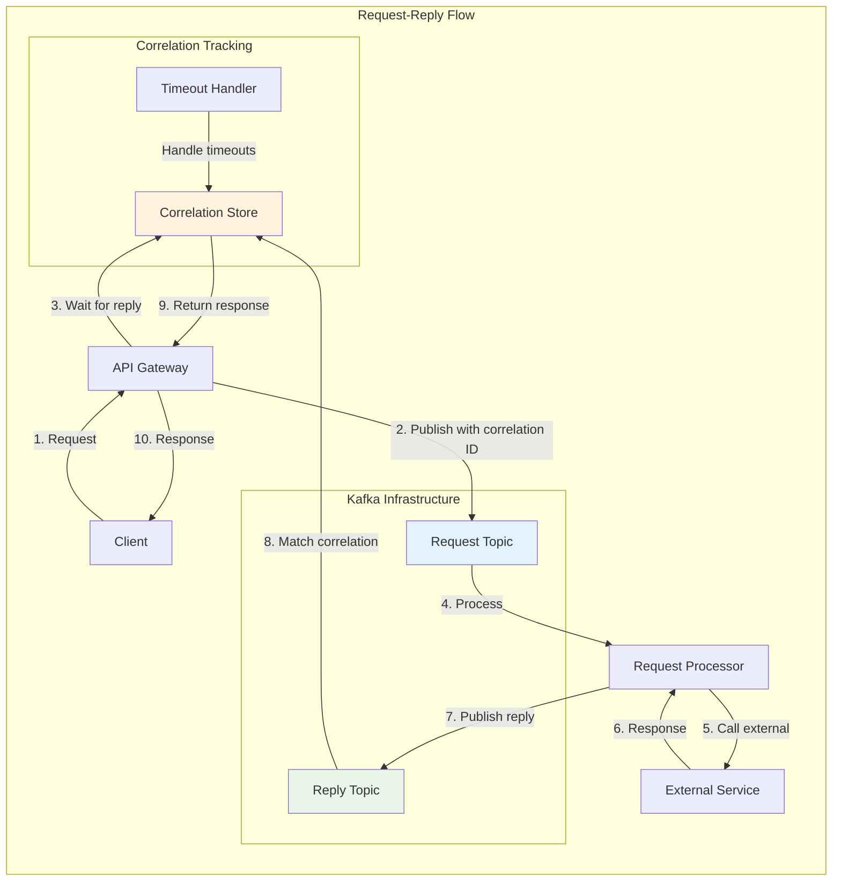
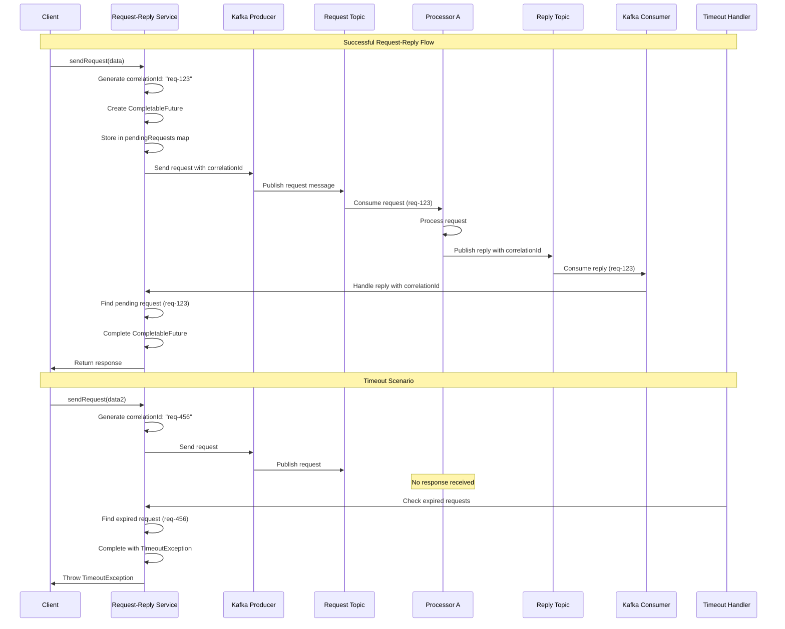

# Lesson 13: Request-Reply Patterns - Advanced Synchronous Communication over Kafka

## 🎯 Objective

Master advanced request-reply patterns using Kafka for synchronous communication in distributed systems. Learn to implement reliable, scalable request-response flows while maintaining the benefits of Kafka's durability and fault tolerance.

## 🔄 **Request-Reply Pattern: When Synchronous Meets Kafka**

Sometimes you need the durability and scalability of Kafka with the immediacy of synchronous communication.



**When to use Request-Reply with Kafka:**
- ✅ **Cross-service queries** requiring real-time responses
- ✅ **Load balancing** across multiple processors
- ✅ **Audit trail** for all requests and responses
- ✅ **Fault tolerance** with message durability

## 🔧 **Basic Request-Reply Implementation**

### 1. **Request-Reply Service Foundation**

```kotlin
data class RequestMessage<T>(
    val correlationId: String,
    val replyTo: String,
    val payload: T,
    val timestamp: Instant,
    val timeoutMs: Long = 30000,
    val metadata: Map<String, String> = emptyMap()
)

data class ReplyMessage<T>(
    val correlationId: String,
    val success: Boolean,
    val payload: T? = null,
    val error: String? = null,
    val timestamp: Instant,
    val processingTimeMs: Long? = null
)

interface RequestReplyService {
    fun <REQ, RESP> sendRequest(
        requestTopic: String,
        request: REQ,
        responseType: Class<RESP>,
        timeoutMs: Long = 30000
    ): CompletableFuture<RESP>
}

@Component
class KafkaRequestReplyService : RequestReplyService {
    
    @Autowired
    private lateinit var kafkaTemplate: KafkaTemplate<String, Any>
    
    private val pendingRequests = ConcurrentHashMap<String, PendingRequest<*>>()
    
    data class PendingRequest<T>(
        val future: CompletableFuture<T>,
        val responseType: Class<T>,
        val startTime: Instant,
        val timeoutMs: Long
    )
    
    override fun <REQ, RESP> sendRequest(
        requestTopic: String,
        request: REQ,
        responseType: Class<RESP>,
        timeoutMs: Long
    ): CompletableFuture<RESP> {
        
        val correlationId = UUID.randomUUID().toString()
        val replyTopic = "replies" // Single reply topic with correlation routing
        
        val future = CompletableFuture<RESP>()
        
        // Store pending request
        pendingRequests[correlationId] = PendingRequest(
            future = future as CompletableFuture<Any>,
            responseType = responseType as Class<Any>,
            startTime = Instant.now(),
            timeoutMs = timeoutMs
        )
        
        // Set up timeout
        scheduleTimeout(correlationId, timeoutMs)
        
        // Create and send request message
        val requestMessage = RequestMessage(
            correlationId = correlationId,
            replyTo = replyTopic,
            payload = request,
            timestamp = Instant.now(),
            timeoutMs = timeoutMs
        )
        
        try {
            kafkaTemplate.send(requestTopic, correlationId, requestMessage)
                .whenComplete { result, exception ->
                    if (exception != null) {
                        removePendingRequest(correlationId, "Failed to send request: ${exception.message}")
                    }
                }
        } catch (e: Exception) {
            removePendingRequest(correlationId, "Failed to send request: ${e.message}")
        }
        
        return future
    }
    
    @KafkaListener(topics = ["replies"])
    fun handleReply(@Payload replyMessage: ReplyMessage<Any>) {
        val correlationId = replyMessage.correlationId
        val pendingRequest = pendingRequests.remove(correlationId)
        
        if (pendingRequest != null) {
            try {
                if (replyMessage.success && replyMessage.payload != null) {
                    // Type-safe deserialization
                    val typedPayload = objectMapper.convertValue(
                        replyMessage.payload,
                        pendingRequest.responseType
                    )
                    pendingRequest.future.complete(typedPayload)
                } else {
                    pendingRequest.future.completeExceptionally(
                        RuntimeException(replyMessage.error ?: "Unknown error")
                    )
                }
                
                // Record metrics
                val duration = Duration.between(pendingRequest.startTime, Instant.now())
                recordRequestReplyMetrics(correlationId, duration, replyMessage.success)
                
            } catch (e: Exception) {
                pendingRequest.future.completeExceptionally(
                    RuntimeException("Failed to process reply: ${e.message}")
                )
            }
        } else {
            logger.warn("Received reply for unknown correlation ID: $correlationId")
        }
    }
    
    private fun scheduleTimeout(correlationId: String, timeoutMs: Long) {
        CompletableFuture.delayedExecutor(timeoutMs, TimeUnit.MILLISECONDS).execute {
            removePendingRequest(correlationId, "Request timeout after ${timeoutMs}ms")
        }
    }
    
    private fun removePendingRequest(correlationId: String, errorMessage: String) {
        val pendingRequest = pendingRequests.remove(correlationId)
        pendingRequest?.future?.completeExceptionally(TimeoutException(errorMessage))
    }
}
```

### 2. **Request Processor Implementation**

```kotlin
@Component
class UserServiceRequestProcessor {
    
    @Autowired
    private lateinit var userService: UserService
    
    @Autowired
    private lateinit var kafkaTemplate: KafkaTemplate<String, Any>
    
    @KafkaListener(topics = ["user-service-requests"])
    fun processUserRequest(
        @Payload requestMessage: RequestMessage<Map<String, Any>>,
        acknowledgment: Acknowledgment
    ) {
        val startTime = Instant.now()
        
        try {
            val requestType = requestMessage.metadata["requestType"] ?: "unknown"
            val response = when (requestType) {
                "GET_USER_PROFILE" -> handleGetUserProfile(requestMessage.payload)
                "VALIDATE_USER" -> handleValidateUser(requestMessage.payload)
                "UPDATE_USER_PREFERENCES" -> handleUpdateUserPreferences(requestMessage.payload)
                "GET_USER_ORDERS" -> handleGetUserOrders(requestMessage.payload)
                else -> throw IllegalArgumentException("Unknown request type: $requestType")
            }
            
            // Send successful reply
            sendReply(requestMessage, response, startTime)
            acknowledgment.acknowledge()
            
        } catch (e: Exception) {
            // Send error reply
            sendErrorReply(requestMessage, e, startTime)
            acknowledgment.acknowledge()
        }
    }
    
    private fun handleGetUserProfile(payload: Map<String, Any>): UserProfile {
        val userId = payload["userId"] as? String 
            ?: throw IllegalArgumentException("Missing userId")
        
        return userService.getUserProfile(userId)
            ?: throw IllegalArgumentException("User not found: $userId")
    }
    
    private fun handleValidateUser(payload: Map<String, Any>): ValidationResult {
        val email = payload["email"] as? String
            ?: throw IllegalArgumentException("Missing email")
        val password = payload["password"] as? String
            ?: throw IllegalArgumentException("Missing password")
        
        return userService.validateCredentials(email, password)
    }
    
    private fun handleUpdateUserPreferences(payload: Map<String, Any>): UpdateResult {
        val userId = payload["userId"] as? String
            ?: throw IllegalArgumentException("Missing userId")
        val preferences = payload["preferences"] as? Map<String, Any>
            ?: throw IllegalArgumentException("Missing preferences")
        
        return userService.updatePreferences(userId, preferences)
    }
    
    private fun handleGetUserOrders(payload: Map<String, Any>): List<Order> {
        val userId = payload["userId"] as? String
            ?: throw IllegalArgumentException("Missing userId")
        val limit = (payload["limit"] as? Number)?.toInt() ?: 10
        
        return userService.getUserOrders(userId, limit)
    }
    
    private fun sendReply(
        requestMessage: RequestMessage<Map<String, Any>>,
        response: Any,
        startTime: Instant
    ) {
        val processingTime = Duration.between(startTime, Instant.now()).toMillis()
        
        val replyMessage = ReplyMessage(
            correlationId = requestMessage.correlationId,
            success = true,
            payload = response,
            timestamp = Instant.now(),
            processingTimeMs = processingTime
        )
        
        kafkaTemplate.send(requestMessage.replyTo, requestMessage.correlationId, replyMessage)
    }
    
    private fun sendErrorReply(
        requestMessage: RequestMessage<Map<String, Any>>,
        exception: Exception,
        startTime: Instant
    ) {
        val processingTime = Duration.between(startTime, Instant.now()).toMillis()
        
        val replyMessage = ReplyMessage<Any>(
            correlationId = requestMessage.correlationId,
            success = false,
            error = exception.message,
            timestamp = Instant.now(),
            processingTimeMs = processingTime
        )
        
        kafkaTemplate.send(requestMessage.replyTo, requestMessage.correlationId, replyMessage)
    }
}
```

## 🏗️ **Advanced Request-Reply Patterns**

### Correlation ID Lifecycle & Timeout Handling

Understanding how correlation IDs work and how timeouts are handled is crucial for reliable request-reply implementations.



### 1. **Multi-Step Request Processing**

```kotlin
@Component
class MultiStepRequestProcessor {
    
    @KafkaListener(topics = ["complex-requests"])
    fun processComplexRequest(
        @Payload requestMessage: RequestMessage<OrderValidationRequest>,
        acknowledgment: Acknowledgment
    ) {
        val correlationId = requestMessage.correlationId
        
        try {
            val request = requestMessage.payload
            
            // Step 1: Validate customer
            val customerValidation = validateCustomer(request.customerId)
            if (!customerValidation.valid) {
                sendErrorReply(requestMessage, "Customer validation failed: ${customerValidation.reason}")
                acknowledgment.acknowledge()
                return
            }
            
            // Step 2: Check inventory
            val inventoryCheck = checkInventory(request.items)
            if (!inventoryCheck.allAvailable) {
                sendErrorReply(requestMessage, "Inventory check failed: ${inventoryCheck.missingItems}")
                acknowledgment.acknowledge()
                return
            }
            
            // Step 3: Validate payment method
            val paymentValidation = validatePaymentMethod(request.paymentMethod)
            if (!paymentValidation.valid) {
                sendErrorReply(requestMessage, "Payment validation failed: ${paymentValidation.reason}")
                acknowledgment.acknowledge()
                return
            }
            
            // Step 4: Calculate pricing
            val pricing = calculatePricing(request.items, request.customerId)
            
            // Step 5: Compile response
            val response = OrderValidationResponse(
                valid = true,
                orderId = UUID.randomUUID().toString(),
                totalAmount = pricing.total,
                discounts = pricing.discounts,
                estimatedDelivery = calculateDeliveryDate(request.shippingAddress),
                validationSteps = listOf(
                    "Customer validated",
                    "Inventory available",
                    "Payment method valid",
                    "Pricing calculated"
                )
            )
            
            sendSuccessReply(requestMessage, response)
            acknowledgment.acknowledge()
            
        } catch (e: Exception) {
            sendErrorReply(requestMessage, "Processing failed: ${e.message}")
            acknowledgment.acknowledge()
        }
    }
}
```

### 2. **Request Aggregation Pattern**

```kotlin
@Component
class RequestAggregationProcessor {
    
    private val aggregationRequests = ConcurrentHashMap<String, AggregationContext>()
    
    data class AggregationContext(
        val originalRequest: RequestMessage<DataAggregationRequest>,
        val subRequests: Set<String>,
        val responses: MutableMap<String, Any>,
        val startTime: Instant
    )
    
    @KafkaListener(topics = ["aggregation-requests"])
    fun processAggregationRequest(
        @Payload requestMessage: RequestMessage<DataAggregationRequest>,
        acknowledgment: Acknowledgment
    ) {
        try {
            val request = requestMessage.payload
            val subRequestIds = mutableSetOf<String>()
            
            // Create sub-requests for different data sources
            if (request.includeUserData) {
                val subRequestId = sendSubRequest("user-data-requests", mapOf(
                    "userId" to request.userId,
                    "correlationId" to requestMessage.correlationId
                ))
                subRequestIds.add(subRequestId)
            }
            
            if (request.includeOrderHistory) {
                val subRequestId = sendSubRequest("order-history-requests", mapOf(
                    "userId" to request.userId,
                    "limit" to request.orderHistoryLimit,
                    "correlationId" to requestMessage.correlationId
                ))
                subRequestIds.add(subRequestId)
            }
            
            if (request.includePreferences) {
                val subRequestId = sendSubRequest("preference-requests", mapOf(
                    "userId" to request.userId,
                    "correlationId" to requestMessage.correlationId
                ))
                subRequestIds.add(subRequestId)
            }
            
            // Store aggregation context
            aggregationRequests[requestMessage.correlationId] = AggregationContext(
                originalRequest = requestMessage,
                subRequests = subRequestIds,
                responses = ConcurrentHashMap(),
                startTime = Instant.now()
            )
            
            // Set up timeout for aggregation
            scheduleAggregationTimeout(requestMessage.correlationId, requestMessage.timeoutMs)
            
            acknowledgment.acknowledge()
            
        } catch (e: Exception) {
            sendErrorReply(requestMessage, "Failed to initiate aggregation: ${e.message}")
            acknowledgment.acknowledge()
        }
    }
    
    @KafkaListener(topics = ["aggregation-sub-replies"])
    fun handleSubReply(
        @Payload subReply: SubRequestReply,
        acknowledgment: Acknowledgment
    ) {
        val context = aggregationRequests[subReply.parentCorrelationId]
        
        if (context != null) {
            // Store sub-response
            context.responses[subReply.subRequestId] = subReply.data
            
            // Check if all sub-requests are complete
            if (context.responses.size == context.subRequests.size) {
                // All responses received - compile and send final response
                val aggregatedResponse = compileAggregatedResponse(context)
                sendSuccessReply(context.originalRequest, aggregatedResponse)
                
                // Clean up
                aggregationRequests.remove(subReply.parentCorrelationId)
            }
        }
        
        acknowledgment.acknowledge()
    }
    
    private fun compileAggregatedResponse(context: AggregationContext): AggregatedDataResponse {
        return AggregatedDataResponse(
            userId = context.originalRequest.payload.userId,
            userData = context.responses["user-data"],
            orderHistory = context.responses["order-history"] as? List<*>,
            preferences = context.responses["preferences"] as? Map<*, *>,
            aggregationTime = Duration.between(context.startTime, Instant.now()).toMillis()
        )
    }
}
```

### 3. **Request Priority and Load Balancing**

```kotlin
@Component
class PriorityRequestProcessor {
    
    @KafkaListener(
        topics = ["high-priority-requests"],
        concurrency = "5"
    )
    fun processHighPriorityRequest(
        @Payload requestMessage: RequestMessage<Any>,
        acknowledgment: Acknowledgment
    ) {
        processWithPriority(requestMessage, Priority.HIGH)
        acknowledgment.acknowledge()
    }
    
    @KafkaListener(
        topics = ["normal-priority-requests"],
        concurrency = "3"
    )
    fun processNormalPriorityRequest(
        @Payload requestMessage: RequestMessage<Any>,
        acknowledgment: Acknowledgment
    ) {
        processWithPriority(requestMessage, Priority.NORMAL)
        acknowledgment.acknowledge()
    }
    
    @KafkaListener(
        topics = ["low-priority-requests"],
        concurrency = "1"
    )
    fun processLowPriorityRequest(
        @Payload requestMessage: RequestMessage<Any>,
        acknowledgment: Acknowledgment
    ) {
        processWithPriority(requestMessage, Priority.LOW)
        acknowledgment.acknowledge()
    }
    
    private fun processWithPriority(
        requestMessage: RequestMessage<Any>,
        priority: Priority
    ) {
        val startTime = Instant.now()
        
        try {
            // Add artificial delay for low priority requests during high load
            if (priority == Priority.LOW && isSystemUnderHighLoad()) {
                Thread.sleep(1000) // 1 second delay
            }
            
            val response = processRequest(requestMessage.payload)
            sendSuccessReply(requestMessage, response)
            
            // Record priority-specific metrics
            recordPriorityMetrics(priority, Duration.between(startTime, Instant.now()), true)
            
        } catch (e: Exception) {
            sendErrorReply(requestMessage, e.message ?: "Processing failed")
            recordPriorityMetrics(priority, Duration.between(startTime, Instant.now()), false)
        }
    }
}
```

## 📊 **Advanced Monitoring and Circuit Breaking**

### 1. **Request-Reply Circuit Breaker**

```kotlin
@Component
class RequestReplyCircuitBreaker {
    
    private val circuitBreakers = ConcurrentHashMap<String, CircuitBreaker>()
    
    fun <T> executeWithCircuitBreaker(
        serviceName: String,
        request: () -> CompletableFuture<T>
    ): CompletableFuture<T> {
        
        val circuitBreaker = circuitBreakers.computeIfAbsent(serviceName) {
            CircuitBreaker.ofDefaults(serviceName).apply {
                eventPublisher.onStateTransition { event ->
                    logger.info("Circuit breaker $serviceName state transition: ${event.stateTransition}")
                    
                    when (event.stateTransition.toState) {
                        CircuitBreaker.State.OPEN -> {
                            alertService.sendAlert("Circuit breaker OPEN for service: $serviceName")
                        }
                        CircuitBreaker.State.HALF_OPEN -> {
                            logger.info("Circuit breaker HALF_OPEN for service: $serviceName - testing...")
                        }
                        CircuitBreaker.State.CLOSED -> {
                            logger.info("Circuit breaker CLOSED for service: $serviceName - service recovered")
                        }
                    }
                }
            }
        }
        
        return circuitBreaker.executeCompletionStage { request() }.toCompletableFuture()
    }
}
```

### 2. **Request-Reply Analytics**

```kotlin
@Component
class RequestReplyAnalytics {
    
    @EventListener
    fun handleRequestReplyEvent(event: RequestReplyEvent) {
        // Record detailed metrics
        when (event.type) {
            EventType.REQUEST_SENT -> recordRequestSent(event)
            EventType.REPLY_RECEIVED -> recordReplyReceived(event)
            EventType.REQUEST_TIMEOUT -> recordRequestTimeout(event)
            EventType.REQUEST_FAILED -> recordRequestFailed(event)
        }
    }
    
    @Scheduled(fixedRate = 60000) // Every minute
    fun generatePerformanceReport() {
        val report = RequestReplyPerformanceReport(
            totalRequests = getTotalRequestCount(),
            successRate = getSuccessRate(),
            averageResponseTime = getAverageResponseTime(),
            timeoutRate = getTimeoutRate(),
            topSlowServices = getTopSlowServices(),
            circuitBreakerStatus = getCircuitBreakerStatus()
        )
        
        logger.info("Request-Reply Performance Report: $report")
        
        // Store report for trending analysis
        performanceReportRepository.save(report)
    }
}
```

## ✅ **Best Practices Summary**

### 🔄 **Request-Reply Design**
- **Use sparingly** - prefer pure async patterns when possible
- **Set reasonable timeouts** based on expected processing time
- **Implement proper correlation ID management** to avoid memory leaks
- **Design for idempotency** in request processors

### 🏗️ **Scalability Patterns**
- **Use priority queues** for different request types
- **Implement load balancing** across multiple processors
- **Monitor queue depths** and processing times
- **Scale processors independently** based on load

### 🔧 **Fault Tolerance**
- **Implement circuit breakers** for external service calls
- **Handle timeouts gracefully** with meaningful error messages
- **Provide fallback responses** when appropriate
- **Monitor failure patterns** to identify systemic issues

### 📊 **Operational Excellence**
- **Track request-reply metrics** including success rates and timing
- **Monitor correlation ID cleanup** to prevent memory leaks
- **Implement proper logging** with correlation tracking
- **Set up alerts** for high failure rates or slow responses

## 🎉 **Phase 2 Complete!**

**Congratulations!** You've completed **Phase 2: Building Resilient Messaging Patterns** with mastery of:

✅ **Consumer Groups & Load Balancing** (Lesson 7)  
✅ **Retry Strategies & Dead Letter Topics** (Lesson 8)  
✅ **Manual Acknowledgment & Idempotent Consumers** (Lesson 9)  
✅ **Message Transformation & Filtering** (Lesson 10)  
✅ **Fan-out Pattern & Notification Systems** (Lesson 11)  
✅ **Kafka-Triggered REST & Command APIs** (Lesson 12)  
✅ **Request-Reply Patterns** (Lesson 13)  

## 🚀 **What's Next?**

Ready for **Phase 3: Kafka Streams, State & Aggregation**? Begin with [Lesson 14: Kafka Streams API Introduction](../lesson_14/concept.md) to learn stream processing, real-time aggregations, and stateful computations that transform how you process data.

---

*Request-reply patterns complete your toolkit for building sophisticated distributed systems. Combined with the other resilient messaging patterns, you can now architect systems that are both responsive and fault-tolerant, handling any communication requirement with confidence.*