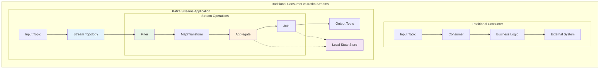

# Concept

## Kafka Streams API Introduction - Real-time Stream Processing

## 🎯 Objective

Master the Kafka Streams API to build real-time stream processing applications. Learn to create stream topologies, perform transformations, and build stateful processing pipelines that can handle millions of events with low latency and fault tolerance.

## 🌊 **Kafka Streams: Real-time Processing Revolution**

Kafka Streams transforms your applications from simple message consumers into powerful stream processors that can perform real-time analytics, transformations, and aggregations.



**Key Advantages of Kafka Streams:**
- ✅ **Event-by-event processing** with millisecond latency
- ✅ **Exactly-once semantics** for data consistency
- ✅ **Fault tolerance** with automatic recovery
- ✅ **Horizontal scaling** across multiple instances
- ✅ **No external dependencies** - just your application + Kafka

## 🏗️ **Stream Processing Fundamentals**

### 1. **Core Concepts: Streams and Tables**

```kotlin
// Stream: Unbounded sequence of events
// Table: Snapshot of latest values (changelog stream)

data class UserEvent(
    val userId: String,
    val eventType: String,
    val timestamp: Long,
    val data: Map<String, Any>
)

data class UserProfile(
    val userId: String,
    val name: String,
    val email: String,
    val lastSeen: Long,
    val preferences: Map<String, String>
)

// Stream: Continuous flow of user events
// user-events: UserEvent("user1", "LOGIN", 123456), UserEvent("user1", "CLICK", 123457), ...

// Table: Current state of user profiles  
// user-profiles: "user1" -> UserProfile("user1", "John", "john@example.com", 123457, {...})
```

### 2. **Basic Stream Topology**

```kotlin
@Component
class UserActivityStreamProcessor {
    
    @Autowired
    private lateinit var streamBuilderFactoryBean: StreamBuilderFactoryBean
    
    @Bean
    fun userActivityTopology(): Topology {
        val builder = StreamsBuilder()
        
        // 1. Source: Read from input topic
        val userEvents: KStream<String, UserEvent> = builder.stream(
            "user-events",
            Consumed.with(Serdes.String(), JsonSerde(UserEvent::class.java))
        )
        
        // 2. Filter: Only process login events
        val loginEvents = userEvents.filter { key, event ->
            event.eventType == "LOGIN"
        }
        
        // 3. Transform: Enrich with additional data
        val enrichedEvents = loginEvents.mapValues { event ->
            EnrichedUserEvent(
                userId = event.userId,
                eventType = event.eventType,
                timestamp = event.timestamp,
                originalData = event.data,
                enrichedData = mapOf(
                    "loginTime" to formatTimestamp(event.timestamp),
                    "deviceType" to detectDeviceType(event.data),
                    "location" to extractLocation(event.data)
                )
            )
        }
        
        // 4. Sink: Write to output topic
        enrichedEvents.to(
            "user-logins-enriched",
            Produced.with(Serdes.String(), JsonSerde(EnrichedUserEvent::class.java))
        )
        
        return builder.build()
    }
}
```

### 3. **Stream Configuration**

```kotlin
@Configuration
@EnableKafkaStreams
class KafkaStreamsConfig {
    
    @Bean(name = [KafkaStreamsDefaultConfiguration.DEFAULT_STREAMS_CONFIG_BEAN_NAME])
    fun streamsConfig(): KafkaStreamsConfiguration {
        val props = HashMap<String, Any>()
        
        // Basic configuration
        props[StreamsConfig.APPLICATION_ID_CONFIG] = "user-activity-processor"
        props[StreamsConfig.BOOTSTRAP_SERVERS_CONFIG] = "localhost:9092"
        
        // Serialization
        props[StreamsConfig.DEFAULT_KEY_SERDE_CLASS_CONFIG] = Serdes.String()::class.java
        props[StreamsConfig.DEFAULT_VALUE_SERDE_CLASS_CONFIG] = JsonSerde::class.java
        
        // Processing guarantees
        props[StreamsConfig.PROCESSING_GUARANTEE_CONFIG] = StreamsConfig.EXACTLY_ONCE_V2
        
        // Performance tuning
        props[StreamsConfig.NUM_STREAM_THREADS_CONFIG] = 2
        props[StreamsConfig.COMMIT_INTERVAL_MS_CONFIG] = 1000 // 1 second
        props[StreamsConfig.CACHE_MAX_BYTES_BUFFERING_CONFIG] = 1024 * 1024 // 1MB
        
        // State store configuration
        props[StreamsConfig.STATE_DIR_CONFIG] = "/tmp/kafka-streams"
        
        // Error handling
        props[StreamsConfig.DEFAULT_DESERIALIZATION_EXCEPTION_HANDLER_CLASS_CONFIG] = 
            LogAndContinueExceptionHandler::class.java
        
        return KafkaStreamsConfiguration(props)
    }
}
```

## 🔄 **Stream Operations and Transformations**

### 1. **Stateless Transformations**

```kotlin
@Component
class StatelessTransformations {
    
    fun buildStatelessTopology(): Topology {
        val builder = StreamsBuilder()
        
        val orderEvents: KStream<String, OrderEvent> = builder.stream("order-events")
        
        // 1. FILTER: Remove test orders
        val realOrders = orderEvents.filter { key, order ->
            !order.customerId.startsWith("test_") && order.amount > 0
        }
        
        // 2. MAP: Transform each record
        val orderSummaries = realOrders.map { key, order ->
            KeyValue(
                order.customerId, // New key: customer ID
                OrderSummary(
                    orderId = order.orderId,
                    customerId = order.customerId,
                    amount = order.amount,
                    itemCount = order.items.size,
                    category = categorizeOrder(order),
                    timestamp = order.timestamp
                )
            )
        }
        
        // 3. MAPVALUES: Transform only values (more efficient)
        val enrichedSummaries = orderSummaries.mapValues { summary ->
            summary.copy(
                taxAmount = calculateTax(summary.amount),
                shippingCost = calculateShipping(summary),
                totalAmount = summary.amount + calculateTax(summary.amount) + calculateShipping(summary)
            )
        }
        
        // 4. FLATMAP: One-to-many transformation
        val orderItems: KStream<String, OrderItem> = realOrders.flatMap { key, order ->
            order.items.map { item ->
                KeyValue(
                    "${order.orderId}-${item.productId}",
                    OrderItem(
                        orderId = order.orderId,
                        productId = item.productId,
                        quantity = item.quantity,
                        price = item.price,
                        customerId = order.customerId
                    )
                )
            }
        }
        
        // 5. SELECTKEY: Choose new key
        val productSales = orderItems.selectKey { key, item ->
            item.productId // Re-key by product ID
        }
        
        // Output streams
        enrichedSummaries.to("order-summaries")
        productSales.to("product-sales")
        
        return builder.build()
    }
}
```

### 2. **Branching and Routing**

```kotlin
@Component  
class StreamRouting {
    
    fun buildRoutingTopology(): Topology {
        val builder = StreamsBuilder()
        
        val transactions: KStream<String, Transaction> = builder.stream("transactions")
        
        // Branch based on transaction amount
        val branches = transactions.branch(
            Named.`as`("high-value"),
            Predicate { key, transaction -> transaction.amount > 10000 },
            
            Named.`as`("medium-value"), 
            Predicate { key, transaction -> transaction.amount > 1000 },
            
            Named.`as`("low-value"),
            Predicate { key, transaction -> true } // Catch all remaining
        )
        
        // Process high-value transactions
        branches["high-value"]!!
            .mapValues { transaction ->
                transaction.copy(
                    flagged = true,
                    reviewRequired = true,
                    priority = "HIGH"
                )
            }
            .to("high-value-transactions")
        
        // Process medium-value transactions
        branches["medium-value"]!!
            .filter { key, transaction -> 
                !isSuspiciousPattern(transaction) 
            }
            .to("standard-transactions")
        
        // Process low-value transactions
        branches["low-value"]!!
            .mapValues { transaction ->
                transaction.copy(priority = "LOW")
            }
            .to("low-priority-transactions")
        
        return builder.build()
    }
}
```

### 3. **Stream-Stream Operations**

```kotlin
@Component
class StreamJoining {
    
    fun buildJoinTopology(): Topology {
        val builder = StreamsBuilder()
        
        val userEvents: KStream<String, UserEvent> = builder.stream("user-events")
        val sessionEvents: KStream<String, SessionEvent> = builder.stream("session-events")
        
        // Inner Join: Match events that occur within a time window
        val joinedEvents = userEvents.join(
            sessionEvents,
            { userEvent, sessionEvent ->
                UserSessionEvent(
                    userId = userEvent.userId,
                    sessionId = sessionEvent.sessionId,
                    eventType = userEvent.eventType,
                    sessionData = sessionEvent.data,
                    joinTimestamp = System.currentTimeMillis()
                )
            },
            JoinWindows.of(Duration.ofMinutes(5)), // 5-minute window
            StreamJoined.with(Serdes.String(), userEventSerde, sessionEventSerde)
        )
        
        // Left Join: Keep all user events, add session data if available
        val leftJoinedEvents = userEvents.leftJoin(
            sessionEvents,
            { userEvent, sessionEvent ->
                UserSessionEvent(
                    userId = userEvent.userId,
                    sessionId = sessionEvent?.sessionId,
                    eventType = userEvent.eventType,
                    sessionData = sessionEvent?.data ?: emptyMap(),
                    joinTimestamp = System.currentTimeMillis()
                )
            },
            JoinWindows.of(Duration.ofMinutes(5)),
            StreamJoined.with(Serdes.String(), userEventSerde, sessionEventSerde)
        )
        
        joinedEvents.to("user-session-events")
        
        return builder.build()
    }
}
```

## 📊 **Aggregations and Windowing**

### 1. **Simple Aggregations**

```kotlin
@Component
class StreamAggregations {
    
    fun buildAggregationTopology(): Topology {
        val builder = StreamsBuilder()
        
        val orderEvents: KStream<String, OrderEvent> = builder.stream("order-events")
        
        // Group by customer ID for aggregation
        val ordersByCustomer = orderEvents
            .selectKey { key, order -> order.customerId }
            .groupByKey(Grouped.with(Serdes.String(), orderEventSerde))
        
        // 1. COUNT: Number of orders per customer
        val orderCounts: KTable<String, Long> = ordersByCustomer.count(
            Named.`as`("order-counts"),
            Materialized.`as`<String, Long, KeyValueStore<Bytes, ByteArray>>("order-counts-store")
                .withKeySerde(Serdes.String())
                .withValueSerde(Serdes.Long())
        )
        
        // 2. AGGREGATE: Total amount per customer
        val customerTotals: KTable<String, CustomerTotal> = ordersByCustomer.aggregate(
            { CustomerTotal() }, // Initial value
            { customerId, order, aggregate ->
                aggregate.copy(
                    customerId = customerId,
                    totalAmount = aggregate.totalAmount + order.amount,
                    orderCount = aggregate.orderCount + 1,
                    lastOrderTime = maxOf(aggregate.lastOrderTime, order.timestamp),
                    averageOrderValue = (aggregate.totalAmount + order.amount) / (aggregate.orderCount + 1)
                )
            },
            Named.`as`("customer-totals"),
            Materialized.`as`<String, CustomerTotal, KeyValueStore<Bytes, ByteArray>>("customer-totals-store")
                .withKeySerde(Serdes.String())
                .withValueSerde(JsonSerde(CustomerTotal::class.java))
        )
        
        // 3. REDUCE: Find highest order amount per customer
        val maxOrders: KTable<String, OrderEvent> = ordersByCustomer.reduce(
            { order1, order2 ->
                if (order1.amount > order2.amount) order1 else order2
            },
            Named.`as`("max-orders"),
            Materialized.`as`<String, OrderEvent, KeyValueStore<Bytes, ByteArray>>("max-orders-store")
                .withKeySerde(Serdes.String())
                .withValueSerde(orderEventSerde)
        )
        
        // Output aggregation results
        orderCounts.toStream().to("customer-order-counts")
        customerTotals.toStream().to("customer-totals")
        maxOrders.toStream().to("customer-max-orders")
        
        return builder.build()
    }
}
```

### 2. **Time-Windowed Aggregations**

```kotlin
@Component
class WindowedAggregations {
    
    fun buildWindowedTopology(): Topology {
        val builder = StreamsBuilder()
        
        val pageViews: KStream<String, PageViewEvent> = builder.stream("page-views")
        
        // Group by page for windowed aggregation
        val pageViewsByPage = pageViews
            .selectKey { key, event -> event.pageUrl }
            .groupByKey(Grouped.with(Serdes.String(), pageViewEventSerde))
        
        // 1. TUMBLING WINDOW: Non-overlapping windows
        val hourlyPageViews = pageViewsByPage
            .windowedBy(TimeWindows.of(Duration.ofHours(1)))
            .count(
                Named.`as`("hourly-page-views"),
                Materialized.`as`<String, Long, WindowStore<Bytes, ByteArray>>("hourly-views-store")
            )
        
        // 2. HOPPING WINDOW: Overlapping windows
        val slidingPageViews = pageViewsByPage
            .windowedBy(
                TimeWindows.of(Duration.ofHours(1))
                    .advanceBy(Duration.ofMinutes(15)) // New window every 15 minutes
            )
            .count(Named.`as`("sliding-page-views"))
        
        // 3. SESSION WINDOW: Based on inactivity gaps
        val sessionPageViews = pageViewsByPage
            .windowedBy(SessionWindows.with(Duration.ofMinutes(30))) // 30-minute inactivity gap
            .aggregate(
                { PageViewSession() },
                { pageUrl, event, session ->
                    session.copy(
                        pageUrl = pageUrl,
                        viewCount = session.viewCount + 1,
                        totalDuration = session.totalDuration + event.duration,
                        lastViewTime = maxOf(session.lastViewTime, event.timestamp)
                    )
                },
                { session1, session2 -> // Merger for session windows
                    session1.copy(
                        viewCount = session1.viewCount + session2.viewCount,
                        totalDuration = session1.totalDuration + session2.totalDuration,
                        lastViewTime = maxOf(session1.lastViewTime, session2.lastViewTime)
                    )
                },
                Named.`as`("session-page-views"),
                Materialized.with(Serdes.String(), JsonSerde(PageViewSession::class.java))
            )
        
        // Convert windowed results to streams for output
        hourlyPageViews
            .toStream { windowedKey, value ->
                "${windowedKey.key()}-${windowedKey.window().start()}-${windowedKey.window().end()}"
            }
            .mapValues { count ->
                WindowedCount(
                    key = "",
                    count = count,
                    windowStart = 0L,
                    windowEnd = 0L
                )
            }
            .to("hourly-page-view-counts")
        
        return builder.build()
    }
}
```

## 🗃️ **State Stores and Interactive Queries**

### 1. **Custom State Store Operations**

```kotlin
@Component
class StateStoreOperations {
    
    @Autowired
    private lateinit var kafkaStreams: KafkaStreams
    
    fun buildStatefulTopology(): Topology {
        val builder = StreamsBuilder()
        
        val userEvents: KStream<String, UserEvent> = builder.stream("user-events")
        
        // Create custom state store
        val userProfileStore = Stores.keyValueStoreBuilder(
            Stores.persistentKeyValueStore("user-profiles"),
            Serdes.String(),
            JsonSerde(UserProfile::class.java)
        )
        
        builder.addStateStore(userProfileStore)
        
        // Process events with state store access
        val enrichedEvents = userEvents.transform(
            TransformerSupplier {
                object : Transformer<String, UserEvent, KeyValue<String, EnrichedUserEvent>> {
                    private lateinit var stateStore: KeyValueStore<String, UserProfile>
                    private lateinit var context: ProcessorContext
                    
                    override fun init(context: ProcessorContext) {
                        this.context = context
                        this.stateStore = context.getStateStore("user-profiles")
                    }
                    
                    override fun transform(key: String, event: UserEvent): KeyValue<String, EnrichedUserEvent>? {
                        // Get current user profile from state store
                        val currentProfile = stateStore.get(event.userId) ?: UserProfile(
                            userId = event.userId,
                            eventCount = 0,
                            lastSeen = 0,
                            preferences = emptyMap()
                        )
                        
                        // Update profile based on event
                        val updatedProfile = currentProfile.copy(
                            eventCount = currentProfile.eventCount + 1,
                            lastSeen = event.timestamp,
                            preferences = mergePreferences(currentProfile.preferences, event.data)
                        )
                        
                        // Save updated profile
                        stateStore.put(event.userId, updatedProfile)
                        
                        // Create enriched event
                        val enrichedEvent = EnrichedUserEvent(
                            userId = event.userId,
                            eventType = event.eventType,
                            timestamp = event.timestamp,
                            originalData = event.data,
                            enrichedData = mapOf(
                                "totalEvents" to updatedProfile.eventCount,
                                "daysSinceFirstSeen" to calculateDaysSince(updatedProfile.firstSeen),
                                "userCategory" to categorizeUser(updatedProfile)
                            )
                        )
                        
                        return KeyValue(key, enrichedEvent)
                    }
                    
                    override fun close() {
                        // Cleanup if needed
                    }
                }
            },
            "user-profiles"
        )
        
        enrichedEvents.to("enriched-user-events")
        
        return builder.build()
    }
    
    // Interactive Query API
    fun getUserProfile(userId: String): UserProfile? {
        val store = kafkaStreams.store(
            StoreQueryParameters.fromNameAndType(
                "user-profiles",
                QueryableStoreTypes.keyValueStore<String, UserProfile>()
            )
        )
        return store.get(userId)
    }
    
    fun getAllUserProfiles(): List<UserProfile> {
        val store = kafkaStreams.store(
            StoreQueryParameters.fromNameAndType(
                "user-profiles", 
                QueryableStoreTypes.keyValueStore<String, UserProfile>()
            )
        )
        
        val profiles = mutableListOf<UserProfile>()
        store.all().use { iterator ->
            while (iterator.hasNext()) {
                profiles.add(iterator.next().value)
            }
        }
        return profiles
    }
}
```

### 2. **REST API for Interactive Queries**

```kotlin
@RestController
@RequestMapping("/api/streams")
class StreamsQueryController {
    
    @Autowired
    private lateinit var stateStoreOperations: StateStoreOperations
    
    @GetMapping("/users/{userId}/profile")
    fun getUserProfile(@PathVariable userId: String): ResponseEntity<UserProfile> {
        val profile = stateStoreOperations.getUserProfile(userId)
        return if (profile != null) {
            ResponseEntity.ok(profile)
        } else {
            ResponseEntity.notFound().build()
        }
    }
    
    @GetMapping("/users/profiles")
    fun getAllUserProfiles(
        @RequestParam(defaultValue = "0") page: Int,
        @RequestParam(defaultValue = "50") size: Int
    ): ResponseEntity<List<UserProfile>> {
        val allProfiles = stateStoreOperations.getAllUserProfiles()
        val startIndex = page * size
        val endIndex = minOf(startIndex + size, allProfiles.size)
        
        return if (startIndex < allProfiles.size) {
            ResponseEntity.ok(allProfiles.subList(startIndex, endIndex))
        } else {
            ResponseEntity.ok(emptyList())
        }
    }
    
    @GetMapping("/metrics/customer-totals/{customerId}")
    fun getCustomerTotals(@PathVariable customerId: String): ResponseEntity<CustomerTotal> {
        // Query windowed store for customer totals
        val store = kafkaStreams.store(
            StoreQueryParameters.fromNameAndType(
                "customer-totals-store",
                QueryableStoreTypes.keyValueStore<String, CustomerTotal>()
            )
        )
        
        val total = store.get(customerId)
        return if (total != null) {
            ResponseEntity.ok(total)
        } else {
            ResponseEntity.notFound().build()
        }
    }
}
```

## 📊 **Monitoring and Observability**

### 1. **Streams Metrics Collection**

```kotlin
@Component
class StreamsMetricsCollector {
    
    @Autowired
    private lateinit var kafkaStreams: KafkaStreams
    
    @Scheduled(fixedRate = 30000) // Every 30 seconds
    fun collectStreamMetrics() {
        val metrics = kafkaStreams.metrics()
        
        metrics.forEach { (metricName, metric) ->
            when (metricName.name()) {
                "process-rate" -> {
                    Metrics.globalRegistry.gauge(
                        "kafka.streams.process.rate",
                        Tags.of(Tag.of("thread", metricName.tags()["thread-id"] ?: "unknown")),
                        metric.metricValue() as Double
                    )
                }
                
                "process-latency-avg" -> {
                    Metrics.globalRegistry.gauge(
                        "kafka.streams.process.latency.avg",
                        Tags.of(Tag.of("thread", metricName.tags()["thread-id"] ?: "unknown")),
                        metric.metricValue() as Double
                    )
                }
                
                "commit-rate" -> {
                    Metrics.globalRegistry.gauge(
                        "kafka.streams.commit.rate",
                        metric.metricValue() as Double
                    )
                }
            }
        }
    }
    
    @EventListener
    fun handleStreamStateChange(event: KafkaStreams.StateListener) {
        when (event.newState()) {
            KafkaStreams.State.RUNNING -> {
                logger.info("Kafka Streams application is running")
                Metrics.globalRegistry.gauge("kafka.streams.state", 1.0)
            }
            KafkaStreams.State.ERROR -> {
                logger.error("Kafka Streams application encountered an error")
                Metrics.globalRegistry.gauge("kafka.streams.state", -1.0)
            }
            else -> {
                logger.info("Kafka Streams state changed to: ${event.newState()}")
                Metrics.globalRegistry.gauge("kafka.streams.state", 0.0)
            }
        }
    }
}
```

## ✅ **Best Practices Summary**

### 🏗️ **Topology Design**
- **Start simple** with basic transformations before adding complexity
- **Design for scalability** with proper key selection for parallelism
- **Use appropriate serdes** for performance and compatibility
- **Handle null values** and malformed data gracefully

### 🔧 **Performance Optimization**
- **Choose appropriate windowing** based on use case requirements
- **Optimize state store configuration** for your data access patterns
- **Monitor lag and throughput** to identify bottlenecks
- **Scale instances** based on partition count and processing load

### 🛡️ **Fault Tolerance**
- **Configure exactly-once semantics** for critical applications
- **Implement proper error handling** with deserialization exception handlers
- **Design for reprocessing** with idempotent operations
- **Monitor and alert** on stream application health

### 📊 **State Management**
- **Design state stores efficiently** with appropriate key schemes
- **Implement cleanup policies** for long-running applications
- **Use interactive queries** for real-time state access
- **Consider state store backup** and recovery strategies

## 🚀 **What's Next?**

You've mastered the fundamentals of Kafka Streams! Next, dive deeper into advanced stream processing with [Lesson 15: Windowing, Joins & Stateful Operations](../lesson_16/concept.md), where you'll learn complex temporal patterns, multi-stream joins, and sophisticated aggregation strategies.

---

*Kafka Streams unlocks the full power of real-time stream processing. With these fundamentals, you can build applications that process millions of events with low latency while maintaining fault tolerance and exactly-once guarantees.*