# Concept

## Windowing, Joins & Stateful Operations - Advanced Stream Processing

## 🎯 Objective

Master advanced Kafka Streams patterns including sophisticated windowing strategies, complex stream joins, and stateful processing operations. Build real-time analytics systems that can handle temporal data analysis, event correlation, and multi-stream processing scenarios.

## ⏰ **Advanced Windowing Strategies**

Windowing is crucial for time-based analytics and handling unbounded data streams in bounded memory.


### 1. **Advanced Tumbling Window Patterns**

```kotlin
@Component
class AdvancedTumblingWindows {
    
    fun buildSalesAnalyticsTopology(): Topology {
        val builder = StreamsBuilder()
        
        val salesEvents: KStream<String, SalesEvent> = builder.stream("sales-events")
        
        // Multi-level tumbling windows for different time granularities
        val salesByProduct = salesEvents
            .selectKey { _, event -> event.productId }
            .groupByKey(Grouped.with(Serdes.String(), salesEventSerde))
        
        // 1. Hourly sales aggregation
        val hourlySales = salesByProduct
            .windowedBy(TimeWindows.of(Duration.ofHours(1)))
            .aggregate(
                { SalesAggregate() },
                { productId, event, aggregate ->
                    aggregate.copy(
                        productId = productId,
                        totalSales = aggregate.totalSales + event.amount,
                        transactionCount = aggregate.transactionCount + 1,
                        averageTransactionValue = (aggregate.totalSales + event.amount) / (aggregate.transactionCount + 1),
                        maxTransactionValue = maxOf(aggregate.maxTransactionValue, event.amount),
                        minTransactionValue = if (aggregate.minTransactionValue == 0.0) event.amount 
                                           else minOf(aggregate.minTransactionValue, event.amount),
                        lastUpdateTime = event.timestamp
                    )
                },
                Named.`as`("hourly-sales"),
                Materialized.`as`<String, SalesAggregate, WindowStore<Bytes, ByteArray>>("hourly-sales-store")
                    .withKeySerde(Serdes.String())
                    .withValueSerde(JsonSerde(SalesAggregate::class.java))
                    .withRetention(Duration.ofDays(7)) // Keep 7 days of data
            )
        
        // 2. Daily sales aggregation with business logic
        val dailySales = salesByProduct
            .windowedBy(TimeWindows.of(Duration.ofDays(1)))
            .aggregate(
                { DailySalesAggregate() },
                { productId, event, aggregate ->
                    val updatedAggregate = aggregate.copy(
                        productId = productId,
                        totalSales = aggregate.totalSales + event.amount,
                        transactionCount = aggregate.transactionCount + 1
                    )
                    
                    // Add business logic
                    updatedAggregate.copy(
                        salesCategory = when {
                            updatedAggregate.totalSales > 100000 -> "HIGH_VOLUME"
                            updatedAggregate.totalSales > 10000 -> "MEDIUM_VOLUME"
                            else -> "LOW_VOLUME"
                        },
                        performanceRating = calculatePerformanceRating(updatedAggregate),
                        alertFlags = generateAlertFlags(updatedAggregate, event)
                    )
                },
                Named.`as`("daily-sales")
            )
        
        // 3. Weekly sales with trend analysis
        val weeklySales = salesByProduct
            .windowedBy(TimeWindows.of(Duration.ofDays(7)))
            .aggregate(
                { WeeklySalesAggregate() },
                { productId, event, aggregate ->
                    aggregate.copy(
                        productId = productId,
                        totalSales = aggregate.totalSales + event.amount,
                        dailyBreakdown = updateDailyBreakdown(aggregate.dailyBreakdown, event),
                        trendDirection = calculateTrend(aggregate.dailyBreakdown, event),
                        weekOverWeekGrowth = calculateWeekOverWeekGrowth(aggregate, event)
                    )
                },
                Named.`as`("weekly-sales")
            )
        
        // Output windowed results with proper key formatting
        hourlySales.toStream()
            .map { windowedKey, aggregate ->
                KeyValue(
                    formatWindowedKey(windowedKey),
                    WindowedSalesResult(
                        productId = windowedKey.key(),
                        windowStart = windowedKey.window().start(),
                        windowEnd = windowedKey.window().end(),
                        windowType = "HOURLY",
                        salesData = aggregate
                    )
                )
            }
            .to("hourly-sales-results")
        
        return builder.build()
    }
}
```

### 2. **Sophisticated Hopping Window Analytics**

```kotlin
@Component  
class HoppingWindowAnalytics {
    
    fun buildMovingAverageTopology(): Topology {
        val builder = StreamsBuilder()
        
        val stockPrices: KStream<String, StockPrice> = builder.stream("stock-prices")
        
        val stockPricesBySymbol = stockPrices
            .selectKey { _, price -> price.symbol }
            .groupByKey()
        
        // 1. Moving average with different time windows
        val fiveMinuteMovingAvg = stockPricesBySymbol
            .windowedBy(
                TimeWindows.of(Duration.ofMinutes(5))
                    .advanceBy(Duration.ofSeconds(30)) // Update every 30 seconds
            )
            .aggregate(
                { PriceAggregate() },
                { symbol, price, aggregate ->
                    val prices = aggregate.prices + price.value
                    aggregate.copy(
                        symbol = symbol,
                        prices = prices,
                        average = prices.average(),
                        min = prices.minOrNull() ?: price.value,
                        max = prices.maxOrNull() ?: price.value,
                        volatility = calculateVolatility(prices),
                        sampleCount = prices.size,
                        lastUpdate = price.timestamp
                    )
                },
                Named.`as`("5min-moving-avg")
            )
        
        // 2. Technical indicators with overlapping windows
        val technicalIndicators = stockPricesBySymbol
            .windowedBy(
                TimeWindows.of(Duration.ofMinutes(15))
                    .advanceBy(Duration.ofMinutes(1))
            )
            .aggregate(
                { TechnicalIndicators() },
                { symbol, price, indicators ->
                    val updatedPrices = indicators.prices + price.value
                    
                    indicators.copy(
                        symbol = symbol,
                        prices = updatedPrices,
                        sma = calculateSMA(updatedPrices),
                        ema = calculateEMA(updatedPrices, indicators.ema),
                        rsi = calculateRSI(updatedPrices),
                        bollinger = calculateBollingerBands(updatedPrices),
                        macd = calculateMACD(updatedPrices),
                        signals = generateTradingSignals(updatedPrices, indicators)
                    )
                },
                Named.`as`("technical-indicators")
            )
        
        // 3. Multi-timeframe analysis
        val multiTimeframeAnalysis = stockPrices
            .flatMap { key, price ->
                // Generate multiple timeframe entries
                listOf(
                    KeyValue("${price.symbol}-1M", price.copy(timeframe = "1M")),
                    KeyValue("${price.symbol}-5M", price.copy(timeframe = "5M")),
                    KeyValue("${price.symbol}-15M", price.copy(timeframe = "15M")),
                    KeyValue("${price.symbol}-1H", price.copy(timeframe = "1H"))
                )
            }
            .groupByKey()
            .windowedBy(
                TimeWindows.of(Duration.ofHours(1))
                    .advanceBy(Duration.ofMinutes(5))
            )
            .aggregate(
                { MultiTimeframeData() },
                { key, price, data ->
                    val timeframe = key.split("-").last()
                    data.updateTimeframe(timeframe, price)
                },
                Named.`as`("multi-timeframe")
            )
        
        // Output streams with enriched data
        technicalIndicators.toStream()
            .map { windowedKey, indicators ->
                KeyValue(
                    "${windowedKey.key()}-${windowedKey.window().start()}",
                    TechnicalAnalysisResult(
                        symbol = windowedKey.key(),
                        windowStart = windowedKey.window().start(),
                        windowEnd = windowedKey.window().end(),
                        indicators = indicators,
                        recommendations = generateRecommendations(indicators)
                    )
                )
            }
            .to("technical-analysis-results")
        
        return builder.build()
    }
}
```

### 3. **Dynamic Session Window Processing**

```kotlin
@Component
class SessionWindowProcessing {
    
    fun buildUserSessionTopology(): Topology {
        val builder = StreamsBuilder()
        
        val userEvents: KStream<String, UserEvent> = builder.stream("user-events")
        
        // Session windows based on user inactivity
        val userSessions = userEvents
            .selectKey { _, event -> event.userId }
            .groupByKey()
            .windowedBy(SessionWindows.with(Duration.ofMinutes(30))) // 30-minute inactivity gap
            .aggregate(
                { UserSession() },
                { userId, event, session ->
                    session.copy(
                        userId = userId,
                        events = session.events + event,
                        sessionStart = if (session.sessionStart == 0L) event.timestamp else session.sessionStart,
                        sessionEnd = event.timestamp,
                        duration = event.timestamp - (if (session.sessionStart == 0L) event.timestamp else session.sessionStart),
                        pageViews = session.pageViews + if (event.eventType == "PAGE_VIEW") 1 else 0,
                        clickCount = session.clickCount + if (event.eventType == "CLICK") 1 else 0,
                        purchaseCount = session.purchaseCount + if (event.eventType == "PURCHASE") 1 else 0,
                        totalValue = session.totalValue + (event.data["amount"] as? Double ?: 0.0),
                        devices = session.devices + (event.data["device"] as? String ?: "unknown"),
                        pages = session.pages + (event.data["page"] as? String ?: "unknown")
                    )
                },
                { session1, session2 -> // Session merger when gaps close
                    session1.copy(
                        events = session1.events + session2.events,
                        sessionStart = minOf(session1.sessionStart, session2.sessionStart),
                        sessionEnd = maxOf(session1.sessionEnd, session2.sessionEnd),
                        duration = maxOf(session1.sessionEnd, session2.sessionEnd) - 
                                  minOf(session1.sessionStart, session2.sessionStart),
                        pageViews = session1.pageViews + session2.pageViews,
                        clickCount = session1.clickCount + session2.clickCount,
                        purchaseCount = session1.purchaseCount + session2.purchaseCount,
                        totalValue = session1.totalValue + session2.totalValue,
                        devices = session1.devices + session2.devices,
                        pages = session1.pages + session2.pages
                    )
                },
                Named.`as`("user-sessions"),
                Materialized.with(Serdes.String(), JsonSerde(UserSession::class.java))
            )
        
        // Process completed sessions
        val completedSessions = userSessions.toStream()
            .filter { windowedKey, session ->
                // Only emit sessions that are complete (window has closed)
                System.currentTimeMillis() - windowedKey.window().end() > Duration.ofMinutes(30).toMillis()
            }
            .mapValues { session ->
                session.copy(
                    sessionCategory = categorizeSession(session),
                    engagementScore = calculateEngagementScore(session),
                    conversionProbability = calculateConversionProbability(session),
                    recommendedActions = generateRecommendations(session)
                )
            }
        
        completedSessions.to("completed-user-sessions")
        
        return builder.build()
    }
}
```

## 🔗 **Advanced Stream Joins**

Stream joins enable correlation of events across different streams for complex event processing.

```mermaid
graph TB
    subgraph "Stream Join Architecture"
        subgraph "Input Streams"
            ORDERS[📦 Orders Stream<br/>orderId, customerId, amount]
            PAYMENTS[💳 Payments Stream<br/>orderId, paymentId, status]
            CUSTOMERS[👤 Customer Stream<br/>customerId, tier, region]
        end
        
        subgraph "Join Operations"
            INNER[⚡ Inner Join<br/>Orders ⋈ Payments<br/&gt;30-second window]
            LEFT[🔄 Left Join<br/>Orders ⋈ Customers<br/>Co-partitioned]
        end
        
        subgraph "State Management"
            ORDER_STORE[Order State Store<br/>Windowed]
            PAYMENT_STORE[Payment State Store<br/>Windowed]
            CUSTOMER_STORE[Customer Global Store<br/>Latest values]
        end
        
        subgraph "Output Streams"
            ENRICHED[🎯 Enriched Events<br/>Order + Payment + Customer]
            INCOMPLETE[⚠️ Incomplete Orders<br/>No matching payment]
        end
        
        subgraph "Join Windows"
            WINDOW[Time Window: 30s<br/>Grace Period: 10s<br/>Retention: 1h]
        end
    end
    
    ORDERS --> INNER
    PAYMENTS --> INNER
    ORDERS --> LEFT
    CUSTOMERS --> LEFT
    
    INNER -.->|Stores| ORDER_STORE
    INNER -.->|Stores| PAYMENT_STORE
    LEFT -.->|Queries| CUSTOMER_STORE
    
    INNER -->|Match Found| ENRICHED
    INNER -->|No Match| INCOMPLETE
    LEFT --> ENRICHED
    
    WINDOW -.->|Controls| INNER
    
    style INNER fill:#e3f2fd
    style LEFT fill:#e8f5e8
    style ENRICHED fill:#fff3e0
    style WINDOW fill:#f3e5f5
```



### 1. **Multi-Stream Join Patterns**

```kotlin
@Component
class MultiStreamJoins {
    
    fun buildOrderEnrichmentTopology(): Topology {
        val builder = StreamsBuilder()
        
        // Source streams
        val orders: KStream<String, Order> = builder.stream("orders")
        val customers: KTable<String, Customer> = builder.table("customers")
        val products: KTable<String, Product> = builder.table("products")
        val inventory: KStream<String, InventoryUpdate> = builder.stream("inventory-updates")
        
        // 1. Stream-Table Join: Enrich orders with customer data
        val ordersWithCustomer = orders.join(
            customers,
            { order, customer ->
                OrderWithCustomer(
                    order = order,
                    customer = customer,
                    customerTier = customer.tier,
                    lifetimeValue = customer.lifetimeValue,
                    joinTimestamp = System.currentTimeMillis()
                )
            },
            Joined.with(Serdes.String(), orderSerde, customerSerde)
        )
        
        // 2. Multiple Table Joins: Add product information
        val enrichedOrders = ordersWithCustomer.flatMap { orderId, orderWithCustomer ->
            orderWithCustomer.order.items.map { item ->
                KeyValue(item.productId, EnrichmentContext(orderWithCustomer, item))
            }
        }
        .join(
            products,
            { context, product ->
                EnrichedOrderItem(
                    orderId = context.orderWithCustomer.order.orderId,
                    customerId = context.orderWithCustomer.customer.customerId,
                    customerTier = context.orderWithCustomer.customer.tier,
                    item = context.item,
                    product = product,
                    totalItemValue = context.item.quantity * product.price,
                    discountEligible = isDiscountEligible(context.orderWithCustomer.customer, product),
                    marginPercent = calculateMargin(product),
                    category = product.category
                )
            }
        )
        
        // 3. Temporal Join: Match with recent inventory updates
        val ordersWithInventory = enrichedOrders
            .selectKey { _, enrichedItem -> enrichedItem.item.productId }
            .join(
                inventory.selectKey { _, update -> update.productId },
                { enrichedItem, inventoryUpdate ->
                    enrichedItem.copy(
                        availableInventory = inventoryUpdate.quantity,
                        inventoryStatus = when {
                            inventoryUpdate.quantity >= enrichedItem.item.quantity -> "AVAILABLE"
                            inventoryUpdate.quantity > 0 -> "PARTIAL"
                            else -> "OUT_OF_STOCK"
                        },
                        fulfillmentPriority = calculateFulfillmentPriority(enrichedItem, inventoryUpdate)
                    )
                },
                JoinWindows.of(Duration.ofMinutes(5)), // Join with inventory updates within 5 minutes
                StreamJoined.with(
                    Serdes.String(),
                    enrichedOrderItemSerde,
                    inventoryUpdateSerde
                )
            )
        
        // 4. Aggregate enriched data back to order level
        val fullyEnrichedOrders = ordersWithInventory
            .groupBy(
                { key, enrichedItem -> enrichedItem.orderId },
                Grouped.with(Serdes.String(), enrichedOrderItemSerde)
            )
            .aggregate(
                { FullyEnrichedOrder() },
                { orderId, enrichedItem, enrichedOrder ->
                    enrichedOrder.copy(
                        orderId = orderId,
                        customerId = enrichedItem.customerId,
                        customerTier = enrichedItem.customerTier,
                        items = enrichedOrder.items + enrichedItem,
                        totalValue = enrichedOrder.totalValue + enrichedItem.totalItemValue,
                        totalMargin = enrichedOrder.totalMargin + (enrichedItem.totalItemValue * enrichedItem.marginPercent / 100),
                        fulfillmentStatus = determineFulfillmentStatus(enrichedOrder.items + enrichedItem),
                        riskScore = calculateRiskScore(enrichedOrder, enrichedItem)
                    )
                },
                Named.`as`("fully-enriched-orders"),
                Materialized.with(Serdes.String(), fullyEnrichedOrderSerde)
            )
        
        fullyEnrichedOrders.toStream().to("enriched-orders")
        
        return builder.build()
    }
}
```

### 2. **Complex Temporal Joins**

```kotlin
@Component
class TemporalJoinPatterns {
    
    fun buildEventCorrelationTopology(): Topology {
        val builder = StreamsBuilder()
        
        val userClicks: KStream<String, ClickEvent> = builder.stream("user-clicks")
        val pageViews: KStream<String, PageViewEvent> = builder.stream("page-views")
        val purchases: KStream<String, PurchaseEvent> = builder.stream("purchases")
        
        // 1. Attribution Analysis: Link clicks to purchases
        val clickToPurchaseAttribution = userClicks
            .selectKey { _, click -> click.userId }
            .join(
                purchases.selectKey { _, purchase -> purchase.userId },
                { click, purchase ->
                    AttributionEvent(
                        userId = click.userId,
                        clickTimestamp = click.timestamp,
                        purchaseTimestamp = purchase.timestamp,
                        timeToPurchase = purchase.timestamp - click.timestamp,
                        clickSource = click.source,
                        clickCampaign = click.campaign,
                        purchaseAmount = purchase.amount,
                        products = purchase.items.map { it.productId },
                        attributionScore = calculateAttributionScore(click, purchase)
                    )
                },
                JoinWindows.of(Duration.ofHours(24)), // 24-hour attribution window
                StreamJoined.with(Serdes.String(), clickEventSerde, purchaseEventSerde)
            )
        
        // 2. User Journey Reconstruction
        val userJourneys = pageViews
            .selectKey { _, view -> view.userId }
            .outerJoin(
                userClicks.selectKey { _, click -> click.userId },
                { view, click ->
                    JourneyStep(
                        userId = view?.userId ?: click?.userId ?: "",
                        timestamp = view?.timestamp ?: click?.timestamp ?: 0L,
                        eventType = when {
                            view != null && click != null -> "VIEW_AND_CLICK"
                            view != null -> "PAGE_VIEW"
                            click != null -> "CLICK"
                            else -> "UNKNOWN"
                        },
                        pageUrl = view?.pageUrl,
                        clickTarget = click?.target,
                        sessionId = view?.sessionId ?: click?.sessionId,
                        referrer = view?.referrer
                    )
                },
                JoinWindows.of(Duration.ofMinutes(1)), // Close temporal correlation
                StreamJoined.with(Serdes.String(), pageViewEventSerde, clickEventSerde)
            )
        
        // 3. Funnel Analysis with Multiple Join Windows
        val funnelAnalysis = pageViews
            .filter { _, view -> view.pageUrl.contains("/product/") }
            .selectKey { _, view -> view.userId }
            .leftJoin(
                userClicks
                    .filter { _, click -> click.target == "add-to-cart" }
                    .selectKey { _, click -> click.userId },
                { view, click ->
                    FunnelStep1(
                        userId = view.userId,
                        productViewTime = view.timestamp,
                        addToCartTime = click?.timestamp,
                        productId = extractProductId(view.pageUrl),
                        cartAdded = click != null
                    )
                },
                JoinWindows.of(Duration.ofMinutes(30))
            )
            .leftJoin(
                purchases.selectKey { _, purchase -> purchase.userId },
                { step1, purchase ->
                    CompleteFunnelStep(
                        userId = step1.userId,
                        productViewTime = step1.productViewTime,
                        addToCartTime = step1.addToCartTime,
                        purchaseTime = purchase?.timestamp,
                        productId = step1.productId,
                        cartAdded = step1.cartAdded,
                        purchased = purchase != null && 
                                   purchase.items.any { it.productId == step1.productId },
                        conversionTime = if (purchase != null) 
                                        purchase.timestamp - step1.productViewTime else null
                    )
                },
                JoinWindows.of(Duration.ofHours(2)) // 2-hour purchase window
            )
        
        // Output analysis results
        clickToPurchaseAttribution.to("attribution-events")
        userJourneys.to("user-journey-steps")
        funnelAnalysis.to("funnel-analysis")
        
        return builder.build()
    }
}
```

## 🔄 **Advanced Stateful Processing**

### 1. **Custom State Transformations**

```kotlin
@Component
class StatefulProcessing {
    
    fun buildAnomalyDetectionTopology(): Topology {
        val builder = StreamsBuilder()
        
        val metrics: KStream<String, MetricEvent> = builder.stream("system-metrics")
        
        // Create multiple state stores for complex stateful processing
        val recentMetricsStore = Stores.keyValueStoreBuilder(
            Stores.persistentKeyValueStore("recent-metrics"),
            Serdes.String(),
            JsonSerde(MetricHistory::class.java)
        ).withLoggingEnabled(emptyMap()) // Enable changelog for fault tolerance
        
        val baselineStore = Stores.keyValueStoreBuilder(
            Stores.persistentKeyValueStore("baseline-metrics"),
            Serdes.String(), 
            JsonSerde(MetricBaseline::class.java)
        ).withLoggingEnabled(emptyMap())
        
        val anomalyStateStore = Stores.keyValueStoreBuilder(
            Stores.persistentKeyValueStore("anomaly-state"),
            Serdes.String(),
            JsonSerde(AnomalyState::class.java)
        ).withLoggingEnabled(emptyMap())
        
        builder.addStateStore(recentMetricsStore)
        builder.addStateStore(baselineStore)
        builder.addStateStore(anomalyStateStore)
        
        // Complex stateful anomaly detection
        val anomalies = metrics.transform(
            TransformerSupplier {
                object : Transformer<String, MetricEvent, KeyValue<String, AnomalyAlert>?> {
                    private lateinit var recentMetrics: KeyValueStore<String, MetricHistory>
                    private lateinit var baselines: KeyValueStore<String, MetricBaseline>
                    private lateinit var anomalyState: KeyValueStore<String, AnomalyState>
                    private lateinit var context: ProcessorContext
                    
                    override fun init(context: ProcessorContext) {
                        this.context = context
                        this.recentMetrics = context.getStateStore("recent-metrics")
                        this.baselines = context.getStateStore("baseline-metrics")
                        this.anomalyState = context.getStateStore("anomaly-state")
                        
                        // Schedule periodic baseline updates
                        context.schedule(
                            Duration.ofHours(1),
                            PunctuationType.WALL_CLOCK_TIME
                        ) { timestamp ->
                            updateBaselines(timestamp)
                        }
                    }
                    
                    override fun transform(key: String, metric: MetricEvent): KeyValue<String, AnomalyAlert>? {
                        val metricKey = "${metric.service}-${metric.metricName}"
                        
                        // Update recent metrics history
                        val history = recentMetrics.get(metricKey) ?: MetricHistory()
                        val updatedHistory = history.addMetric(metric)
                        recentMetrics.put(metricKey, updatedHistory)
                        
                        // Get or create baseline
                        val baseline = baselines.get(metricKey) ?: MetricBaseline()
                        
                        // Detect anomalies using multiple algorithms
                        val anomalyScore = detectAnomalies(metric, updatedHistory, baseline)
                        
                        if (anomalyScore > ANOMALY_THRESHOLD) {
                            // Update anomaly state
                            val currentState = anomalyState.get(metricKey) ?: AnomalyState()
                            val updatedState = currentState.recordAnomaly(metric, anomalyScore)
                            anomalyState.put(metricKey, updatedState)
                            
                            // Generate alert if conditions are met
                            if (shouldGenerateAlert(updatedState)) {
                                return KeyValue(
                                    metricKey,
                                    AnomalyAlert(
                                        service = metric.service,
                                        metricName = metric.metricName,
                                        value = metric.value,
                                        anomalyScore = anomalyScore,
                                        severity = calculateSeverity(anomalyScore, updatedState),
                                        description = generateAnomalyDescription(metric, baseline, anomalyScore),
                                        recommendedActions = getRecommendedActions(metric, anomalyScore),
                                        timestamp = metric.timestamp,
                                        context = buildAnomalyContext(updatedHistory, baseline, updatedState)
                                    )
                                )
                            }
                        }
                        
                        return null
                    }
                    
                    override fun close() {
                        // Cleanup resources
                    }
                    
                    private fun updateBaselines(timestamp: Long) {
                        // Periodic baseline recalculation
                        recentMetrics.all().use { iterator ->
                            while (iterator.hasNext()) {
                                val entry = iterator.next()
                                val metricKey = entry.key
                                val history = entry.value
                                
                                val currentBaseline = baselines.get(metricKey) ?: MetricBaseline()
                                val updatedBaseline = recalculateBaseline(history, currentBaseline)
                                baselines.put(metricKey, updatedBaseline)
                            }
                        }
                    }
                }
            },
            "recent-metrics", "baseline-metrics", "anomaly-state"
        )
        
        anomalies.to("anomaly-alerts")
        
        return builder.build()
    }
}
```

### 2. **Global State Coordination**

```kotlin
@Component
class GlobalStateProcessing {
    
    fun buildGlobalCoordinationTopology(): Topology {
        val builder = StreamsBuilder()
        
        // Global table for reference data
        val productCatalog: GlobalKTable<String, Product> = builder.globalTable(
            "product-catalog",
            Consumed.with(Serdes.String(), productSerde)
        )
        
        val inventoryLevels: GlobalKTable<String, InventoryLevel> = builder.globalTable(
            "inventory-levels",
            Consumed.with(Serdes.String(), inventoryLevelSerde)
        )
        
        val orderEvents: KStream<String, OrderEvent> = builder.stream("order-events")
        
        // Join with global tables for enrichment
        val enrichedOrders = orderEvents.join(
            productCatalog,
            { orderId, order -> order.items.first().productId }, // Key selector
            { order, product ->
                // This join can access global state across all partitions
                val enrichedItems = order.items.map { item ->
                    val itemProduct = product // This is simplified - in reality you'd need to look up each item
                    EnrichedOrderItem(
                        productId = item.productId,
                        quantity = item.quantity,
                        unitPrice = item.price,
                        productName = itemProduct.name,
                        category = itemProduct.category,
                        weight = itemProduct.weight,
                        dimensions = itemProduct.dimensions
                    )
                }
                
                order.copy(items = enrichedItems)
            }
        )
        
        // Further join with inventory for availability checking
        val ordersWithInventory = enrichedOrders.join(
            inventoryLevels,
            { orderId, order -> order.items.first().productId }, // Key selector for inventory
            { order, inventoryLevel ->
                val availability = order.items.map { item ->
                    ItemAvailability(
                        productId = item.productId,
                        requestedQuantity = item.quantity,
                        availableQuantity = inventoryLevel.available,
                        status = when {
                            inventoryLevel.available >= item.quantity -> "AVAILABLE"
                            inventoryLevel.available > 0 -> "PARTIAL"
                            else -> "OUT_OF_STOCK"
                        }
                    )
                }
                
                OrderWithAvailability(
                    order = order,
                    availability = availability,
                    overallStatus = determineOverallStatus(availability),
                    fulfillmentPriority = calculateFulfillmentPriority(order, availability)
                )
            }
        )
        
        ordersWithInventory.to("orders-with-availability")
        
        return builder.build()
    }
}
```

## 📊 **Real-time Analytics Engine**

### 1. **Multi-Dimensional Analytics**

```kotlin
@Component
class RealTimeAnalyticsEngine {
    
    fun buildAnalyticsTopology(): Topology {
        val builder = StreamsBuilder()
        
        val events: KStream<String, AnalyticsEvent> = builder.stream("analytics-events")
        
        // Create multiple analytics dimensions
        val dimensions = listOf("user", "product", "category", "region", "device")
        
        dimensions.forEach { dimension ->
            // Windowed analytics for each dimension
            val dimensionAnalytics = events
                .selectKey { _, event -> event.getDimensionValue(dimension) }
                .groupByKey()
                .windowedBy(TimeWindows.of(Duration.ofMinutes(5)).advanceBy(Duration.ofMinutes(1)))
                .aggregate(
                    { DimensionAnalytics() },
                    { key, event, analytics ->
                        analytics.copy(
                            dimension = dimension,
                            dimensionValue = key,
                            eventCount = analytics.eventCount + 1,
                            uniqueUsers = analytics.uniqueUsers + event.userId,
                            totalValue = analytics.totalValue + (event.value ?: 0.0),
                            averageValue = (analytics.totalValue + (event.value ?: 0.0)) / (analytics.eventCount + 1),
                            topEvents = updateTopEvents(analytics.topEvents, event),
                            hourlyTrend = updateHourlyTrend(analytics.hourlyTrend, event),
                            lastUpdate = event.timestamp
                        )
                    },
                    Named.`as`("${dimension}-analytics"),
                    Materialized.`as`<String, DimensionAnalytics, WindowStore<Bytes, ByteArray>>("${dimension}-analytics-store")
                )
            
            // Output dimension analytics
            dimensionAnalytics.toStream()
                .map { windowedKey, analytics ->
                    KeyValue(
                        "${windowedKey.key()}-${windowedKey.window().start()}",
                        WindowedAnalytics(
                            dimension = dimension,
                            dimensionValue = windowedKey.key(),
                            windowStart = windowedKey.window().start(),
                            windowEnd = windowedKey.window().end(),
                            analytics = analytics
                        )
                    )
                }
                .to("${dimension}-analytics-results")
        }
        
        // Cross-dimensional correlation analysis
        val correlationAnalysis = events
            .groupBy(
                { key, event -> "global" }, // Single partition for global analysis
                Grouped.with(Serdes.String(), analyticsEventSerde)
            )
            .windowedBy(TimeWindows.of(Duration.ofMinutes(10)))
            .aggregate(
                { CorrelationMatrix() },
                { key, event, matrix ->
                    matrix.updateCorrelations(event)
                },
                Named.`as`("correlation-analysis")
            )
        
        correlationAnalysis.toStream().to("correlation-analysis-results")
        
        return builder.build()
    }
}
```

## ✅ **Best Practices Summary**

### ⏰ **Windowing Strategy**
- **Choose appropriate window types** based on your use case requirements
- **Configure retention policies** to manage state store size
- **Handle late-arriving data** with appropriate grace periods
- **Monitor window processing lag** to ensure real-time performance

### 🔗 **Join Optimization**
- **Co-partition data** for stream-stream joins when possible
- **Use Global KTables** for reference data that fits in memory
- **Set appropriate join windows** to balance accuracy and resource usage
- **Handle join failures** gracefully with left/outer joins when needed

### 🔄 **Stateful Processing**
- **Design state schemas carefully** for evolution and performance
- **Implement proper cleanup logic** for long-running applications
- **Use changelog topics** for fault tolerance
- **Monitor state store sizes** and performance

### 📊 **Performance Optimization**
- **Partition data effectively** for parallel processing
- **Use appropriate serialization** for performance and compatibility
- **Configure caching strategically** to reduce downstream traffic
- **Scale based on CPU and memory utilization**

## 🚀 **What's Next?**

You've mastered advanced stream processing patterns! Next, learn about persistent state management in [Lesson 16: Local State Stores & Fault Tolerance](../lesson_16/concept.md), where you'll build robust, recoverable stream applications with persistent state and disaster recovery capabilities.

---

*Advanced windowing and joins unlock sophisticated real-time analytics capabilities. These patterns enable you to build systems that can correlate events across time and multiple data streams, providing the foundation for complex business intelligence and operational monitoring applications.*