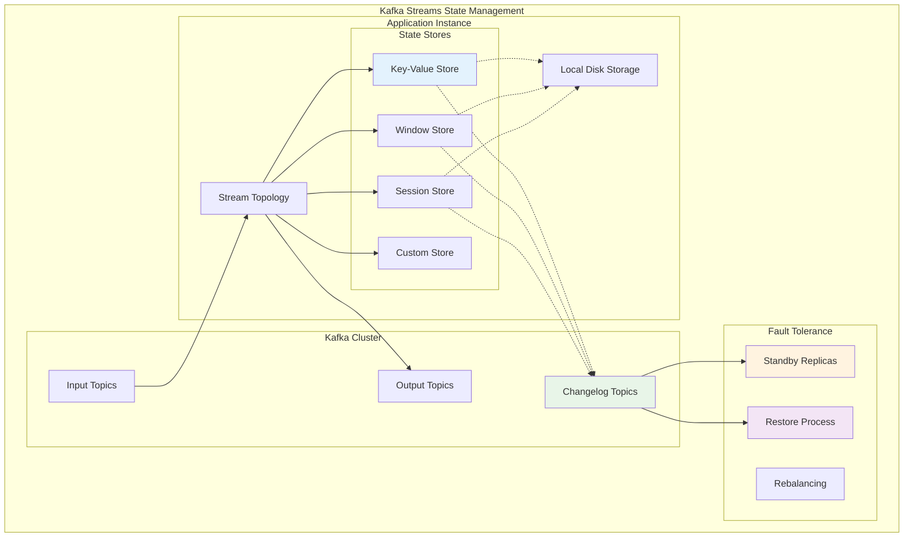

# Concept

## Local State Stores & Fault Tolerance - Persistent State Management


## 🎯 Objective

Master local state stores in Kafka Streams for building robust, stateful applications with persistent data storage, fault tolerance, and disaster recovery capabilities. Learn to optimize state management for performance and reliability in production environments.

## 🗃️ **State Stores: The Foundation of Stateful Processing**

State stores enable Kafka Streams applications to maintain persistent state that survives application restarts and failures.



**Key Benefits:**
- ✅ **Persistent state** survives application restarts
- ✅ **Fast local access** with disk-based storage
- ✅ **Automatic backup** via changelog topics
- ✅ **Fault tolerance** with standby replicas

## 🔧 **Advanced State Store Configuration**

### 1. **Custom State Store Implementation**

```kotlin
@Component
class CustomStateStoreConfig {
    
    fun buildAdvancedStateTopology(): Topology {
        val builder = StreamsBuilder()
        
        // 1. High-performance Key-Value Store
        val userSessionStore = Stores.keyValueStoreBuilder(
            Stores.persistentKeyValueStore("user-sessions"),
            Serdes.String(),
            JsonSerde(UserSession::class.java)
        )
        .withCachingEnabled()  // Enable in-memory caching
        .withLoggingEnabled(mapOf(
            "cleanup.policy" to "compact",
            "min.compaction.lag.ms" to "3600000", // 1 hour
            "segment.ms" to "86400000" // 1 day
        ))
        
        // 2. Time-based Window Store
        val metricsWindowStore = Stores.windowStoreBuilder(
            Stores.persistentWindowStore(
                "metrics-windows",
                Duration.ofDays(7), // Retention: 7 days
                Duration.ofMinutes(5), // Window size: 5 minutes
                false // No duplicate windows
            ),
            Serdes.String(),
            JsonSerde(MetricSummary::class.java)
        )
        .withCachingEnabled()
        .withLoggingEnabled(mapOf(
            "cleanup.policy" to "delete",
            "retention.ms" to "604800000", // 7 days
            "segment.ms" to "3600000" // 1 hour segments
        ))
        
        // 3. Session Window Store
        val conversationSessionStore = Stores.sessionStoreBuilder(
            Stores.persistentSessionStore(
                "conversation-sessions",
                Duration.ofHours(2) // Session timeout: 2 hours
            ),
            Serdes.String(),
            JsonSerde(ConversationSession::class.java)
        )
        .withCachingEnabled()
        .withLoggingEnabled(emptyMap())
        
        // 4. Custom Timestamped Store
        val auditTrailStore = Stores.keyValueStoreBuilder(
            Stores.persistentTimestampedKeyValueStore("audit-trail"),
            Serdes.String(),
            JsonSerde(AuditEntry::class.java)
        )
        .withCachingEnabled()
        .withLoggingEnabled(mapOf(
            "cleanup.policy" to "delete",
            "retention.ms" to "2592000000", // 30 days
            "min.cleanable.dirty.ratio" to "0.1"
        ))
        
        // Add stores to topology
        builder.addStateStore(userSessionStore)
        builder.addStateStore(metricsWindowStore)
        builder.addStateStore(conversationSessionStore)
        builder.addStateStore(auditTrailStore)
        
        return buildProcessingTopology(builder)
    }
    
    private fun buildProcessingTopology(builder: StreamsBuilder): Topology {
        val events: KStream<String, Event> = builder.stream("events")
        
        // Use multiple state stores in processing
        val processedEvents = events.transform(
            TransformerSupplier {
                MultiStateTransformer()
            },
            "user-sessions", "audit-trail"
        )
        
        processedEvents.to("processed-events")
        
        return builder.build()
    }
}

class MultiStateTransformer : Transformer<String, Event, KeyValue<String, ProcessedEvent>?> {
    private lateinit var userSessions: KeyValueStore<String, UserSession>
    private lateinit var auditTrail: TimestampedKeyValueStore<String, AuditEntry>
    private lateinit var context: ProcessorContext
    
    override fun init(context: ProcessorContext) {
        this.context = context
        this.userSessions = context.getStateStore("user-sessions")
        this.auditTrail = context.getStateStore("audit-trail")
    }
    
    override fun transform(key: String, event: Event): KeyValue<String, ProcessedEvent>? {
        // Multi-store transaction-like processing
        return try {
            // Update user session
            val session = updateUserSession(event)
            
            // Log audit entry with timestamp
            logAuditEntry(event)
            
            // Generate processed event
            KeyValue(key, createProcessedEvent(event, session))
            
        } catch (e: Exception) {
            logger.error("Failed to process event $key", e)
            null
        }
    }
    
    private fun updateUserSession(event: Event): UserSession {
        val currentSession = userSessions.get(event.userId) ?: UserSession(
            userId = event.userId,
            startTime = event.timestamp,
            events = emptyList()
        )
        
        val updatedSession = currentSession.copy(
            events = currentSession.events + event,
            lastActivity = event.timestamp,
            duration = event.timestamp - currentSession.startTime,
            eventCount = currentSession.eventCount + 1
        )
        
        userSessions.put(event.userId, updatedSession)
        return updatedSession
    }
    
    private fun logAuditEntry(event: Event) {
        val auditEntry = AuditEntry(
            eventId = event.eventId,
            userId = event.userId,
            action = event.eventType,
            timestamp = event.timestamp,
            metadata = event.metadata
        )
        
        auditTrail.put(
            event.eventId,
            ValueAndTimestamp.make(auditEntry, event.timestamp)
        )
    }
    
    override fun close() {
        // Cleanup if needed
    }
}
```

### 2. **Performance Optimization Strategies**

```kotlin
@Component
class StateStoreOptimization {
    
    fun buildOptimizedTopology(): Topology {
        val builder = StreamsBuilder()
        
        // Optimized store configuration
        val highThroughputStore = Stores.keyValueStoreBuilder(
            Stores.persistentKeyValueStore("high-throughput-data"),
            Serdes.String(),
            JsonSerde(DataPoint::class.java)
        )
        .withCachingEnabled() // Critical for write performance
        .withLoggingEnabled(mapOf(
            // Optimize changelog topic
            "cleanup.policy" to "compact",
            "compression.type" to "lz4",
            "segment.ms" to "3600000", // 1 hour
            "min.cleanable.dirty.ratio" to "0.2",
            "delete.retention.ms" to "86400000" // 1 day
        ))
        
        builder.addStateStore(highThroughputStore)
        
        val dataStream: KStream<String, DataPoint> = builder.stream(
            "data-points",
            Consumed.with(Serdes.String(), JsonSerde(DataPoint::class.java))
        )
        
        // Batch processing for better performance
        val batchProcessor = dataStream.transform(
            TransformerSupplier {
                BatchingTransformer()
            },
            "high-throughput-data"
        )
        
        batchProcessor.to("processed-data-points")
        
        return builder.build()
    }
}

class BatchingTransformer : Transformer<String, DataPoint, KeyValue<String, BatchedDataPoints>?> {
    private lateinit var store: KeyValueStore<String, DataPoint>
    private lateinit var context: ProcessorContext
    private val batchBuffer = mutableMapOf<String, MutableList<DataPoint>>()
    private val batchSize = 100
    
    override fun init(context: ProcessorContext) {
        this.context = context
        this.store = context.getStateStore("high-throughput-data")
        
        // Schedule periodic batch flush
        context.schedule(
            Duration.ofSeconds(30),
            PunctuationType.WALL_CLOCK_TIME
        ) { timestamp ->
            flushBatches(timestamp)
        }
    }
    
    override fun transform(key: String, dataPoint: DataPoint): KeyValue<String, BatchedDataPoints>? {
        // Add to batch
        val categoryBatch = batchBuffer.computeIfAbsent(dataPoint.category) { mutableListOf() }
        categoryBatch.add(dataPoint)
        
        // Update store (with caching, this is efficient)
        store.put(key, dataPoint)
        
        // Flush if batch is full
        if (categoryBatch.size >= batchSize) {
            return flushBatch(dataPoint.category, categoryBatch.toList())
        }
        
        return null
    }
    
    private fun flushBatches(timestamp: Long) {
        batchBuffer.forEach { (category, batch) ->
            if (batch.isNotEmpty()) {
                val result = flushBatch(category, batch.toList())
                if (result != null) {
                    context.forward(result.key, result.value)
                }
                batch.clear()
            }
        }
    }
    
    private fun flushBatch(category: String, batch: List<DataPoint>): KeyValue<String, BatchedDataPoints> {
        val batchedData = BatchedDataPoints(
            category = category,
            dataPoints = batch,
            batchSize = batch.size,
            batchTimestamp = System.currentTimeMillis(),
            aggregates = calculateAggregates(batch)
        )
        
        return KeyValue(category, batchedData)
    }
    
    override fun close() {
        // Final flush
        flushBatches(System.currentTimeMillis())
    }
}
```

## 🛡️ **Fault Tolerance and Recovery**

### 1. **Standby Replicas Configuration**

```kotlin
@Configuration
class FaultToleranceConfig {
    
    @Bean
    fun faultTolerantStreamsConfig(): KafkaStreamsConfiguration {
        val props = HashMap<String, Any>()
        
        // Basic configuration
        props[StreamsConfig.APPLICATION_ID_CONFIG] = "fault-tolerant-app"
        props[StreamsConfig.BOOTSTRAP_SERVERS_CONFIG] = "localhost:9092"
        
        // Fault tolerance settings
        props[StreamsConfig.NUM_STANDBY_REPLICAS_CONFIG] = 2 // 2 standby replicas
        props[StreamsConfig.ACCEPTABLE_RECOVERY_LAG_CONFIG] = 1000L // 1000 records max lag
        props[StreamsConfig.MAX_WARMUP_REPLICAS_CONFIG] = 2 // Warm up 2 replicas during rebalance
        
        // State directory with redundancy
        props[StreamsConfig.STATE_DIR_CONFIG] = "/opt/kafka-streams/state"
        
        // Processing guarantees
        props[StreamsConfig.PROCESSING_GUARANTEE_CONFIG] = StreamsConfig.EXACTLY_ONCE_V2
        
        // Replication and durability
        props[StreamsConfig.REPLICATION_FACTOR_CONFIG] = 3
        props[StreamsConfig.topicPrefix(TopicConfig.MIN_IN_SYNC_REPLICAS_CONFIG)] = 2
        
        // Recovery optimization
        props[StreamsConfig.COMMIT_INTERVAL_MS_CONFIG] = 1000 // 1 second
        props[StreamsConfig.CACHE_MAX_BYTES_BUFFERING_CONFIG] = 64 * 1024 * 1024 // 64MB
        
        return KafkaStreamsConfiguration(props)
    }
}

@Component
class StateRecoveryManager {
    
    @Autowired
    private lateinit var kafkaStreams: KafkaStreams
    
    @EventListener
    fun handleStateChange(stateChangeEvent: KafkaStreams.StateListener) {
        when (stateChangeEvent.newState()) {
            KafkaStreams.State.REBALANCING -> {
                logger.info("Streams rebalancing - state stores may be temporarily unavailable")
                handleRebalancing()
            }
            
            KafkaStreams.State.RUNNING -> {
                logger.info("Streams running - all state stores available")
                handleRunning()
            }
            
            KafkaStreams.State.ERROR -> {
                logger.error("Streams in error state - initiating recovery")
                handleError()
            }
            
            else -> {
                logger.info("Streams state: ${stateChangeEvent.newState()}")
            }
        }
    }
    
    private fun handleRebalancing() {
        // Pause external processing if needed
        // Update health check status
        updateHealthStatus("REBALANCING")
    }
    
    private fun handleRunning() {
        // Resume external processing
        // Verify state store integrity
        verifyStateStores()
        updateHealthStatus("HEALTHY")
    }
    
    private fun handleError() {
        // Attempt graceful recovery
        try {
            // Check if recovery is possible
            if (canRecover()) {
                logger.info("Attempting automatic recovery")
                restartStreamsApplication()
            } else {
                logger.error("Manual intervention required")
                alertOperations("Kafka Streams requires manual recovery")
            }
        } catch (e: Exception) {
            logger.error("Failed to recover automatically", e)
            alertOperations("Critical: Kafka Streams recovery failed")
        }
    }
    
    private fun verifyStateStores() {
        try {
            // Query each state store to verify accessibility
            val storeNames = listOf("user-sessions", "metrics-windows", "audit-trail")
            
            storeNames.forEach { storeName ->
                val store = kafkaStreams.store(
                    StoreQueryParameters.fromNameAndType(
                        storeName,
                        QueryableStoreTypes.keyValueStore<String, Any>()
                    )
                )
                
                // Perform a simple query to verify store health
                val approximateNumEntries = store.approximateNumEntries()
                logger.info("State store $storeName verified: ~$approximateNumEntries entries")
            }
            
        } catch (e: Exception) {
            logger.error("State store verification failed", e)
            throw IllegalStateException("State stores not accessible", e)
        }
    }
}
```

### 2. **Disaster Recovery Procedures**

```kotlin
@Component
class DisasterRecoveryManager {
    
    @Autowired
    private lateinit var kafkaStreams: KafkaStreams
    
    fun performBackup(backupPath: String): BackupResult {
        return try {
            logger.info("Starting state store backup to $backupPath")
            
            // Stop processing temporarily (if possible)
            val isRunning = kafkaStreams.state() == KafkaStreams.State.RUNNING
            
            if (isRunning) {
                // For critical applications, you might not stop the streams
                // Instead, use standby replicas or point-in-time snapshots
                logger.warn("Backing up while streams are running - may have consistency issues")
            }
            
            val stateDir = File("/opt/kafka-streams/state")
            val backupDir = File(backupPath)
            
            // Create backup directory
            backupDir.mkdirs()
            
            // Backup state directories
            val backupFiles = backupStateDirectories(stateDir, backupDir)
            
            // Backup changelog topic offsets for consistency
            val offsetsBackup = backupChangelogOffsets()
            
            BackupResult(
                success = true,
                backupPath = backupPath,
                backupTimestamp = System.currentTimeMillis(),
                filesBackedUp = backupFiles,
                changelogOffsets = offsetsBackup,
                sizeBytes = calculateBackupSize(backupDir)
            )
            
        } catch (e: Exception) {
            logger.error("Backup failed", e)
            BackupResult(
                success = false,
                error = e.message,
                backupTimestamp = System.currentTimeMillis()
            )
        }
    }
    
    fun performRestore(backupPath: String): RestoreResult {
        return try {
            logger.info("Starting state store restore from $backupPath")
            
            // Ensure streams are stopped
            if (kafkaStreams.state() != KafkaStreams.State.NOT_RUNNING) {
                kafkaStreams.close(Duration.ofSeconds(30))
            }
            
            val backupDir = File(backupPath)
            val stateDir = File("/opt/kafka-streams/state")
            
            // Clear existing state
            stateDir.deleteRecursively()
            stateDir.mkdirs()
            
            // Restore state directories
            restoreStateDirectories(backupDir, stateDir)
            
            // Note: Changelog topics will be automatically reconciled on startup
            // if there are any inconsistencies
            
            RestoreResult(
                success = true,
                restorePath = backupPath,
                restoreTimestamp = System.currentTimeMillis(),
                message = "State restored successfully. Restart application to complete recovery."
            )
            
        } catch (e: Exception) {
            logger.error("Restore failed", e)
            RestoreResult(
                success = false,
                error = e.message,
                restoreTimestamp = System.currentTimeMillis()
            )
        }
    }
    
    fun validateStateConsistency(): ConsistencyReport {
        val report = ConsistencyReport()
        
        try {
            // Check if all expected state stores are available
            val expectedStores = listOf("user-sessions", "metrics-windows", "audit-trail")
            expectedStores.forEach { storeName ->
                val isAvailable = isStoreAvailable(storeName)
                report.storeAvailability[storeName] = isAvailable
                
                if (isAvailable) {
                    // Perform consistency checks
                    val consistencyCheck = checkStoreConsistency(storeName)
                    report.consistencyResults[storeName] = consistencyCheck
                }
            }
            
            // Check changelog topic lag
            report.changelogLag = checkChangelogLag()
            
            // Overall health assessment
            report.overallHealth = determineOverallHealth(report)
            
        } catch (e: Exception) {
            logger.error("Consistency validation failed", e)
            report.error = e.message
        }
        
        return report
    }
    
    private fun checkStoreConsistency(storeName: String): StoreConsistencyCheck {
        return try {
            val store = kafkaStreams.store(
                StoreQueryParameters.fromNameAndType(
                    storeName,
                    QueryableStoreTypes.keyValueStore<String, Any>()
                )
            )
            
            val entryCount = store.approximateNumEntries()
            val sampleKeys = getSampleKeys(store, 100)
            val sampleValidation = validateSampleData(store, sampleKeys)
            
            StoreConsistencyCheck(
                storeName = storeName,
                entryCount = entryCount,
                sampleSize = sampleKeys.size,
                sampleValidationPassed = sampleValidation,
                lastChecked = System.currentTimeMillis()
            )
            
        } catch (e: Exception) {
            StoreConsistencyCheck(
                storeName = storeName,
                error = e.message,
                lastChecked = System.currentTimeMillis()
            )
        }
    }
}
```

## 🔍 **Interactive Queries and State Access**

### 1. **Advanced Query API**

```kotlin
@RestController
@RequestMapping("/api/state")
class StateQueryController {
    
    @Autowired
    private lateinit var kafkaStreams: KafkaStreams
    
    @GetMapping("/users/{userId}/session")
    fun getUserSession(@PathVariable userId: String): ResponseEntity<UserSession> {
        return try {
            val store = kafkaStreams.store(
                StoreQueryParameters.fromNameAndType(
                    "user-sessions",
                    QueryableStoreTypes.keyValueStore<String, UserSession>()
                )
            )
            
            val session = store.get(userId)
            if (session != null) {
                ResponseEntity.ok(session)
            } else {
                ResponseEntity.notFound().build()
            }
            
        } catch (e: InvalidStateStoreException) {
            ResponseEntity.status(HttpStatus.SERVICE_UNAVAILABLE)
                .body(null)
        }
    }
    
    @GetMapping("/metrics/{metricName}/windows")
    fun getMetricWindows(
        @PathVariable metricName: String,
        @RequestParam(defaultValue = "1") hours: Long
    ): ResponseEntity<List<WindowedMetric>> {
        return try {
            val store = kafkaStreams.store(
                StoreQueryParameters.fromNameAndType(
                    "metrics-windows",
                    QueryableStoreTypes.windowStore<String, MetricSummary>()
                )
            )
            
            val endTime = Instant.now()
            val startTime = endTime.minus(Duration.ofHours(hours))
            
            val windows = mutableListOf<WindowedMetric>()
            
            store.fetch(
                metricName,
                startTime,
                endTime
            ).use { iterator ->
                while (iterator.hasNext()) {
                    val entry = iterator.next()
                    windows.add(
                        WindowedMetric(
                            metricName = metricName,
                            windowStart = entry.key,
                            value = entry.value,
                            timestamp = entry.key
                        )
                    )
                }
            }
            
            ResponseEntity.ok(windows)
            
        } catch (e: InvalidStateStoreException) {
            ResponseEntity.status(HttpStatus.SERVICE_UNAVAILABLE)
                .body(emptyList())
        }
    }
    
    @GetMapping("/audit/{eventId}")
    fun getAuditEntry(@PathVariable eventId: String): ResponseEntity<TimestampedAuditEntry> {
        return try {
            val store = kafkaStreams.store(
                StoreQueryParameters.fromNameAndType(
                    "audit-trail",
                    QueryableStoreTypes.timestampedKeyValueStore<String, AuditEntry>()
                )
            )
            
            val entry = store.get(eventId)
            if (entry != null) {
                ResponseEntity.ok(
                    TimestampedAuditEntry(
                        auditEntry = entry.value(),
                        timestamp = entry.timestamp()
                    )
                )
            } else {
                ResponseEntity.notFound().build()
            }
            
        } catch (e: InvalidStateStoreException) {
            ResponseEntity.status(HttpStatus.SERVICE_UNAVAILABLE)
                .body(null)
        }
    }
    
    @GetMapping("/health/stores")
    fun getStateStoreHealth(): ResponseEntity<Map<String, StoreHealth>> {
        val health = mutableMapOf<String, StoreHealth>()
        val storeNames = listOf("user-sessions", "metrics-windows", "audit-trail")
        
        storeNames.forEach { storeName ->
            health[storeName] = try {
                val metadata = kafkaStreams.localThreadsMetadata()
                val storeInfo = metadata.flatMap { it.activeTasks() + it.standbyTasks() }
                    .flatMap { it.topicPartitions().map { tp -> tp to it } }
                    .find { it.second.taskId().toString().contains(storeName) }
                
                StoreHealth(
                    available = true,
                    storeName = storeName,
                    partitions = storeInfo?.second?.topicPartitions()?.size ?: 0,
                    lastAccessed = System.currentTimeMillis()
                )
                
            } catch (e: Exception) {
                StoreHealth(
                    available = false,
                    storeName = storeName,
                    error = e.message
                )
            }
        }
        
        return ResponseEntity.ok(health)
    }
    
    @PostMapping("/operations/backup")
    fun triggerBackup(@RequestBody request: BackupRequest): ResponseEntity<BackupResult> {
        val disasterRecoveryManager = DisasterRecoveryManager()
        val result = disasterRecoveryManager.performBackup(request.backupPath)
        
        return if (result.success) {
            ResponseEntity.ok(result)
        } else {
            ResponseEntity.status(HttpStatus.INTERNAL_SERVER_ERROR).body(result)
        }
    }
}
```

### 2. **State Store Monitoring**

```kotlin
@Component
class StateStoreMonitoring {
    
    @Autowired
    private lateinit var kafkaStreams: KafkaStreams
    
    @Scheduled(fixedRate = 30000) // Every 30 seconds
    fun monitorStateStores() {
        try {
            val metadata = kafkaStreams.localThreadsMetadata()
            
            metadata.forEach { threadMetadata ->
                // Monitor active tasks
                threadMetadata.activeTasks().forEach { taskMetadata ->
                    monitorTask(taskMetadata, "active")
                }
                
                // Monitor standby tasks
                threadMetadata.standbyTasks().forEach { taskMetadata ->
                    monitorTask(taskMetadata, "standby")
                }
            }
            
        } catch (e: Exception) {
            logger.error("Failed to monitor state stores", e)
        }
    }
    
    private fun monitorTask(taskMetadata: TaskMetadata, taskType: String) {
        val taskId = taskMetadata.taskId().toString()
        
        // Record task-level metrics
        Metrics.globalRegistry.gauge(
            "kafka.streams.task.partitions",
            Tags.of(
                Tag.of("task_id", taskId),
                Tag.of("task_type", taskType)
            ),
            taskMetadata.topicPartitions().size.toDouble()
        )
        
        // Monitor state store sizes (if accessible)
        if (taskType == "active") {
            try {
                val storeMetrics = getStoreMetrics(taskId)
                storeMetrics.forEach { (storeName, metrics) ->
                    Metrics.globalRegistry.gauge(
                        "kafka.streams.store.size",
                        Tags.of(
                            Tag.of("store", storeName),
                            Tag.of("task_id", taskId)
                        ),
                        metrics.sizeBytes.toDouble()
                    )
                    
                    Metrics.globalRegistry.gauge(
                        "kafka.streams.store.entries",
                        Tags.of(
                            Tag.of("store", storeName),
                            Tag.of("task_id", taskId)
                        ),
                        metrics.entryCount.toDouble()
                    )
                }
            } catch (e: Exception) {
                logger.warn("Could not get store metrics for task $taskId", e)
            }
        }
    }
    
    @EventListener
    fun handleRebalance(event: StreamsRebalanceEvent) {
        logger.info("Streams rebalance: ${event.type}")
        
        Metrics.globalRegistry.counter(
            "kafka.streams.rebalance",
            Tags.of(Tag.of("type", event.type.toString()))
        ).increment()
        
        when (event.type) {
            RebalanceType.STARTED -> {
                startRebalanceTimer()
            }
            RebalanceType.COMPLETED -> {
                recordRebalanceDuration()
                validatePostRebalanceState()
            }
        }
    }
    
    private fun validatePostRebalanceState() {
        CompletableFuture.runAsync {
            Thread.sleep(5000) // Wait for stabilization
            
            try {
                val consistencyReport = DisasterRecoveryManager().validateStateConsistency()
                
                if (consistencyReport.overallHealth != "HEALTHY") {
                    logger.warn("Post-rebalance consistency check failed: $consistencyReport")
                    alertOperations("State consistency issues detected after rebalance")
                }
                
            } catch (e: Exception) {
                logger.error("Post-rebalance validation failed", e)
            }
        }
    }
}
```

## ✅ **Best Practices Summary**

### 🗃️ **State Store Design**
- **Choose appropriate store types** based on access patterns
- **Configure retention policies** to manage disk usage
- **Enable caching** for frequently accessed data
- **Use proper serialization** for performance and compatibility

### 🛡️ **Fault Tolerance**
- **Configure standby replicas** for critical applications
- **Monitor changelog lag** to ensure recovery readiness
- **Test recovery procedures** regularly
- **Implement health checks** for state store availability

### 🔧 **Performance Optimization**
- **Batch state operations** when possible
- **Configure appropriate cache sizes** based on memory availability
- **Monitor state store sizes** and implement cleanup policies
- **Use proper key design** for even distribution

### 📊 **Operational Excellence**
- **Implement state store monitoring** with comprehensive metrics
- **Create backup and restore procedures** for disaster recovery
- **Set up alerting** for state store issues
- **Document recovery procedures** for operations teams

## 🚀 **What's Next?**

You've mastered state management and fault tolerance! Complete Phase 3 with [Lesson 17: Building a Real-time Dashboard Application](../lesson_17/concept.md), where you'll put everything together to build a comprehensive real-time analytics system with state stores, windowing, and interactive queries.

---

*Local state stores are the foundation of robust stream processing applications. With proper fault tolerance and recovery mechanisms, you can build systems that maintain consistency and availability even in the face of failures.*