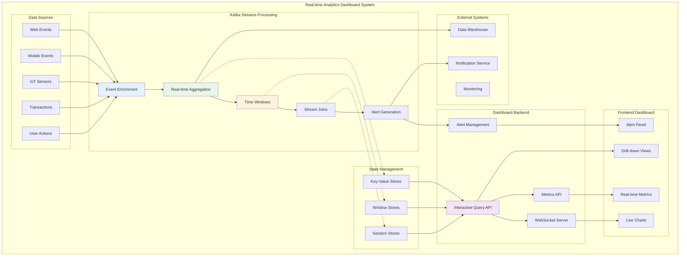

# Lesson 17: Building a Real-time Dashboard Application - Complete Analytics System

## 🎯 Objective

Build a comprehensive real-time dashboard application that demonstrates all Kafka Streams concepts learned so far. Create an end-to-end analytics system with live data processing, interactive visualizations, and real-time insights that scales to handle millions of events.

## 📊 **Real-time Dashboard Architecture**

Integrate all Kafka Streams components into a production-ready analytics platform.



## 🏗️ **Complete Stream Processing Topology**

### 1. **Multi-Source Data Ingestion and Enrichment**

```kotlin
@Component
class DashboardStreamProcessor {
    
    fun buildDashboardTopology(): Topology {
        val builder = StreamsBuilder()
        
        // Source streams from different data sources
        val webEvents: KStream<String, WebEvent> = builder.stream(
            "web-events",
            Consumed.with(Serdes.String(), JsonSerde(WebEvent::class.java))
        )
        
        val mobileEvents: KStream<String, MobileEvent> = builder.stream(
            "mobile-events", 
            Consumed.with(Serdes.String(), JsonSerde(MobileEvent::class.java))
        )
        
        val transactionEvents: KStream<String, TransactionEvent> = builder.stream(
            "transaction-events",
            Consumed.with(Serdes.String(), JsonSerde(TransactionEvent::class.java))
        )
        
        // Reference data tables
        val userProfiles: GlobalKTable<String, UserProfile> = builder.globalTable(
            "user-profiles",
            Consumed.with(Serdes.String(), JsonSerde(UserProfile::class.java))
        )
        
        val productCatalog: GlobalKTable<String, Product> = builder.globalTable(
            "product-catalog",
            Consumed.with(Serdes.String(), JsonSerde(Product::class.java))
        )
        
        // 1. Unify all events into a common format
        val unifiedEvents = unifyEventStreams(webEvents, mobileEvents, transactionEvents)
        
        // 2. Enrich events with user and product data
        val enrichedEvents = enrichEvents(unifiedEvents, userProfiles, productCatalog)
        
        // 3. Build analytics pipelines
        buildAnalyticsPipelines(builder, enrichedEvents)
        
        // 4. Build alerting system
        buildAlertingSystem(builder, enrichedEvents)
        
        return builder.build()
    }
    
    private fun unifyEventStreams(
        webEvents: KStream<String, WebEvent>,
        mobileEvents: KStream<String, MobileEvent>,
        transactionEvents: KStream<String, TransactionEvent>
    ): KStream<String, UnifiedEvent> {
        
        // Convert web events
        val unifiedWebEvents = webEvents.map { key, event ->
            KeyValue(
                event.sessionId,
                UnifiedEvent(
                    eventId = event.eventId,
                    userId = event.userId,
                    sessionId = event.sessionId,
                    timestamp = event.timestamp,
                    eventType = "WEB_${event.action}",
                    platform = "WEB",
                    data = mapOf(
                        "page" to event.page,
                        "referrer" to event.referrer,
                        "userAgent" to event.userAgent,
                        "ipAddress" to event.ipAddress
                    ) + event.customData
                )
            )
        }
        
        // Convert mobile events
        val unifiedMobileEvents = mobileEvents.map { key, event ->
            KeyValue(
                event.sessionId,
                UnifiedEvent(
                    eventId = event.eventId,
                    userId = event.userId,
                    sessionId = event.sessionId,
                    timestamp = event.timestamp,
                    eventType = "MOBILE_${event.action}",
                    platform = "MOBILE",
                    data = mapOf(
                        "appVersion" to event.appVersion,
                        "deviceType" to event.deviceType,
                        "osVersion" to event.osVersion,
                        "location" to event.location
                    ) + event.customData
                )
            )
        }
        
        // Convert transaction events
        val unifiedTransactionEvents = transactionEvents.map { key, event ->
            KeyValue(
                event.transactionId,
                UnifiedEvent(
                    eventId = event.transactionId,
                    userId = event.userId,
                    sessionId = event.sessionId,
                    timestamp = event.timestamp,
                    eventType = "TRANSACTION_${event.type}",
                    platform = event.platform,
                    data = mapOf(
                        "amount" to event.amount,
                        "currency" to event.currency,
                        "merchantId" to event.merchantId,
                        "paymentMethod" to event.paymentMethod
                    ) + event.metadata
                )
            )
        }
        
        // Merge all streams
        return unifiedWebEvents
            .merge(unifiedMobileEvents)
            .merge(unifiedTransactionEvents)
    }
    
    private fun enrichEvents(
        events: KStream<String, UnifiedEvent>,
        userProfiles: GlobalKTable<String, UserProfile>,
        productCatalog: GlobalKTable<String, Product>
    ): KStream<String, EnrichedEvent> {
        
        // Enrich with user profile data
        val eventsWithUser = events.join(
            userProfiles,
            { key, event -> event.userId },
            { event, user ->
                EnrichedEvent(
                    unifiedEvent = event,
                    userProfile = user,
                    enrichmentTimestamp = System.currentTimeMillis()
                )
            }
        )
        
        // Further enrich transaction events with product data
        return eventsWithUser.map { key, enrichedEvent ->
            val event = enrichedEvent.unifiedEvent
            
            if (event.eventType.startsWith("TRANSACTION_") && event.data.containsKey("productId")) {
                val productId = event.data["productId"] as? String
                if (productId != null) {
                    // Note: For simplicity, this example doesn't show the full product enrichment
                    // In practice, you'd need another join or lookup for product data
                    enrichedEvent
                } else {
                    enrichedEvent
                }
            } else {
                enrichedEvent
            }
            
            KeyValue(key, enrichedEvent)
        }
    }
}
```

### 2. **Multi-Dimensional Real-time Analytics**

```kotlin
@Component
class RealTimeAnalytics {
    
    fun buildAnalyticsPipelines(
        builder: StreamsBuilder,
        enrichedEvents: KStream<String, EnrichedEvent>
    ) {
        // 1. Real-time user activity analytics
        buildUserActivityAnalytics(builder, enrichedEvents)
        
        // 2. Business metrics dashboard
        buildBusinessMetrics(builder, enrichedEvents)
        
        // 3. Geographic analytics
        buildGeographicAnalytics(builder, enrichedEvents)
        
        // 4. Performance analytics
        buildPerformanceAnalytics(builder, enrichedEvents)
        
        // 5. Funnel analysis
        buildFunnelAnalytics(builder, enrichedEvents)
    }
    
    private fun buildUserActivityAnalytics(
        builder: StreamsBuilder,
        enrichedEvents: KStream<String, EnrichedEvent>
    ) {
        // Real-time active users by minute
        val activeUsersByMinute = enrichedEvents
            .selectKey { _, event -> "active-users" }
            .groupByKey()
            .windowedBy(TimeWindows.of(Duration.ofMinutes(1)))
            .aggregate(
                { ActiveUsersMetric() },
                { key, event, metric ->
                    metric.copy(
                        uniqueUsers = metric.uniqueUsers + event.unifiedEvent.userId,
                        totalEvents = metric.totalEvents + 1,
                        platformBreakdown = updatePlatformBreakdown(metric.platformBreakdown, event.unifiedEvent.platform),
                        lastUpdate = event.unifiedEvent.timestamp
                    )
                },
                Named.`as`("active-users-by-minute"),
                Materialized.`as`<String, ActiveUsersMetric, WindowStore<Bytes, ByteArray>>("active-users-store")
                    .withKeySerde(Serdes.String())
                    .withValueSerde(JsonSerde(ActiveUsersMetric::class.java))
                    .withRetention(Duration.ofHours(24))
            )
        
        // User session analytics
        val userSessions = enrichedEvents
            .selectKey { _, event -> event.unifiedEvent.userId }
            .groupByKey()
            .windowedBy(SessionWindows.with(Duration.ofMinutes(30)))
            .aggregate(
                { UserSessionAnalytics() },
                { userId, event, session ->
                    session.copy(
                        userId = userId,
                        events = session.events + event.unifiedEvent,
                        sessionStart = if (session.sessionStart == 0L) event.unifiedEvent.timestamp else session.sessionStart,
                        sessionEnd = event.unifiedEvent.timestamp,
                        duration = event.unifiedEvent.timestamp - (if (session.sessionStart == 0L) event.unifiedEvent.timestamp else session.sessionStart),
                        pageViews = session.pageViews + if (event.unifiedEvent.eventType.contains("PAGE_VIEW")) 1 else 0,
                        transactions = session.transactions + if (event.unifiedEvent.eventType.startsWith("TRANSACTION_")) 1 else 0,
                        platforms = session.platforms + event.unifiedEvent.platform,
                        userSegment = determineUserSegment(event.userProfile)
                    )
                },
                { session1, session2 -> // Session merger
                    session1.copy(
                        events = session1.events + session2.events,
                        sessionStart = minOf(session1.sessionStart, session2.sessionStart),
                        sessionEnd = maxOf(session1.sessionEnd, session2.sessionEnd),
                        duration = maxOf(session1.sessionEnd, session2.sessionEnd) - minOf(session1.sessionStart, session2.sessionStart),
                        pageViews = session1.pageViews + session2.pageViews,
                        transactions = session1.transactions + session2.transactions,
                        platforms = session1.platforms + session2.platforms
                    )
                },
                Named.`as`("user-sessions"),
                Materialized.with(Serdes.String(), JsonSerde(UserSessionAnalytics::class.java))
            )
        
        // Output streams for dashboard consumption
        activeUsersByMinute.toStream()
            .map { windowedKey, metric ->
                KeyValue(
                    "${windowedKey.key()}-${windowedKey.window().start()}",
                    DashboardMetric(
                        metricType = "ACTIVE_USERS",
                        timeWindow = TimeWindow(windowedKey.window().start(), windowedKey.window().end()),
                        value = metric.uniqueUsers.size.toDouble(),
                        breakdown = metric.platformBreakdown,
                        timestamp = metric.lastUpdate
                    )
                )
            }
            .to("dashboard-metrics")
        
        userSessions.toStream()
            .filter { windowedKey, session ->
                // Only emit completed sessions
                System.currentTimeMillis() - windowedKey.window().end() > Duration.ofMinutes(30).toMillis()
            }
            .to("user-session-analytics")
    }
    
    private fun buildBusinessMetrics(
        builder: StreamsBuilder,
        enrichedEvents: KStream<String, EnrichedEvent>
    ) {
        // Revenue analytics by time window
        val revenueAnalytics = enrichedEvents
            .filter { _, event -> event.unifiedEvent.eventType == "TRANSACTION_COMPLETED" }
            .selectKey { _, event -> "revenue" }
            .groupByKey()
            .windowedBy(
                TimeWindows.of(Duration.ofMinutes(5))
                    .advanceBy(Duration.ofMinutes(1))
            )
            .aggregate(
                { RevenueMetrics() },
                { key, event, metrics ->
                    val amount = event.unifiedEvent.data["amount"] as? Double ?: 0.0
                    val currency = event.unifiedEvent.data["currency"] as? String ?: "USD"
                    
                    metrics.copy(
                        totalRevenue = metrics.totalRevenue + amount,
                        transactionCount = metrics.transactionCount + 1,
                        averageTransactionValue = (metrics.totalRevenue + amount) / (metrics.transactionCount + 1),
                        currencyBreakdown = updateCurrencyBreakdown(metrics.currencyBreakdown, currency, amount),
                        userTierBreakdown = updateUserTierBreakdown(metrics.userTierBreakdown, event.userProfile.tier, amount),
                        lastUpdate = event.unifiedEvent.timestamp
                    )
                },
                Named.`as`("revenue-analytics"),
                Materialized.`as`<String, RevenueMetrics, WindowStore<Bytes, ByteArray>>("revenue-store")
            )
        
        // Product performance analytics
        val productAnalytics = enrichedEvents
            .filter { _, event -> 
                event.unifiedEvent.eventType.startsWith("TRANSACTION_") && 
                event.unifiedEvent.data.containsKey("productId")
            }
            .selectKey { _, event -> event.unifiedEvent.data["productId"] as String }
            .groupByKey()
            .windowedBy(TimeWindows.of(Duration.ofHours(1)))
            .aggregate(
                { ProductPerformanceMetrics() },
                { productId, event, metrics ->
                    val amount = event.unifiedEvent.data["amount"] as? Double ?: 0.0
                    val quantity = event.unifiedEvent.data["quantity"] as? Int ?: 1
                    
                    metrics.copy(
                        productId = productId,
                        sales = metrics.sales + amount,
                        unitsSold = metrics.unitsSold + quantity,
                        transactionCount = metrics.transactionCount + 1,
                        averageOrderValue = (metrics.sales + amount) / (metrics.transactionCount + 1),
                        customerSegments = updateCustomerSegments(metrics.customerSegments, event.userProfile.tier),
                        platforms = updatePlatformStats(metrics.platforms, event.unifiedEvent.platform),
                        lastUpdate = event.unifiedEvent.timestamp
                    )
                },
                Named.`as`("product-analytics")
            )
        
        // Output business metrics
        revenueAnalytics.toStream()
            .map { windowedKey, metrics ->
                KeyValue(
                    "revenue-${windowedKey.window().start()}",
                    DashboardMetric(
                        metricType = "REVENUE",
                        timeWindow = TimeWindow(windowedKey.window().start(), windowedKey.window().end()),
                        value = metrics.totalRevenue,
                        breakdown = mapOf(
                            "transactionCount" to metrics.transactionCount,
                            "averageValue" to metrics.averageTransactionValue,
                            "currencies" to metrics.currencyBreakdown
                        ),
                        timestamp = metrics.lastUpdate
                    )
                )
            }
            .to("dashboard-metrics")
    }
}
```

### 3. **Real-time Alerting System**

```kotlin
@Component
class RealTimeAlerting {
    
    fun buildAlertingSystem(
        builder: StreamsBuilder,
        enrichedEvents: KStream<String, EnrichedEvent>
    ) {
        // 1. Anomaly detection for transaction amounts
        val transactionAnomalies = buildTransactionAnomalyDetection(enrichedEvents)
        
        // 2. User behavior alerts
        val behaviorAlerts = buildUserBehaviorAlerts(enrichedEvents)
        
        // 3. System performance alerts
        val performanceAlerts = buildPerformanceAlerts(enrichedEvents)
        
        // 4. Business threshold alerts
        val businessAlerts = buildBusinessThresholdAlerts(enrichedEvents)
        
        // Merge all alerts
        val allAlerts = transactionAnomalies
            .merge(behaviorAlerts)
            .merge(performanceAlerts)
            .merge(businessAlerts)
        
        // Process and route alerts
        processAndRouteAlerts(allAlerts)
    }
    
    private fun buildTransactionAnomalyDetection(
        enrichedEvents: KStream<String, EnrichedEvent>
    ): KStream<String, Alert> {
        
        val transactionEvents = enrichedEvents.filter { _, event ->
            event.unifiedEvent.eventType == "TRANSACTION_COMPLETED"
        }
        
        return transactionEvents.transform(
            TransformerSupplier {
                TransactionAnomalyDetector()
            },
            "transaction-baselines"
        )
    }
    
    private fun buildUserBehaviorAlerts(
        enrichedEvents: KStream<String, EnrichedEvent>
    ): KStream<String, Alert> {
        
        // Detect suspicious user behavior patterns
        return enrichedEvents
            .selectKey { _, event -> event.unifiedEvent.userId }
            .groupByKey()
            .windowedBy(TimeWindows.of(Duration.ofMinutes(10)))
            .aggregate(
                { UserBehaviorWindow() },
                { userId, event, window ->
                    window.copy(
                        userId = userId,
                        events = window.events + event.unifiedEvent,
                        eventTypes = window.eventTypes + event.unifiedEvent.eventType,
                        platforms = window.platforms + event.unifiedEvent.platform,
                        locations = window.locations + (event.unifiedEvent.data["location"] as? String ?: "unknown"),
                        lastActivity = event.unifiedEvent.timestamp
                    )
                },
                Named.`as`("user-behavior-windows")
            )
            .toStream()
            .flatMap { windowedKey, window ->
                val alerts = mutableListOf<KeyValue<String, Alert>>()
                
                // Check for suspicious patterns
                if (window.platforms.size > 3) {
                    alerts.add(KeyValue(
                        "behavior-${windowedKey.key()}-${System.currentTimeMillis()}",
                        Alert(
                            alertId = UUID.randomUUID().toString(),
                            alertType = "SUSPICIOUS_BEHAVIOR",
                            severity = AlertSeverity.MEDIUM,
                            title = "Multiple Platform Access",
                            description = "User ${window.userId} accessed from ${window.platforms.size} different platforms within 10 minutes",
                            data = mapOf(
                                "userId" to window.userId,
                                "platforms" to window.platforms,
                                "eventCount" to window.events.size
                            ),
                            timestamp = window.lastActivity
                        )
                    ))
                }
                
                if (window.locations.size > 2) {
                    alerts.add(KeyValue(
                        "location-${windowedKey.key()}-${System.currentTimeMillis()}",
                        Alert(
                            alertId = UUID.randomUUID().toString(),
                            alertType = "MULTIPLE_LOCATIONS",
                            severity = AlertSeverity.HIGH,
                            title = "Multiple Location Access",
                            description = "User ${window.userId} accessed from ${window.locations.size} different locations",
                            data = mapOf(
                                "userId" to window.userId,
                                "locations" to window.locations,
                                "timeWindow" to "10 minutes"
                            ),
                            timestamp = window.lastActivity
                        )
                    ))
                }
                
                alerts
            }
    }
    
    private fun buildBusinessThresholdAlerts(
        enrichedEvents: KStream<String, EnrichedEvent>
    ): KStream<String, Alert> {
        
        // Monitor business KPIs and generate alerts when thresholds are exceeded
        return enrichedEvents
            .selectKey { _, event -> "business-metrics" }
            .groupByKey()
            .windowedBy(TimeWindows.of(Duration.ofMinutes(5)))
            .aggregate(
                { BusinessMetricsWindow() },
                { key, event, metrics ->
                    val amount = if (event.unifiedEvent.eventType == "TRANSACTION_COMPLETED") {
                        event.unifiedEvent.data["amount"] as? Double ?: 0.0
                    } else 0.0
                    
                    metrics.copy(
                        totalRevenue = metrics.totalRevenue + amount,
                        totalEvents = metrics.totalEvents + 1,
                        uniqueUsers = metrics.uniqueUsers + event.unifiedEvent.userId,
                        errorEvents = metrics.errorEvents + if (event.unifiedEvent.eventType.contains("ERROR")) 1 else 0,
                        lastUpdate = event.unifiedEvent.timestamp
                    )
                },
                Named.`as`("business-metrics-windows")
            )
            .toStream()
            .flatMap { windowedKey, metrics ->
                val alerts = mutableListOf<KeyValue<String, Alert>>()
                
                // Revenue threshold alert
                if (metrics.totalRevenue < 1000.0) { // Low revenue threshold
                    alerts.add(KeyValue(
                        "revenue-low-${windowedKey.window().start()}",
                        Alert(
                            alertId = UUID.randomUUID().toString(),
                            alertType = "LOW_REVENUE",
                            severity = AlertSeverity.MEDIUM,
                            title = "Low Revenue Alert",
                            description = "Revenue in the last 5 minutes is below threshold: $${metrics.totalRevenue}",
                            data = mapOf(
                                "revenue" to metrics.totalRevenue,
                                "threshold" to 1000.0,
                                "window" to "5 minutes"
                            ),
                            timestamp = metrics.lastUpdate
                        )
                    ))
                }
                
                // Error rate alert
                val errorRate = if (metrics.totalEvents > 0) {
                    metrics.errorEvents.toDouble() / metrics.totalEvents
                } else 0.0
                
                if (errorRate > 0.05) { // 5% error rate threshold
                    alerts.add(KeyValue(
                        "error-rate-${windowedKey.window().start()}",
                        Alert(
                            alertId = UUID.randomUUID().toString(),
                            alertType = "HIGH_ERROR_RATE",
                            severity = AlertSeverity.HIGH,
                            title = "High Error Rate Alert",
                            description = "Error rate is ${(errorRate * 100).format(2)}% in the last 5 minutes",
                            data = mapOf(
                                "errorRate" to errorRate,
                                "errorCount" to metrics.errorEvents,
                                "totalEvents" to metrics.totalEvents
                            ),
                            timestamp = metrics.lastUpdate
                        )
                    ))
                }
                
                alerts
            }
    }
    
    private fun processAndRouteAlerts(alerts: KStream<String, Alert>) {
        // Route alerts based on severity and type
        val routedAlerts = alerts.branch(
            Named.`as`("critical"),
            Predicate { _, alert -> alert.severity == AlertSeverity.CRITICAL },
            
            Named.`as`("high"),
            Predicate { _, alert -> alert.severity == AlertSeverity.HIGH },
            
            Named.`as`("medium"),
            Predicate { _, alert -> alert.severity == AlertSeverity.MEDIUM },
            
            Named.`as`("low"),
            Predicate { _, alert -> true }
        )
        
        // Send critical alerts immediately
        routedAlerts["critical"]!!
            .foreach { key, alert ->
                sendImmediateAlert(alert)
            }
        
        // Batch lower priority alerts
        routedAlerts["high"]!!.to("high-priority-alerts")
        routedAlerts["medium"]!!.to("medium-priority-alerts")
        routedAlerts["low"]!!.to("low-priority-alerts")
        
        // Send all alerts to dashboard
        alerts.to("dashboard-alerts")
    }
}
```

## 📡 **Interactive Dashboard API**

### 1. **WebSocket Real-time Updates**

```kotlin
@Component
@EnableWebSocket
class DashboardWebSocketConfig : WebSocketConfigurer {
    
    override fun registerWebSocketHandlers(registry: WebSocketHandlerRegistry) {
        registry.addHandler(DashboardWebSocketHandler(), "/dashboard-ws")
            .setAllowedOrigins("*")
    }
}

@Component
class DashboardWebSocketHandler : TextWebSocketHandler() {
    
    private val sessions = ConcurrentHashMap<String, WebSocketSession>()
    
    @Autowired
    private lateinit var kafkaStreams: KafkaStreams
    
    override fun afterConnectionEstablished(session: WebSocketSession) {
        sessions[session.id] = session
        logger.info("Dashboard WebSocket connected: ${session.id}")
        
        // Send initial data
        sendInitialDashboardData(session)
    }
    
    override fun handleTextMessage(session: WebSocketSession, message: TextMessage) {
        try {
            val request = ObjectMapper().readValue(message.payload, DashboardRequest::class.java)
            handleDashboardRequest(session, request)
        } catch (e: Exception) {
            logger.error("Failed to handle WebSocket message", e)
        }
    }
    
    override fun afterConnectionClosed(session: WebSocketSession, status: CloseStatus) {
        sessions.remove(session.id)
        logger.info("Dashboard WebSocket disconnected: ${session.id}")
    }
    
    private fun sendInitialDashboardData(session: WebSocketSession) {
        try {
            val dashboardData = DashboardData(
                activeUsers = getCurrentActiveUsers(),
                revenueMetrics = getCurrentRevenueMetrics(),
                recentAlerts = getRecentAlerts(),
                systemHealth = getSystemHealth()
            )
            
            session.sendMessage(TextMessage(
                ObjectMapper().writeValueAsString(dashboardData)
            ))
        } catch (e: Exception) {
            logger.error("Failed to send initial dashboard data", e)
        }
    }
    
    private fun handleDashboardRequest(session: WebSocketSession, request: DashboardRequest) {
        when (request.type) {
            "GET_USER_ANALYTICS" -> {
                val analytics = getUserAnalytics(request.userId, request.timeRange)
                sendResponse(session, "USER_ANALYTICS", analytics)
            }
            
            "GET_REVENUE_BREAKDOWN" -> {
                val breakdown = getRevenueBreakdown(request.timeRange)
                sendResponse(session, "REVENUE_BREAKDOWN", breakdown)
            }
            
            "GET_ALERT_DETAILS" -> {
                val alertDetails = getAlertDetails(request.alertId)
                sendResponse(session, "ALERT_DETAILS", alertDetails)
            }
            
            "SUBSCRIBE_METRIC" -> {
                subscribeToMetric(session, request.metricType)
            }
        }
    }
    
    @Scheduled(fixedRate = 5000) // Every 5 seconds
    fun broadcastLiveUpdates() {
        if (sessions.isNotEmpty()) {
            try {
                val liveUpdate = LiveDashboardUpdate(
                    timestamp = System.currentTimeMillis(),
                    activeUsers = getCurrentActiveUsers(),
                    revenueLastMinute = getRevenueLastMinute(),
                    newAlerts = getNewAlerts(),
                    systemMetrics = getCurrentSystemMetrics()
                )
                
                val message = TextMessage(ObjectMapper().writeValueAsString(liveUpdate))
                
                sessions.values.forEach { session ->
                    if (session.isOpen) {
                        session.sendMessage(message)
                    }
                }
            } catch (e: Exception) {
                logger.error("Failed to broadcast live updates", e)
            }
        }
    }
}
```

### 2. **Comprehensive Query API**

```kotlin
@RestController
@RequestMapping("/api/dashboard")
class DashboardQueryController {
    
    @Autowired
    private lateinit var kafkaStreams: KafkaStreams
    
    @GetMapping("/metrics/active-users")
    fun getActiveUsers(
        @RequestParam(defaultValue = "1") hours: Int
    ): ResponseEntity<List<TimeSeriesPoint>> {
        return try {
            val store = kafkaStreams.store(
                StoreQueryParameters.fromNameAndType(
                    "active-users-store",
                    QueryableStoreTypes.windowStore<String, ActiveUsersMetric>()
                )
            )
            
            val endTime = Instant.now()
            val startTime = endTime.minus(Duration.ofHours(hours.toLong()))
            
            val dataPoints = mutableListOf<TimeSeriesPoint>()
            
            store.fetchAll(startTime, endTime).use { iterator ->
                while (iterator.hasNext()) {
                    val entry = iterator.next()
                    dataPoints.add(
                        TimeSeriesPoint(
                            timestamp = entry.key.window().start(),
                            value = entry.value.uniqueUsers.size.toDouble(),
                            metadata = mapOf(
                                "totalEvents" to entry.value.totalEvents,
                                "platformBreakdown" to entry.value.platformBreakdown
                            )
                        )
                    )
                }
            }
            
            ResponseEntity.ok(dataPoints.sortedBy { it.timestamp })
            
        } catch (e: InvalidStateStoreException) {
            ResponseEntity.status(HttpStatus.SERVICE_UNAVAILABLE).body(emptyList())
        }
    }
    
    @GetMapping("/metrics/revenue")
    fun getRevenueMetrics(
        @RequestParam(defaultValue = "24") hours: Int,
        @RequestParam(defaultValue = "hour") granularity: String
    ): ResponseEntity<RevenueAnalysisResponse> {
        return try {
            val store = kafkaStreams.store(
                StoreQueryParameters.fromNameAndType(
                    "revenue-store",
                    QueryableStoreTypes.windowStore<String, RevenueMetrics>()
                )
            )
            
            val endTime = Instant.now()
            val startTime = endTime.minus(Duration.ofHours(hours.toLong()))
            
            val metrics = mutableListOf<RevenueDataPoint>()
            var totalRevenue = 0.0
            var totalTransactions = 0
            val currencyBreakdown = mutableMapOf<String, Double>()
            
            store.fetch("revenue", startTime, endTime).use { iterator ->
                while (iterator.hasNext()) {
                    val entry = iterator.next()
                    val revenueMetric = entry.value
                    
                    metrics.add(
                        RevenueDataPoint(
                            timestamp = entry.key,
                            revenue = revenueMetric.totalRevenue,
                            transactionCount = revenueMetric.transactionCount,
                            averageValue = revenueMetric.averageTransactionValue
                        )
                    )
                    
                    totalRevenue += revenueMetric.totalRevenue
                    totalTransactions += revenueMetric.transactionCount
                    
                    revenueMetric.currencyBreakdown.forEach { (currency, amount) ->
                        currencyBreakdown[currency] = (currencyBreakdown[currency] ?: 0.0) + amount
                    }
                }
            }
            
            ResponseEntity.ok(
                RevenueAnalysisResponse(
                    timeRange = TimeRange(startTime.toEpochMilli(), endTime.toEpochMilli()),
                    totalRevenue = totalRevenue,
                    totalTransactions = totalTransactions,
                    averageTransactionValue = if (totalTransactions > 0) totalRevenue / totalTransactions else 0.0,
                    currencyBreakdown = currencyBreakdown,
                    timeSeries = metrics.sortedBy { it.timestamp },
                    granularity = granularity
                )
            )
            
        } catch (e: InvalidStateStoreException) {
            ResponseEntity.status(HttpStatus.SERVICE_UNAVAILABLE).body(null)
        }
    }
    
    @GetMapping("/analytics/funnel")
    fun getFunnelAnalysis(
        @RequestParam(defaultValue = "24") hours: Int
    ): ResponseEntity<FunnelAnalysisResponse> {
        // Implementation for funnel analysis using state stores
        return ResponseEntity.ok(
            FunnelAnalysisResponse(
                steps = listOf(
                    FunnelStep("Page View", 10000, 100.0),
                    FunnelStep("Product View", 5000, 50.0),
                    FunnelStep("Add to Cart", 1000, 10.0),
                    FunnelStep("Checkout", 500, 5.0),
                    FunnelStep("Purchase", 250, 2.5)
                ),
                conversionRates = mapOf(
                    "Page View → Product View" to 50.0,
                    "Product View → Add to Cart" to 20.0,
                    "Add to Cart → Checkout" to 50.0,
                    "Checkout → Purchase" to 50.0
                ),
                timeRange = TimeRange(
                    System.currentTimeMillis() - Duration.ofHours(hours.toLong()).toMillis(),
                    System.currentTimeMillis()
                )
            )
        )
    }
    
    @GetMapping("/alerts")
    fun getAlerts(
        @RequestParam(defaultValue = "24") hours: Int,
        @RequestParam(required = false) severity: String?
    ): ResponseEntity<AlertsResponse> {
        // Implementation to fetch alerts from state stores or external systems
        return ResponseEntity.ok(
            AlertsResponse(
                alerts = getAlertsFromStore(hours, severity),
                totalCount = 42,
                severityBreakdown = mapOf(
                    "CRITICAL" to 2,
                    "HIGH" to 8,
                    "MEDIUM" to 15,
                    "LOW" to 17
                )
            )
        )
    }
    
    @GetMapping("/health")
    fun getDashboardHealth(): ResponseEntity<DashboardHealth> {
        return ResponseEntity.ok(
            DashboardHealth(
                streamsState = kafkaStreams.state().toString(),
                storeAvailability = checkStoreAvailability(),
                dataFreshness = checkDataFreshness(),
                alertingSystems = checkAlertingSystems(),
                overallStatus = "HEALTHY"
            )
        )
    }
}
```

## ✅ **Best Practices Summary**

### 📊 **Dashboard Architecture**
- **Separate concerns** between stream processing and dashboard API
- **Use WebSockets** for real-time updates to reduce polling
- **Implement proper error handling** for state store unavailability
- **Cache frequently accessed data** to reduce state store load

### 🔄 **Stream Processing Optimization**
- **Design for scalability** with proper partitioning strategies
- **Use appropriate windowing** for different metrics granularities
- **Implement efficient joins** with co-partitioned data
- **Monitor resource usage** and optimize state store configurations

### 📡 **Real-time Communication**
- **Batch updates** when possible to reduce WebSocket traffic
- **Implement connection management** for WebSocket sessions
- **Use compression** for large data payloads
- **Handle connection failures** gracefully with reconnection logic

### 🛡️ **Production Readiness**
- **Implement comprehensive monitoring** for all components
- **Set up proper alerting** for system health and business metrics
- **Design for fault tolerance** with standby replicas and recovery procedures
- **Test under load** to ensure scalability requirements are met

## 🎉 **Phase 3 Complete!**

**Congratulations!** You've completed **Phase 3: Kafka Streams, State & Aggregation** with mastery of:

✅ **Kafka Streams API Fundamentals** (Lesson 14)  
✅ **Advanced Windowing & Joins** (Lesson 15)  
✅ **State Store Management & Fault Tolerance** (Lesson 16)  
✅ **Real-time Dashboard Application** (Lesson 17)  

## 🚀 **What's Next?**

Ready for the final phase? Begin **Phase 4: Production & Scaling** with [Lesson 18: Kafka Security & ACLs](../lesson_18/concept.md) to learn how to secure and deploy Kafka systems in production environments.

---

*You've built a complete real-time analytics system! This comprehensive dashboard demonstrates the full power of Kafka Streams for building production-ready, scalable stream processing applications that provide instant insights from streaming data.*