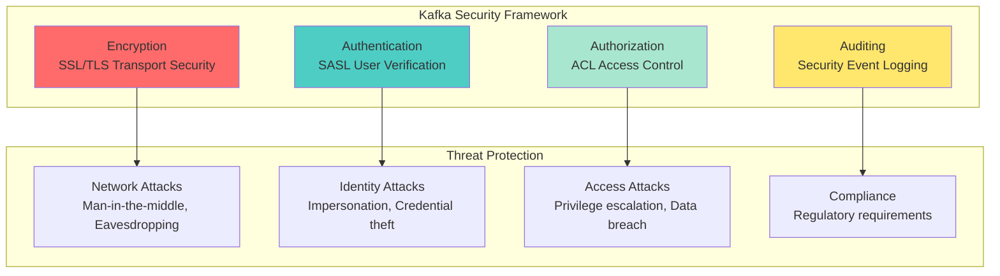
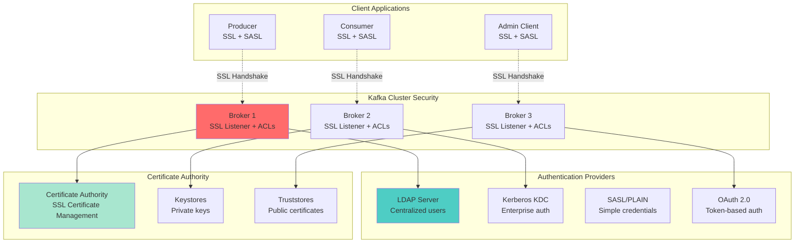
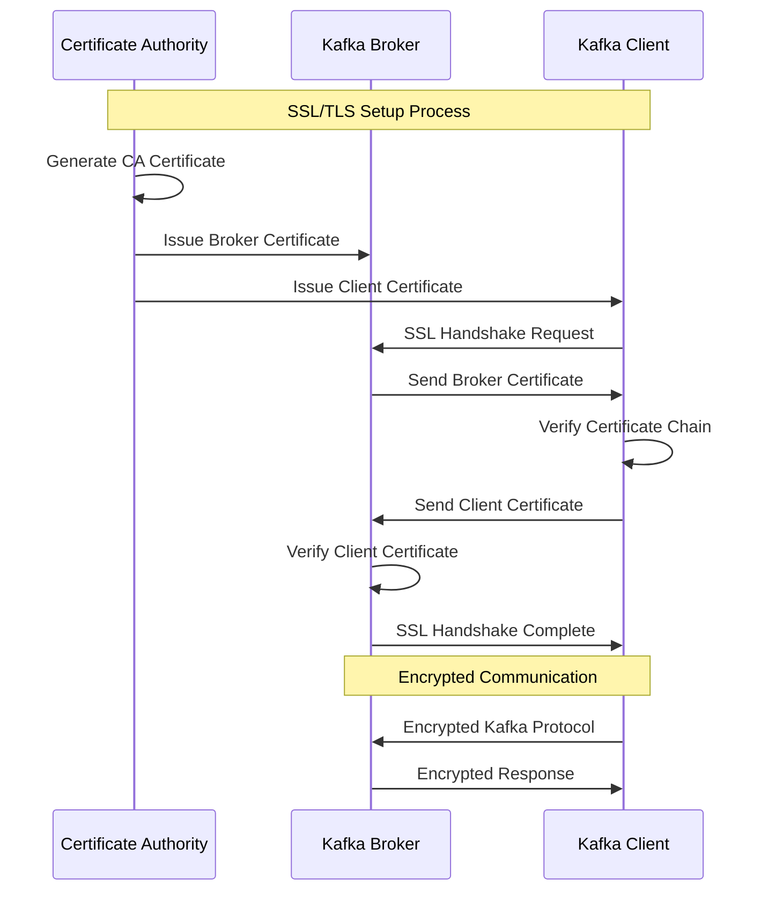
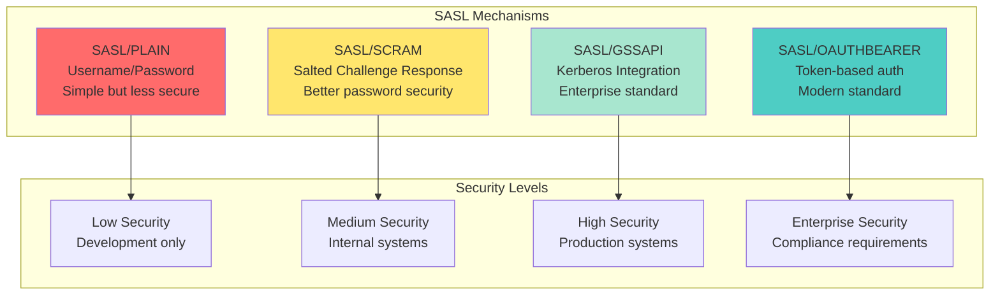
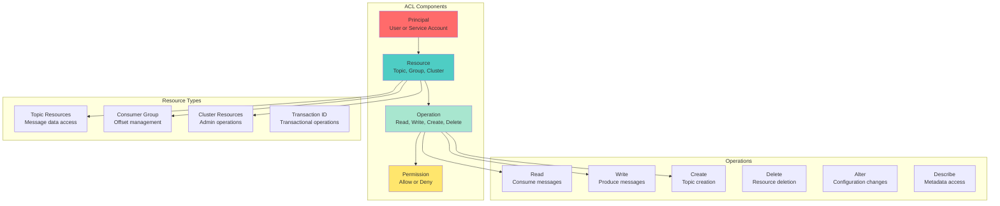
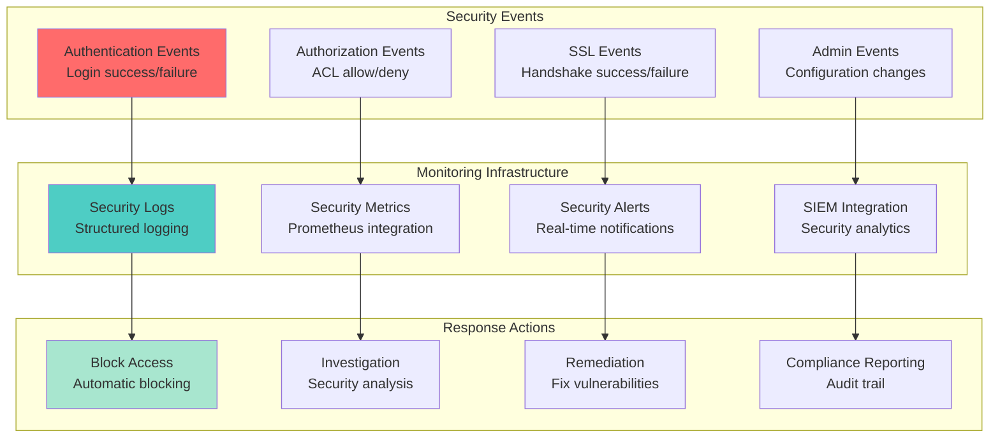
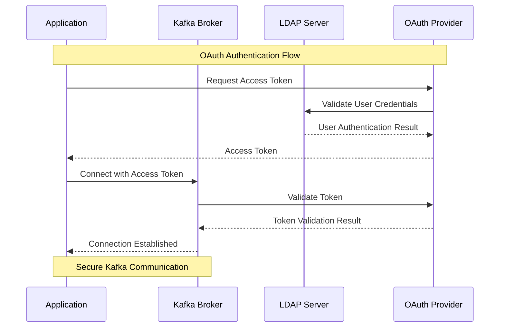
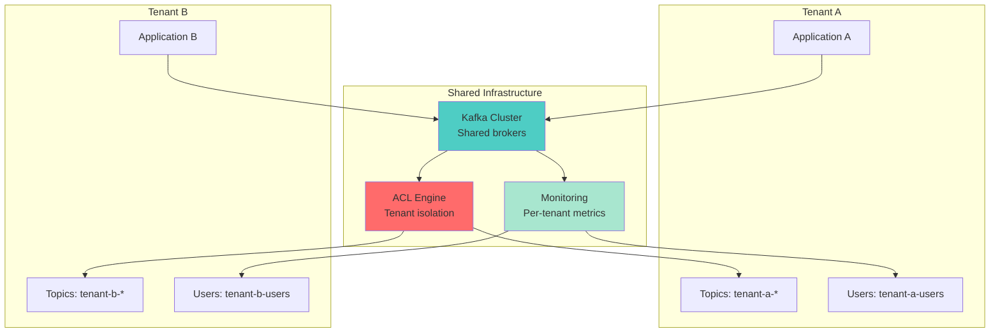
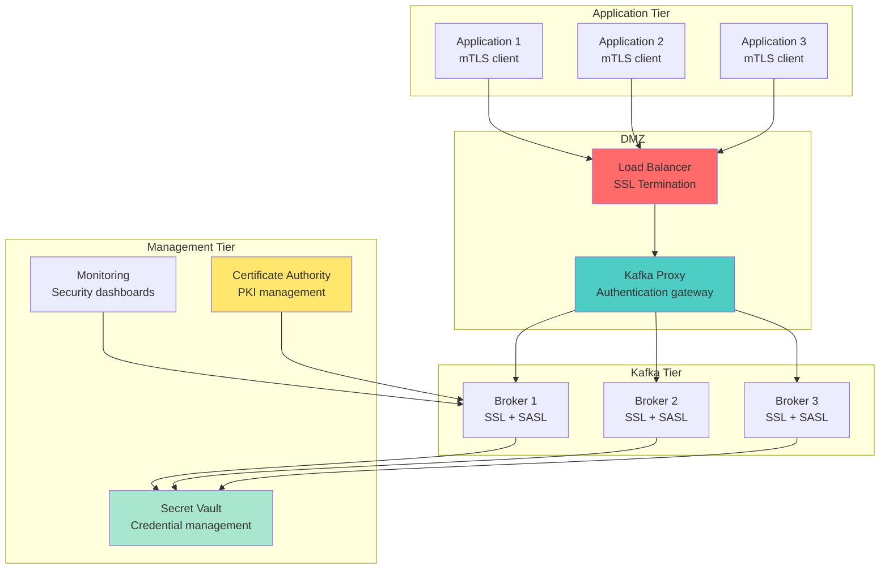

# Concept

## Kafka Security & ACLs - Production Security Implementation

## 🎯 Learning Objectives

After completing this lesson, you will:
- **Understand** Kafka security architecture and threat models
- **Implement** SSL/TLS encryption for secure communication
- **Configure** SASL authentication mechanisms
- **Design** ACL-based authorization strategies
- **Deploy** secure Kafka clusters in production environments

## 🔐 Kafka Security Overview

### Security Pillars



### Security Components Architecture



## 🔑 SSL/TLS Implementation

### Certificate Management Strategy



### SSL Configuration Patterns

**Server Configuration**
```properties
# Broker SSL Configuration
listeners=SSL://localhost:9093
security.inter.broker.protocol=SSL
ssl.keystore.location=/etc/kafka/ssl/kafka.server.keystore.jks
ssl.keystore.password=server-keystore-password
ssl.key.password=server-key-password
ssl.truststore.location=/etc/kafka/ssl/kafka.server.truststore.jks
ssl.truststore.password=server-truststore-password
ssl.client.auth=required
ssl.enabled.protocols=TLSv1.2,TLSv1.3
ssl.cipher.suites=TLS_ECDHE_RSA_WITH_AES_256_GCM_SHA384
```

**Client Configuration**
```properties
# Producer/Consumer SSL Configuration
bootstrap.servers=localhost:9093
security.protocol=SSL
ssl.truststore.location=/etc/kafka/ssl/kafka.client.truststore.jks
ssl.truststore.password=client-truststore-password
ssl.keystore.location=/etc/kafka/ssl/kafka.client.keystore.jks
ssl.keystore.password=client-keystore-password
ssl.key.password=client-key-password
```

## 🔐 SASL Authentication

### Authentication Mechanisms Comparison



### SASL Configuration Examples

**SASL/SCRAM Configuration**
```properties
# Broker SASL Configuration
listeners=SASL_SSL://localhost:9094
security.inter.broker.protocol=SASL_SSL
sasl.mechanism.inter.broker.protocol=SCRAM-SHA-512
sasl.enabled.mechanisms=SCRAM-SHA-512

# JAAS Configuration
listener.name.sasl_ssl.scram-sha-512.sasl.jaas.config=org.apache.kafka.common.security.scram.ScramLoginModule required;
```

**Client SASL Configuration**
```properties
# Producer/Consumer SASL Configuration
bootstrap.servers=localhost:9094
security.protocol=SASL_SSL
sasl.mechanism=SCRAM-SHA-512
sasl.jaas.config=org.apache.kafka.common.security.scram.ScramLoginModule required \
  username="kafka-user" \
  password="secure-password";
```

## 🛡️ Access Control Lists (ACLs)

### ACL Permission Model



### ACL Management Examples

**Topic Access Control**
```bash
# Grant producer access to specific topic
kafka-acls --bootstrap-server localhost:9094 \
  --command-config client-ssl.properties \
  --add \
  --allow-principal User:order-producer \
  --operation Write \
  --topic order-events

# Grant consumer access to topic and group
kafka-acls --bootstrap-server localhost:9094 \
  --command-config client-ssl.properties \
  --add \
  --allow-principal User:order-consumer \
  --operation Read \
  --topic order-events

kafka-acls --bootstrap-server localhost:9094 \
  --command-config client-ssl.properties \
  --add \
  --allow-principal User:order-consumer \
  --operation Read \
  --group order-processing-group
```

**Administrative Access Control**
```bash
# Grant cluster admin privileges
kafka-acls --bootstrap-server localhost:9094 \
  --command-config client-ssl.properties \
  --add \
  --allow-principal User:kafka-admin \
  --operation All \
  --cluster

# Grant topic creation privileges
kafka-acls --bootstrap-server localhost:9094 \
  --command-config client-ssl.properties \
  --add \
  --allow-principal User:app-deployer \
  --operation Create \
  --resource-pattern-type prefixed \
  --topic app-
```

## 🔍 Security Monitoring & Auditing

### Security Event Monitoring



### Security Configuration Monitoring

```properties
# Security-related JMX metrics to monitor
kafka.server:type=KafkaRequestHandlerPool,name=RequestHandlerAvgIdlePercent
kafka.network:type=SocketServer,name=NetworkProcessorAvgIdlePercent
kafka.server:type=BrokerTopicMetrics,name=FailedProduceRequestsPerSec
kafka.server:type=BrokerTopicMetrics,name=FailedFetchRequestsPerSec
kafka.controller:type=KafkaController,name=ActiveControllerCount
```

## 🏢 Enterprise Integration Patterns

### Identity Provider Integration



### Multi-Tenant Security Model



## 🎯 Security Best Practices

### Defense in Depth Strategy

1. **Network Security**
   - Use VPCs and security groups
   - Implement network segmentation
   - Configure firewalls and load balancers
   - Monitor network traffic

2. **Transport Security**
   - Enable SSL/TLS for all communication
   - Use strong cipher suites
   - Implement certificate rotation
   - Monitor SSL handshake failures

3. **Authentication & Authorization**
   - Implement strong authentication (SASL/SCRAM or better)
   - Use principle of least privilege for ACLs
   - Regular access reviews and cleanup
   - Monitor authentication failures

4. **Operational Security**
   - Secure configuration management
   - Regular security updates
   - Vulnerability scanning
   - Incident response procedures

### Security Checklist

**🔐 Authentication**
- [ ] SASL authentication enabled for all clients
- [ ] Strong passwords or certificate-based auth
- [ ] Regular credential rotation
- [ ] Failed authentication monitoring

**🔒 Authorization**
- [ ] ACLs configured for all resources
- [ ] Principle of least privilege applied
- [ ] Regular ACL reviews and cleanup
- [ ] Authorization failure monitoring

**🔑 Encryption**
- [ ] SSL/TLS enabled for all communication
- [ ] Strong cipher suites configured
- [ ] Certificate management process
- [ ] Regular certificate rotation

**📊 Monitoring**
- [ ] Security event logging enabled
- [ ] Real-time security monitoring
- [ ] Automated alerting for security events
- [ ] Regular security audits

## 🚀 Production Implementation

### Secure Deployment Architecture



### Security Automation

**Certificate Automation**
```bash
#!/bin/bash
# Automated certificate rotation script

# Generate new certificates
./generate-certificates.sh

# Update keystores
./update-keystores.sh

# Rolling restart of brokers
./rolling-restart.sh

# Verify security health
./security-health-check.sh
```

**ACL Management Automation**
```yaml
# GitOps-based ACL management
apiVersion: v1
kind: ConfigMap
metadata:
  name: kafka-acls
data:
  acls.yaml: |
    users:
      - name: order-service
        topics:
          - name: order-events
            operations: [READ, WRITE]
        groups:
          - name: order-processing
            operations: [READ]
```

## 📈 Security Metrics & KPIs

### Key Security Metrics

1. **Authentication Metrics**
   - Authentication success rate (target: &gt;99.9%)
   - Authentication failure rate (alert: &gt;1%)
   - Authentication latency (target: &lt;100ms)

2. **Authorization Metrics**
   - ACL evaluation success rate (target: &gt;99.9%)
   - Unauthorized access attempts (alert: &gt;0)
   - ACL rule coverage (target: 100%)

3. **Encryption Metrics**
   - SSL handshake success rate (target: &gt;99.9%)
   - SSL handshake latency (target: &lt;200ms)
   - Certificate expiration monitoring (alert: &lt;30 days)

4. **Security Health Metrics**
   - Security configuration compliance (target: 100%)
   - Vulnerability scan results (target: 0 high/critical)
   - Security incident response time (target: &lt;1 hour)

## 🔍 Troubleshooting Common Security Issues

### SSL/TLS Issues
- Certificate validation failures
- Cipher suite mismatches
- Certificate expiration
- Trust store configuration errors

### SASL Authentication Issues
- Incorrect credentials or configuration
- JAAS configuration problems
- Kerberos ticket expiration
- Network connectivity issues

### ACL Authorization Issues
- Missing or incorrect ACL rules
- Principal name mismatches
- Resource pattern matching errors
- Permission inheritance problems

## 🎯 Key Takeaways

✅ **Comprehensive Security**: Implement defense in depth with encryption, authentication, and authorization  
✅ **Enterprise Integration**: Seamlessly integrate with existing identity and security infrastructure  
✅ **Operational Excellence**: Automate security processes and monitoring for production environments  
✅ **Compliance Ready**: Meet regulatory requirements with proper auditing and access controls  
✅ **Performance Aware**: Balance security with performance requirements  

## 🚀 Next Steps

Ready to implement production monitoring? Move to [Lesson 19: Observability & Monitoring](../lesson_20/concept) to learn comprehensive system observability.

---

*Security is not a feature, it's a requirement. This lesson provides the foundation for building secure, compliant Kafka systems that protect your data and meet enterprise security standards.*