# Lesson 19: Observability & Monitoring - Production Operations Excellence

## 🎯 Learning Objectives

After completing this lesson, you will:
- **Master** the three pillars of observability: metrics, logs, and traces
- **Implement** comprehensive Kafka monitoring strategies
- **Build** production-ready dashboards and alerting systems
- **Design** effective SLIs, SLOs, and error budgets
- **Operate** Kafka clusters with confidence and reliability

## 📊 Observability Overview

### The Three Pillars of Observability


### Kafka-Specific Observability Architecture


## 📈 Kafka Metrics Strategy

### Critical Kafka Metrics Hierarchy

```mermaid
graph TB
    subgraph "Business Metrics (Level 1)"
        THROUGHPUT[Message Throughput<br/>messages/second]
        LATENCY[End-to-End Latency<br/>ms (p95, p99)]
        AVAILABILITY[Service Availability<br/>uptime percentage]
        ERROR_RATE[Error Rate<br/>errors/total requests]
    end
    
    subgraph "Service Metrics (Level 2)"
        PRODUCER_RATE[Producer Rate<br/>records/second]
        CONSUMER_LAG[Consumer Lag<br/>messages behind]
        PARTITION_COUNT[Partition Count<br/>per topic]
        BROKER_HEALTH[Broker Health<br/>up/down status]
    end
    
    subgraph "Infrastructure Metrics (Level 3)"
        CPU_USAGE[CPU Usage<br/>percentage]
        MEMORY_USAGE[Memory Usage<br/>heap utilization]
        DISK_USAGE[Disk Usage<br/>log segment growth]
        NETWORK_IO[Network I/O<br/>bytes in/out]
    end
    
    subgraph "JVM Metrics (Level 4)"
        GC_TIME[Garbage Collection<br/>pause time]
        GC_FREQUENCY[GC Frequency<br/>collections/minute]
        HEAP_SIZE[Heap Size<br/>used vs allocated]
        THREAD_COUNT[Thread Count<br/>active threads]
    end
    
    THROUGHPUT --> PRODUCER_RATE
    LATENCY --> CONSUMER_LAG
    AVAILABILITY --> BROKER_HEALTH
    ERROR_RATE --> PARTITION_COUNT
    
    PRODUCER_RATE --> CPU_USAGE
    CONSUMER_LAG --> MEMORY_USAGE
    BROKER_HEALTH --> DISK_USAGE
    PARTITION_COUNT --> NETWORK_IO
    
    CPU_USAGE --> GC_TIME
    MEMORY_USAGE --> GC_FREQUENCY
    DISK_USAGE --> HEAP_SIZE
    NETWORK_IO --> THREAD_COUNT
    
    style THROUGHPUT fill:#ff6b6b
    style PRODUCER_RATE fill:#4ecdc4
    style CPU_USAGE fill:#a8e6cf
    style GC_TIME fill:#ffe66d
```

### Producer Metrics Deep Dive

**Key Producer Metrics**
```properties
# Throughput and Performance
kafka.producer:type=producer-metrics,client-id=*,name=record-send-rate
kafka.producer:type=producer-metrics,client-id=*,name=record-send-total
kafka.producer:type=producer-metrics,client-id=*,name=batch-size-avg
kafka.producer:type=producer-metrics,client-id=*,name=batch-size-max

# Latency and Timing
kafka.producer:type=producer-metrics,client-id=*,name=record-queue-time-avg
kafka.producer:type=producer-metrics,client-id=*,name=record-queue-time-max
kafka.producer:type=producer-topic-metrics,client-id=*,topic=*,name=record-send-rate

# Error and Retry Metrics
kafka.producer:type=producer-metrics,client-id=*,name=record-error-rate
kafka.producer:type=producer-metrics,client-id=*,name=record-retry-rate
kafka.producer:type=producer-metrics,client-id=*,name=record-error-total
```

### Consumer Metrics Deep Dive

**Key Consumer Metrics**
```properties
# Consumption Performance
kafka.consumer:type=consumer-fetch-manager-metrics,client-id=*,name=records-consumed-rate
kafka.consumer:type=consumer-fetch-manager-metrics,client-id=*,name=records-consumed-total
kafka.consumer:type=consumer-fetch-manager-metrics,client-id=*,name=bytes-consumed-rate

# Lag and Offset Metrics
kafka.consumer:type=consumer-fetch-manager-metrics,client-id=*,topic=*,partition=*,name=records-lag
kafka.consumer:type=consumer-fetch-manager-metrics,client-id=*,topic=*,partition=*,name=records-lag-max
kafka.consumer:type=consumer-coordinator-metrics,client-id=*,name=commit-latency-avg

# Processing Metrics
kafka.consumer:type=consumer-coordinator-metrics,client-id=*,name=sync-time-avg
kafka.consumer:type=consumer-coordinator-metrics,client-id=*,name=heartbeat-rate
kafka.consumer:type=consumer-coordinator-metrics,client-id=*,name=join-time-avg
```

### Broker Metrics Deep Dive

**Critical Broker Metrics**
```properties
# Request Handling
kafka.server:type=BrokerTopicMetrics,name=MessagesInPerSec,topic=*
kafka.server:type=BrokerTopicMetrics,name=BytesInPerSec,topic=*
kafka.server:type=BrokerTopicMetrics,name=BytesOutPerSec,topic=*
kafka.network:type=RequestMetrics,name=RequestsPerSec,request=*

# Performance and Latency
kafka.network:type=RequestMetrics,name=TotalTimeMs,request=Produce
kafka.network:type=RequestMetrics,name=TotalTimeMs,request=FetchConsumer
kafka.server:type=KafkaRequestHandlerPool,name=RequestHandlerAvgIdlePercent

# Storage and Log Metrics
kafka.log:type=LogFlushStats,name=LogFlushRateAndTimeMs
kafka.log:type=LogSize,name=Size,topic=*,partition=*
kafka.server:type=ReplicaManager,name=LeaderCount
kafka.server:type=ReplicaManager,name=PartitionCount
```

## 📊 Dashboard Design Patterns

### Executive Dashboard

```mermaid
graph TB
    subgraph "Executive Dashboard - High Level KPIs"
        HEALTH[🟢 System Health<br/&gt;99.9% uptime]
        THROUGHPUT[📈 Message Throughput<br/&gt;50K msg/sec]
        LATENCY[⚡ Avg Latency<br/&gt;5ms p95]
        ERRORS[🚨 Error Rate<br/&gt;0.01%]
    end
    
    subgraph "Business Impact Metrics"
        REVENUE[💰 Revenue Impact<br/>$1.2M/hour processed]
        CUSTOMERS[👥 Active Users<br/&gt;50K concurrent]
        ORDERS[🛒 Orders/minute<br/&gt;1,200 orders/min]
        ALERTS[⚠️ Active Alerts<br/&gt;2 warnings]
    end
    
    subgraph "Trend Analysis"
        HOURLY[📊 Hourly Trends<br/>Last 24 hours]
        DAILY[📅 Daily Trends<br/>Last 30 days]
        CAPACITY[📏 Capacity Planning<br/>Current: 60% utilization]
        FORECAST[🔮 Growth Forecast<br/&gt;20% monthly growth]
    end
    
    HEALTH --> REVENUE
    THROUGHPUT --> CUSTOMERS
    LATENCY --> ORDERS
    ERRORS --> ALERTS
    
    REVENUE --> HOURLY
    CUSTOMERS --> DAILY
    ORDERS --> CAPACITY
    ALERTS --> FORECAST
    
    style HEALTH fill:#4ecdc4
    style THROUGHPUT fill:#a8e6cf
    style REVENUE fill:#ffe66d
    style HOURLY fill:#ffa8e6
```



### Operational Dashboard

```mermaid
graph TB
    subgraph "Cluster Health Overview"
        BROKER_STATUS[Broker Status<br/&gt;3/3 brokers online]
        PARTITION_STATUS[Partition Status<br/&gt;150 partitions healthy]
        REPLICATION[Replication Status<br/>In-sync replicas: 100%]
        CONTROLLER[Controller Status<br/>Active controller: broker-1]
    end
    
    subgraph "Performance Metrics"
        PRODUCER_METRICS[Producer Metrics<br/>Send rate, batch size, errors]
        CONSUMER_METRICS[Consumer Metrics<br/>Lag, throughput, commits]
        BROKER_METRICS[Broker Metrics<br/>Request rate, response time]
        NETWORK_METRICS[Network Metrics<br/>Bytes in/out, connections]
    end
    
    subgraph "Resource Utilization"
        CPU_CHART[CPU Usage<br/>Per broker utilization]
        MEMORY_CHART[Memory Usage<br/>Heap and off-heap memory]
        DISK_CHART[Disk Usage<br/>Log directory space]
        NETWORK_CHART[Network I/O<br/>Bandwidth utilization]
    end
    
    subgraph "Alert Summary"
        CRITICAL_ALERTS[🔴 Critical: 0]
        WARNING_ALERTS[🟡 Warning: 2]
        INFO_ALERTS[🔵 Info: 5]
        ALERT_TRENDS[Alert Trends<br/>Last 7 days]
    end
    
    BROKER_STATUS --> PRODUCER_METRICS
    PARTITION_STATUS --> CONSUMER_METRICS
    REPLICATION --> BROKER_METRICS
    CONTROLLER --> NETWORK_METRICS
    
    PRODUCER_METRICS --> CPU_CHART
    CONSUMER_METRICS --> MEMORY_CHART
    BROKER_METRICS --> DISK_CHART
    NETWORK_METRICS --> NETWORK_CHART
    
    CPU_CHART --> CRITICAL_ALERTS
    MEMORY_CHART --> WARNING_ALERTS
    DISK_CHART --> INFO_ALERTS
    NETWORK_CHART --> ALERT_TRENDS
    
    style BROKER_STATUS fill:#ff6b6b
    style PRODUCER_METRICS fill:#4ecdc4
    style CPU_CHART fill:#a8e6cf
    style CRITICAL_ALERTS fill:#ffe66d
```



### Application-Specific Dashboard


## 📝 Structured Logging Strategy

### Log Level Strategy


### Kafka-Specific Logging Patterns

**Producer Logging Example**
```json
{
  "timestamp": "2024-01-15T10:30:00.123Z",
  "level": "INFO",
  "service": "order-service",
  "component": "kafka-producer",
  "event": "message_sent",
  "topic": "order-events",
  "partition": 2,
  "offset": 12345,
  "key": "order-67890",
  "correlationId": "req-abc-123",
  "userId": "user-456",
  "orderId": "order-67890",
  "processingTime": 15,
  "batchSize": 100,
  "retryCount": 0
}
```

**Consumer Logging Example**
```json
{
  "timestamp": "2024-01-15T10:30:00.234Z",
  "level": "INFO", 
  "service": "payment-service",
  "component": "kafka-consumer",
  "event": "message_processed",
  "topic": "order-events",
  "partition": 2,
  "offset": 12345,
  "key": "order-67890",
  "correlationId": "req-abc-123",
  "consumerGroup": "payment-processors",
  "processingTime": 85,
  "businessResult": "payment_successful",
  "lag": 5
}
```

## 🔍 Distributed Tracing Implementation

### Trace Context Flow


### Trace Data Structure

```json
{
  "traceId": "abc-123-def-456",
  "spans": [
    {
      "spanId": "span-001",
      "parentSpanId": null,
      "operationName": "order-creation",
      "service": "order-api",
      "startTime": "2024-01-15T10:30:00.000Z",
      "duration": 250,
      "tags": {
        "http.method": "POST",
        "http.url": "/api/orders",
        "order.id": "order-67890",
        "customer.id": "user-456"
      }
    },
    {
      "spanId": "span-002", 
      "parentSpanId": "span-001",
      "operationName": "kafka-send",
      "service": "order-api",
      "startTime": "2024-01-15T10:30:00.150Z",
      "duration": 25,
      "tags": {
        "messaging.system": "kafka",
        "messaging.destination": "order-events",
        "messaging.kafka.partition": 2
      }
    }
  ]
}
```

## 🚨 Alerting Strategy

### Alert Hierarchy and Escalation

```mermaid
graph TB
    subgraph "Alert Severity Levels"
        CRITICAL[🔴 CRITICAL<br/>System down or data loss<br/>Immediate response required]
        HIGH[🟠 HIGH<br/>Degraded performance<br/>Response within 15 min]
        MEDIUM[🟡 MEDIUM<br/>Warning conditions<br/>Response within 1 hour]
        LOW[🔵 LOW<br/>Informational<br/>Next business day]
    end
    
    subgraph "Alert Channels"
        PAGERDUTY[📱 PagerDuty<br/>Critical & High alerts<br/&gt;24/7 on-call rotation]
        SLACK[💬 Slack<br/>All alert levels<br/>Team notifications]
        EMAIL[📧 Email<br/>Medium & Low alerts<br/>Non-urgent notifications]
        DASHBOARD[📊 Dashboard<br/>Visual indicators<br/>Status overview]
    end
    
    subgraph "Response Actions"
        IMMEDIATE[🚨 Immediate Response<br/>< 5 minutes<br/>Wake up on-call engineer]
        URGENT[⚡ Urgent Response<br/>< 15 minutes<br/>High priority ticket]
        STANDARD[📋 Standard Response<br/>< 1 hour<br/>Normal priority ticket]
        INFORMATIONAL[ℹ️ Informational<br/>Next business day<br/>Monitoring only]
    end
    
    CRITICAL --> PAGERDUTY
    HIGH --> PAGERDUTY
    MEDIUM --> SLACK
    LOW --> EMAIL
    
    PAGERDUTY --> IMMEDIATE
    PAGERDUTY --> URGENT
    SLACK --> STANDARD
    EMAIL --> INFORMATIONAL
    
    ALL_ALERTS[All Alerts] --> DASHBOARD
    
    style CRITICAL fill:#ff6b6b
    style PAGERDUTY fill:#4ecdc4
    style IMMEDIATE fill:#a8e6cf
```



### Kafka-Specific Alert Rules

**Critical Alerts**
```yaml
# Broker Down Alert
- alert: KafkaBrokerDown
  expr: up{job="kafka-broker"} == 0
  for: 1m
  severity: critical
  description: "Kafka broker {{ $labels.instance }} is down"

# High Consumer Lag Alert  
- alert: KafkaConsumerLagHigh
  expr: kafka_consumer_lag_max > 10000
  for: 5m
  severity: critical
  description: "Consumer lag is {{ $value }} messages"

# Disk Space Critical
- alert: KafkaDiskSpaceCritical
  expr: (kafka_log_size / kafka_log_capacity) > 0.9
  for: 2m
  severity: critical
  description: "Kafka disk usage is {{ $value }}%"
```

**Warning Alerts**
```yaml
# High Error Rate
- alert: KafkaHighErrorRate
  expr: rate(kafka_server_errors_total[5m]) > 0.01
  for: 5m
  severity: warning
  description: "Kafka error rate is {{ $value }}/sec"

# Memory Usage High
- alert: KafkaMemoryUsageHigh
  expr: kafka_jvm_memory_used / kafka_jvm_memory_max > 0.8
  for: 10m
  severity: warning
  description: "Kafka memory usage is {{ $value }}%"

# Slow Request Processing
- alert: KafkaSlowRequests
  expr: kafka_request_time_99th_percentile > 100
  for: 15m
  severity: warning
  description: "99th percentile request time is {{ $value }}ms"
```

## 📊 SLIs, SLOs, and Error Budgets

### Service Level Definitions

```mermaid
graph TB
    subgraph "SLI - Service Level Indicators"
        AVAILABILITY[Availability SLI<br/>Successful requests / Total requests]
        LATENCY[Latency SLI<br/>Requests < 100ms / Total requests]
        THROUGHPUT[Throughput SLI<br/>Messages processed / Time period]
        QUALITY[Quality SLI<br/>Valid messages / Total messages]
    end
    
    subgraph "SLO - Service Level Objectives"
        AVAIL_SLO[Availability SLO<br/&gt;99.9% uptime per month]
        LATENCY_SLO[Latency SLO<br/&gt;95% of requests < 100ms]
        THROUGHPUT_SLO[Throughput SLO<br/>≥ 10K messages/second]
        QUALITY_SLO[Quality SLO<br/&gt;99.99% message delivery success]
    end
    
    subgraph "Error Budget Management"
        BUDGET_CALC[Error Budget Calculation<br/>(1 - SLO) × Time Period]
        BUDGET_CONSUMPTION[Budget Consumption<br/>Track against actual performance]
        BUDGET_ALERTS[Budget Alerts<br/>Alert when budget consumed]
        BUDGET_POLICY[Budget Policy<br/>Actions when budget exhausted]
    end
    
    AVAILABILITY --> AVAIL_SLO
    LATENCY --> LATENCY_SLO
    THROUGHPUT --> THROUGHPUT_SLO
    QUALITY --> QUALITY_SLO
    
    AVAIL_SLO --> BUDGET_CALC
    LATENCY_SLO --> BUDGET_CONSUMPTION
    THROUGHPUT_SLO --> BUDGET_ALERTS
    QUALITY_SLO --> BUDGET_POLICY
    
    style AVAILABILITY fill:#ff6b6b
    style AVAIL_SLO fill:#4ecdc4
    style BUDGET_CALC fill:#a8e6cf
```

### Error Budget Example

**Monthly Error Budget Calculation**
```
SLO: 99.9% availability
Error Budget: (100% - 99.9%) = 0.1%
Monthly Downtime Budget: 0.1% × 30 days = 43.2 minutes

Week 1: 5 minutes downtime (11.6% budget consumed)
Week 2: 2 minutes downtime (4.6% budget consumed)  
Week 3: 1 minute downtime (2.3% budget consumed)
Week 4: Budget remaining = 43.2 - 8 = 35.2 minutes

Budget Consumption Rate: 18.5% after 3 weeks
Projected Monthly Consumption: 24.7% (within budget)
```

## 🛠️ Monitoring Infrastructure Setup

### Prometheus Configuration

```yaml
# prometheus.yml
global:
  scrape_interval: 15s
  evaluation_interval: 15s

rule_files:
  - "kafka_alerts.yml"
  - "application_alerts.yml"

scrape_configs:
  # Kafka Brokers (via JMX Exporter)
  - job_name: 'kafka-broker'
    static_configs:
      - targets: ['kafka-1:9308', 'kafka-2:9308', 'kafka-3:9308']
    scrape_interval: 10s
    metrics_path: /metrics

  # Kafka Producer Applications
  - job_name: 'kafka-producers'
    kubernetes_sd_configs:
      - role: pod
    relabel_configs:
      - source_labels: [__meta_kubernetes_pod_annotation_prometheus_io_scrape]
        action: keep
        regex: true
      - source_labels: [__meta_kubernetes_pod_annotation_prometheus_io_path]
        action: replace
        target_label: __metrics_path__
        regex: (.+)

  # Kafka Consumer Applications  
  - job_name: 'kafka-consumers'
    static_configs:
      - targets: ['consumer-app-1:8080', 'consumer-app-2:8080']
    metrics_path: /actuator/prometheus
    scrape_interval: 10s
```

### Grafana Dashboard Configuration

```json
{
  "dashboard": {
    "title": "Kafka Cluster Overview",
    "panels": [
      {
        "title": "Message Throughput",
        "type": "graph",
        "targets": [
          {
            "expr": "sum(rate(kafka_server_brokertopicmetrics_messagesin_total[5m]))",
            "legendFormat": "Messages In/sec"
          },
          {
            "expr": "sum(rate(kafka_server_brokertopicmetrics_messagesout_total[5m]))", 
            "legendFormat": "Messages Out/sec"
          }
        ]
      },
      {
        "title": "Consumer Lag",
        "type": "graph",
        "targets": [
          {
            "expr": "kafka_consumer_lag_max",
            "legendFormat": "Max Lag - {{consumer_group}}"
          }
        ]
      }
    ]
  }
}
```

## 🔧 Operational Runbooks

### Common Incident Response Procedures

**High Consumer Lag Runbook**
```markdown
## High Consumer Lag Incident Response

### Immediate Actions (< 5 minutes)
1. Check consumer group status
   ```bash
   kafka-consumer-groups --bootstrap-server kafka:9092 \
     --group payment-processors --describe
   ```

2. Identify lagging partitions
   ```bash
   kafka-consumer-groups --bootstrap-server kafka:9092 \
     --group payment-processors --describe | sort -k5 -nr
   ```

3. Check consumer application health
   ```bash
   curl http://consumer-app:8080/actuator/health
   ```

### Investigation Steps (< 15 minutes)
1. Review consumer application logs
2. Check for processing errors or exceptions
3. Verify downstream dependencies (database, APIs)
4. Monitor resource utilization (CPU, memory)

### Resolution Actions
1. Scale consumer instances if needed
2. Reset consumer offsets if corruption suspected
3. Restart consumer applications if unhealthy
4. Implement temporary backpressure if necessary
```

**Broker Down Runbook**
```markdown
## Broker Down Incident Response

### Immediate Actions (< 2 minutes)
1. Verify broker status
   ```bash
   kafka-broker-api-versions --bootstrap-server kafka-1:9092
   ```

2. Check cluster metadata
   ```bash
   kafka-metadata-shell --snapshot /kafka-logs/__cluster_metadata-0/00000000000000000000.log
   ```

### Recovery Steps
1. Attempt broker restart
   ```bash
   systemctl restart kafka
   ```

2. Monitor partition reassignment
   ```bash
   kafka-reassign-partitions --bootstrap-server kafka:9092 --list
   ```

3. Verify leader election completion
   ```bash
   kafka-topics --bootstrap-server kafka:9092 --describe
   ```
```

## 🎯 Key Takeaways

✅ **Comprehensive Observability**: Implement metrics, logs, and traces for complete system visibility  
✅ **Proactive Monitoring**: Use SLIs, SLOs, and error budgets to manage service reliability  
✅ **Effective Alerting**: Design alert hierarchies that minimize noise while ensuring rapid response  
✅ **Operational Excellence**: Build runbooks and automation for common incident scenarios  
✅ **Continuous Improvement**: Use observability data to optimize performance and reliability  

## 🚀 Next Steps

Ready to deploy to production? Move to [Lesson 20: Deployment & Scaling Best Practices](../lesson_20/) to learn production deployment strategies.

---

*"You can't manage what you can't measure. This lesson provides the observability foundation for operating reliable, scalable Kafka systems in production."*