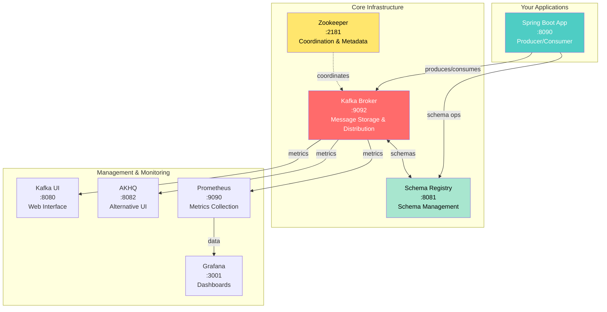
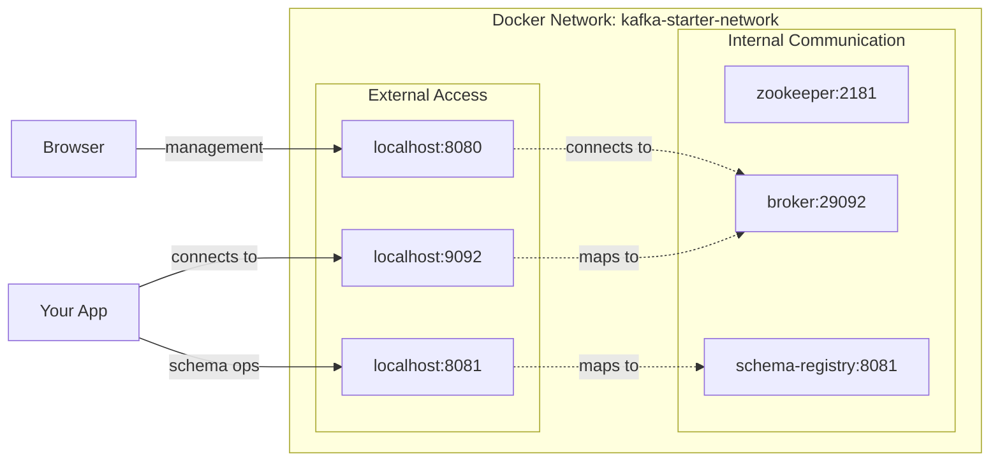
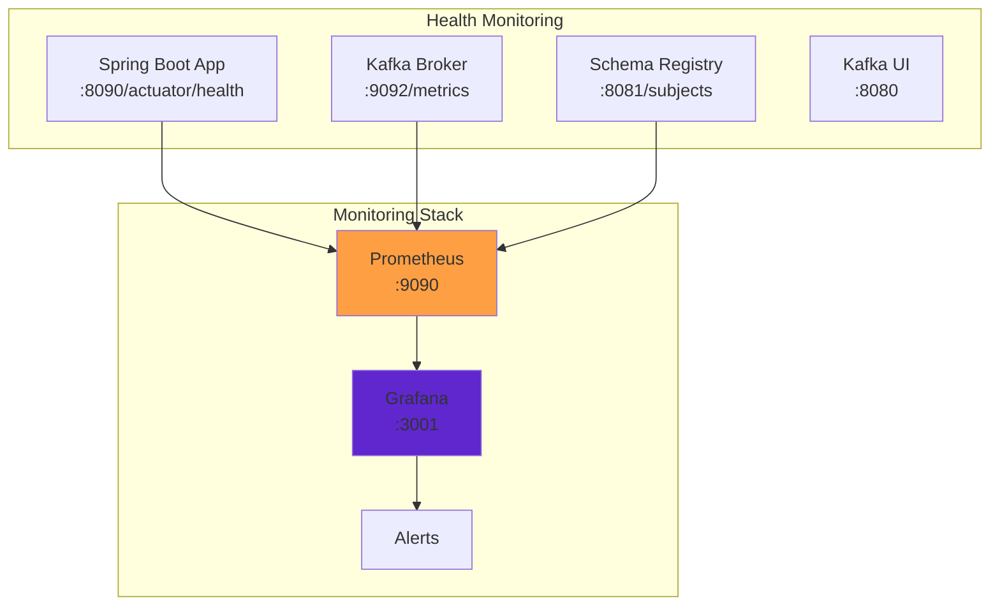

# Concept

## Environment Setup & Kafka Infrastructure

## 🎯 Learning Objectives

By the end of this lesson, you will:
- **Set up** a complete Kafka development environment using Docker
- **Understand** the core components of the Kafka ecosystem
- **Validate** that all services are properly configured and accessible
- **Master** basic Kafka operations and troubleshooting
- **Configure** monitoring and observability tools

## 🏗️ Kafka Ecosystem Architecture

Understanding how Kafka components work together is crucial for successful development:



## 🧱 Core Components

### 1. **Apache Kafka Broker**
The heart of the Kafka ecosystem:
- **Message Storage**: Persists messages in topics with configurable retention
- **Distribution**: Routes messages to consumers across partitions
- **Replication**: Ensures data durability through replica management
- **Performance**: Handles thousands of messages per second with low latency

### 2. **Apache Zookeeper**
Coordination service for Kafka:
- **Metadata Management**: Stores topic and partition metadata
- **Leader Election**: Manages partition leader selection
- **Configuration**: Maintains cluster configuration
- **Service Discovery**: Helps brokers find each other

### 3. **Confluent Schema Registry**
Schema management and evolution:
- **Schema Storage**: Centralized repository for Avro, JSON, Protobuf schemas
- **Compatibility**: Enforces schema evolution rules
- **Serialization**: Integrates with Kafka serializers/deserializers
- **Versioning**: Manages schema versions and migration

### 4. **Management Tools**

#### **Kafka UI**
Modern web interface for Kafka management:
- Topic browsing and message inspection
- Consumer group monitoring
- Schema registry integration
- Cluster health monitoring

#### **AKHQ**
Alternative Kafka management interface:
- Comprehensive cluster overview
- Advanced message filtering
- SQL-like query capabilities
- Connect cluster management

## 🐳 Docker Environment Setup

### Docker Compose Configuration

Our `docker-compose.yml` creates a complete Kafka ecosystem:

```yaml
services:
  zookeeper:
    image: confluentinc/cp-zookeeper:7.4.0
    environment:
      ZOOKEEPER_CLIENT_PORT: 2181
      ZOOKEEPER_TICK_TIME: 2000

  broker:
    image: confluentinc/cp-kafka:7.4.0
    depends_on: [zookeeper]
    environment:
      KAFKA_BROKER_ID: 1
      KAFKA_ZOOKEEPER_CONNECT: 'zookeeper:2181'
      KAFKA_ADVERTISED_LISTENERS: PLAINTEXT://localhost:9092
      KAFKA_OFFSETS_TOPIC_REPLICATION_FACTOR: 1
```

### Network Architecture



## ⚙️ Configuration Deep Dive

### Kafka Broker Configuration

Key configuration parameters you'll encounter:

```properties
# Broker Identity
broker.id=1

# Network & Listeners
listeners=PLAINTEXT://0.0.0.0:29092
advertised.listeners=PLAINTEXT://localhost:9092

# Log & Storage
log.dirs=/kafka/kafka-logs
num.partitions=3
default.replication.factor=1

# Performance
num.network.threads=3
num.io.threads=8
socket.send.buffer.bytes=102400
socket.receive.buffer.bytes=102400

# Topic Management
auto.create.topics.enable=true
delete.topic.enable=true
```

### Spring Boot Configuration

Your application's `application.yml`:

```yaml
spring:
  kafka:
    bootstrap-servers: localhost:9092
    producer:
      key-serializer: org.apache.kafka.common.serialization.StringSerializer
      value-serializer: org.springframework.kafka.support.serializer.JsonSerializer
    consumer:
      group-id: my-app-group
      key-deserializer: org.apache.kafka.common.serialization.StringDeserializer
      value-deserializer: org.springframework.kafka.support.serializer.JsonDeserializer
```

## 🔍 Environment Validation

### Automated Health Checks

Use the workshop's `EnvironmentValidator` to systematically verify:

1. **Kafka Broker Connectivity**
   ```kotlin
   val result = environmentValidator.validateKafkaBroker("localhost:9092")
   ```

2. **Schema Registry Access**
   ```kotlin
   val result = environmentValidator.validateSchemaRegistry("http://localhost:8081")
   ```

3. **Topic Operations**
   ```kotlin
   val result = environmentValidator.validateTopicOperations(adminClient)
   ```

### Manual Verification Commands

```bash
# Test Kafka broker
kafka-broker-api-versions --bootstrap-server localhost:9092

# List topics
kafka-topics --list --bootstrap-server localhost:9092

# Test Schema Registry
curl http://localhost:8081/subjects

# Test producer/consumer
kafka-console-producer --topic test --bootstrap-server localhost:9092
kafka-console-consumer --topic test --from-beginning --bootstrap-server localhost:9092
```

## 📊 Monitoring Setup

### Health Check Endpoints



### Key Metrics to Monitor

1. **Broker Metrics**
   - Message throughput (messages/sec)
   - Network I/O (bytes/sec)
   - Disk usage
   - Active connections

2. **Topic Metrics**
   - Message count per topic
   - Partition distribution
   - Log size
   - Retention compliance

3. **Consumer Metrics**
   - Consumer lag
   - Processing rate
   - Error rate
   - Rebalance frequency

## 🚨 Troubleshooting Guide

### Common Issues & Solutions

#### **Port Conflicts**
```bash
# Check what's using Kafka port
lsof -i :9092

# Kill conflicting process
kill -9 <PID>
```

#### **Memory Issues**
- **Symptom**: Services randomly stop or fail to start
- **Solution**: Increase Docker memory allocation to 4GB+
- **Check**: Docker Desktop → Settings → Resources → Memory

#### **Slow Startup**
- **Symptom**: Services take &gt;2 minutes to start
- **Cause**: Insufficient resources or network issues
- **Solution**: 
  - Check Docker resource allocation
  - Verify network connectivity
  - Check logs: `docker-compose logs <service>`

#### **Schema Registry Connection Issues**
```bash
# Check Schema Registry health
curl -f http://localhost:8081/subjects

# Verify it can reach Kafka
docker-compose logs schema-registry | grep -i error
```

### Diagnostic Commands

```bash
# Service status
docker-compose ps

# Service logs  
docker-compose logs kafka
docker-compose logs schema-registry

# Resource usage
docker stats

# Network connectivity
docker exec kafka-starter-broker kafka-broker-api-versions --bootstrap-server localhost:9092
```

## 🎯 Best Practices

### Development Environment

1. **Resource Allocation**
   - Minimum 4GB RAM for Docker
   - SSD storage for better I/O performance
   - Close unnecessary applications

2. **Network Configuration**
   - Use consistent port mappings
   - Avoid port conflicts with other services
   - Configure proper advertised listeners

3. **Data Management**
   - Regular cleanup of test topics
   - Monitor disk usage
   - Configure appropriate retention policies

### Production Considerations

1. **Security**
   - Enable SSL/SASL authentication
   - Configure proper ACLs
   - Use dedicated service accounts

2. **Monitoring**
   - Set up comprehensive alerts
   - Monitor key performance metrics
   - Implement health checks

3. **Backup & Recovery**
   - Regular configuration backups
   - Disaster recovery procedures
   - Data replication strategies

## ✅ Environment Checklist

Before proceeding to the next lesson, verify:

- [ ] **Docker Services**: All containers running and healthy
- [ ] **Kafka Broker**: Accessible on port 9092
- [ ] **Schema Registry**: Accessible on port 8081  
- [ ] **Kafka UI**: Accessible on port 8080
- [ ] **Topic Operations**: Can create, list, and delete topics
- [ ] **Producer/Consumer**: Basic message flow works
- [ ] **Health Checks**: All validation checks pass
- [ ] **Monitoring**: Can access Prometheus and Grafana (optional)

## 🚀 What's Next?

With your environment validated and running, you're ready for hands-on Kafka development!

**Next**: [Lesson 3 - First Producer/Consumer](../lesson_3/concept.md) where you'll build your first Kafka application and see events flowing through the system.

---

*"A solid foundation enables confident building. With your Kafka environment ready, let's start producing and consuming events!"*