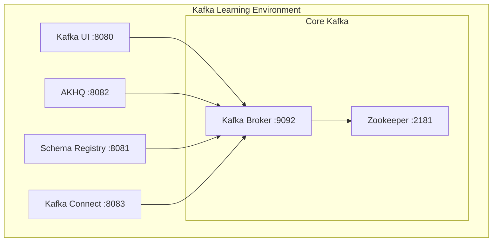

# Lesson 2: Kafka Setup with Docker Compose

## 🎯 Objective

Set up a complete Kafka development environment using Docker Compose, including Kafka, Zookeeper, Schema Registry, and web UIs for learning and development.

## 🐳 Why Docker for Kafka Learning?

### ✅ Benefits
- **Quick setup** - Environment ready in minutes
- **Isolation** - No conflicts with system installations  
- **Consistency** - Same environment for everyone
- **Easy cleanup** - Remove everything with one command
- **Production-like** - Similar to cloud deployments

### 🏗️ Complete Development Stack
Our setup includes:
- **Kafka Broker** - The main event streaming engine
- **Zookeeper** - Kafka coordination service
- **Schema Registry** - Manages Avro/Protobuf schemas
- **Kafka UI** - Modern web interface
- **AKHQ** - Alternative Kafka management UI
- **Kafka Connect** - Integration framework

## 🚀 Environment Overview



## 📋 Prerequisites

### Required Software
- **Docker Desktop** (4.0+)
- **Docker Compose** (2.0+)
- **Web Browser** (for UIs)

### Verify Installation
```bash
docker --version          # Should show 20.0+
docker-compose --version  # Should show 2.0+
```

### System Requirements
- **Memory**: 4GB+ available RAM
- **Disk**: 2GB+ free space
- **Ports**: 2181, 8080-8083, 9092, 9101

## 🏃‍♂️ Quick Start

### 1. Start the Environment
```bash
cd docker
docker-compose up -d
```

### 2. Verify Services
```bash
docker-compose ps
```

Expected output:
```
NAME                          STATUS
kafka-starter-broker          Up 
kafka-starter-zookeeper       Up
kafka-starter-schema-registry Up
kafka-starter-ui             Up
kafka-starter-akhq           Up
kafka-starter-connect        Up
```

### 3. Access Web Interfaces

| Service | URL | Purpose |
|---------|-----|---------|
| **Kafka UI** | http://localhost:8080 | Primary management interface |
| **AKHQ** | http://localhost:8082 | Alternative Kafka browser |
| **Schema Registry** | http://localhost:8081 | Schema management API |

## 🔧 Service Configuration

### Kafka Broker
```yaml
ports:
  - "9092:9092"    # Client connections
  - "9101:9101"    # JMX metrics

environment:
  KAFKA_ADVERTISED_LISTENERS: PLAINTEXT_HOST://localhost:9092
  KAFKA_AUTO_CREATE_TOPICS_ENABLE: 'true'
  KAFKA_DELETE_TOPIC_ENABLE: 'true'
```

**Key Settings:**
- **Auto-create topics**: Enabled for easy learning
- **Replication factor**: 1 (single broker setup)
- **JMX monitoring**: Enabled for metrics

### Schema Registry
```yaml
ports:
  - "8081:8081"

environment:
  SCHEMA_REGISTRY_KAFKASTORE_BOOTSTRAP_SERVERS: 'kafka:29092'
```

**Purpose:**
- Manage Avro and Protobuf schemas
- Enforce schema evolution rules
- Provide compatibility checking

## 🛠️ Essential Commands

### Docker Management
```bash
# Start all services
docker-compose up -d

# View service logs
docker-compose logs kafka
docker-compose logs -f kafka-ui

# Stop all services
docker-compose down

# Clean up (removes volumes)
docker-compose down -v

# Restart a specific service
docker-compose restart kafka
```

### Kafka CLI Commands
```bash
# Create a topic
docker exec kafka-starter-broker kafka-topics \
  --create --topic test-topic \
  --bootstrap-server localhost:9092 \
  --partitions 3 \
  --replication-factor 1

# List topics
docker exec kafka-starter-broker kafka-topics \
  --list --bootstrap-server localhost:9092

# Describe a topic
docker exec kafka-starter-broker kafka-topics \
  --describe --topic test-topic \
  --bootstrap-server localhost:9092

# Delete a topic
docker exec kafka-starter-broker kafka-topics \
  --delete --topic test-topic \
  --bootstrap-server localhost:9092
```

### Producer/Consumer Testing
```bash
# Start a console producer
docker exec -it kafka-starter-broker kafka-console-producer \
  --topic test-topic \
  --bootstrap-server localhost:9092

# Start a console consumer
docker exec -it kafka-starter-broker kafka-console-consumer \
  --topic test-topic \
  --from-beginning \
  --bootstrap-server localhost:9092

# Consumer with group
docker exec -it kafka-starter-broker kafka-console-consumer \
  --topic test-topic \
  --group test-group \
  --bootstrap-server localhost:9092
```

## 🎨 Exploring Kafka UI

### 1. **Topics Management**
- View all topics and their configurations
- Create new topics with custom partitions
- Monitor topic metrics and message rates

### 2. **Message Browser**
- Browse messages in any topic
- View message headers and payloads
- Filter messages by key or timestamp

### 3. **Consumer Groups**
- Monitor consumer lag
- View group membership
- Reset consumer offsets

### 4. **Schema Registry**
- Browse registered schemas
- View schema evolution history
- Test schema compatibility

## 🔍 Health Checks

### Verify Kafka is Ready
```bash
# Check broker logs for "started (kafka.server.KafkaServer)"
docker-compose logs kafka | grep "started"

# Test topic creation
docker exec kafka-starter-broker kafka-topics \
  --create --topic health-check \
  --bootstrap-server localhost:9092 \
  --partitions 1 \
  --replication-factor 1
```

### Verify Schema Registry
```bash
# Check if Schema Registry responds
curl http://localhost:8081/subjects

# Should return: []
```

### Verify Connectivity
```bash
# Test producer/consumer
echo "Hello Kafka" | docker exec -i kafka-starter-broker kafka-console-producer \
  --topic health-check \
  --bootstrap-server localhost:9092

docker exec kafka-starter-broker kafka-console-consumer \
  --topic health-check \
  --from-beginning \
  --max-messages 1 \
  --bootstrap-server localhost:9092
```

## 🚨 Troubleshooting

### Common Issues

#### 1. **Port Conflicts**
```bash
# Check what's using port 9092
lsof -i :9092

# Use different ports if needed
```

#### 2. **Memory Issues**
```bash
# Increase Docker memory limit to 4GB+
# Docker Desktop → Settings → Resources → Memory
```

#### 3. **Services Not Starting**
```bash
# Check logs for specific service
docker-compose logs zookeeper
docker-compose logs kafka

# Common issue: Zookeeper not ready
# Solution: Wait longer or restart services
```

#### 4. **Clean Start**
```bash
# Stop and remove everything
docker-compose down -v
docker system prune -f

# Start fresh
docker-compose up -d
```

## 📊 Environment Verification Checklist

- [ ] All 6 services running (`docker-compose ps`)
- [ ] Kafka UI accessible (http://localhost:8080)
- [ ] Can create topics via CLI
- [ ] Can produce/consume messages
- [ ] Schema Registry responding (http://localhost:8081/subjects)
- [ ] JMX metrics available (port 9101)

## 🎯 What's Next?

With your Kafka environment running, you're ready for hands-on development! In [Lesson 3: Hello Kafka](../lesson_3/workshop_3.md), you'll build your first Kafka producer and consumer with Spring Boot and Kotlin.

## 💡 Pro Tips

1. **Bookmark the UIs** - You'll use them constantly
2. **Keep Docker Desktop open** - Monitor resource usage
3. **Save commands** - Create scripts for common operations
4. **Use volumes** - Your data persists between restarts
5. **Monitor logs** - `docker-compose logs -f` is your friend

---

*Your Kafka development environment is now ready! This setup will support all lessons in the curriculum and provides the tools you'll use in production environments.*