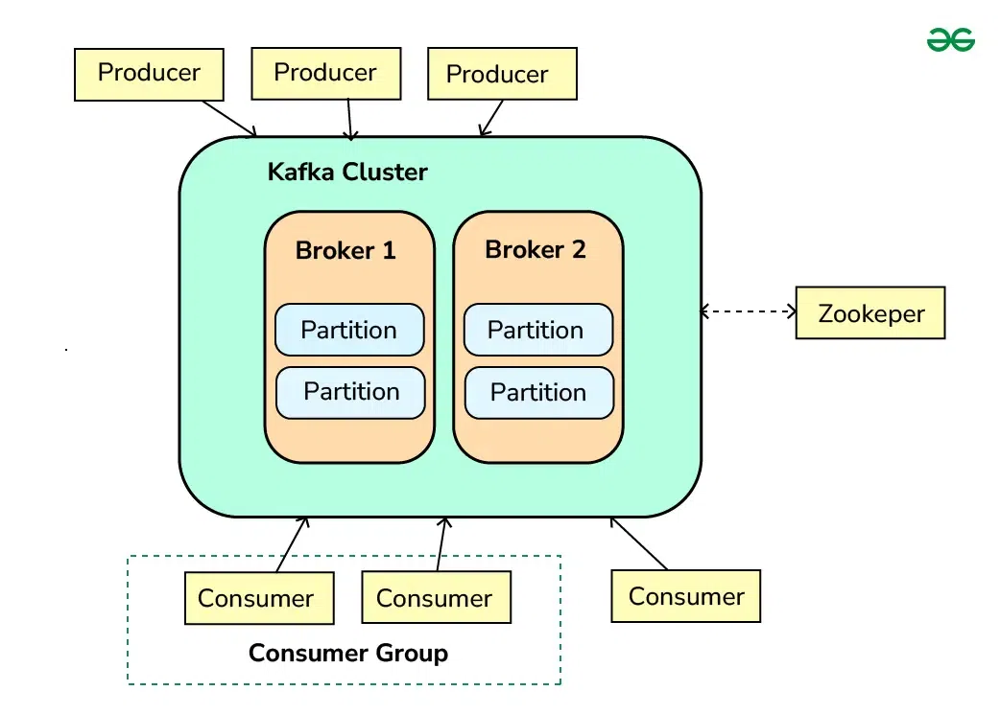

# Concept

## Kafka Architecture

## 🏢 Core Architecture Components




## 🏢 **Kafka Cluster = The Newspaper Publishing Company**

### 📖 **Technical Definition**
A **Kafka cluster** is a distributed system composed of multiple Kafka brokers working together to handle the storage and processing of real-time streaming data. It provides fault tolerance, scalability, and high availability for efficient data streaming and messaging in large-scale applications.

### 🗞️ **Newspaper Analogy**
A **Kafka cluster** is like a large newspaper publishing company with multiple facilities working together. Just as a publishing company ensures newspapers are printed and distributed reliably even if one facility has problems, a Kafka cluster provides **fault tolerance**, **scalability**, and **high availability** for real-time data streaming across large-scale applications.

*Think of it as "The Daily Data Times" - a massive publishing operation that never stops!*

---

## 🏭 **Brokers = Individual Publishing Facilities**

### 📖 **Technical Definition**
**Brokers** are the servers that form the Kafka cluster. Each broker is responsible for receiving, storing, and serving data. They handle the read and write operations from producers and consumers. Brokers also manage the replication of data to ensure fault tolerance.

### 🗞️ **Newspaper Analogy**
**Brokers** are like individual printing and distribution facilities within the newspaper company. Each facility (broker):

- **Receives articles** from journalists (producers)
- **Stores them** in organized sections
- **Serves copies** to readers (consumers)
- **Handles printing operations** (read/write operations)
- **Maintains backup copies** across other facilities for safety (replication)

If one facility goes down, the other facilities keep the newspaper running smoothly!

---

## 📰 **Topics and Partitions**

### 📖 **Technical Definition**
Data in Kafka is organized into **topics**, which are logical channels to which producers send data and from which consumers read data. Each topic is divided into **partitions**, which are the basic unit of parallelism in Kafka. Partitions allow Kafka to scale horizontally by distributing data across multiple brokers.

### 🗞️ **Newspaper Analogy**
**Topics** are the different sections of your newspaper (Sports, Business, Weather), while **partitions** are the individual printing presses within each section:

```
📰 Sports Section (Topic)
├── 🖨️ Press #1 (Partition 0)
├── 🖨️ Press #2 (Partition 1) 
└── 🖨️ Press #3 (Partition 2)

💼 Business Section (Topic)
├── 🖨️ Press #1 (Partition 0)
└── 🖨️ Press #2 (Partition 1)
```

**Key Benefits:**
- **Horizontal Scaling**: Add more presses when article volume increases
- **Parallel Processing**: Multiple presses work simultaneously
- **Load Distribution**: Articles spread across different facilities (brokers)

---

## ✍️ **Producers = Journalists & News Agencies**

### 📖 **Technical Definition**
**Producers** are client applications that publish (write) data to Kafka topics. They send records to the appropriate topic and partition based on the partitioning strategy, which can be key-based or round-robin.

### 🗞️ **Newspaper Analogy**
**Producers** are the journalists who write and submit articles to the newspaper:

- They **publish articles** to appropriate sections (topics)
- They **choose which press** to send articles to based on:
  - **Key-based strategy**: Sports articles about "Basketball" always go to Press #1
  - **Round-robin strategy**: Articles distributed evenly across all presses
- They ensure **timely delivery** of breaking news

---

## 👥 **Consumers = Newspaper Readers**

### 📖 **Technical Definition**
**Consumers** are client applications that subscribe to Kafka topics and process the data. They read records from the topics and can be part of a consumer group, which allows for load balancing and fault tolerance. Each consumer in a group reads data from a unique set of partitions.

### 🗞️ **Newspaper Analogy**
**Consumers** are readers who subscribe to and read specific sections:

#### Individual Readers
- Each reader **subscribes to topics** they're interested in
- They **read articles** at their own pace
- They **track their progress** through each section

#### Reader Groups (Consumer Groups)
A **consumer group** works like a family sharing one newspaper subscription:


```
👨‍👩‍👧‍👦 The Johnson Family (Consumer Group)
├── 👨 Dad reads Sports (from Press #1)
├── 👩 Mom reads Business (from Press #1) 
└── 👧 Daughter reads Local News (from Press #2)
```

**Benefits of Reader Groups:**
- **Load Balancing**: Work is divided efficiently
- **Fault Tolerance**: If Dad is busy, Mom can pick up Sports section
- **No Duplication**: Only one family member reads each press output

---

## 🏛️ **ZooKeeper = The Publishing Company's Administrative Office**

### 📖 **Technical Definition**
**ZooKeeper** is a centralized service for maintaining configuration information, naming, providing distributed synchronization, and providing group services. In Kafka, ZooKeeper is used to manage and coordinate the Kafka brokers. ZooKeeper is shown as a separate component interacting with the Kafka cluster.

### 🗞️ **Newspaper Analogy**
**ZooKeeper** is like the central administrative office that:

- **Maintains company records** (configuration information)
- **Manages facility directories** (naming services)
- **Coordinates operations** between facilities (distributed synchronization)
- **Oversees staff meetings** (group services)
- **Keeps track of all facilities** and ensures they work together smoothly

Without this administrative office, the facilities wouldn't know how to coordinate with each other!

---

## 📍 **Offsets = Page Numbers in Each Section**

### 📖 **Technical Definition**
**Offsets** are unique identifiers assigned to each message in a partition. Consumers will use these offsets to track their progress in consuming messages from a topic.

### 🗞️ **Newspaper Analogy**
**Offsets** are like page numbers within each newspaper section:

```
📰 Sports Section - Press #1
├── Page 1 (Offset 0): "Basketball Championship"
├── Page 2 (Offset 1): "Football Trade News"  
├── Page 3 (Offset 2): "Tennis Tournament Results"
└── Page 4 (Offset 3): "Olympic Preparations"
```

**How Readers Use Page Numbers (Offsets):**
- **Track Progress**: "I've read up to page 3 in Sports"
- **Resume Reading**: Come back later and continue from page 4
- **Avoid Duplication**: Don't re-read articles they've already seen
- **Catch Up**: New subscribers can start from page 1 or jump to current page

---

## 🔄 **The Complete System in Action**

Here's how everything works together:

1. **📝 Journalists (Producers)** write breaking news articles
2. **🏭 Publishing Facilities (Brokers)** receive and organize the articles
3. **📰 Sections (Topics)** categorize the content logically
4. **🖨️ Printing Presses (Partitions)** handle high-volume parallel printing
5. **👥 Reader Families (Consumer Groups)** efficiently divide up the reading
6. **📍 Page Numbers (Offsets)** help readers track their progress
7. **🏛️ Administrative Office (ZooKeeper)** coordinates the entire operation

This system ensures that **millions of readers** can access **real-time news** efficiently, reliably, and at massive scale - just like how Kafka handles streaming data in modern applications!

---

## 🎯 **Key Architectural Benefits**

- **⚡ High Performance**: Parallel processing across multiple presses
- **📈 Scalability**: Add more facilities and presses as readership grows
- **🛡️ Fault Tolerance**: System continues even if facilities go offline
- **🔄 Real-time Processing**: Breaking news reaches readers immediately
- **📊 Load Distribution**: Work balanced across the entire company
- **💾 Persistence**: Articles archived for historical reference

---

## 📚 **Summary: Kafka Components Mapping**

| Kafka Component | Newspaper Analogy | Key Function |
|-----------------|-------------------|--------------|
| **Kafka Cluster** | Publishing Company | Distributed system providing fault tolerance and scalability |
| **Brokers** | Publishing Facilities | Servers handling data storage, read/write operations, and replication |
| **Topics** | Newspaper Sections | Logical channels organizing data by category |
| **Partitions** | Printing Presses | Units of parallelism enabling horizontal scaling |
| **Producers** | Journalists | Client applications publishing data to topics |
| **Consumers** | Readers | Client applications subscribing to and processing topic data |
| **Consumer Groups** | Reader Families | Groups enabling load balancing and fault tolerance |
| **ZooKeeper** | Administrative Office | Centralized service managing broker coordination |
| **Offsets** | Page Numbers | Unique identifiers tracking message progress in partitions |

This newspaper analogy captures exactly how Kafka enables **enterprise-scale real-time data streaming** with reliability and efficiency! 
