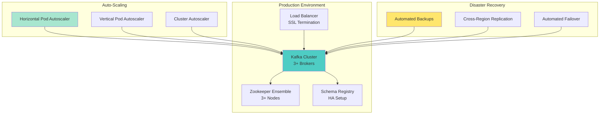
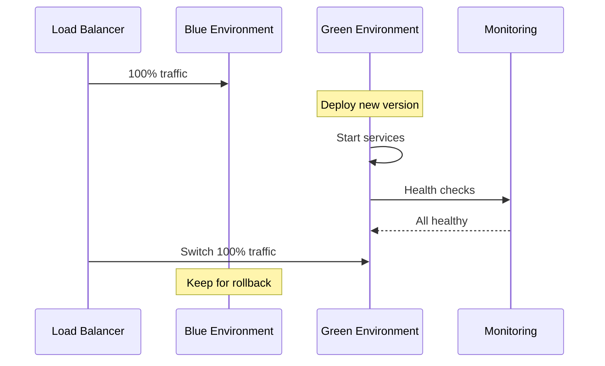
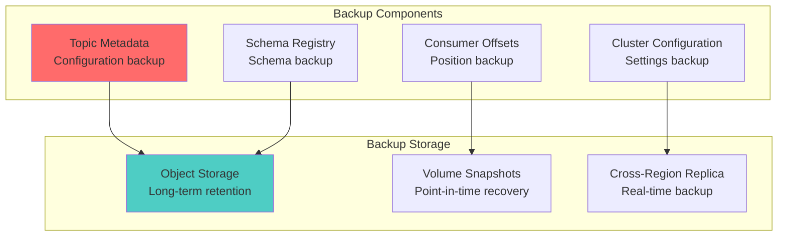

# Lesson 20: Deployment & Scaling Best Practices - Production Excellence

## 🎯 Learning Objectives

Master production deployment strategies, auto-scaling, disaster recovery, and operational best practices for enterprise Kafka deployments.

## 🏗️ Production Deployment Architecture



## 🚀 Deployment Strategies

### Blue-Green Deployment



### Rolling Updates
- Zero-downtime deployments
- Gradual instance replacement
- Automatic rollback on failure
- Health check validation

### Canary Deployments
- Small percentage traffic to new version
- Gradual traffic increase
- Metric-based promotion
- Automated rollback triggers

## 📈 Auto-Scaling Strategies

### Horizontal Scaling

**Kafka Broker Scaling**
```yaml
apiVersion: autoscaling/v2
kind: HorizontalPodAutoscaler
metadata:
  name: kafka-broker-hpa
spec:
  scaleTargetRef:
    apiVersion: apps/v1
    kind: StatefulSet
    name: kafka-broker
  minReplicas: 3
  maxReplicas: 10
  metrics:
  - type: Resource
    resource:
      name: cpu
      target:
        type: Utilization
        averageUtilization: 70
  - type: Pods
    pods:
      metric:
        name: kafka_server_network_io_rate
      target:
        type: AverageValue
        averageValue: "1000"
```

### Consumer Scaling

**Consumer Group Auto-Scaling**
```yaml
apiVersion: autoscaling/v2
kind: HorizontalPodAutoscaler
metadata:
  name: order-consumer-hpa
spec:
  scaleTargetRef:
    apiVersion: apps/v1
    kind: Deployment
    name: order-consumer
  minReplicas: 2
  maxReplicas: 20
  metrics:
  - type: External
    external:
      metric:
        name: kafka_consumer_lag_max
        selector:
          matchLabels:
            consumer_group: order-processors
      target:
        type: AverageValue
        averageValue: "1000"
```

### Custom Metrics Scaling

```yaml
# Custom metric for scaling based on message rate
- type: External
  external:
    metric:
      name: kafka_messages_per_second
    target:
      type: AverageValue
      averageValue: "5000"

# Scale based on error rate
- type: External
  external:
    metric:
      name: kafka_error_rate
    target:
      type: AverageValue
      averageValue: "0.01"
```

## 🛡️ Disaster Recovery

### Backup Strategy



### Recovery Procedures

**Automated Recovery Script**
```bash
#!/bin/bash
# disaster-recovery.sh

# 1. Restore cluster metadata
kubectl apply -f kafka-cluster-backup.yaml

# 2. Restore topic configurations
./restore-topics.sh --backup-location s3://kafka-backups/topics/

# 3. Restore consumer offsets
./restore-offsets.sh --backup-location s3://kafka-backups/offsets/

# 4. Validate cluster health
./health-check.sh --cluster kafka-prod

# 5. Resume applications
kubectl scale deployment order-service --replicas=5
```

## 🔧 Infrastructure as Code

### Terraform Configuration

```hcl
# Kafka cluster infrastructure
resource "aws_msk_cluster" "kafka_cluster" {
  cluster_name           = "kafka-production"
  kafka_version         = "2.8.1"
  number_of_broker_nodes = 6

  broker_node_group_info {
    instance_type   = "kafka.m5.xlarge"
    ebs_volume_size = 1000
    client_subnets = [
      aws_subnet.private_a.id,
      aws_subnet.private_b.id,
      aws_subnet.private_c.id,
    ]
    security_groups = [aws_security_group.kafka.id]
  }

  configuration_info {
    arn      = aws_msk_configuration.kafka_config.arn
    revision = aws_msk_configuration.kafka_config.latest_revision
  }

  encryption_info {
    encryption_in_transit {
      client_broker = "TLS"
      in_cluster    = true
    }
    encryption_at_rest_kms_key_id = aws_kms_key.kafka.arn
  }

  logging_info {
    broker_logs {
      cloudwatch_logs {
        enabled   = true
        log_group = aws_cloudwatch_log_group.kafka.name
      }
      s3 {
        enabled = true
        bucket  = aws_s3_bucket.kafka_logs.bucket
        prefix  = "logs/kafka"
      }
    }
  }

  tags = {
    Environment = "production"
    Team        = "platform"
  }
}
```

### Kubernetes Deployment

```yaml
# Kafka StatefulSet
apiVersion: apps/v1
kind: StatefulSet
metadata:
  name: kafka-broker
spec:
  serviceName: kafka-headless
  replicas: 6
  template:
    spec:
      containers:
      - name: kafka
        image: confluentinc/cp-kafka:7.4.0
        resources:
          requests:
            memory: "4Gi"
            cpu: "2"
          limits:
            memory: "8Gi"
            cpu: "4"
        env:
        - name: KAFKA_BROKER_ID
          valueFrom:
            fieldRef:
              fieldPath: metadata.annotations['kafka.broker.id']
        - name: KAFKA_ZOOKEEPER_CONNECT
          value: "zookeeper:2181"
        - name: KAFKA_LISTENERS
          value: "PLAINTEXT://0.0.0.0:9092,SSL://0.0.0.0:9093"
        volumeMounts:
        - name: kafka-storage
          mountPath: /var/lib/kafka/data
  volumeClaimTemplates:
  - metadata:
      name: kafka-storage
    spec:
      accessModes: ["ReadWriteOnce"]
      storageClassName: "fast-ssd"
      resources:
        requests:
          storage: 1Ti
```

## 📊 Performance Optimization

### Resource Allocation

```yaml
# Production-tuned configuration
resources:
  requests:
    memory: "8Gi"     # Minimum for production
    cpu: "4"          # Minimum CPU cores
  limits:
    memory: "16Gi"    # Allow burst capacity
    cpu: "8"          # Maximum CPU usage

# JVM tuning
env:
- name: KAFKA_HEAP_OPTS
  value: "-Xmx6g -Xms6g"
- name: KAFKA_JVM_PERFORMANCE_OPTS
  value: "-XX:+UseG1GC -XX:MaxGCPauseMillis=20 -XX:+DisableExplicitGC"
```

### Storage Optimization

```yaml
# High-performance storage
volumeClaimTemplates:
- metadata:
    name: kafka-storage
  spec:
    accessModes: ["ReadWriteOnce"]
    storageClassName: "premium-ssd"
    resources:
      requests:
        storage: 2Ti
```

## 🔍 Health Checks & Probes

### Comprehensive Health Checks

```yaml
# Liveness probe
livenessProbe:
  exec:
    command:
    - /bin/bash
    - -c
    - "kafka-broker-api-versions --bootstrap-server localhost:9092"
  initialDelaySeconds: 60
  periodSeconds: 30
  timeoutSeconds: 10

# Readiness probe  
readinessProbe:
  exec:
    command:
    - /bin/bash
    - -c
    - "kafka-topics --bootstrap-server localhost:9092 --list"
  initialDelaySeconds: 30
  periodSeconds: 10
  timeoutSeconds: 5

# Startup probe
startupProbe:
  exec:
    command:
    - /bin/bash
    - -c
    - "test -f /var/lib/kafka/data/.kafka_health"
  initialDelaySeconds: 10
  periodSeconds: 5
  failureThreshold: 30
```

## 🎯 Best Practices Summary

### **Deployment Excellence**
✅ **Infrastructure as Code** - Version-controlled, repeatable deployments  
✅ **Zero-Downtime Updates** - Blue-green and rolling deployment strategies  
✅ **Automated Scaling** - HPA based on Kafka-specific metrics  
✅ **Disaster Recovery** - Automated backup and recovery procedures  

### **Operational Excellence**
✅ **Comprehensive Monitoring** - Metrics, logs, traces, and alerting  
✅ **Performance Optimization** - Resource tuning and capacity planning  
✅ **Security Implementation** - SSL/TLS, authentication, and authorization  
✅ **Documentation** - Runbooks, procedures, and troubleshooting guides  

## 🎉 **CONGRATULATIONS!**

You've completed the comprehensive **Kafka Mastery Curriculum**! You now have the expertise to:

🎯 **Design** enterprise-grade event-driven architectures  
🏗️ **Build** production-ready Kafka applications  
🚀 **Deploy** scalable, secure, and reliable systems  
📊 **Monitor** and operate Kafka clusters with confidence  
🛡️ **Secure** systems with enterprise-grade security  
⚡ **Scale** to handle millions of events per second  

## 🌟 **Welcome to Kafka Mastery!**

You're now ready to build the next generation of real-time, event-driven systems. Go forth and create amazing applications! 🚀

---

*"The expert in anything was once a beginner. You've now mastered one of the most important technologies in modern software architecture. Time to change the world with event-driven systems!"*