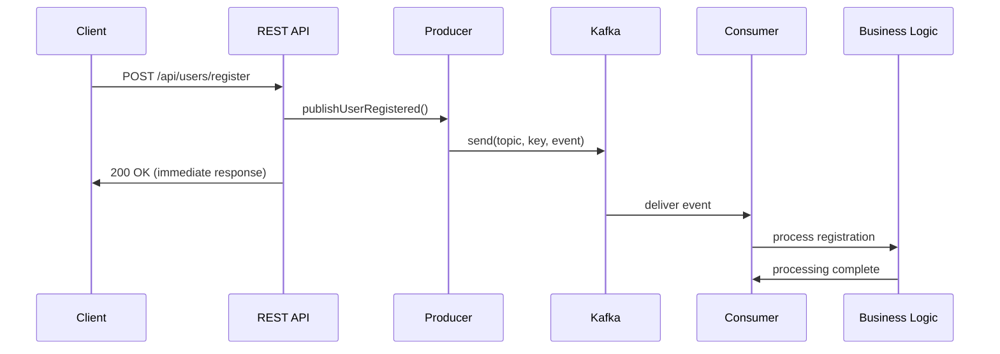

# Lesson 3: Hello Kafka - Spring Boot Producer & Consumer Fundamentals

## 🎯 Objective

Build your first Kafka application using Spring Boot and Kotlin, demonstrating the fundamental producer-consumer pattern with JSON message serialization.

## 🧱 Core Components

### 1. **Event Model**
The foundation of event-driven systems is well-defined events.

```kotlin
data class UserRegisteredEvent(
    val userId: String,
    val email: String,
    val timestamp: Instant = Instant.now(),
    val source: String
)
```

**Key Principles:**
- **Immutable** - Events represent facts that happened
- **Self-contained** - Include all necessary information
- **Timestamped** - Always include when it happened
- **Sourced** - Track where the event originated

### 2. **Producer Pattern**
Producers publish events to Kafka topics.

```kotlin
@Service
class UserEventProducer(
    private val kafkaTemplate: KafkaTemplate<String, UserRegisteredEvent>
) {
    fun publishUserRegistered(event: UserRegisteredEvent) {
        kafkaTemplate.send("user-registration", event.userId, event)
    }
}
```

**Key Concepts:**
- **Topic** - Logical channel for related events
- **Key** - Ensures related events go to same partition
- **Async by default** - Non-blocking event publishing
- **Template pattern** - Spring's abstraction over Kafka producer

### 3. **Consumer Pattern**
Consumers subscribe to topics and process events.

```kotlin
@Service
class UserEventConsumer {
    
    @KafkaListener(topics = ["user-registration"])
    fun handleUserRegistered(event: UserRegisteredEvent) {
        // Process the event
        logger.info("Processing user registration: ${event.userId}")
    }
}
```

**Key Concepts:**
- **@KafkaListener** - Annotation-driven consumption
- **Automatic deserialization** - JSON to Kotlin objects
- **Error handling** - Built-in retry and error handling
- **Concurrent processing** - Multiple consumers for scalability

## 🔧 Spring Boot Integration

### Configuration Strategy

Spring Boot provides excellent Kafka auto-configuration:

```yaml
spring:
  kafka:
    bootstrap-servers: localhost:9092
    producer:
      key-serializer: org.apache.kafka.common.serialization.StringSerializer
      value-serializer: org.springframework.kafka.support.serializer.JsonSerializer
    consumer:
      group-id: kafka-starter-app
      key-deserializer: org.apache.kafka.common.serialization.StringDeserializer
      value-deserializer: org.springframework.kafka.support.serializer.JsonDeserializer
      properties:
        spring.json.trusted.packages: com.learning.KafkaStarter.model
```

**Configuration Highlights:**
- **Bootstrap servers** - Initial connection points
- **Serializers** - Convert objects to bytes for network transfer
- **Consumer group** - Logical grouping for load balancing
- **Trusted packages** - Security for JSON deserialization

### Bean Configuration

```kotlin
@Configuration
class KafkaConfig {
    
    @Bean
    fun kafkaTemplate(): KafkaTemplate<String, Any> {
        return KafkaTemplate(producerFactory())
    }
    
    @Bean
    fun producerFactory(): ProducerFactory<String, Any> {
        return DefaultKafkaProducerFactory(producerConfigs())
    }
}
```

## 📊 Message Flow



**Flow Characteristics:**
- **Asynchronous** - API responds before event processing
- **Decoupled** - Producer doesn't know about consumers
- **Reliable** - Kafka guarantees event delivery
- **Scalable** - Multiple consumers can process events

## 🎯 Key Benefits

### 1. **Loose Coupling**
Services only depend on event contracts, not each other.

```kotlin
// Producer only knows about events
producer.publishUserRegistered(event)

// Consumer only knows about events  
@KafkaListener(topics = ["user-registration"])
fun handleUserRegistered(event: UserRegisteredEvent)
```

### 2. **Async Processing**
Long-running operations don't block API responses.

```kotlin
@PostMapping("/register")
fun registerUser(@RequestBody request: RegisterRequest): ResponseEntity<*> {
    // Publish event (fast)
    producer.publishUserRegistered(toEvent(request))
    
    // Return immediately
    return ResponseEntity.ok("Registration initiated")
}
```

### 3. **Scalability**
Add consumers without changing producers.

```yaml
# Scale consumers independently
replicas: 5  # 5 consumer instances
```

### 4. **Reliability**
Events are persisted and can be replayed.

```kotlin
// Events survive consumer failures
@KafkaListener(topics = ["user-registration"])
fun handleUserRegistered(event: UserRegisteredEvent) {
    try {
        processRegistration(event)
    } catch (e: Exception) {
        // Event will be retried
        throw e
    }
}
```

## 🛡️ Error Handling

### Producer Error Handling

```kotlin
fun publishUserRegistered(event: UserRegisteredEvent) {
    kafkaTemplate.send("user-registration", event.userId, event)
        .thenAccept { result ->
            logger.info("Event published successfully")
        }
        .exceptionally { failure ->
            logger.error("Failed to publish event", failure)
            // Handle failure (retry, alert, etc.)
            null
        }
}
```

### Consumer Error Handling

```kotlin
@KafkaListener(topics = ["user-registration"])
fun handleUserRegistered(event: UserRegisteredEvent) {
    try {
        processRegistration(event)
    } catch (retryableException: RetryableException) {
        // Will be retried automatically
        throw retryableException
    } catch (poisonException: PoisonMessageException) {
        // Log and skip
        logger.error("Poison message", poisonException)
    }
}
```

## 🔍 JSON Serialization

### Why JSON?
- **Human readable** - Easy to debug and inspect
- **Schema flexible** - Add fields without breaking consumers
- **Tool friendly** - Works with Kafka UI, curl, etc.
- **Cross-language** - Any language can consume

### Schema Evolution

```kotlin
// Version 1
data class UserRegisteredEvent(
    val userId: String,
    val email: String
)

// Version 2 - backward compatible
data class UserRegisteredEvent(
    val userId: String,
    val email: String,
    val firstName: String? = null,  // Optional field
    val lastName: String? = null    // Optional field
)
```

## 📊 Monitoring & Debugging

### Application Metrics

```kotlin
@Component
class UserEventMetrics {
    private val registrationCounter = Counter.builder("user.registration.events")
        .description("Total user registration events")
        .register(Metrics.globalRegistry)
    
    fun incrementRegistrationEvent() {
        registrationCounter.increment()
    }
}
```

### Logging Best Practices

```kotlin
@KafkaListener(topics = ["user-registration"])
fun handleUserRegistered(event: UserRegisteredEvent) {
    logger.info("Processing user registration: userId=${event.userId}, email=${event.email}")
    
    try {
        processRegistration(event)
        logger.info("Successfully processed user registration: userId=${event.userId}")
    } catch (e: Exception) {
        logger.error("Failed to process user registration: userId=${event.userId}", e)
        throw e
    }
}
```

## 🧪 Testing Strategies

### Unit Testing

```kotlin
@Test
fun `should publish user registration event`() {
    val event = UserRegisteredEvent("user123", "test@example.com", "web")
    
    producer.publishUserRegistered(event)
    
    verify(kafkaTemplate).send("user-registration", "user123", event)
}
```

### Integration Testing

```kotlin
@SpringBootTest
@EmbeddedKafka(topics = ["user-registration"])
class UserEventIntegrationTest {
    
    @Test
    fun `should process user registration end-to-end`() {
        // Publish event
        producer.publishUserRegistered(event)
        
        // Verify consumer processed it
        await().atMost(Duration.ofSeconds(5))
            .until { processedEvents.contains(event.userId) }
    }
}
```

## ✅ Best Practices

### 1. **Event Design**
- Use past tense names (`UserRegistered`, not `RegisterUser`)
- Include all necessary context
- Make events immutable
- Version your events

### 2. **Topic Naming**
- Use kebab-case (`user-registration`)
- Include business context
- Consider retention policies
- Plan for multiple environments

### 3. **Consumer Safety**
- Make consumers idempotent
- Handle poison messages
- Use appropriate error handling
- Monitor consumer lag

### 4. **Producer Reliability**
- Handle send failures
- Use appropriate acknowledgment settings
- Consider message ordering requirements
- Monitor producer metrics

## 🚀 What's Next?

You've built your first Kafka application! This foundational pattern will scale to:

- **Multiple topics** - Different event types
- **Consumer groups** - Load balancing and fault tolerance  
- **Schema registry** - Structured data with evolution
- **Stream processing** - Real-time event transformation

Next up: [Lesson 4: Topics, Partitions & Offsets](../lesson_4/concept.md) - dive deeper into Kafka's storage model.

---

*Congratulations! You've just implemented the core pattern used in production Kafka applications. The producer-consumer model you've learned scales from simple notifications to complex event-driven architectures.*