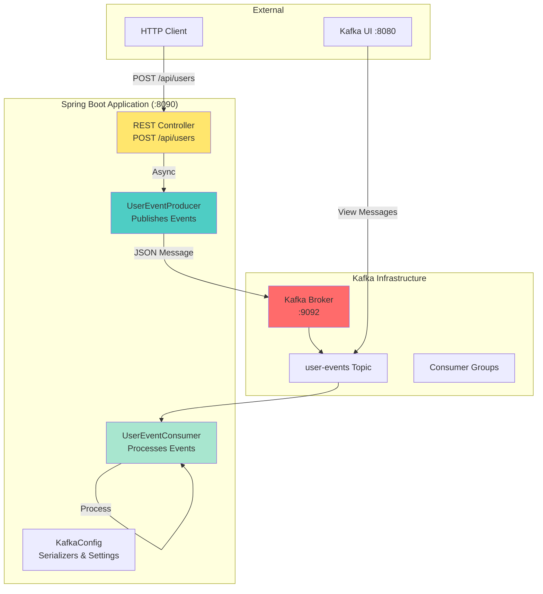
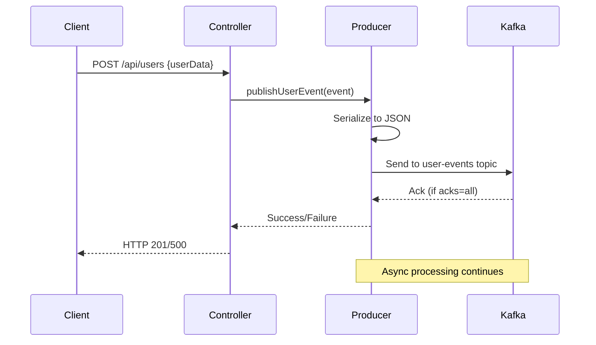
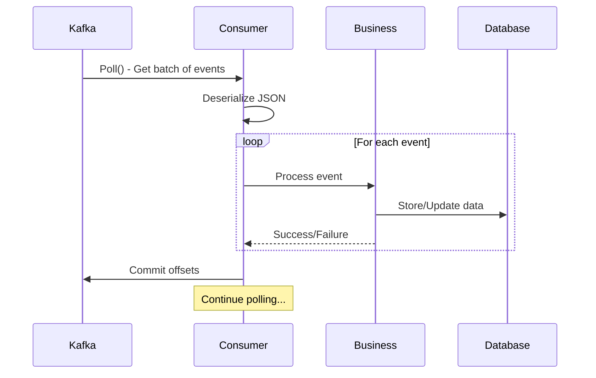
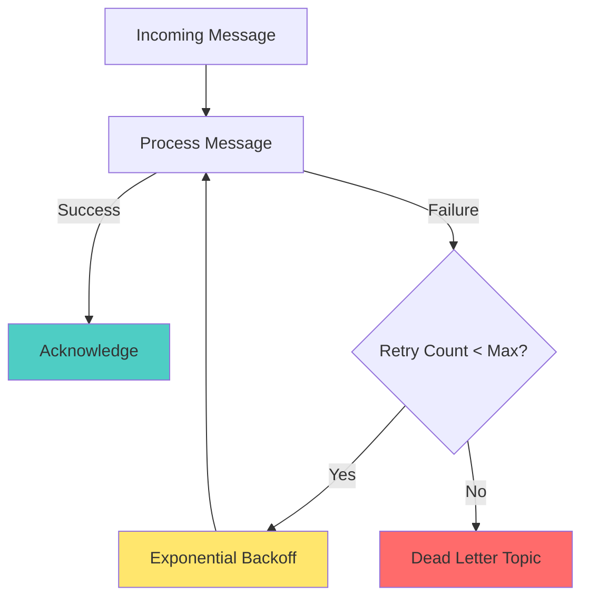
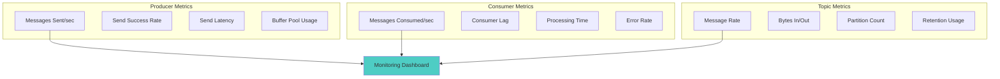

# Concept

## First Producer/Consumer - Hello Kafka with Spring Boot


## 🎯 Learning Objectives

By the end of this lesson, you will:
- **Build** your first Kafka application using Spring Boot and Kotlin
- **Implement** both producer and consumer patterns with proper configuration
- **Understand** JSON serialization and deserialization with Spring Kafka
- **Apply** error handling and retry strategies for robust messaging
- **Monitor** message flow through Kafka topics and consumer groups
- **Test** end-to-end event flow with REST APIs and integration tests

## 🏗️ Application Architecture

Our first Kafka application demonstrates the core producer-consumer pattern:



## 🔄 Event Flow Deep Dive

### Producer Flow


### Consumer Flow


## 🛠️ Spring Boot Kafka Integration

### Dependency Configuration

```kotlin
dependencies {
    implementation("org.springframework.boot:spring-boot-starter-web")
    implementation("org.springframework.kafka:spring-kafka")
    implementation("com.fasterxml.jackson.module:jackson-module-kotlin")
}
```

### Application Configuration

```yaml
spring:
  kafka:
    bootstrap-servers: localhost:9092
    producer:
      key-serializer: org.apache.kafka.common.serialization.StringSerializer
      value-serializer: org.springframework.kafka.support.serializer.JsonSerializer
      acks: all
      retries: 3
    consumer:
      group-id: user-service-group
      key-deserializer: org.apache.kafka.common.serialization.StringDeserializer
      value-deserializer: org.springframework.kafka.support.serializer.JsonDeserializer
      auto-offset-reset: earliest
      properties:
        spring.json.trusted.packages: "com.learning.KafkaStarter.model"
```

## 📊 Event Model Design

### User Event Structure
```kotlin
data class UserEvent(
    val eventId: String,
    val eventType: String, // USER_CREATED, USER_UPDATED, USER_DELETED
    val userId: String,
    val username: String,
    val email: String,
    val timestamp: Long = Instant.now().toEpochMilli(),
    val metadata: Map<String, Any> = emptyMap()
)
```

### JSON Serialization Example
```json
{
  "eventId": "user-evt-123",
  "eventType": "USER_CREATED",
  "userId": "user-456",
  "username": "john_doe",
  "email": "john@example.com",
  "timestamp": 1645123456789,
  "metadata": {
    "source": "web-ui",
    "version": "1.0"
  }
}
```

## 🚀 Producer Implementation Patterns

### KafkaTemplate Usage
```kotlin
@Service
class UserEventProducer(
    private val kafkaTemplate: KafkaTemplate<String, UserEvent>
) {
    fun publishUserEvent(event: UserEvent): CompletableFuture<SendResult<String, UserEvent>> {
        return kafkaTemplate.send("user-events", event.userId, event)
    }
}
```

### Error Handling & Callbacks
```kotlin
fun publishWithCallback(event: UserEvent) {
    kafkaTemplate.send("user-events", event.userId, event)
        .whenComplete { result, throwable ->
            if (throwable == null) {
                val metadata = result.recordMetadata
                logger.info("Event sent: topic=${metadata.topic()}, " +
                    "partition=${metadata.partition()}, offset=${metadata.offset()}")
            } else {
                logger.error("Failed to send event: ${event.eventId}", throwable)
            }
        }
}
```

## 🎯 Consumer Implementation Patterns

### @KafkaListener Annotation
```kotlin
@Service
class UserEventConsumer {
    
    @KafkaListener(topics = ["user-events"])
    fun handleUserEvent(
        @Payload event: UserEvent,
        @Header(KafkaHeaders.RECEIVED_TOPIC) topic: String,
        @Header(KafkaHeaders.RECEIVED_PARTITION_ID) partition: Int,
        @Header(KafkaHeaders.OFFSET) offset: Long
    ) {
        logger.info("Processing event: ${event.eventId} from $topic:$partition:$offset")
        processUserEvent(event)
    }
}
```

### Manual Acknowledgment (Advanced)
```kotlin
@KafkaListener(
    topics = ["user-events"],
    containerFactory = "manualAckContainerFactory"
)
fun handleWithManualAck(
    @Payload event: UserEvent,
    acknowledgment: Acknowledgment
) {
    try {
        processUserEvent(event)
        acknowledgment.acknowledge() // Manual commit
    } catch (e: Exception) {
        logger.error("Failed to process event: ${event.eventId}", e)
        // Don't acknowledge - message will be retried
    }
}
```

## 🔧 Configuration Deep Dive

### Producer Configuration Options
```kotlin
@Configuration
class KafkaProducerConfig {
    
    @Bean
    fun kafkaTemplate(): KafkaTemplate<String, Any> {
        val props = mapOf(
            ProducerConfig.BOOTSTRAP_SERVERS_CONFIG to "localhost:9092",
            ProducerConfig.KEY_SERIALIZER_CLASS_CONFIG to StringSerializer::class.java,
            ProducerConfig.VALUE_SERIALIZER_CLASS_CONFIG to JsonSerializer::class.java,
            ProducerConfig.ACKS_CONFIG to "all",
            ProducerConfig.RETRIES_CONFIG to 3,
            ProducerConfig.ENABLE_IDEMPOTENCE_CONFIG to true,
            ProducerConfig.MAX_IN_FLIGHT_REQUESTS_PER_CONNECTION to 1
        )
        
        return KafkaTemplate(DefaultKafkaProducerFactory(props))
    }
}
```

### Consumer Configuration Options
```kotlin
@Configuration
class KafkaConsumerConfig {
    
    @Bean
    fun consumerFactory(): ConsumerFactory<String, UserEvent> {
        val props = mapOf(
            ConsumerConfig.BOOTSTRAP_SERVERS_CONFIG to "localhost:9092",
            ConsumerConfig.GROUP_ID_CONFIG to "user-service-group",
            ConsumerConfig.KEY_DESERIALIZER_CLASS_CONFIG to StringDeserializer::class.java,
            ConsumerConfig.VALUE_DESERIALIZER_CLASS_CONFIG to JsonDeserializer::class.java,
            ConsumerConfig.AUTO_OFFSET_RESET_CONFIG to "earliest",
            ConsumerConfig.ENABLE_AUTO_COMMIT_CONFIG to true,
            ConsumerConfig.AUTO_COMMIT_INTERVAL_MS_CONFIG to 1000,
            JsonDeserializer.TRUSTED_PACKAGES to "com.learning.KafkaStarter.model"
        )
        
        return DefaultKafkaConsumerFactory(props)
    }
}
```

## 🛡️ Error Handling Strategies

### Retry Configuration


### Exception Handling
```kotlin
@KafkaListener(topics = ["user-events"])
fun handleUserEvent(event: UserEvent) {
    try {
        processUserEvent(event)
    } catch (e: RetryableException) {
        logger.warn("Retryable error processing ${event.eventId}", e)
        throw e // Let Spring Kafka retry
    } catch (e: NonRetryableException) {
        logger.error("Non-retryable error processing ${event.eventId}", e)
        // Log and move on - don't retry
    }
}
```

## 📊 Monitoring & Observability

### Key Metrics to Track


### Health Check Implementation
```kotlin
@Component
class KafkaHealthIndicator : HealthIndicator {
    
    @Autowired
    private lateinit var kafkaAdmin: KafkaAdmin
    
    override fun health(): Health {
        return try {
            AdminClient.create(kafkaAdmin.configurationProperties).use { client ->
                val metadata = client.describeCluster()
                val brokers = metadata.nodes().get(5, TimeUnit.SECONDS)
                
                if (brokers.isNotEmpty()) {
                    Health.up()
                        .withDetail("brokers", brokers.size)
                        .withDetail("clusterId", metadata.clusterId().get())
                        .build()
                } else {
                    Health.down().withDetail("reason", "No brokers available").build()
                }
            }
        } catch (e: Exception) {
            Health.down(e).build()
        }
    }
}
```

## 🧪 Testing Strategies

### Integration Testing with Embedded Kafka
```kotlin
@SpringBootTest
@EmbeddedKafka(partitions = 1, topics = ["user-events"])
class UserEventIntegrationTest {
    
    @Autowired
    private lateinit var userEventProducer: UserEventProducer
    
    @Test
    fun `should send and receive user event`() {
        val event = UserEvent(
            eventId = "test-123",
            eventType = "USER_CREATED",
            userId = "user-456",
            username = "testuser",
            email = "test@example.com"
        )
        
        userEventProducer.publishUserEvent(event)
        
        // Assert event was consumed and processed
        // (Implementation depends on your consumer logic)
    }
}
```

## 🎯 Best Practices

### Message Design
- **Use meaningful event types** (USER_CREATED vs CREATED)
- **Include correlation IDs** for tracing
- **Add timestamps** for temporal ordering
- **Version your messages** for schema evolution
- **Keep events immutable** and self-contained

### Producer Best Practices
- **Use idempotent producers** (`enable.idempotence=true`)
- **Configure appropriate `acks`** level for durability
- **Handle send failures** gracefully
- **Use message keys** for partition assignment
- **Monitor send metrics** for performance

### Consumer Best Practices
- **Design idempotent consumers** - handle duplicate messages
- **Use consumer groups** for parallel processing
- **Handle deserialization errors** gracefully
- **Monitor consumer lag** for performance
- **Implement proper error handling** and retry logic

## ✅ Success Criteria

You've mastered this lesson when you can:
- [ ] Configure Spring Boot with Kafka dependencies
- [ ] Implement a producer that sends JSON events
- [ ] Implement a consumer that processes events
- [ ] Handle serialization/deserialization correctly
- [ ] Add proper error handling and monitoring
- [ ] Test the complete flow end-to-end
- [ ] Monitor events through Kafka UI

## 🚀 What's Next?

Now that you can produce and consume events, let's dive deeper into Kafka's storage model!

**Next**: [Lesson 4 - Topics, Partitions & Offsets](../lesson_4/concept.md) where you'll master how Kafka stores and distributes your events for optimal performance and scalability.

---

*"Your first Kafka application is running! You've crossed the threshold from theory to practice. Now let's optimize how your events are stored and processed."*