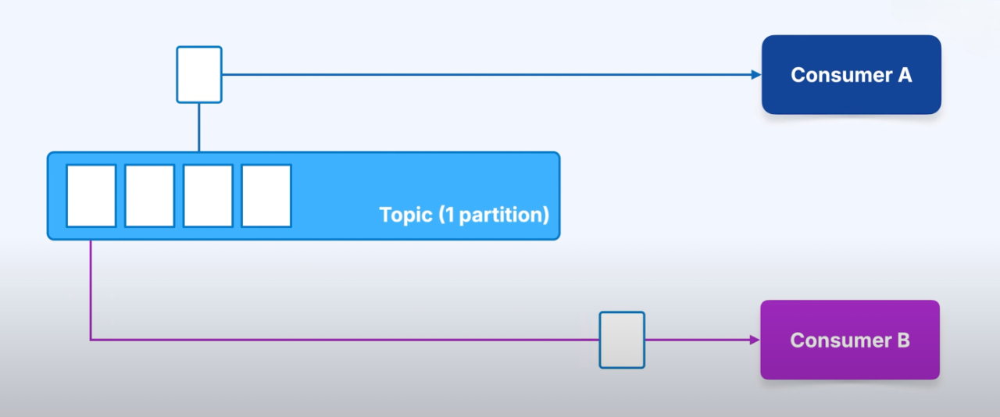

# Consumers

#### 🔹 What is a Consumer?
- A consumer is a client that reads messages from Kafka topics.
- You use the KafkaConsumer class (in Java) or Spring Boot integrations to connect to a Kafka cluster.
- Consumers usually process, store, or forward the messages they read.

#### 🔹 Connecting a Consumer
- A consumer needs bootstrap servers (addresses of brokers) to connect.

- You don’t need to list all brokers. Just one (or a few) is enough → Kafka will discover the rest.

#### 🔹 Subscribing to Topics
- Consumers must subscribe to one or more topics.

You can:

```kotlin
Subscribe to a single topic: subscribe(listOf("topicA"))

Subscribe to multiple topics: subscribe(listOf("topicA", "topicB"))

Subscribe with regex: subscribe(listOf("topic-.*"))
```

---

#### 🔹 Infinite Loop & Polling

  - Consumers run in an infinite loop.
  - They call poll() to check if there are new messages.
  - Since Kafka is streaming, there is no “last message”.

#### 🔹 Consumer Records
- poll() returns a batch of messages called ConsumerRecords.
- Each record/topic has:
    - key
    - value
    - partition
    - offset
    - timestamp
    - optional headers

Most of the time, you care about key + value.

----

#### 🔹 Kafka is a Log, Not a Queue
- Consuming a message does not remove it from Kafka.
- Multiple consumers can read the same messages independently.
- Example: Consumer A and Consumer B can both read the same topic data.

🔹 Offsets & Commits
- Kafka tracks where each consumer is in the log using an offset.
- After processing a message, the consumer commits its offset back to Kafka.
- Offsets are stored in an internal topic (__consumer_offsets).
- If a consumer crashes and restarts, it can resume from its last committed offset.

💡 Offsets are not committed after every message (too slow).
They are usually committed in batches (based on time or count).

---

#### 🔹 Scaling with Consumer Groups


  - Consumer groups allow multiple consumers to share the work.


- Kafka assigns partitions to consumers in a group:
    - Each partition is read by only one consumer in the group.
    - More consumers → more parallelism.

Example:

- Topic has 3 partitions.
- Group has 2 consumers.
- Kafka will assign partitions (like P0+P1 → Consumer A, P2 → Consumer B).

⚠️ Each consumer is single-threaded. To scale, add more consumers or increase concurrency.

#### Auto balancing when failure


---

✅ Summary

- Consumers read data from topics.
- They subscribe to topics and poll for new messages in a loop.
- Messages are not deleted when consumed → multiple consumers can read the same data.
- Kafka tracks progress with offsets (committed to an internal topic).
- Consumers can scale with consumer groups → partitions are divided among consumers.