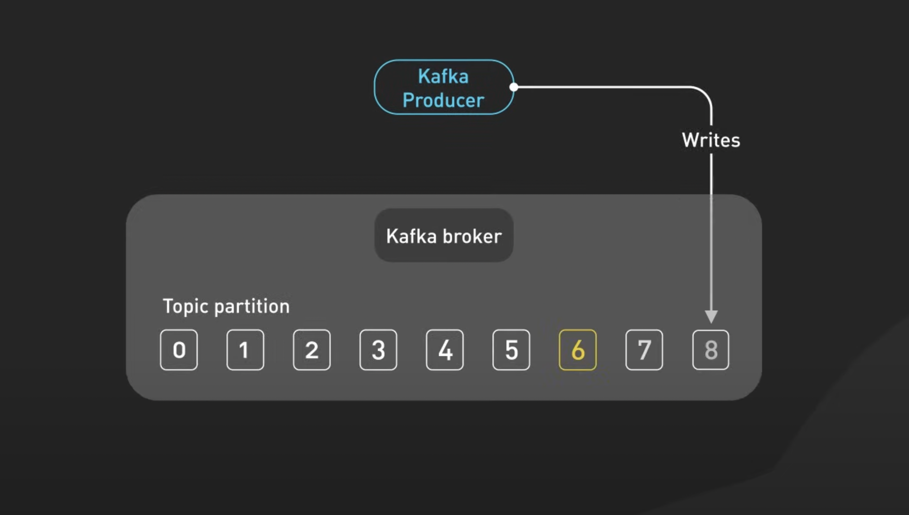
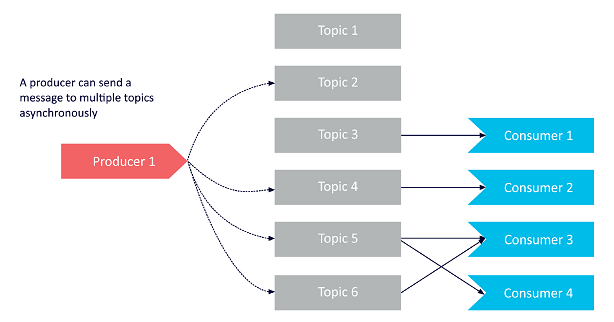
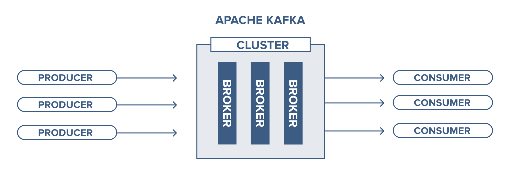

# Producers

In Kafka, producers are client applications responsible for writing data into a Kafka cluster.
- Brokers handle storage, replication, and partition management.
- Producers send messages (key–value pairs) into topics.

Any application that sends data to Kafka—whether a microservice, IoT device, or a data pipeline—is considered a producer.

---

### 🧩 Producer Basics

- Producers connect to Kafka and publish events.
- Events are just key–value pairs stored as bytes inside Kafka.
- Kafka takes care of the heavy lifting:
  - Networking
  - Batching
  - Retries
  - Acknowledgments
  - Idempotency (avoid duplicates)
  - Partitioning

---

### 🔧 Producer API

Kafka offers a simple but powerful API, available in many languages:
    - Java (native, features appear here first)
    - Python, Go, JavaScript, .NET
    - Community drivers for many others

### Core Classes

1. KafkaProducer
   - Manages the connection to the cluster.
   - Handles sending messages.

2. ProducerRecord
   - Represents the message (topic, key, value).
   - Can also include: partition, timestamp, headers.

---

### ⚙️ Configuring a Producer

Producers require a set of properties (key–value pairs) such as:
- bootstrap.servers → List of broker addresses.
  - Only a few are needed (for discovery).
- acks → Level of acknowledgment required:
  - 0 → No ack (fastest, unsafe)
  - 1 → Leader only
  - all → Strongest guarantee (leader + replicas)
- Serializers → Convert keys and values into bytes.
  - Built-in: StringSerializer, IntegerSerializer, LongSerializer, etc.

---

### ✨ Summary
- Producers are how data enters Kafka.
- They are simple to use but handle complex concerns like retries, batching, partitioning, and acknowledgments.
- With correct configs + serialization, producers make your event pipeline reliable and scalable.