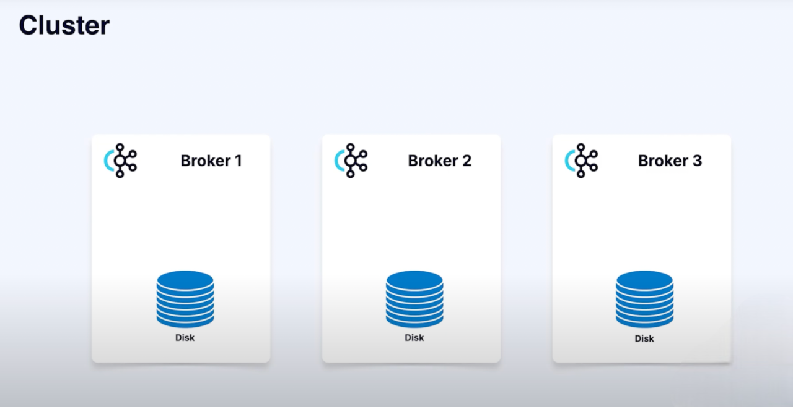
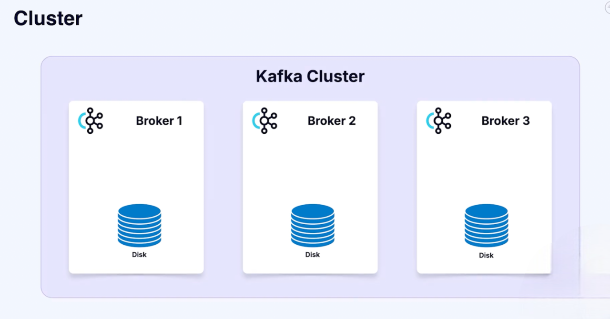
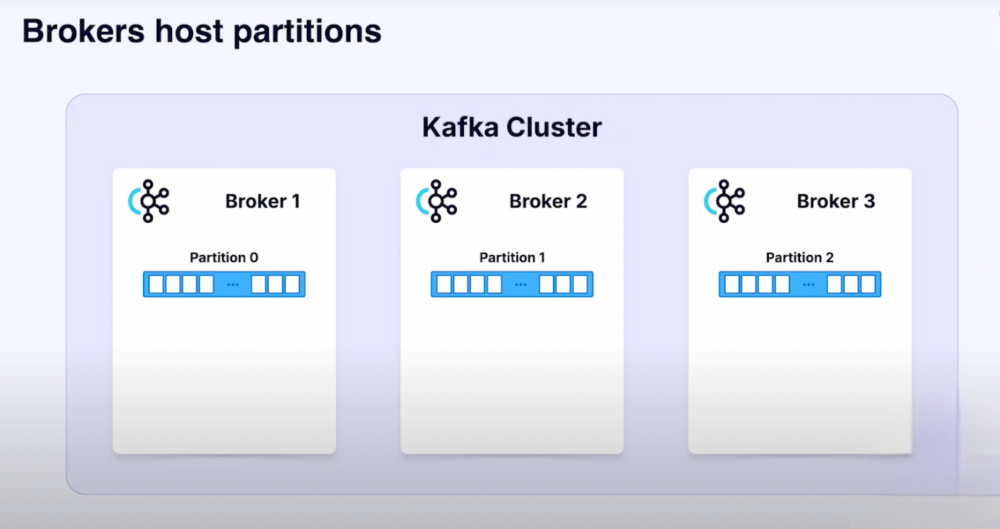
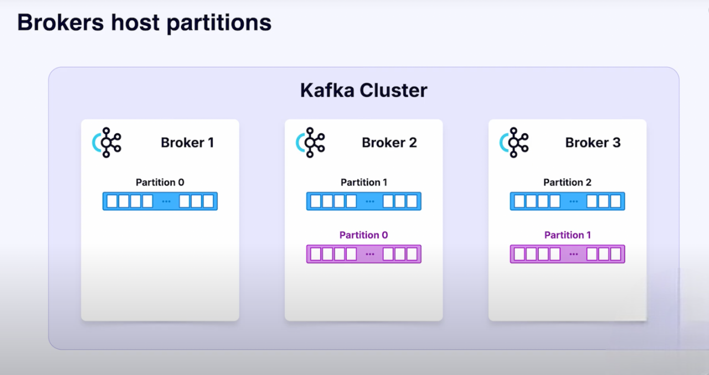
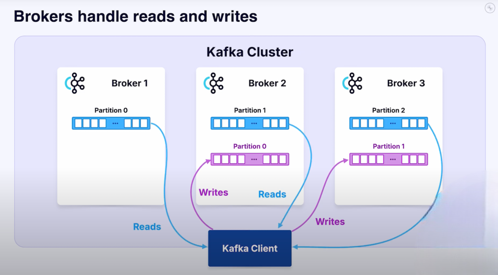
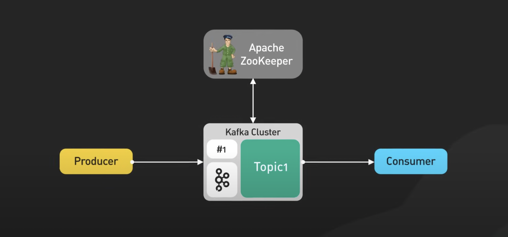
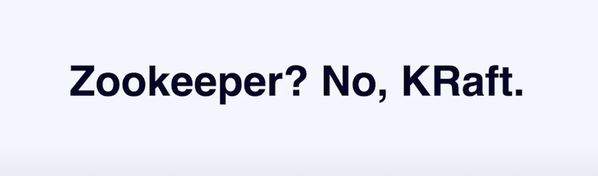

## Brokers

We’ve talked about **events**, **topics**, and **partitions**.  
Now let’s meet the actual **machines that do the work**: the **brokers**.

- A **broker** is a machine running the Kafka server process.
- You can run brokers on:
    - Physical servers (with blinking lights).
    - Cloud instances.
    - Even Raspberry Pi modules.
- Each broker stores data (usually on SSDs) and handles requests.

---

## Running Brokers
- Download Kafka → run the server process on the JVM.
- Or use **Docker / Docker Compose** → spin up multiple brokers.

- In managed services (e.g., **Confluent Cloud**), brokers are abstracted away:
    - You don’t see them.
    - You just work with **topics, messages, and connectors**.

---

## Brokers in a Cluster
- A cluster usually has **multiple brokers** (e.g., 3).
- Each broker hosts **partitions** from topics.

- Example:
    - Topic A → 3 partitions → spread across 3 brokers.
    - Topic B → 2 partitions → stored on 2 brokers.

This distribution is how Kafka scales.

---

## What Do Brokers Do?
- Handle **client requests**:
    - Writing messages to partitions.
    - Reading messages from partitions.

- Manage **replication**.
- Maintain **metadata** about the cluster.

👉 In short, brokers **broker the requests** between client applications and Kafka storage.

---

## ZooKeeper in Kafka

#### Did ZooKeeper Control Clients and Brokers?
➡️ **No.**  
ZooKeeper was **never** a controller sitting between clients and brokers.  
Clients have always communicated **directly with brokers** for reads and writes.

#### What ZooKeeper Actually Did
ZooKeeper’s role was **metadata management** and **cluster coordination**:

- Track which **brokers are alive**.
- Store **topic and partition metadata** (leaders, replicas, configs).
- Handle **leader election** (deciding which broker is leader for a partition).
- Provide a **consistent view of cluster state** to brokers.

👉 Think of ZooKeeper as the **“cluster manager”**, not a traffic controller.

---

## ZooKeeper vs. KRaft
- **Old Kafka (before 4.0):** Used **Apache ZooKeeper** for cluster metadata.
- **New Kafka (4.0+):** No ZooKeeper needed.
    - Brokers use **KRaft** (Kafka + Raft protocol).
    - Metadata is managed internally by brokers.
    - Cleaner, simpler architecture.

---

## Key Takeaways
- **Broker = machine running Kafka server.**
- Brokers together form a **cluster**.
- They store partitions, handle reads/writes, and manage replication.
- In managed Kafka (e.g., Confluent Cloud), brokers are **hidden from you**.
- Since Kafka 4.0, **KRaft replaces ZooKeeper**.  