# Lesson 4: Topics, Partitions & Offsets - Kafka's Storage Model

## 🎯 Objective

Master Kafka's fundamental storage concepts: topics, partitions, and offsets. Learn how Kafka achieves scalability, ordering guarantees, and fault tolerance through its distributed storage model.

## 🧱 Core Concepts Deep Dive

### 📁 **Topics: Logical Channels**

Topics are **logical categories** for related events, like folders in a file system.

```bash
# Real-world topic examples
user-events          # All user-related activities
order-lifecycle      # Order creation, updates, completion
payment-transactions # Payment processing events
inventory-changes    # Stock level modifications
audit-logs          # Security and compliance events
```

**Topic Characteristics:**
- **Logical grouping** - Events of the same type
- **Unlimited size** - Can store terabytes of data
- **Configurable retention** - Hours to years
- **Schema-aware** - Optional schema enforcement

### 🗂️ **Partitions: Physical Storage Units**

Partitions are the **physical storage and parallelism units** within topics.

```mermaid
graph TB
    subgraph "Topic: user-events"
        P0[Partition 0]
        P1[Partition 1] 
        P2[Partition 2]
    end
    
    subgraph "Partition 0"
        M0[user:123 → register]
        M1[user:456 → login]
        M2[user:123 → update]
    end
    
    subgraph "Partition 1"
        M3[user:789 → register]
        M4[user:234 → logout]
        M5[user:789 → delete]
    end
    
    subgraph "Partition 2"
        M6[user:567 → login]
        M7[user:890 → register]
        M8[user:567 → update]
    end
```



**Partition Benefits:**
- **Scalability** - More partitions = more parallelism
- **Ordering** - Messages within a partition are ordered
- **Distribution** - Partitions spread across different brokers
- **Load balancing** - Multiple consumers can process in parallel

### 🔢 **Offsets: Message Addresses**

Offsets are **unique identifiers** for messages within a partition.

```
Partition 0: user-events
┌─────────────────────────────────────────────────────┐
│ Offset: 0    1    2    3    4    5    6    7    8   │
│ Event:  reg  log  upd  del  log  reg  upd  log  del │
│ User:   123  456  123  789  234  567  123  456  234 │
└─────────────────────────────────────────────────────┘
```

**Offset Characteristics:**
- **Sequential** - Incremental numbers (0, 1, 2, ...)
- **Immutable** - Once assigned, never changes
- **Partition-scoped** - Each partition has independent offset sequence
- **Consumer tracking** - Consumers track their position via offsets

## 🎯 **Message Routing & Partitioning**

### Key-Based Partitioning

```kotlin
// Messages with same key go to same partition
val userEvent = UserEvent(
    userId = "user123",    // Key for partitioning
    action = "login",
    timestamp = Instant.now()
)

// Producer ensures user123 events always go to same partition
kafkaTemplate.send("user-events", userEvent.userId, userEvent)
```

**Partitioning Strategies:**

1. **Key-based** (Default) - `hash(key) % partition_count`
2. **Round-robin** - No key, distribute evenly
3. **Custom** - Implement custom partitioner logic

### Ordering Guarantees


**Ordering Rules:**
- ✅ **Within partition** - Messages are strictly ordered
- ❌ **Across partitions** - No ordering guarantees
- 🔑 **Key strategy** - Same key = same partition = ordered processing

## 🛠️ **Topic Management with CLI**

### Creating Topics

```bash
# Create topic with specific partition count
docker exec kafka-starter-broker kafka-topics \
  --create \
  --topic user-events \
  --bootstrap-server localhost:9092 \
  --partitions 3 \
  --replication-factor 1

# Create with custom configuration
docker exec kafka-starter-broker kafka-topics \
  --create \
  --topic order-events \
  --bootstrap-server localhost:9092 \
  --partitions 6 \
  --replication-factor 1 \
  --config retention.ms=604800000 \
  --config cleanup.policy=compact
```

### Inspecting Topics

```bash
# List all topics
docker exec kafka-starter-broker kafka-topics \
  --list \
  --bootstrap-server localhost:9092

# Describe topic details
docker exec kafka-starter-broker kafka-topics \
  --describe \
  --topic user-events \
  --bootstrap-server localhost:9092

# Output shows:
# Topic: user-events  PartitionCount: 3  ReplicationFactor: 1
# Partition: 0  Leader: 1  Replicas: 1  Isr: 1
# Partition: 1  Leader: 1  Replicas: 1  Isr: 1  
# Partition: 2  Leader: 1  Replicas: 1  Isr: 1
```

### Modifying Topics

```bash
# Increase partition count (can only increase!)
docker exec kafka-starter-broker kafka-topics \
  --alter \
  --topic user-events \
  --partitions 6 \
  --bootstrap-server localhost:9092

# Update topic configuration
docker exec kafka-starter-broker kafka-configs \
  --alter \
  --entity-type topics \
  --entity-name user-events \
  --add-config retention.ms=86400000 \
  --bootstrap-server localhost:9092
```

## 📊 **Partition Strategy Planning**

### How Many Partitions?

```kotlin
// Rule of thumb calculation
val expectedThroughput = 100_000 // messages/second
val consumerThroughput = 5_000   // messages/second per consumer
val partitionCount = expectedThroughput / consumerThroughput
// Result: 20 partitions
```

**Factors to Consider:**
- **Throughput requirements** - More partitions = more parallelism
- **Consumer count** - One consumer per partition max
- **Ordering needs** - Fewer partitions = more ordering
- **Storage** - More partitions = more file handles

### Partitioning Best Practices

```kotlin
// ✅ Good: User-based partitioning
kafkaTemplate.send("user-events", event.userId, event)

// ✅ Good: Account-based partitioning  
kafkaTemplate.send("account-updates", event.accountId, event)

// ❌ Avoid: Random keys
kafkaTemplate.send("user-events", UUID.randomUUID().toString(), event)

// ❌ Avoid: Timestamp-based keys (creates hot partitions)
kafkaTemplate.send("user-events", event.timestamp.toString(), event)
```

## 🔍 **Consumer Offset Management**

### Manual Offset Control

```kotlin
@KafkaListener(topics = ["user-events"])
fun processUserEvent(
    @Payload event: UserEvent,
    @Header(KafkaHeaders.RECEIVED_PARTITION) partition: Int,
    @Header(KafkaHeaders.OFFSET) offset: Long,
    acknowledgment: Acknowledgment
) {
    logger.info("Processing event from partition $partition, offset $offset")
    
    try {
        // Process the event
        userService.handleEvent(event)
        
        // Manually commit offset after successful processing
        acknowledgment.acknowledge()
        
    } catch (retryableException: RetryableException) {
        logger.warn("Retryable error, will retry: ${retryableException.message}")
        throw retryableException // Don't acknowledge, will retry
        
    } catch (poisonException: PoisonMessageException) {
        logger.error("Poison message, skipping: ${poisonException.message}")
        acknowledgment.acknowledge() // Skip this message
    }
}
```

### Offset Reset Strategies

```yaml
spring:
  kafka:
    consumer:
      auto-offset-reset: earliest  # Start from beginning
      # auto-offset-reset: latest    # Start from end  
      # auto-offset-reset: none      # Fail if no offset stored
```

**Reset Strategy Use Cases:**
- **earliest** - Reprocess all historical data
- **latest** - Only process new messages
- **none** - Fail fast if offset tracking is lost

## 🧪 **Hands-On Examples**

### Partition Key Distribution Testing

```kotlin
@Service
class PartitioningTestService {
    
    fun testKeyDistribution() {
        val userIds = listOf("user1", "user2", "user3", "user4", "user5")
        
        userIds.forEach { userId ->
            val partition = calculatePartition(userId, partitionCount = 3)
            println("User $userId → Partition $partition")
        }
    }
    
    private fun calculatePartition(key: String, partitionCount: Int): Int {
        return Math.abs(key.hashCode()) % partitionCount
    }
}
```

### Monitoring Partition Lag

```bash
# Check consumer group lag by partition
docker exec kafka-starter-broker kafka-consumer-groups \
  --bootstrap-server localhost:9092 \
  --group user-events-group \
  --describe

# Output shows lag per partition:
# TOPIC      PARTITION  CURRENT-OFFSET  LOG-END-OFFSET  LAG
# user-events    0         150             150           0
# user-events    1         200             205           5  <- Lag detected!
# user-events    2         175             175           0
```

## ⚠️ **Common Pitfalls & Solutions**

### 1. **Hot Partitions**
```kotlin
// ❌ Problem: All events go to one partition
kafkaTemplate.send("events", "constant-key", event)

// ✅ Solution: Use balanced keys
kafkaTemplate.send("events", event.userId, event)
```

### 2. **Too Many Partitions**
```kotlin
// ❌ Problem: 1000 partitions for low-volume topic
// Creates overhead and resource waste

// ✅ Solution: Start small, scale up
// Begin with 3-6 partitions, monitor and adjust
```

### 3. **Lost Ordering**
```kotlin
// ❌ Problem: Multiple consumers for ordered processing
@KafkaListener(topics = ["user-events"], concurrency = "5")
fun processEvent(event: UserEvent) { /* Parallel processing breaks order */ }

// ✅ Solution: Single consumer per partition
@KafkaListener(topics = ["user-events"], concurrency = "1") 
fun processEvent(event: UserEvent) { /* Maintains order */ }
```

## 📊 **Monitoring & Observability**

### Key Metrics to Track

```kotlin
@Component
class KafkaPartitionMetrics {
    
    private val partitionLagGauge = Gauge.builder("kafka.consumer.partition.lag")
        .description("Consumer lag by partition")
        .register(Metrics.globalRegistry)
    
    private val messageProcessingRate = Counter.builder("kafka.message.processed")
        .description("Messages processed by partition")
        .register(Metrics.globalRegistry)
    
    @EventListener
    fun recordPartitionMetrics(event: PartitionMetricsEvent) {
        partitionLagGauge.set(event.lag.toDouble())
        messageProcessingRate.increment()
    }
}
```

### Kafka UI Monitoring

Access http://localhost:8080 to visualize:
- **Topic overview** - Partition count and configuration
- **Message distribution** - Events per partition
- **Consumer lag** - Partition-level lag monitoring
- **Throughput metrics** - Messages per second by partition

## ✅ **Best Practices Summary**

### 🎯 **Topic Design**
- Use **descriptive names** (`user-registration`, not `topic1`)
- Plan for **growth** but start with reasonable partition counts
- Consider **data retention** requirements upfront
- Group **related events** in the same topic

### 🗂️ **Partitioning Strategy**
- Use **business keys** for partitioning (userId, accountId, etc.)
- Aim for **even distribution** across partitions
- **Monitor partition lag** and rebalance if needed
- Remember: **more partitions ≠ always better**

### 📊 **Operational Excellence**
- **Monitor consumer lag** by partition
- **Test key distribution** before production
- **Plan partition scaling** as part of capacity planning
- **Document partitioning strategy** for your team

## 🚀 **What's Next?**

Now that you understand Kafka's storage model, you're ready for [Lesson 5: Schema Registry](../lesson_5/concept.md), where you'll learn to manage structured data with schema evolution and type safety.

---

*Understanding topics, partitions, and offsets is crucial for building scalable Kafka applications. This knowledge forms the foundation for all advanced Kafka patterns you'll learn in subsequent lessons.*