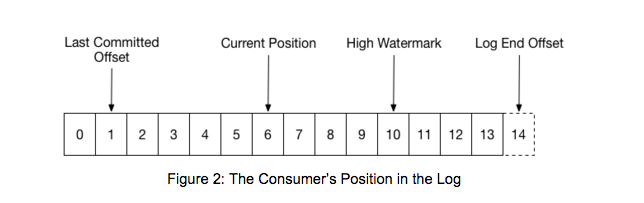
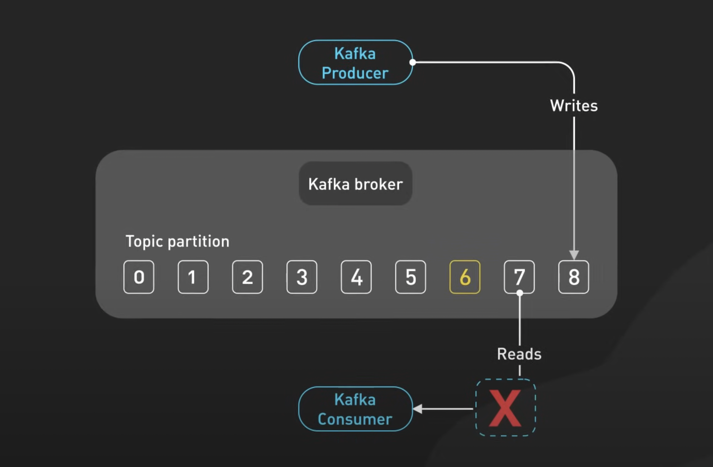
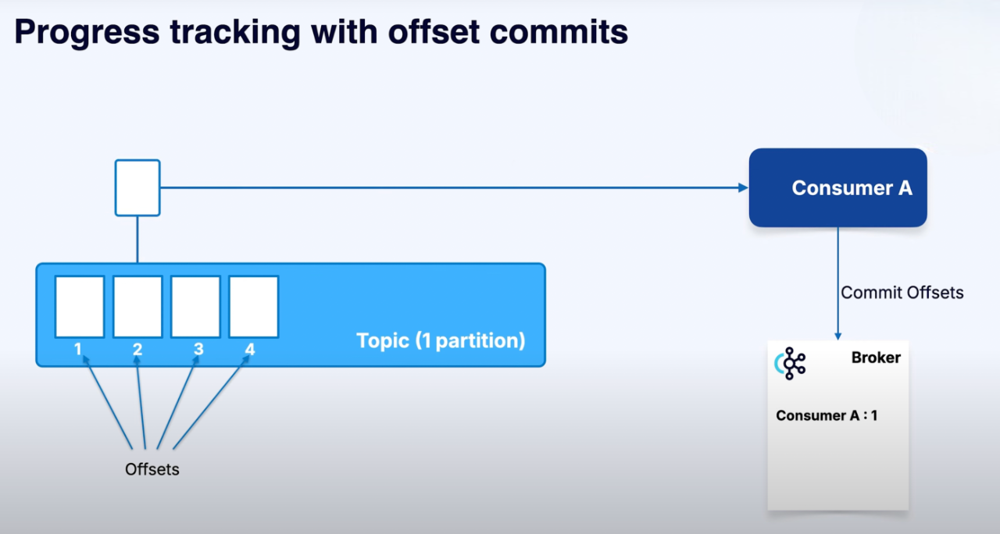
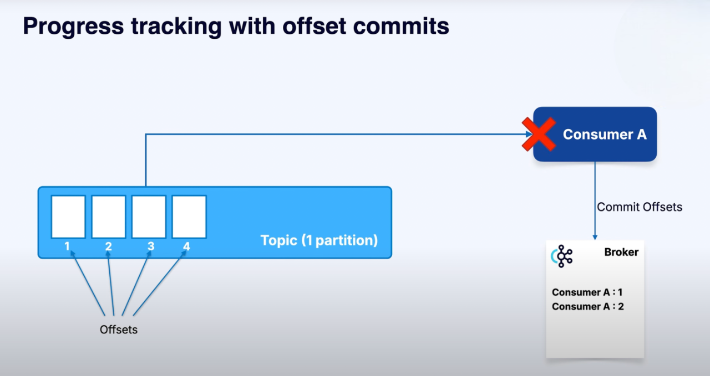
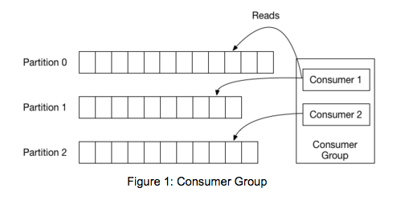

# Offsets

### What is an Offset?
An **offset** is a unique number that identifies the position of a message within a partition.

- Each partition is an **ordered log**.
- The first message gets offset `0`, the next gets `1`, then `2`, and so on.
- Offsets are **monotonically increasing** (they always go up, never down).

👉 Offsets are **per partition**, not global.  
That means two different partitions can both have a message with offset `0`.

---

### Why Offsets Matter
Offsets are how Kafka (and your applications) **keep track of where they are** in a partition.

- A **consumer** reads messages from a partition in order.
- The consumer keeps track of the **last offset it has processed**.
- Next time, it knows where to continue reading from.

Without offsets, a consumer would have no idea:
- Where it left off,
- Or whether it has already processed a message.

### 📦 Special Offsets in the Log
1. Log End Offset (LEO)
   - The offset of the **last message written** to the partition.
   - Think: “the end of the log.”

2. High Watermark (HW)
   - The offset of the **last fully replicated message**.
   - Consumers can only read up to this point.
   - Prevents reading unreplicated data (which could be lost).

---

### How Consumers Use Offsets

- Consumers **commit offsets** to Kafka.
- If a consumer crashes, it can restart and **resume from the last committed offset**.
- This ensures **at-least-once** delivery:
    - You don’t lose messages.
    - But you might reprocess some if you commit late.

---

## Consumer Group
A **consumer group** is a set of consumers that work together to read data from a topic.

- Each consumer has the **same group.id**.
- Kafka assigns partitions in the topic to consumers in the group.
- **Each partition is read by only one consumer in the group.**
- If a consumer leaves or joins, Kafka **rebalances** and reassigns partitions.

### Important Details
- Offsets are **partition-specific**:
    - Consumer groups keep track of offsets per partition.
- Consumers can control where they start reading:
    - From the **earliest** offset (read everything).
    - From the **latest** offset (only new messages).
    - From a **specific offset** (manual seek).

---

### Key Takeaways
- **Offset = position of a message in a partition.**
- Offsets allow consumers to **resume work reliably**.
- They are **not global** — they exist **within each partition**.
- Consumers **commit offsets** to track progress.  
