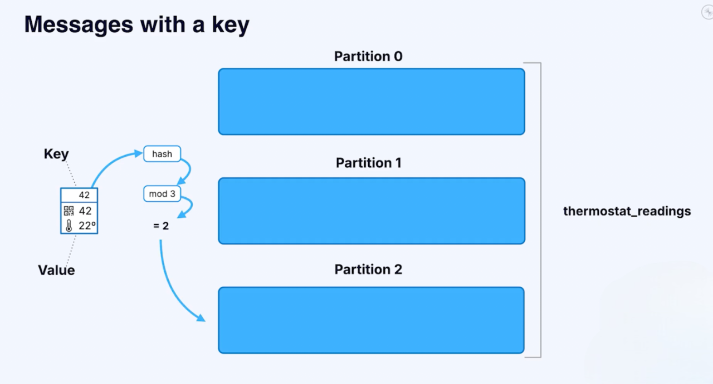

# Partitions

Apache Kafka is a **distributed system**. That means it runs across multiple machines but looks like one big system from the outside.

Now, imagine if a **topic** could only live on a single machine.
- That machine’s storage would limit the size of the topic.
- Scaling would be hard.

👉 **Partitioning** solves this problem.

---

## What is a Partition?
A **partition** is basically a split of a topic log into multiple smaller logs.

- Instead of one big log, you get many smaller logs (partitions).

- Kafka can scale to handle **millions of partitions** (around 2 million as of Kafka 4.0).

- Topics can get very large by spreading across the cluster.

---

## Ordering and Partitions
Here’s the catch:
- **Global ordering across partitions** does **not** exist.
- **Ordering within a single partition** is guaranteed.

So:
- Messages inside one partition are in order.
- Across multiple partitions, you only get "rough" ordering.

---

## How Messages Get Assigned to Partitions

### Case 1: **No Key (Key = Null)**

- Kafka distributes messages **round-robin**.
- Each new message goes to the next partition.
- Load is spread evenly.

- Downside: No ordering guarantee (e.g., all messages from `thermostat-42` could be scattered).

**Benefits:**
- **Even distribution** across all partitions
- **Maximum throughput** - utilizes all partitions equally
- **Load balancing** - prevents hot partitions

**Use Cases:**
- Metrics and logging (order doesn't matter)
- Bulk data ingestion
- Analytics events

### Case 2: **With a Key**
- Messages are **key-value pairs**.

- Kafka applies a **hash function** on the key.
- `partition_number = hash(key) % number_of_partitions`

- This ensures:
   - All messages with the same key go to the **same partition**.
   - Ordering for that key is preserved.

Example:
- Key = `sensor_id = 42` → always maps to the same partition → strict ordering for `42`.

**Benefits:**
- **Ordering guarantee** - all events for the same key go to the same partition
- **Stateful processing** - related events stay together
- **Partition affinity** - enables stateful stream processing

**Use Cases:**
- User activity tracking (key = userId)
- Order processing (key = orderId)
- Account transactions (key = accountId)

---

## Why Partitions Matter
- **Scalability** → Handle massive amounts of data.
- **Efficiency** → Spread the load across machines.
- **Reliability** → Preserve ordering where it matters (per key).

---

## Does Setting a Key Make Kafka Faster?

### Short Answer
➡️ **No — setting a key doesn’t inherently make Kafka faster.**

### Why?

#### 1. Round-Robin (No Key)
- Messages are **evenly spread** across partitions.
- Maximizes throughput (all partitions share the load).
- ❌ But you lose **strict ordering**.

#### 2. With Key
- Messages with the same key always go to the **same partition**.
- ✅ Guarantees **ordering for that key**.
- ⚠️ Risk of **hot partitions**:
   - If one key is very active, that partition gets overloaded.
   - This can **slow the entire topic down**.

### ✅ Rule of Thumb
- **No key** → Best for maximum throughput, no ordering needs.
- **With key** → Best when ordering or grouping matters (e.g., all events for a customer, device, or order ID).

---

## TL;DR (Summary)
- Kafka partitions split a topic into multiple smaller logs.
- No strict global ordering, only **per-partition ordering**.
- No key → round-robin distribution.
- With key → all messages of the same key go to the same partition.
- This makes Kafka scalable, efficient, and reliable.
