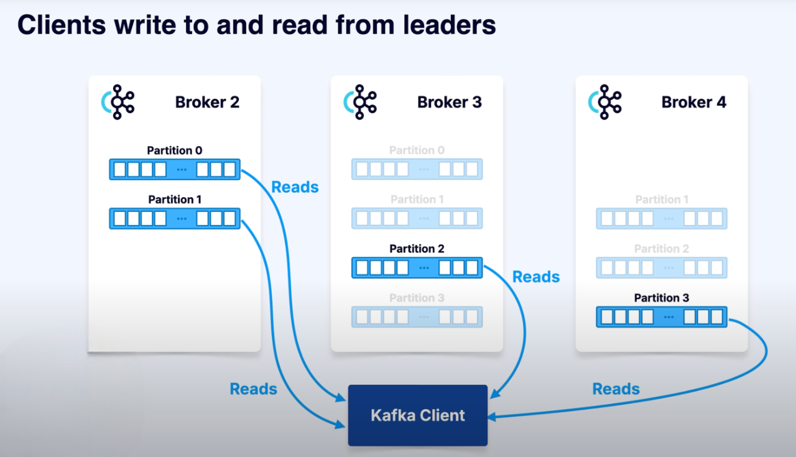
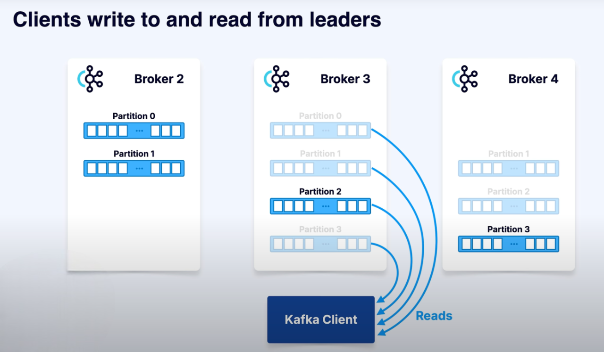

# Replication

### Why it Matters
Storing a partition on only one broker is risky.
- **Servers fail.**
- **Disks fail.**
- Cloud instances can disappear.

#### 👉 To prevent data loss, Kafka makes copies of partitions across multiple brokers. This process is called replication.

---

### Replication Factor
- You configure replication with a **replication factor** (e.g., 3).
- That means **3 copies** of each partition exist.
- Among them:
    - **1 Leader replica** (the main copy).
    - **Followers** (the other copies).

- **Followers**: Continuously replicate data from the leader.

### If one broker down

#### How It Works
- **Writes**: Always go to the **leader replica**.

- **Reads**: By default, clients also read from the leader.

### Failover

- If a broker fails:
    - Kafka elects a **new leader** from the followers.
    - No data is lost, cluster keeps running.

- Once the failed broker recovers, it can **re-sync replicas**.

---

## Reading from Followers
- Since recent Kafka versions, clients can be configured to:
    - Read from the **nearest replica** (even if it’s a follower).
    - Useful for **low latency** in geographically distributed clusters.

---

## Why Replication is Important
Replication is a **cornerstone of Kafka’s reliability**:
- Ensures **fault tolerance** (survive broker failures).
- Enables **load balancing** across brokers.
- Provides **high availability** for clients.

👉 Whether you self-manage Kafka or use a cloud service, replication is always happening behind the scenes.

---

## Key Takeaways
- **Replication factor = number of copies per partition.**
- **Leader handles writes, followers replicate.**
- Failover = automatic leader election, no data loss.
- Replication = Kafka’s built-in **fault tolerance + reliability**.