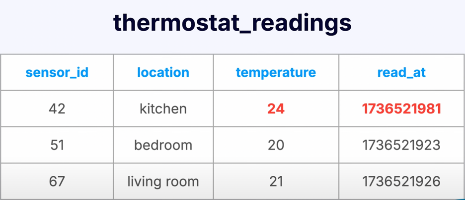
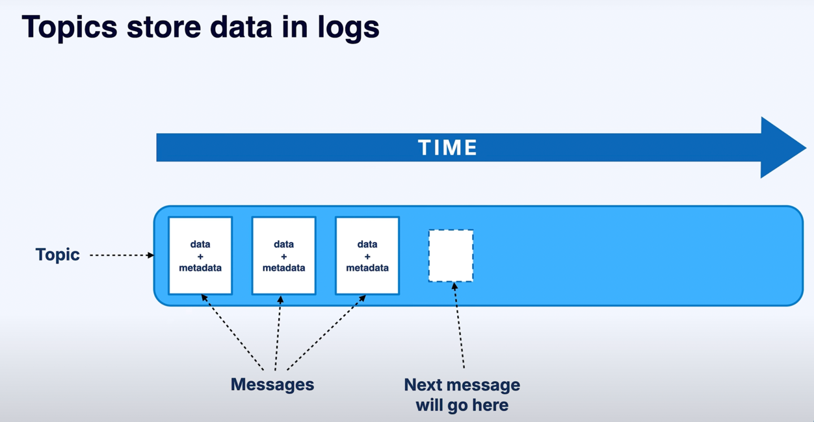
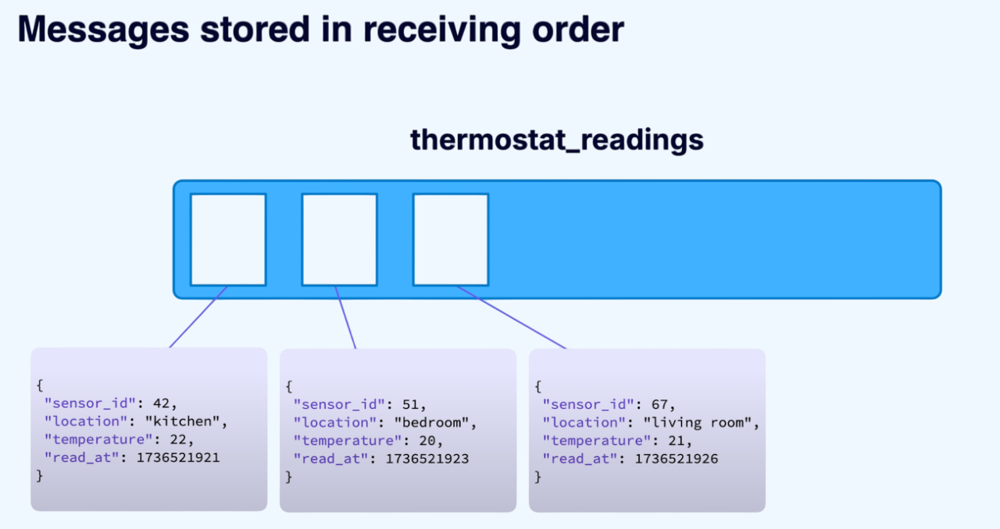
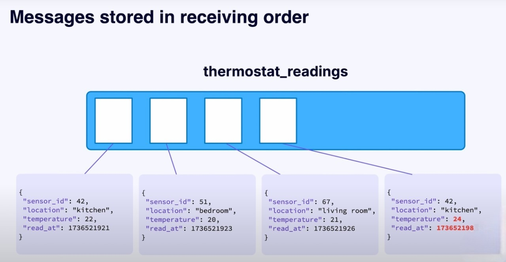
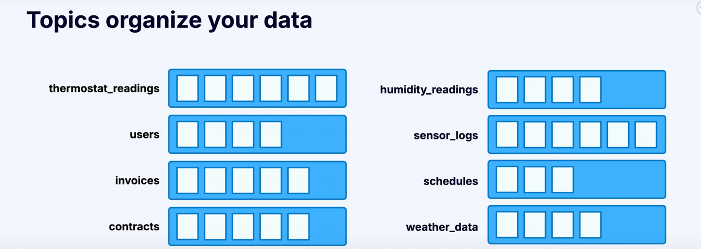
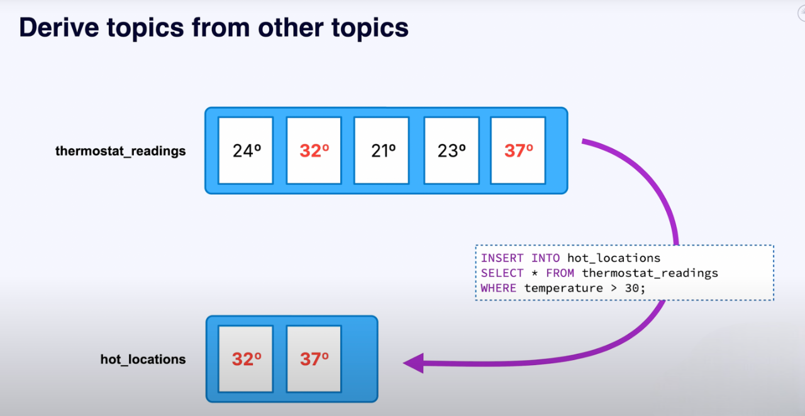
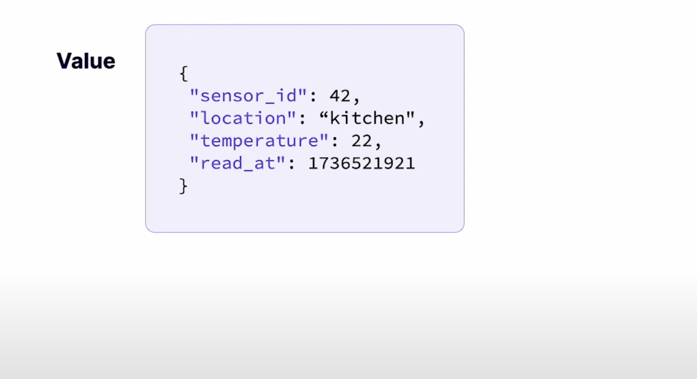
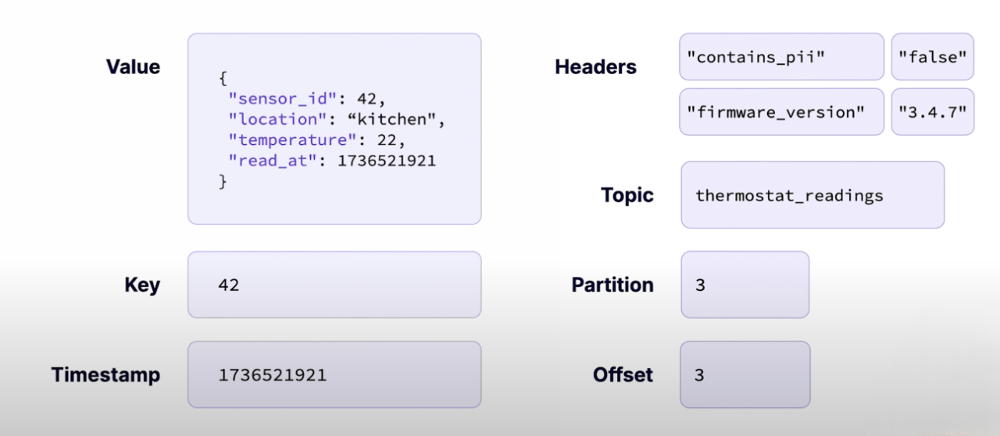
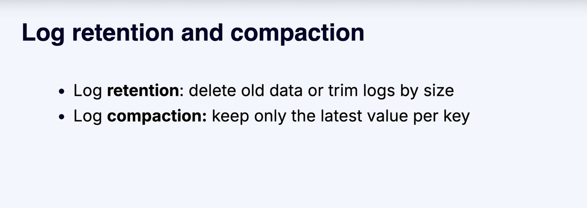

# Topic

### 1. Databases vs Kafka

#### Traditional Database
- Data stored in **tables** (rows & columns).
- Example: `thermostat_readings` table with:
   - `sensor_id`
   - `location`
   - `temperature`
   - `timestamp`
- New data → **insert row**
- Updated data → **update row** (loses history ❌)



👉 Problem: difficult to track historical changes (e.g., kitchen temp rising from 22°C → 24°C).

#### Kafka
- Uses **logs** instead of tables.
- **Log = sequence of immutable events/messages**.
- The equivalent of a table = **topic**.



---

### 2. Kafka Topics
- A **topic** is a named log that stores messages (events).
- Messages are always **appended** to the end.
- You can have **thousands of topics** in a cluster.
- **Key properties**:
   - Messages are **immutable** (cannot be changed).
   - Messages remain **ordered**.
   - Messages can be read by **many consumers**.
   - Messages are **not deleted** after reading.


**Action**


**New message coming**


**Multiple topics**


- There is no fixed limit on the number of topics a Kafka cluster can handle.

**Derive topic from other**


---

### 3. Kafka ≠ Queue

| Queue | Kafka Topic (Log) |
|-------|-------------------|
| Messages disappear once a consumer reads them | Messages stay in the log even after being read |
| Each message can be consumed only once | Many consumers can read the same message independently |
| Temporary storage (short-lived) | Persistent, ordered storage (like an append-only history) |

👉 Think of it like this:
--------
A queue is like a post-it note: once someone takes it, it’s gone.

A Kafka topic (log) is like a notebook: when someone reads a page, the page doesn’t vanish — others can read it too, and the whole history is kept in order.

⚠️ Don’t call it a “Kafka Queue.” Kafka uses **logs**.


---

### 4. Kafka Message Structure



A Kafka message has several fields:

1. **Value** → main event data (JSON, Avro, Protobuf, string, integer, etc.)
2. **Key** → identifier (e.g., `sensor_id: 42`), helps partition data
3. **Timestamp** → when the event happened (producer-assigned or broker time)
4. **Headers** → optional key–value metadata
5. **Topic Name** → which topic it belongs to
6. **Offset** → message’s position in the topic (starts at `0` and increments)



---

### 5. log


### Kafka Log Retention vs Compaction

Kafka topics can manage stored messages in two main ways: **retention** and **compaction**.  
These control *how long* or *which messages* are kept in the log.

### Retention 🕒
- Keeps **all messages** for a configured time (e.g. 7 days) or until the log reaches a certain size.
- Messages are removed only after this period/limit, even if they’ve been consumed.
- Good for event history, analytics, or replay scenarios.

**Analogy:** Like CCTV footage — everything is recorded and kept for a week, then old recordings are deleted.

### Compaction ✂️
- Keeps **only the latest message per key**, removing older duplicates.
- Ensures the log always has the most recent state for each key.
- Good for stateful data (e.g. user profiles, account balances, configuration).

**Analogy:** Like a ledger — you don’t keep every transaction slip, just the latest balance for each account.

=============

**Example**

Imagine you’re tracking **usernames**.  
Users can change their username many times, but you only care about the **latest username** for each user.


### Without Compaction (Normal Retention)

Kafka log might look like this:

```(user1, Alice)
(user2, Bob)
(user1, Alicia)
(user2, Bobby)
(user1, Al)
```

- All historical events are kept until the **retention period** ends (e.g. 7 days).
- Even if you only need the latest value, the old messages are still stored.


### With Compaction

Kafka cleans up old values for the same key (`user1`, `user2`) and keeps only the most recent:

```
(user1, Al)
(user2, Bobby)
```

👉 This means the topic always contains the **latest version per key**, no matter how many times it was updated before.

### Analogy

- **Retention** = keeping **all your receipts** for 7 days, even for coffee you already drank.
- **Compaction** = just writing your **current wallet balance** on a sticky note and updating it whenever it changes.

---

### 6. Transforming Topics
- Messages are immutable.
- To change data → **create new topics**.
- Example:
   - Source: `thermostat_readings`
   - Derived: `hot_locations` (only readings with temp > 30°C)

---

### 7. Key Takeaways
- Kafka topics = **immutable logs** of messages.
- Logs ≠ queues → data isn’t removed after reading.
- Messages contain **value, key, timestamp, headers, topic, offset**.
- Transformations create **new topics**.
- Kafka is built for **event-driven, streaming, and historical** data.

---