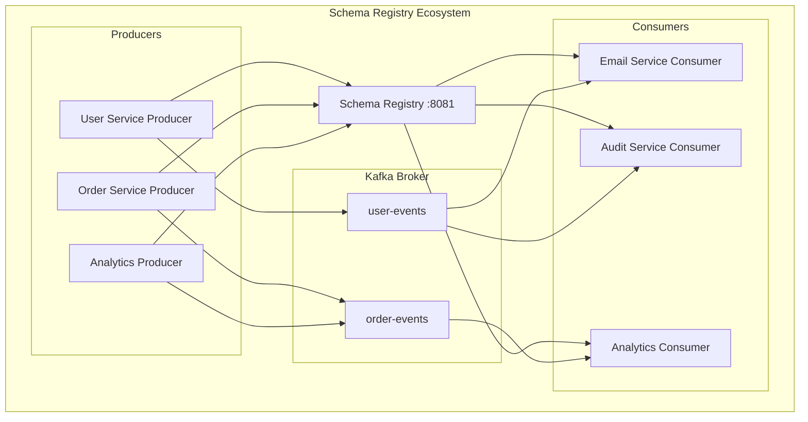

# Concept

## Schema Registry with Avro & Protobuf - Managing Structured Data

## 🎯 Objective

Master structured data management in Kafka using Schema Registry with Avro and Protobuf. Learn schema evolution, compatibility strategies, and type safety for production-grade event-driven systems.

## 🔍 **The Problem with JSON**

While JSON is human-readable and flexible, it has limitations for production systems:

```kotlin
// JSON - No schema enforcement
val userEvent = """
{
  "userId": 123,           // Should be string, not number!
  "email": "test@",        // Invalid email format
  "timestamp": "invalid",  // Invalid timestamp format
  "newField": "surprise"   // Unexpected field - breaks consumers?
}
"""
```

**JSON Challenges:**
- ❌ **No schema validation** - Invalid data propagates
- ❌ **No evolution strategy** - Adding fields breaks consumers
- ❌ **Large payload size** - Field names repeated in every message
- ❌ **No type safety** - Runtime errors instead of compile-time checks

## 🛡️ **Schema Registry: Structured Data Solution**

Schema Registry provides **centralized schema management** with evolution and compatibility checking.



**Schema Registry Benefits:**
- ✅ **Schema validation** - Only valid data reaches consumers
- ✅ **Evolution management** - Safe schema changes over time
- ✅ **Type safety** - Compile-time error detection
- ✅ **Compact serialization** - Binary format reduces payload size
- ✅ **Backward/Forward compatibility** - Gradual system updates

## 🏗️ **Apache Avro: Dynamic Schema Evolution**

Avro provides **schema evolution** with **dynamic typing** at runtime.

### Avro Schema Definition

```json
{
  "type": "record",
  "name": "UserRegistered",
  "namespace": "com.learning.events",
  "fields": [
    {
      "name": "userId",
      "type": "string",
      "doc": "Unique identifier for the user"
    },
    {
      "name": "email",
      "type": "string",
      "doc": "User's email address"
    },
    {
      "name": "timestamp",
      "type": "long",
      "logicalType": "timestamp-millis",
      "doc": "Event timestamp in milliseconds"
    },
    {
      "name": "source",
      "type": "string",
      "default": "unknown",
      "doc": "Event source system"
    }
  ]
}
```

### Schema Evolution Example

```json
// Version 1 - Initial schema
{
  "type": "record",
  "name": "UserRegistered",
  "fields": [
    {"name": "userId", "type": "string"},
    {"name": "email", "type": "string"}
  ]
}

// Version 2 - Backward compatible (added optional field)
{
  "type": "record", 
  "name": "UserRegistered",
  "fields": [
    {"name": "userId", "type": "string"},
    {"name": "email", "type": "string"},
    {"name": "firstName", "type": ["null", "string"], "default": null}
  ]
}

// Version 3 - Forward compatible (removed field with default)
{
  "type": "record",
  "name": "UserRegistered", 
  "fields": [
    {"name": "userId", "type": "string"},
    {"name": "email", "type": "string"},
    {"name": "firstName", "type": ["null", "string"], "default": null},
    {"name": "registrationSource", "type": "string", "default": "web"}
  ]
}
```

### Kotlin Avro Integration

```kotlin
// Generated from Avro schema
data class UserRegistered(
    val userId: String,
    val email: String,
    val timestamp: Long,
    val source: String = "unknown"
) {
    companion object {
        val SCHEMA = Schema.Parser().parse("""
            {
              "type": "record",
              "name": "UserRegistered",
              "fields": [
                {"name": "userId", "type": "string"},
                {"name": "email", "type": "string"},
                {"name": "timestamp", "type": "long"},
                {"name": "source", "type": "string", "default": "unknown"}
              ]
            }
        """)
    }
}
```

## 🚀 **Protocol Buffers: High-Performance Schema**

Protobuf provides **strongly-typed**, **high-performance** serialization with **code generation**.

### Protobuf Schema Definition

```protobuf
// user_events.proto
syntax = "proto3";

package com.learning.events;

import "google/protobuf/timestamp.proto";

message UserRegistered {
  string user_id = 1;
  string email = 2;
  google.protobuf.Timestamp timestamp = 3;
  string source = 4;
  
  // Evolution: Add optional fields with higher field numbers
  optional string first_name = 5;
  optional string last_name = 6;
  optional RegistrationSource registration_source = 7;
}

enum RegistrationSource {
  UNKNOWN = 0;
  WEB = 1;
  MOBILE = 2;
  API = 3;
}
```

### Schema Evolution with Protobuf

```protobuf
// Version 1
message UserRegistered {
  string user_id = 1;
  string email = 2;
}

// Version 2 - Backward compatible
message UserRegistered {
  string user_id = 1;
  string email = 2;
  google.protobuf.Timestamp timestamp = 3;  // New field
  optional string source = 4;               // Optional field
}

// Version 3 - Field number reserved for removed fields
message UserRegistered {
  string user_id = 1;
  string email = 2;
  google.protobuf.Timestamp timestamp = 3;
  // reserved 4;  // Remove source field safely
  optional string first_name = 5;
  optional string last_name = 6;
}
```

## 🔄 **Schema Compatibility Strategies**

### Backward Compatibility
**New consumers** can read **old producer** data.

```kotlin
// Old producer sends: {userId: "123", email: "test@test.com"}
// New consumer expects: {userId: "123", email: "test@test.com", firstName: null}
// ✅ Works: New field gets default value
```

### Forward Compatibility
**Old consumers** can read **new producer** data.

```kotlin
// New producer sends: {userId: "123", email: "test@test.com", firstName: "John"}  
// Old consumer expects: {userId: "123", email: "test@test.com"}
// ✅ Works: Unknown fields are ignored
```

### Full Compatibility
**Both directions** work - gradual rollouts possible.

```kotlin
// Supports both old and new versions simultaneously
// Enables zero-downtime deployments
```

### Breaking Changes
**Incompatible changes** require coordination.

```kotlin
// ❌ Breaking: Remove required field
// ❌ Breaking: Change field type (string -> int)
// ❌ Breaking: Rename field without alias
```

## 🛠️ **Spring Boot Schema Registry Integration**

### Producer Configuration

```kotlin
@Configuration
class AvroProducerConfig {
    
    @Bean
    fun avroProducerFactory(): ProducerFactory<String, SpecificRecord> {
        val props = mapOf<String, Any>(
            ProducerConfig.BOOTSTRAP_SERVERS_CONFIG to "localhost:9092",
            ProducerConfig.KEY_SERIALIZER_CLASS_CONFIG to StringSerializer::class.java,
            ProducerConfig.VALUE_SERIALIZER_CLASS_CONFIG to KafkaAvroSerializer::class.java,
            AbstractKafkaSchemaSerDeConfig.SCHEMA_REGISTRY_URL_CONFIG to "http://localhost:8081",
            KafkaAvroSerializerConfig.SPECIFIC_AVRO_READER_CONFIG to true
        )
        return DefaultKafkaProducerFactory(props)
    }
    
    @Bean
    fun avroKafkaTemplate(): KafkaTemplate<String, SpecificRecord> {
        return KafkaTemplate(avroProducerFactory())
    }
}
```

### Consumer Configuration

```kotlin
@Configuration
class AvroConsumerConfig {
    
    @Bean
    fun avroConsumerFactory(): ConsumerFactory<String, SpecificRecord> {
        val props = mapOf<String, Any>(
            ConsumerConfig.BOOTSTRAP_SERVERS_CONFIG to "localhost:9092",
            ConsumerConfig.GROUP_ID_CONFIG to "avro-consumer-group",
            ConsumerConfig.KEY_DESERIALIZER_CLASS_CONFIG to StringDeserializer::class.java,
            ConsumerConfig.VALUE_DESERIALIZER_CLASS_CONFIG to KafkaAvroDeserializer::class.java,
            AbstractKafkaSchemaSerDeConfig.SCHEMA_REGISTRY_URL_CONFIG to "http://localhost:8081",
            KafkaAvroDeserializerConfig.SPECIFIC_AVRO_READER_CONFIG to true
        )
        return DefaultKafkaConsumerFactory(props)
    }
}
```

## 📊 **Schema Management Workflow**

### 1. Schema Development

```bash
# Register new schema
curl -X POST http://localhost:8081/subjects/user-events-value/versions \
  -H "Content-Type: application/vnd.schemaregistry.v1+json" \
  -d '{
    "schema": "{\"type\":\"record\",\"name\":\"UserRegistered\",\"fields\":[{\"name\":\"userId\",\"type\":\"string\"}]}"
  }'
```

### 2. Schema Evolution

```bash
# Check compatibility before registering
curl -X POST http://localhost:8081/compatibility/subjects/user-events-value/versions/latest \
  -H "Content-Type: application/vnd.schemaregistry.v1+json" \
  -d '{
    "schema": "{\"type\":\"record\",\"name\":\"UserRegistered\",\"fields\":[{\"name\":\"userId\",\"type\":\"string\"},{\"name\":\"email\",\"type\":\"string\"}]}"
  }'

# Response: {"is_compatible": true}
```

### 3. Schema Retrieval

```bash
# Get latest schema
curl http://localhost:8081/subjects/user-events-value/versions/latest

# Get specific version  
curl http://localhost:8081/subjects/user-events-value/versions/1

# List all subjects
curl http://localhost:8081/subjects
```

## 🧪 **Hands-On: Producer with Schema Evolution**

```kotlin
@Service
class SchemaAwareProducer(
    private val avroKafkaTemplate: KafkaTemplate<String, SpecificRecord>
) {
    
    fun sendUserRegistered(userId: String, email: String) {
        // Create Avro record
        val userRegistered = UserRegistered.newBuilder()
            .setUserId(userId)
            .setEmail(email)
            .setTimestamp(System.currentTimeMillis())
            .setSource("api")
            .build()
        
        // Send with schema validation
        avroKafkaTemplate.send("user-events", userId, userRegistered)
            .thenAccept { result ->
                logger.info("Avro message sent: partition=${result.recordMetadata.partition()}")
            }
            .exceptionally { failure ->
                logger.error("Schema validation failed", failure)
                null
            }
    }
}
```

## 🔍 **Schema Registry Monitoring**

### Schema Versions

```bash
# View schema evolution history
curl http://localhost:8081/subjects/user-events-value/versions

# Response: [1, 2, 3, 4]  # Available versions
```

### Compatibility Settings

```bash
# Set compatibility level
curl -X PUT http://localhost:8081/config/user-events-value \
  -H "Content-Type: application/vnd.schemaregistry.v1+json" \
  -d '{"compatibility": "BACKWARD"}'

# Check current setting
curl http://localhost:8081/config/user-events-value
```

### Schema Health Check

```kotlin
@Component
class SchemaRegistryHealthIndicator(
    private val schemaRegistryClient: SchemaRegistryClient
) : HealthIndicator {
    
    override fun health(): Health {
        return try {
            val subjects = schemaRegistryClient.allSubjects
            Health.up()
                .withDetail("schema_registry_url", "http://localhost:8081")
                .withDetail("subjects_count", subjects.size)
                .withDetail("subjects", subjects)
                .build()
        } catch (e: Exception) {
            Health.down()
                .withDetail("error", e.message)
                .build()
        }
    }
}
```

## ⚠️ **Common Pitfalls & Solutions**

### 1. **Schema Compatibility Violations**

```kotlin
// ❌ Problem: Breaking change
// Old: {"name": "userId", "type": "string"}
// New: {"name": "userId", "type": "int"}  // Type change breaks compatibility

// ✅ Solution: Add new field, deprecate old
// {"name": "userId", "type": "string"}        // Keep old
// {"name": "userIdNum", "type": "int"}        // Add new
```

### 2. **Schema Subject Naming**

```kotlin
// ❌ Problem: Inconsistent naming
// "UserEvent", "user_event", "userEvent"

// ✅ Solution: Consistent convention
// "user-events-value", "order-events-key"
```

### 3. **Default Values**

```avro
// ❌ Problem: No default for new required field
{"name": "newField", "type": "string"}

// ✅ Solution: Provide default value
{"name": "newField", "type": "string", "default": "unknown"}
```

## 📈 **Performance Comparison**

| Format | Size (bytes) | Serialize (ms) | Deserialize (ms) | Schema Evolution |
|--------|--------------|----------------|------------------|------------------|
| **JSON** | 150 | 0.8 | 0.9 | Manual |
| **Avro** | 45 | 0.4 | 0.3 | Automatic |
| **Protobuf** | 35 | 0.2 | 0.2 | Automatic |

**Protobuf Advantages:**
- 🚀 **Fastest serialization/deserialization**
- 📦 **Smallest payload size**
- 🔒 **Strong typing with code generation**
- 🛡️ **Built-in validation**

**Avro Advantages:**
- 🔄 **Dynamic schema resolution**
- 📋 **Schema embedded in data**
- 🔀 **Rich schema evolution features**
- 🛠️ **Better tooling ecosystem**

## ✅ **Best Practices**

### 🎯 **Schema Design**
- **Use meaningful names** for fields and types
- **Add documentation** to all fields
- **Plan for evolution** from the start
- **Keep schemas simple** and focused

### 🔄 **Evolution Strategy**
- **Always add default values** for new fields
- **Never remove required fields** without deprecation
- **Use union types** for optional fields: `["null", "string"]`
- **Test compatibility** before deploying

### 🛡️ **Production Deployment**
- **Set appropriate compatibility levels** per topic
- **Monitor schema registry health** and performance
- **Version schemas semantically** (v1.0.0, v1.1.0)
- **Backup schema registry** data regularly

### 🧪 **Testing**
- **Test schema evolution scenarios** in CI/CD
- **Validate producer/consumer compatibility** across versions
- **Load test with realistic schemas** and payloads
- **Monitor serialization performance** in production

## 🚀 **What's Next?**

With structured data mastery complete, you're ready for [Lesson 6: Development Tools](../lesson_6/concept.md), where you'll learn debugging, testing, and monitoring tools for Kafka applications.

---

*Schema Registry transforms Kafka from a simple message broker to a robust data platform. The type safety and evolution capabilities you've learned are essential for production-grade event-driven architectures.*