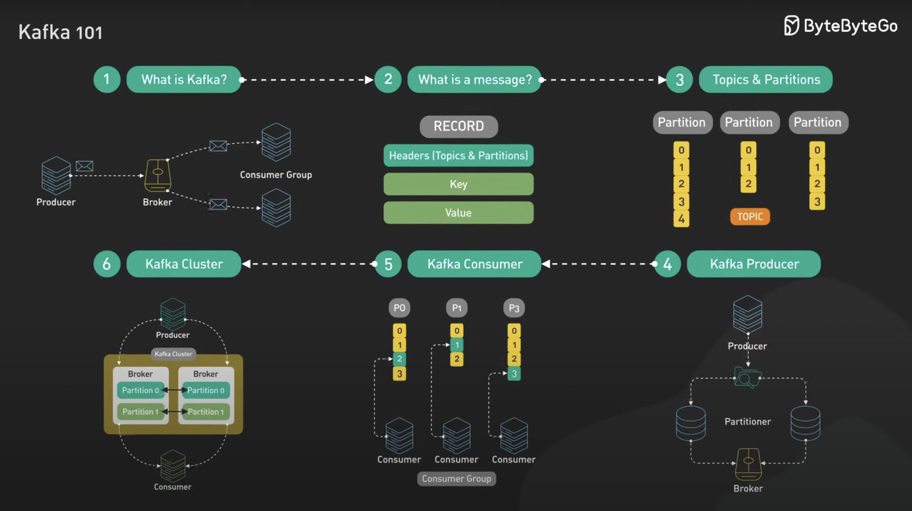
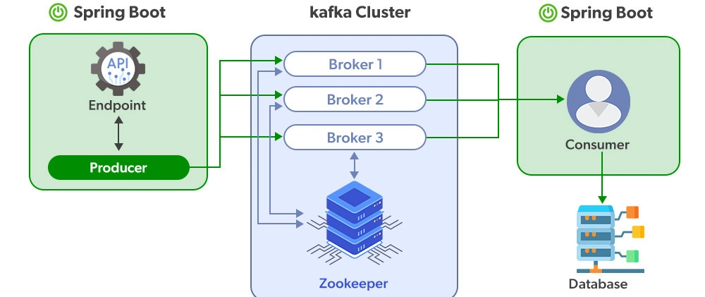

# Overview

### 1️⃣ What is Kafka?
Kafka is a **distributed event streaming platform** where:
- **Producers** send events (messages).
- **Brokers** store and forward them.
- **Consumers** read and process them.
- Everything happens over a high-performance TCP protocol.

---

### 2️⃣ What is a Message?
A Kafka message is a **record** made of:
- **Headers** → metadata (topics, partitions).
- **Key** → decides partition placement (ordering).
- **Value** → the actual event data.

---

### 3️⃣ Topics & Partitions
- **Topic** = category/log where events are stored.
- Each topic is split into **partitions** for scalability.
- Guarantees:
  - Events in a partition are **append-only** and **ordered**.
  - Same key → always lands in the same partition.
- Topics are **multi-producer & multi-consumer**.

---

### 4️⃣ Kafka Producer
- Clients that **write events** to topics.
- Use a **partitioner** to decide where to put each event:
  - Round-robin → load balancing.
  - By key → keep order for related data.
- Kafka provides a **Producer API** for apps.

---

### 5️⃣ Kafka Consumer
- Clients that **read events** from topics.
- Track position using **offsets** (can rewind, replay, or skip).
- Consumers form **consumer groups**:
  - Each partition → read by exactly **one consumer** in the group.
  - Enables parallel processing without duplication.
- Kafka provides a **Consumer API** for apps.

---

### 6️⃣ Kafka Cluster
- A cluster = multiple **brokers**.
- Each broker stores topic partitions.
- **Replication**:
  - Common setting = replication factor of 3.
  - Ensures **fault tolerance** and **high availability**.
- Clients (producers/consumers) can connect to **any broker** to access the full cluster.

---

Recap: https://youtu.be/Ch5VhJzaoaI?si=zEXBo9Yu6jemWcqu

## Kafka with Spring boot

1. **Producer (Spring Boot)**
   - Creates messages (events).
   - Sends them into the Kafka system.
   - Example: An API receives an order and pushes the order event to Kafka.

2. **Kafka Cluster**
   - The "post office" that handles all messages.
   - **Brokers** → Store and forward messages (more brokers = scalable & reliable).
   - **Zookeeper** → Keeps track of cluster coordination (which broker does what).

3. **Consumer (Spring Boot)**
   - Reads the messages from Kafka.
   - Processes them and saves results into the **Database**.
