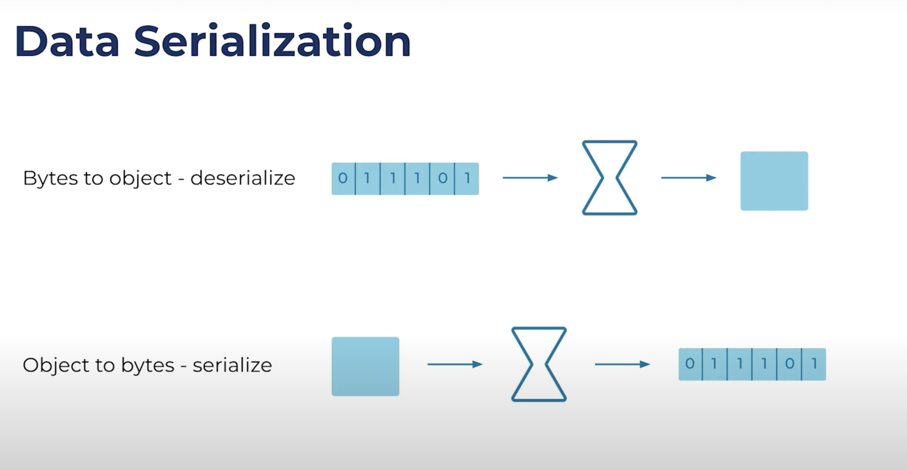

# Serialization & Deserializer

- Serialization is a general term that covers deserializing and serializing.

- When you push an array of bytes through a deserializer, it gives you an object on the other end:

- A serializer is just the opposite—you give it an object, and it returns an array of bytes:

Serialization is important for Kafka because as mentioned above, a Kafka broker only works with bytes. 
Kafka stores records in bytes, and when a fetch request comes in from a consumer, Kafka returns records in bytes. 

The broker really knows nothing about its records.
it just appends them to the end of a file, and that's the end of it.

