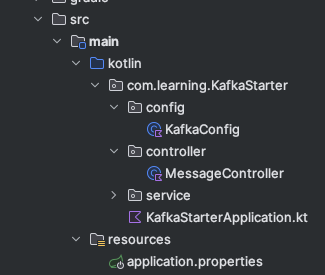

# Workshop

## Let's build a Kafka basic application!

Let's start with the basic structure of a Kafka application.



### Kafka Configuration

#### Kafka Producer 

```kotlin
    // Producer Configuration
    @Bean
    fun producerFactory(): ProducerFactory<String, String> {
        val configProps = HashMap<String, Any>()
        configProps[ProducerConfig.BOOTSTRAP_SERVERS_CONFIG] = bootstrapServers
        configProps[ProducerConfig.KEY_SERIALIZER_CLASS_CONFIG] = StringSerializer::class.java
        configProps[ProducerConfig.VALUE_SERIALIZER_CLASS_CONFIG] = StringSerializer::class.java

        return DefaultKafkaProducerFactory(configProps)
    }

    @Bean
    fun kafkaTemplate(): KafkaTemplate<String, String> {
        return KafkaTemplate(producerFactory())
    }
```