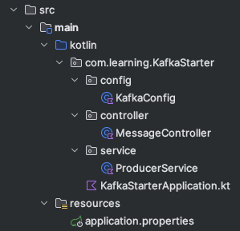

# Workshop

## Let's build a Kafka basic application!

Let's start with the basic structure of a Kafka application.



### Kafka Configuration

#### Kafka Producer 

Try adding the following code to the `KafkaConfig` class.
```kotlin
    // Producer Configuration
    @Bean
    fun producerFactory(): ProducerFactory<String, String> {
        val configProps = HashMap<String, Any>()
        configProps[ProducerConfig.BOOTSTRAP_SERVERS_CONFIG] = bootstrapServers
        configProps[ProducerConfig.KEY_SERIALIZER_CLASS_CONFIG] = StringSerializer::class.java
        configProps[ProducerConfig.VALUE_SERIALIZER_CLASS_CONFIG] = StringSerializer::class.java

        return DefaultKafkaProducerFactory(configProps)
    }

    @Bean
    fun kafkaTemplate(): KafkaTemplate<String, String> {
        return KafkaTemplate(producerFactory())
    }
```
- **Boostrap Servers** - is the address of the Kafka server.
- **Key Serializer** - is the serializer for the key.
- **Value Serializer** - is the serializer for the value.

### Kafka Producer Service

```kotlin
    fun sendMessage(message: String) {
        logger.info("Sending message to topic $TOPIC_NAME: $message")
        val key = UUID.randomUUID().toString()
        kafkaTemplate.send(TOPIC_NAME, key, message)
            .whenComplete { result, exception ->
                if (exception != null) {
                    logger.error("Failed to send message: ${exception.message}")
                    // Error handling should be implemented here
                } else {
                    logger.info("Message sent successfully to ${result?.recordMetadata?.topic()}:${result?.recordMetadata?.partition()}")
                }
            }
    }
```

### A Controller

A basic controller for sending messages to Kafka topics. Allowing the user to send a message to the topic.
```kotlin
    @RestController
    @RequestMapping("/api/messages")
    class MessageController(
        private val producerService: ProducerService
    ) {
    
        @PostMapping("/send")
        fun sendMessage(@RequestBody request: String) =
            producerService.sendMessage(request)
    }
```

### Application Properties

```properties
# Application Configuration
spring.application.name=kafka-starter-main

# Kafka Configuration
spring.kafka.bootstrap-servers=localhost:9092
spring.kafka.consumer.group-id=kafka-starter-group-1
```

### Run the application

### Open swagger and try sending a message to the topic.

http://localhost:8090/swagger-ui/index.html#

```
curl -X 'POST' \
  'http://localhost:8090/api/messages/send' \
  -H 'accept: */*' \
  -H 'Content-Type: application/json' \
  -d '"test"'
  ```
If you can see your message in the consumer, congratulations!

## Next, let's build a Kafka Consumer!

### Kafka Consumer Configuration

Add the following code to the `KafkaConfig` class.

```kotlin
    // Consumer Configuration
    @Bean
    fun consumerFactory(): ConsumerFactory<String, String> {
        val props = HashMap<String, Any>()
        props[ConsumerConfig.BOOTSTRAP_SERVERS_CONFIG] = bootstrapServers
        props[ConsumerConfig.GROUP_ID_CONFIG] = groupId
        props[ConsumerConfig.KEY_DESERIALIZER_CLASS_CONFIG] = StringDeserializer::class.java
        props[ConsumerConfig.VALUE_DESERIALIZER_CLASS_CONFIG] = StringSerializer::class.java
        props[ConsumerConfig.AUTO_OFFSET_RESET_CONFIG] = "earliest"
    
        return DefaultKafkaConsumerFactory(props)
    }
    
    @Bean
    fun kafkaListenerContainerFactory(): ConcurrentKafkaListenerContainerFactory<String, String> {
        val factory = ConcurrentKafkaListenerContainerFactory<String, String>()
        factory.consumerFactory = consumerFactory()
        
        return factory
    }
```
- **Boostrap Servers** - is the address of the Kafka server.
- **Group ID** - is the group id for the consumer.
- **Key Deserializer** - is the deserializer for the key.
- **Value Deserializer** - is the deserializer for the value.
- **Auto Offset Reset** - is the auto offset reset, there are 2 options: `earliest` and `latest`.
  - The `earliest` option will start from the beginning of the topic.
  - The `latest` option will start from the end of the topic.

### Kafka Consumer Service

Create a simple consumer service to receive messages from the topic.

```kotlin
@Service
class ConsumerService {

    private val logger = LoggerFactory.getLogger(ConsumerService::class.java)
    
    @KafkaListener(topics = [TOPIC_NAME])
    fun consumeMessage(message: String) {
        logger.info("Received message from the topic: $message")
    }
}
```

### Re-run the application

### Open swagger and try sending a message to the topic.

If you can see your message in the consumer, congratulations! You've successfully built a Kafka application!


## Let's try to connect to a remote Kafka server!

### Kafka Configuration

Add some more configuration to the `KafkaConfig` class.
```kotlin
@Value("\${spring.kafka.security.protocol}")
    private lateinit var securityProtocol: String

    @Value("\${spring.kafka.properties.sasl.mechanism}")
    private lateinit var saslMechanism: String

    @Value("\${spring.kafka.properties.sasl.jaas.config}")
    private lateinit var saslJaasConfig: String

    @Value("\${spring.kafka.properties.ssl.endpoint.identification.algorithm}")
    private lateinit var sslEndpointIdentificationAlgorithm: String

    @Value("\${spring.kafka.properties.client.dns.lookup}")
    private lateinit var clientDnsLookup: String

    private fun getCommonSecurityProperties(): Map<String, Any> {
        return mapOf(
            "security.protocol" to securityProtocol,
            SaslConfigs.SASL_MECHANISM to saslMechanism,
            SaslConfigs.SASL_JAAS_CONFIG to saslJaasConfig,
            SslConfigs.SSL_ENDPOINT_IDENTIFICATION_ALGORITHM_CONFIG to sslEndpointIdentificationAlgorithm,
            "client.dns.lookup" to clientDnsLookup
        )
    }
```

In the `producerFactory()`, add the following code. As well as in the `consumerFactory()`.
```kotlin
        // Add security properties
        configProps.putAll(getCommonSecurityProperties())
```

In the `application.properties`, add the following configuration.
```properties
spring.kafka.bootstrap-servers=pkc-l7j7w.asia-east1.gcp.confluent.cloud:9092
spring.kafka.consumer.group-id={LETS_SEPARATE_GROUP_ID}}


spring.kafka.security.protocol=SASL_SSL
spring.kafka.properties.sasl.mechanism=PLAIN
spring.kafka.properties.sasl.jaas.config=org.apache.kafka.common.security.plain.PlainLoginModule required username="3OFJGVL3G3YQY2UC" password="cfltYpG9GFIC5Fx0Z8WuayLW7sbPv8Ef7ywbGqU5r4qi0PjSJTe3KN0IlnLyugzQ";
spring.kafka.properties.ssl.endpoint.identification.algorithm=https
spring.kafka.properties.client.dns.lookup=use_all_dns_ips
```

For the group id, you can select from one of these group ids.
- chiang-mai-consumer-group
- bangkok-consumer-group
- phuket-consumer-group
- khon-kaen-consumer-group
- kanchanaburi-consumer-group

### Re-run the application
### Try sending a message to the topic!