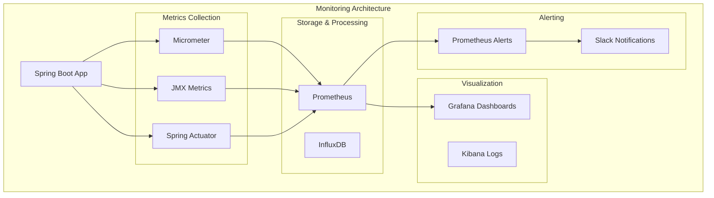

# Concept 

## Development Tools - Debugging, Testing & Monitoring Kafka Applications

## 🎯 Objective

Master the essential development tools and techniques for building, debugging, testing, and monitoring production-ready Kafka applications. Learn industry-standard practices for troubleshooting, performance optimization, and operational excellence.

## 🛠️ **Essential Kafka Development Tools**

### 🔍 **Debugging & Inspection Tools**

#### 1. **Kafka UI (Primary Tool)**
```
URL: http://localhost:8080
Features:
- Topic browsing and message inspection
- Consumer group monitoring  
- Schema Registry integration
- Real-time metrics and performance data
- Partition and offset management
```

#### 2. **AKHQ (Alternative UI)**
```
URL: http://localhost:8082  
Features:
- Advanced message filtering
- JSON/Avro/Protobuf message viewing
- Consumer group management
- Topic configuration editing
```

#### 3. **Kafka CLI Tools**
```bash
# Essential CLI commands for debugging
docker exec kafka-starter-broker kafka-topics --list --bootstrap-server localhost:9092
docker exec kafka-starter-broker kafka-console-consumer --topic user-events --from-beginning --bootstrap-server localhost:9092
docker exec kafka-starter-broker kafka-consumer-groups --bootstrap-server localhost:9092 --list
```

### 📊 **Monitoring & Observability Stack**



## 🧪 **Testing Strategies for Kafka Applications**

### 1. **Unit Testing with Mocks**

```kotlin
@ExtendWith(MockitoExtension::class)
class UserEventProducerTest {
    
    @Mock
    private lateinit var kafkaTemplate: KafkaTemplate<String, UserRegisteredEvent>
    
    @InjectMocks
    private lateinit var userEventProducer: UserEventProducer
    
    @Test
    fun `should send user registration event`() {
        // Given
        val event = UserRegisteredEvent("user123", "test@example.com", "api")
        val future = CompletableFuture<SendResult<String, UserRegisteredEvent>>()
        
        `when`(kafkaTemplate.send("user-registration", "user123", event))
            .thenReturn(future)
        
        // When
        userEventProducer.publishUserRegistered(event)
        
        // Then
        verify(kafkaTemplate).send("user-registration", "user123", event)
    }
}
```

### 2. **Integration Testing with Embedded Kafka**

```kotlin
@SpringBootTest
@EmbeddedKafka(
    partitions = 1,
    topics = ["test-user-events"],
    brokerProperties = ["listeners=PLAINTEXT://localhost:9000", "port=9000"]
)
@TestPropertySource(properties = ["spring.kafka.bootstrap-servers=localhost:9000"])
class KafkaIntegrationTest {
    
    @Autowired
    private lateinit var userEventProducer: UserEventProducer
    
    @Autowired
    private lateinit var userEventConsumer: UserEventConsumer
    
    @Test
    fun `should process user event end-to-end`() {
        // Given
        val event = UserRegisteredEvent("test-user", "test@test.com", "test")
        val latch = CountDownLatch(1)
        
        // When
        userEventProducer.publishUserRegistered(event)
        
        // Then
        assertTrue(latch.await(5, TimeUnit.SECONDS))
        // Verify processing occurred
    }
}
```

### 3. **TestContainers for Real Kafka Testing**

```kotlin
@SpringBootTest
@Testcontainers
class KafkaTestContainersTest {
    
    companion object {
        @Container
        @JvmStatic
        val kafka = KafkaContainer(DockerImageName.parse("confluentinc/cp-kafka:7.4.0"))
            .withExposedPorts(9093)
    }
    
    @DynamicPropertySource
    @JvmStatic
    fun setProperties(registry: DynamicPropertyRegistry) {
        registry.add("spring.kafka.bootstrap-servers", kafka::getBootstrapServers)
    }
    
    @Test
    fun `should work with real Kafka container`() {
        // Test with actual Kafka instance
        assertTrue(kafka.isRunning)
    }
}
```

## 🔧 **Debugging Techniques & Tools**

### 1. **Message Inspection & Debugging**

```kotlin
@Component
class KafkaDebugger {
    
    private val logger = LoggerFactory.getLogger(KafkaDebugger::class.java)
    
    fun inspectMessage(
        topic: String,
        partition: Int,
        offset: Long,
        key: String?,
        value: Any?,
        headers: RecordHeaders
    ) {
        logger.debug("""
            📨 Message Debug Info:
            Topic: $topic
            Partition: $partition  
            Offset: $offset
            Key: $key
            Value Type: ${value?.javaClass?.simpleName}
            Headers: ${headers.map { "${it.key()}=${String(it.value())}" }}
            Timestamp: ${System.currentTimeMillis()}
        """.trimIndent())
    }
    
    fun inspectConsumerState(consumer: Consumer<*, *>) {
        val assignment = consumer.assignment()
        val positions = assignment.map { partition ->
            "$partition: ${consumer.position(partition)}"
        }
        
        logger.debug("""
            🔍 Consumer Debug Info:
            Assignment: $assignment
            Positions: $positions
            Committed: ${consumer.committed(assignment)}
        """.trimIndent())
    }
}
```

### 2. **Performance Profiling**

```kotlin
@Component
class KafkaPerformanceProfiler {
    
    private val processingTimes = mutableMapOf<String, MutableList<Long>>()
    
    fun profileOperation(operationName: String, operation: () -> Unit) {
        val startTime = System.nanoTime()
        
        try {
            operation()
        } finally {
            val duration = System.nanoTime() - startTime
            processingTimes.computeIfAbsent(operationName) { mutableListOf() }.add(duration)
            
            // Log if operation is slow
            if (duration > 1_000_000_000) { // 1 second
                logger.warn("Slow operation detected: $operationName took ${duration / 1_000_000}ms")
            }
        }
    }
    
    fun getPerformanceReport(): Map<String, Map<String, Double>> {
        return processingTimes.mapValues { (_, times) ->
            mapOf(
                "avg" to times.average(),
                "min" to times.minOrNull()?.toDouble() ?: 0.0,
                "max" to times.maxOrNull()?.toDouble() ?: 0.0,
                "count" to times.size.toDouble()
            )
        }
    }
}
```

### 3. **Error Tracking & Analysis**

```kotlin
@Component
class KafkaErrorTracker {
    
    private val errorCounts = ConcurrentHashMap<String, AtomicLong>()
    private val recentErrors = ConcurrentLinkedQueue<ErrorInfo>()
    
    data class ErrorInfo(
        val timestamp: Instant,
        val topic: String,
        val partition: Int,
        val offset: Long,
        val errorType: String,
        val message: String
    )
    
    fun trackError(
        topic: String,
        partition: Int,
        offset: Long,
        exception: Exception
    ) {
        val errorType = exception.javaClass.simpleName
        errorCounts.computeIfAbsent(errorType) { AtomicLong(0) }.incrementAndGet()
        
        recentErrors.offer(ErrorInfo(
            timestamp = Instant.now(),
            topic = topic,
            partition = partition,
            offset = offset,
            errorType = errorType,
            message = exception.message ?: "Unknown error"
        ))
        
        // Keep only recent errors (last 100)
        while (recentErrors.size > 100) {
            recentErrors.poll()
        }
        
        logger.error("Kafka processing error: topic=$topic, partition=$partition, offset=$offset", exception)
    }
    
    fun getErrorSummary(): Map<String, Any> {
        return mapOf(
            "errorCounts" to errorCounts.mapValues { it.value.get() },
            "recentErrors" to recentErrors.toList(),
            "totalErrors" to errorCounts.values.sumOf { it.get() }
        )
    }
}
```

## 📈 **Monitoring & Metrics Setup**

### 1. **Application Metrics with Micrometer**

```kotlin
@Configuration
class KafkaMetricsConfig {
    
    @Bean
    fun kafkaMetrics(): MeterBinder {
        return object : MeterBinder {
            override fun bindTo(registry: MeterRegistry) {
                // Producer metrics
                Gauge.builder("kafka.producer.connections")
                    .description("Number of active producer connections")
                    .register(registry) { getActiveProducerConnections() }
                
                // Consumer metrics  
                Gauge.builder("kafka.consumer.lag.max")
                    .description("Maximum consumer lag across all partitions")
                    .register(registry) { getMaxConsumerLag() }
                
                // Processing metrics
                Timer.builder("kafka.message.processing.time")
                    .description("Time to process Kafka messages")
                    .register(registry)
            }
        }
    }
    
    private fun getActiveProducerConnections(): Double {
        // Implementation to get producer connection count
        return 0.0
    }
    
    private fun getMaxConsumerLag(): Double {
        // Implementation to get max consumer lag
        return 0.0
    }
}
```

### 2. **Health Checks**

```kotlin
@Component
class KafkaHealthIndicator : HealthIndicator {
    
    @Autowired
    private lateinit var kafkaAdmin: KafkaAdmin
    
    override fun health(): Health {
        return try {
            // Test connectivity
            val adminClient = AdminClient.create(kafkaAdmin.configurationProperties)
            val clusterInfo = adminClient.describeCluster()
            val nodeCount = clusterInfo.nodes().get(5, TimeUnit.SECONDS).size
            
            adminClient.close()
            
            Health.up()
                .withDetail("cluster_id", clusterInfo.clusterId().get())
                .withDetail("node_count", nodeCount)
                .withDetail("bootstrap_servers", kafkaAdmin.configurationProperties["bootstrap.servers"])
                .build()
                
        } catch (e: Exception) {
            Health.down()
                .withDetail("error", e.message)
                .build()
        }
    }
}
```

### 3. **Custom Actuator Endpoints**

```kotlin
@Component
@Endpoint(id = "kafka")
class KafkaActuatorEndpoint {
    
    @Autowired
    private lateinit var kafkaErrorTracker: KafkaErrorTracker
    
    @Autowired
    private lateinit var kafkaPerformanceProfiler: KafkaPerformanceProfiler
    
    @ReadOperation
    fun kafkaInfo(): Map<String, Any> {
        return mapOf(
            "errors" to kafkaErrorTracker.getErrorSummary(),
            "performance" to kafkaPerformanceProfiler.getPerformanceReport(),
            "topics" to getTopicInfo(),
            "consumers" to getConsumerGroupInfo()
        )
    }
    
    @ReadOperation
    fun kafkaHealth(@Selector component: String): Map<String, Any> {
        return when (component) {
            "producers" -> getProducerHealth()
            "consumers" -> getConsumerHealth()
            "topics" -> getTopicHealth()
            else -> mapOf("error" to "Unknown component: $component")
        }
    }
    
    private fun getTopicInfo(): List<Map<String, Any>> {
        // Implementation to get topic information
        return emptyList()
    }
    
    private fun getConsumerGroupInfo(): List<Map<String, Any>> {
        // Implementation to get consumer group information
        return emptyList()
    }
    
    private fun getProducerHealth(): Map<String, Any> {
        // Implementation to check producer health
        return mapOf("status" to "UP")
    }
    
    private fun getConsumerHealth(): Map<String, Any> {
        // Implementation to check consumer health
        return mapOf("status" to "UP")
    }
    
    private fun getTopicHealth(): Map<String, Any> {
        // Implementation to check topic health
        return mapOf("status" to "UP")
    }
}
```

## 🚀 **CLI Tools & Automation**

### 1. **Custom CLI Scripts**

```bash
#!/bin/bash
# kafka-dev-tools.sh - Development automation script

# Set Kafka broker
KAFKA_BROKER="localhost:9092"
KAFKA_CONTAINER="kafka-starter-broker"

function list_topics() {
    echo "📋 Available Topics:"
    docker exec $KAFKA_CONTAINER kafka-topics \
        --list \
        --bootstrap-server $KAFKA_BROKER
}

function describe_topic() {
    local topic=$1
    echo "🔍 Topic Details: $topic"
    docker exec $KAFKA_CONTAINER kafka-topics \
        --describe \
        --topic $topic \
        --bootstrap-server $KAFKA_BROKER
}

function tail_topic() {
    local topic=$1
    echo "👁️ Watching topic: $topic (Ctrl+C to stop)"
    docker exec -it $KAFKA_CONTAINER kafka-console-consumer \
        --topic $topic \
        --bootstrap-server $KAFKA_BROKER \
        --from-beginning
}

function check_consumer_lag() {
    local group=$1
    echo "📊 Consumer Group Lag: $group"
    docker exec $KAFKA_CONTAINER kafka-consumer-groups \
        --bootstrap-server $KAFKA_BROKER \
        --group $group \
        --describe
}

function reset_consumer_group() {
    local group=$1
    local topic=$2
    echo "🔄 Resetting consumer group: $group for topic: $topic"
    docker exec $KAFKA_CONTAINER kafka-consumer-groups \
        --bootstrap-server $KAFKA_BROKER \
        --group $group \
        --topic $topic \
        --reset-offsets \
        --to-earliest \
        --execute
}

# Main menu
case "$1" in
    "topics") list_topics ;;
    "describe") describe_topic $2 ;;
    "tail") tail_topic $2 ;;
    "lag") check_consumer_lag $2 ;;
    "reset") reset_consumer_group $2 $3 ;;
    *)
        echo "Kafka Development Tools"
        echo "Usage: $0 {topics|describe|tail|lag|reset} [args]"
        echo ""
        echo "Commands:"
        echo "  topics              - List all topics"
        echo "  describe <topic>    - Show topic details"
        echo "  tail <topic>        - Watch topic messages"
        echo "  lag <group>         - Check consumer group lag"
        echo "  reset <group> <topic> - Reset consumer offsets"
        ;;
esac
```

### 2. **Development Environment Setup**

```bash
#!/bin/bash
# setup-dev-env.sh - Initialize development environment

echo "🚀 Setting up Kafka development environment..."

# Start Docker services
echo "📦 Starting Docker services..."
cd docker && docker-compose up -d

# Wait for services to be ready
echo "⏳ Waiting for Kafka to be ready..."
sleep 30

# Create development topics
echo "📝 Creating development topics..."
docker exec kafka-starter-broker kafka-topics \
    --create --topic user-events-dev \
    --bootstrap-server localhost:9092 \
    --partitions 3 --replication-factor 1

docker exec kafka-starter-broker kafka-topics \
    --create --topic order-events-dev \
    --bootstrap-server localhost:9092 \
    --partitions 6 --replication-factor 1

# Verify setup
echo "✅ Verifying setup..."
curl -f http://localhost:8080/api/health > /dev/null 2>&1
if [ $? -eq 0 ]; then
    echo "✅ Kafka UI is ready: http://localhost:8080"
else
    echo "❌ Kafka UI is not responding"
fi

curl -f http://localhost:8081/ > /dev/null 2>&1
if [ $? -eq 0 ]; then
    echo "✅ Schema Registry is ready: http://localhost:8081"
else
    echo "❌ Schema Registry is not responding"
fi

echo "🎉 Development environment is ready!"
echo ""
echo "🔗 Useful URLs:"
echo "  Kafka UI: http://localhost:8080"
echo "  AKHQ: http://localhost:8082"
echo "  Schema Registry: http://localhost:8081"
echo ""
echo "🛠️ Useful commands:"
echo "  ./kafka-dev-tools.sh topics"
echo "  ./kafka-dev-tools.sh describe user-events-dev"
echo "  ./kafka-dev-tools.sh tail user-events-dev"
```

## 🔍 **Troubleshooting Guide**

### Common Issues & Solutions

#### 1. **Consumer Lag Issues**
```bash
# Symptoms: Messages piling up, slow processing
# Diagnosis:
docker exec kafka-starter-broker kafka-consumer-groups \
    --bootstrap-server localhost:9092 \
    --group your-group \
    --describe

# Solutions:
# - Increase consumer instances
# - Optimize processing logic
# - Check for poison messages
# - Review partition strategy
```

#### 2. **Schema Registry Issues**
```bash
# Symptoms: Serialization errors, schema not found
# Diagnosis:
curl http://localhost:8081/subjects
curl http://localhost:8081/subjects/your-topic-value/versions

# Solutions:
# - Verify schema registration
# - Check compatibility settings
# - Validate schema format
# - Review trusted packages config
```

#### 3. **Connection Issues**
```bash
# Symptoms: Unable to connect to Kafka
# Diagnosis:
docker-compose ps
docker-compose logs kafka
telnet localhost 9092

# Solutions:
# - Check Docker services are running
# - Verify port mappings
# - Review network configuration
# - Check firewall settings
```

## ✅ **Best Practices Summary**

### 🧪 **Testing**
- **Unit test** business logic with mocks
- **Integration test** with embedded Kafka
- **Load test** with realistic data volumes
- **Chaos test** failure scenarios

### 🔍 **Debugging**
- **Enable debug logging** for Kafka clients
- **Use structured logging** with correlation IDs
- **Monitor consumer lag** and partition distribution
- **Track message processing times**

### 📊 **Monitoring**
- **Set up dashboards** for key metrics
- **Create alerts** for anomalies
- **Monitor JVM metrics** alongside Kafka metrics
- **Track business metrics** not just technical ones

### 🛠️ **Development Workflow**
- **Automate environment setup** with scripts
- **Use version control** for schemas
- **Implement circuit breakers** for resilience
- **Practice failure scenarios** regularly

## 🚀 **What's Next?**

Congratulations! You've completed **Phase 1: Kafka Foundations**. You now have solid grounding in:

✅ **Event-driven architecture** principles  
✅ **Producer/Consumer patterns** with Spring Boot  
✅ **Topic and partition management**  
✅ **Schema evolution** with Avro/Protobuf  
✅ **Development tools** and best practices  

Ready for **Phase 2: Building Resilient Messaging Patterns**? Start with [Lesson 7: Consumer Groups & Load Balancing](../lesson_7/concept.md) to learn advanced consumer patterns and scalability techniques.

---

*With these development tools and techniques, you're equipped to build, debug, and monitor production-ready Kafka applications. The foundation is complete - time to build resilient, scalable systems!*