# Concept

## First Producer/Consumer - Hello Kafka with Spring Boot


## 🎯 Learning Objectives

By the end of this lesson, you will:
- **Build** your first Kafka application using Spring Boot and Kotlin
- **Implement** both producer and consumer patterns with proper configuration
- **Understand** JSON serialization and deserialization with Spring Kafka
- **Apply** error handling and retry strategies for robust messaging
- **Monitor** message flow through Kafka topics and consumer groups
- **Test** end-to-end event flow with REST APIs and integration tests

## 🏗️ Application Architecture

Our first Kafka application demonstrates the core producer-consumer pattern:

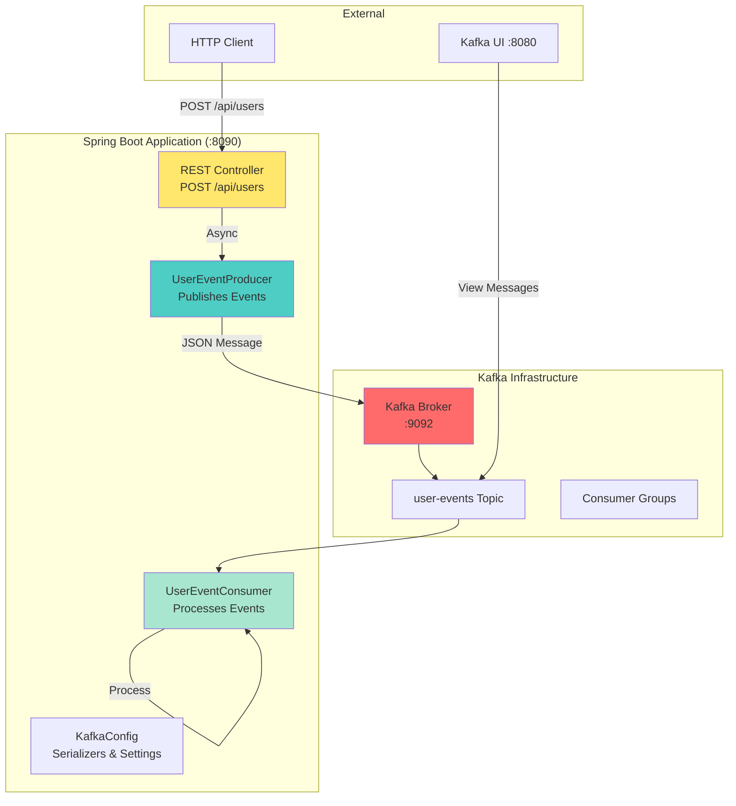

## 🔄 Event Flow Deep Dive

### Producer Flow
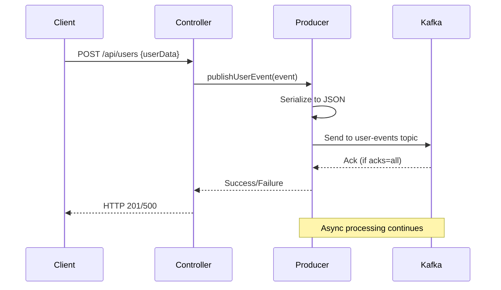

### Consumer Flow
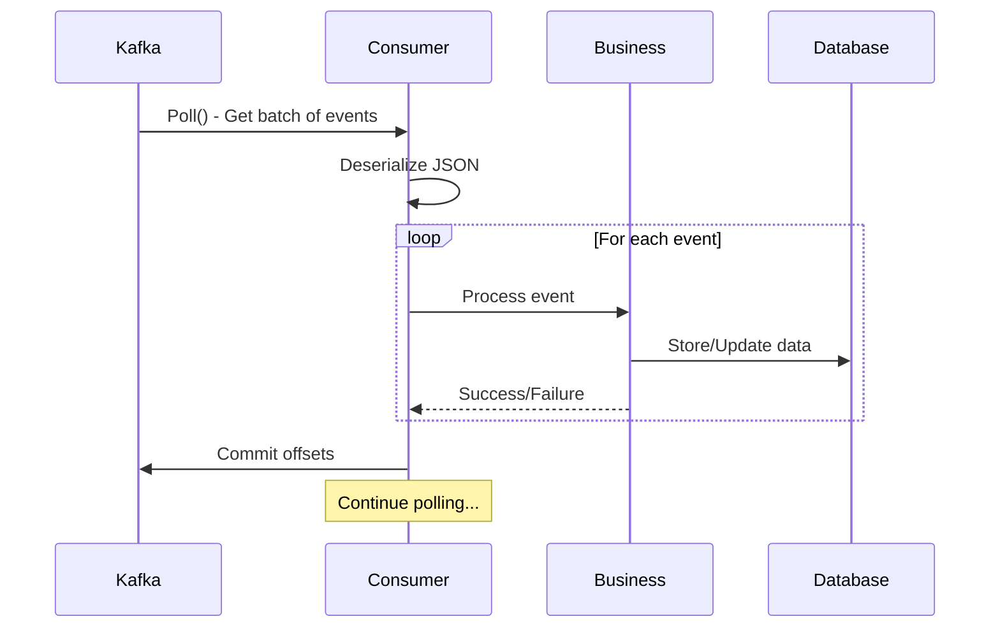

## 🛠️ Spring Boot Kafka Integration

### Dependency Configuration

```kotlin
dependencies {
    implementation("org.springframework.boot:spring-boot-starter-web")
    implementation("org.springframework.kafka:spring-kafka")
    implementation("com.fasterxml.jackson.module:jackson-module-kotlin")
}
```

### Application Configuration

```yaml
spring:
  kafka:
    bootstrap-servers: localhost:9092
    producer:
      key-serializer: org.apache.kafka.common.serialization.StringSerializer
      value-serializer: org.springframework.kafka.support.serializer.JsonSerializer
      acks: all
      retries: 3
    consumer:
      group-id: user-service-group
      key-deserializer: org.apache.kafka.common.serialization.StringDeserializer
      value-deserializer: org.springframework.kafka.support.serializer.JsonDeserializer
      auto-offset-reset: earliest
      properties:
        spring.json.trusted.packages: "com.learning.KafkaStarter.model"
```

## 📊 Event Model Design

### User Event Structure
```kotlin
data class UserEvent(
    val eventId: String,
    val eventType: String, // USER_CREATED, USER_UPDATED, USER_DELETED
    val userId: String,
    val username: String,
    val email: String,
    val timestamp: Long = Instant.now().toEpochMilli(),
    val metadata: Map<String, Any> = emptyMap()
)
```

### JSON Serialization Example
```json
{
  "eventId": "user-evt-123",
  "eventType": "USER_CREATED",
  "userId": "user-456",
  "username": "john_doe",
  "email": "john@example.com",
  "timestamp": 1645123456789,
  "metadata": {
    "source": "web-ui",
    "version": "1.0"
  }
}
```

## 🚀 Producer Implementation Patterns

### KafkaTemplate Usage
```kotlin
@Service
class UserEventProducer(
    private val kafkaTemplate: KafkaTemplate<String, UserEvent>
) {
    fun publishUserEvent(event: UserEvent): CompletableFuture<SendResult<String, UserEvent>> {
        return kafkaTemplate.send("user-events", event.userId, event)
    }
}
```

### Error Handling & Callbacks
```kotlin
fun publishWithCallback(event: UserEvent) {
    kafkaTemplate.send("user-events", event.userId, event)
        .whenComplete { result, throwable ->
            if (throwable == null) {
                val metadata = result.recordMetadata
                logger.info("Event sent: topic=${metadata.topic()}, " +
                    "partition=${metadata.partition()}, offset=${metadata.offset()}")
            } else {
                logger.error("Failed to send event: ${event.eventId}", throwable)
            }
        }
}
```

## 🎯 Consumer Implementation Patterns

### @KafkaListener Annotation
```kotlin
@Service
class UserEventConsumer {
    
    @KafkaListener(topics = ["user-events"])
    fun handleUserEvent(
        @Payload event: UserEvent,
        @Header(KafkaHeaders.RECEIVED_TOPIC) topic: String,
        @Header(KafkaHeaders.RECEIVED_PARTITION_ID) partition: Int,
        @Header(KafkaHeaders.OFFSET) offset: Long
    ) {
        logger.info("Processing event: ${event.eventId} from $topic:$partition:$offset")
        processUserEvent(event)
    }
}
```

### Manual Acknowledgment (Advanced)
```kotlin
@KafkaListener(
    topics = ["user-events"],
    containerFactory = "manualAckContainerFactory"
)
fun handleWithManualAck(
    @Payload event: UserEvent,
    acknowledgment: Acknowledgment
) {
    try {
        processUserEvent(event)
        acknowledgment.acknowledge() // Manual commit
    } catch (e: Exception) {
        logger.error("Failed to process event: ${event.eventId}", e)
        // Don't acknowledge - message will be retried
    }
}
```

## 🔧 Configuration Deep Dive

### Producer Configuration Options
```kotlin
@Configuration
class KafkaProducerConfig {
    
    @Bean
    fun kafkaTemplate(): KafkaTemplate<String, Any> {
        val props = mapOf(
            ProducerConfig.BOOTSTRAP_SERVERS_CONFIG to "localhost:9092",
            ProducerConfig.KEY_SERIALIZER_CLASS_CONFIG to StringSerializer::class.java,
            ProducerConfig.VALUE_SERIALIZER_CLASS_CONFIG to JsonSerializer::class.java,
            ProducerConfig.ACKS_CONFIG to "all",
            ProducerConfig.RETRIES_CONFIG to 3,
            ProducerConfig.ENABLE_IDEMPOTENCE_CONFIG to true,
            ProducerConfig.MAX_IN_FLIGHT_REQUESTS_PER_CONNECTION to 1
        )
        
        return KafkaTemplate(DefaultKafkaProducerFactory(props))
    }
}
```

### Consumer Configuration Options
```kotlin
@Configuration
class KafkaConsumerConfig {
    
    @Bean
    fun consumerFactory(): ConsumerFactory<String, UserEvent> {
        val props = mapOf(
            ConsumerConfig.BOOTSTRAP_SERVERS_CONFIG to "localhost:9092",
            ConsumerConfig.GROUP_ID_CONFIG to "user-service-group",
            ConsumerConfig.KEY_DESERIALIZER_CLASS_CONFIG to StringDeserializer::class.java,
            ConsumerConfig.VALUE_DESERIALIZER_CLASS_CONFIG to JsonDeserializer::class.java,
            ConsumerConfig.AUTO_OFFSET_RESET_CONFIG to "earliest",
            ConsumerConfig.ENABLE_AUTO_COMMIT_CONFIG to true,
            ConsumerConfig.AUTO_COMMIT_INTERVAL_MS_CONFIG to 1000,
            JsonDeserializer.TRUSTED_PACKAGES to "com.learning.KafkaStarter.model"
        )
        
        return DefaultKafkaConsumerFactory(props)
    }
}
```

## 🛡️ Error Handling Strategies

### Retry Configuration
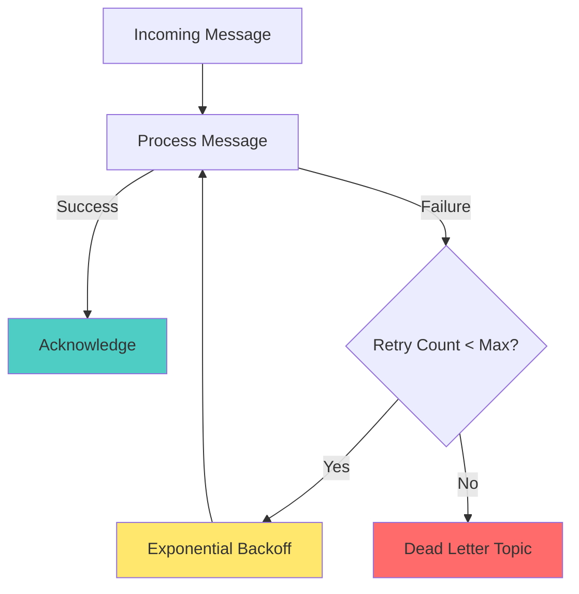

### Exception Handling
```kotlin
@KafkaListener(topics = ["user-events"])
fun handleUserEvent(event: UserEvent) {
    try {
        processUserEvent(event)
    } catch (e: RetryableException) {
        logger.warn("Retryable error processing ${event.eventId}", e)
        throw e // Let Spring Kafka retry
    } catch (e: NonRetryableException) {
        logger.error("Non-retryable error processing ${event.eventId}", e)
        // Log and move on - don't retry
    }
}
```

## 📊 Monitoring & Observability

### Key Metrics to Track
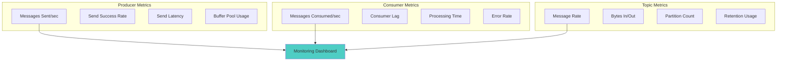

### Health Check Implementation
```kotlin
@Component
class KafkaHealthIndicator : HealthIndicator {
    
    @Autowired
    private lateinit var kafkaAdmin: KafkaAdmin
    
    override fun health(): Health {
        return try {
            AdminClient.create(kafkaAdmin.configurationProperties).use { client ->
                val metadata = client.describeCluster()
                val brokers = metadata.nodes().get(5, TimeUnit.SECONDS)
                
                if (brokers.isNotEmpty()) {
                    Health.up()
                        .withDetail("brokers", brokers.size)
                        .withDetail("clusterId", metadata.clusterId().get())
                        .build()
                } else {
                    Health.down().withDetail("reason", "No brokers available").build()
                }
            }
        } catch (e: Exception) {
            Health.down(e).build()
        }
    }
}
```

## 🧪 Testing Strategies

### Integration Testing with Embedded Kafka
```kotlin
@SpringBootTest
@EmbeddedKafka(partitions = 1, topics = ["user-events"])
class UserEventIntegrationTest {
    
    @Autowired
    private lateinit var userEventProducer: UserEventProducer
    
    @Test
    fun `should send and receive user event`() {
        val event = UserEvent(
            eventId = "test-123",
            eventType = "USER_CREATED",
            userId = "user-456",
            username = "testuser",
            email = "test@example.com"
        )
        
        userEventProducer.publishUserEvent(event)
        
        // Assert event was consumed and processed
        // (Implementation depends on your consumer logic)
    }
}
```

## 🎯 Best Practices

### Message Design
- **Use meaningful event types** (USER_CREATED vs CREATED)
- **Include correlation IDs** for tracing
- **Add timestamps** for temporal ordering
- **Version your messages** for schema evolution
- **Keep events immutable** and self-contained

### Producer Best Practices
- **Use idempotent producers** (`enable.idempotence=true`)
- **Configure appropriate `acks`** level for durability
- **Handle send failures** gracefully
- **Use message keys** for partition assignment
- **Monitor send metrics** for performance

### Consumer Best Practices
- **Design idempotent consumers** - handle duplicate messages
- **Use consumer groups** for parallel processing
- **Handle deserialization errors** gracefully
- **Monitor consumer lag** for performance
- **Implement proper error handling** and retry logic

## ✅ Success Criteria

You've mastered this lesson when you can:
- [ ] Configure Spring Boot with Kafka dependencies
- [ ] Implement a producer that sends JSON events
- [ ] Implement a consumer that processes events
- [ ] Handle serialization/deserialization correctly
- [ ] Add proper error handling and monitoring
- [ ] Test the complete flow end-to-end
- [ ] Monitor events through Kafka UI

## 🚀 What's Next?

Now that you can produce and consume events, let's dive deeper into Kafka's storage model!

**Next**: [Lesson 4 - Topics, Partitions & Offsets](../lesson_4/topic.md) where you'll master how Kafka stores and distributes your events for optimal performance and scalability.

---

*"Your first Kafka application is running! You've crossed the threshold from theory to practice. Now let's optimize how your events are stored and processed."*


# Concept

## Topics, Partitions & Offsets - Kafka's Storage Model

## 🎯 Learning Objectives

By the end of this lesson, you will:
- **Master** Kafka's storage architecture: topics, partitions, and offsets
- **Design** optimal topic structures for performance and scalability
- **Implement** effective partitioning strategies for your use cases
- **Manage** consumer offsets for reliable message processing
- **Optimize** partition distribution and consumer group coordination
- **Monitor** topic health and partition performance

## 🏗️ Kafka Storage Architecture Deep Dive

Understanding Kafka's storage model is crucial for building scalable, performant applications:

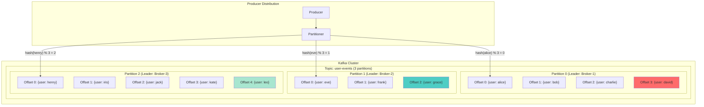

## 📚 Core Concepts

### **Topics**: Logical Event Categories
- **Named streams** of related events (e.g., `user-events`, `order-events`, `payment-events`)
- **Logical abstraction** over physical storage
- **Configurable retention** based on time, size, or compaction
- **Schema evolution** support through versioning

### **Partitions**: Physical Storage & Parallelism Units
- **Ordered, immutable** sequence of records within each partition
- **Parallel processing** - each partition can be consumed independently
- **Fault tolerance** - replicated across multiple brokers
- **Load distribution** - enables horizontal scaling

### **Offsets**: Message Position Tracking
- **Sequential, unique** identifiers within each partition
- **Monotonically increasing** - never decrease within a partition
- **Consumer progress** tracking mechanism
- **Replay capability** - consumers can reset and reprocess from any offset

## 🔄 Producer Partitioning Strategies

### 1. **Key-Based Partitioning (Default)**
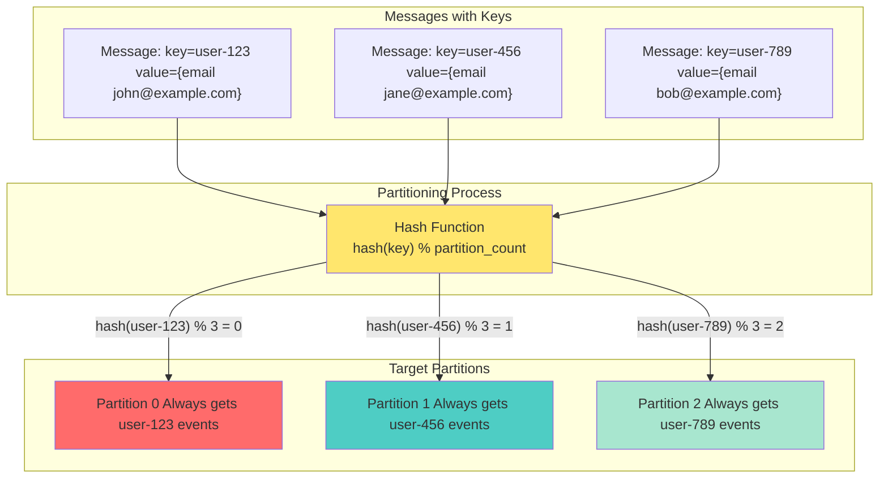

**Benefits:**
- **Ordering guarantee** - all events for the same key go to the same partition
- **Stateful processing** - related events stay together
- **Partition affinity** - enables stateful stream processing

**Use Cases:**
- User activity tracking (key = userId)
- Order processing (key = orderId)
- Account transactions (key = accountId)

### 2. **Round-Robin Partitioning**
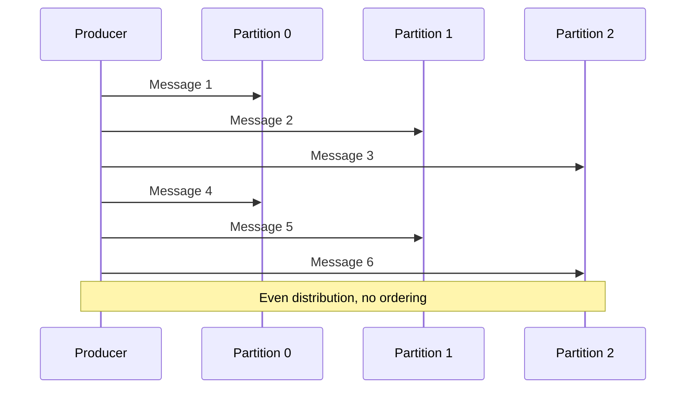

**Benefits:**
- **Even distribution** across all partitions
- **Maximum throughput** - utilizes all partitions equally
- **Load balancing** - prevents hot partitions

**Use Cases:**
- Metrics and logging (order doesn't matter)
- Bulk data ingestion
- Analytics events

### 3. **Custom Partitioning**
```kotlin
class GeographicPartitioner : Partitioner {
    override fun partition(
        topic: String,
        key: Any?,
        keyBytes: ByteArray?,
        value: Any?,
        valueBytes: ByteArray?,
        cluster: Cluster
    ): Int {
        val userLocation = extractLocation(value)
        return when (userLocation.region) {
            "US" -> 0
            "EU" -> 1
            "ASIA" -> 2
            else -> 3
        }
    }
}
```

## 🎯 Consumer Groups & Partition Assignment

### Consumer Group Coordination
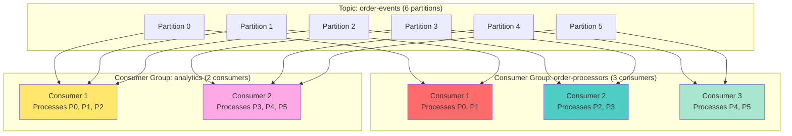

### Partition Assignment Strategies

1. **Range Assignment** (Default)
    - Assigns continuous ranges of partitions to consumers
    - Good for ordered processing within consumer

2. **Round-Robin Assignment**
    - Distributes partitions evenly across consumers
    - Better load balancing for varying partition sizes

3. **Sticky Assignment**
    - Minimizes partition reassignment during rebalancing
    - Reduces state transfer in stateful applications

## 📊 Offset Management Strategies

### Automatic vs Manual Offset Management
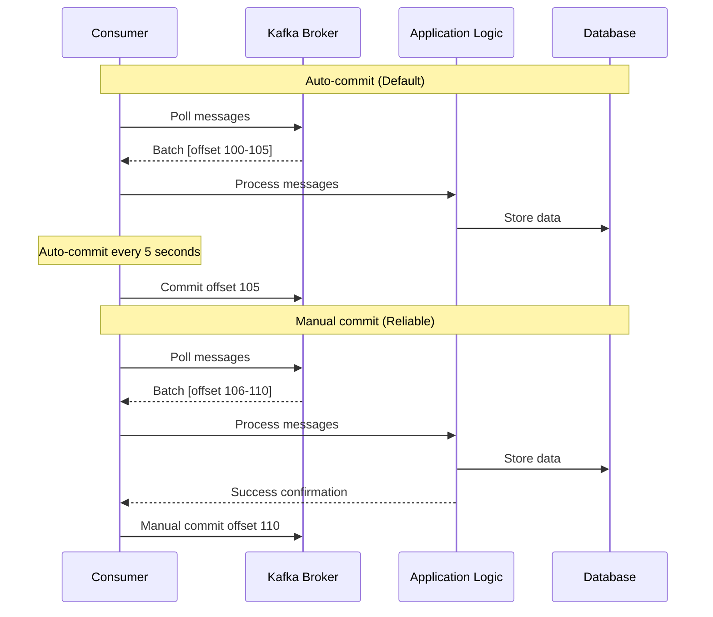

### Offset Commit Patterns

#### 1. **Auto-Commit (Simple)**
```kotlin
@KafkaListener(topics = ["user-events"])
fun handleUserEvent(event: UserEvent) {
    // Process event
    processUserEvent(event)
    // Offset automatically committed every 5 seconds
}
```

#### 2. **Manual Sync Commit (Reliable)**
```kotlin
@KafkaListener(
    topics = ["user-events"],
    containerFactory = "manualCommitContainerFactory"
)
fun handleUserEventManual(
    event: UserEvent,
    acknowledgment: Acknowledgment
) {
    try {
        processUserEvent(event)
        acknowledgment.acknowledge() // Sync commit
    } catch (e: Exception) {
        // Don't commit - message will be redelivered
        logger.error("Processing failed for ${event.eventId}", e)
    }
}
```

#### 3. **Batch Commit (Performance)**
```kotlin
@KafkaListener(topics = ["user-events"])
fun handleUserEventBatch(events: List<UserEvent>) {
    events.forEach { event ->
        try {
            processUserEvent(event)
        } catch (e: Exception) {
            logger.error("Failed to process ${event.eventId}", e)
            // Handle individual failures
        }
    }
    // Commit after entire batch
}
```

## 🎛️ Topic Configuration & Management

### Essential Topic Configurations
```kotlin
val topicConfig = mapOf(
    // Retention settings
    TopicConfig.RETENTION_MS_CONFIG to "604800000", // 7 days
    TopicConfig.RETENTION_BYTES_CONFIG to "1073741824", // 1GB
    
    // Performance settings
    TopicConfig.COMPRESSION_TYPE_CONFIG to "lz4",
    TopicConfig.MIN_IN_SYNC_REPLICAS_CONFIG to "2",
    
    // Cleanup settings
    TopicConfig.CLEANUP_POLICY_CONFIG to "delete", // or "compact"
    TopicConfig.DELETE_RETENTION_MS_CONFIG to "86400000", // 1 day
    
    // Segment settings
    TopicConfig.SEGMENT_MS_CONFIG to "604800000", // 7 days
    TopicConfig.SEGMENT_BYTES_CONFIG to "1073741824" // 1GB
)
```

### Partition Sizing Guidelines

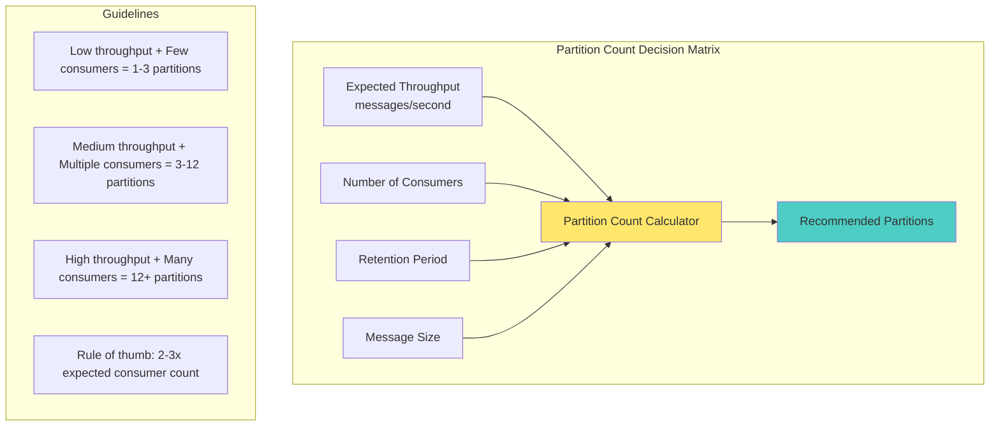

**Best Practices:**
- **Start small**: Begin with 3-6 partitions
- **Plan for growth**: Consider 2-3x expected consumer count
- **Monitor performance**: Adjust based on throughput needs
- **Avoid over-partitioning**: Too many partitions increase overhead

## 📈 Performance Optimization

### Partition Distribution Monitoring
```mermaid
graph TB
    subgraph "Healthy Partition Distribution"
        HP0[Partition 0: 1000 messages]
        HP1[Partition 1: 980 messages]
        HP2[Partition 2: 1020 messages]
        BALANCED[✅ Balanced Load]
    end
    
    subgraph "Unhealthy Partition Distribution"
        UP0[Partition 0: 50 messages]
        UP1[Partition 1: 2000 messages]
        UP2[Partition 2: 100 messages]
        HOTSPOT[❌ Hot Partition]
    end
    
    HP0 --> BALANCED
    HP1 --> BALANCED
    HP2 --> BALANCED
    
    UP0 --> HOTSPOT
    UP1 --> HOTSPOT
    UP2 --> HOTSPOT
    
    style BALANCED fill:#4ecdc4
    style HOTSPOT fill:#ff6b6b
```

### Consumer Lag Monitoring
```kotlin
@Component
class ConsumerLagMonitor {
    
    fun checkConsumerLag(groupId: String): Map<String, Long> {
        AdminClient.create(adminConfig).use { admin ->
            val groupDescription = admin.describeConsumerGroups(listOf(groupId))
                .all().get()
            
            val memberAssignments = groupDescription[groupId]!!.members()
                .flatMap { it.assignment().topicPartitions() }
            
            val endOffsets = admin.listOffsets(
                memberAssignments.associateWith { 
                    OffsetSpec.latest() 
                }
            ).all().get()
            
            val groupOffsets = admin.listConsumerGroupOffsets(groupId)
                .partitionsToOffsetAndMetadata().get()
            
            return memberAssignments.associate { tp ->
                val endOffset = endOffsets[tp]?.offset() ?: 0
                val currentOffset = groupOffsets[tp]?.offset() ?: 0
                val lag = endOffset - currentOffset
                "${tp.topic()}-${tp.partition()}" to lag
            }
        }
    }
}
```

## 🛡️ Fault Tolerance & Recovery

### Partition Leadership & Replication
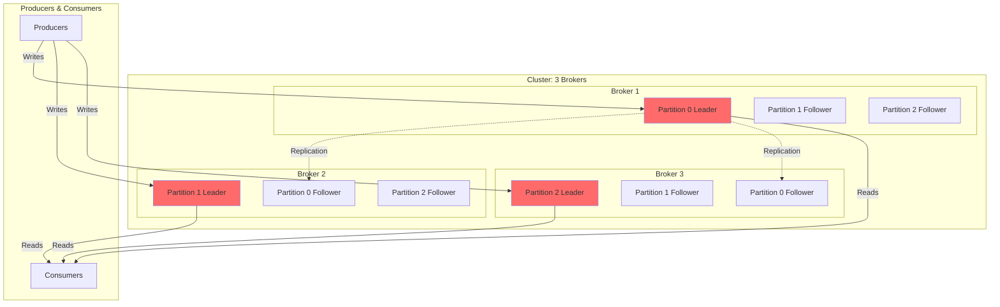

### Recovery Scenarios

#### **Broker Failure Recovery**
1. **Leader election** for affected partitions
2. **ISR (In-Sync Replica)** promotes to leader
3. **Producers/consumers** automatically reconnect
4. **No data loss** if `min.insync.replicas` configured properly

#### **Consumer Recovery**
1. **Group rebalancing** triggered
2. **Partitions reassigned** to remaining consumers
3. **Processing resumes** from last committed offset
4. **Duplicate processing** possible if manual commit used

## 🔍 Monitoring & Observability

### Key Metrics Dashboard
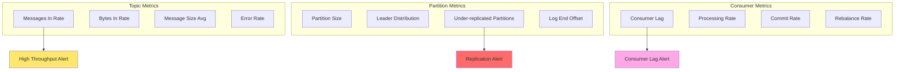

### Health Check Implementation
```kotlin
@Service
class TopicHealthService {
    
    fun checkTopicHealth(topicName: String): TopicHealthReport {
        return AdminClient.create(adminConfig).use { admin ->
            val topicDescription = admin.describeTopics(listOf(topicName))
                .allTopicNames().get()[topicName]!!
            
            val issues = mutableListOf<String>()
            
            // Check partition health
            topicDescription.partitions().forEach { partition ->
                if (partition.leader() == null) {
                    issues.add("Partition ${partition.partition()} has no leader")
                }
                
                val inSyncReplicas = partition.isr().size
                val totalReplicas = partition.replicas().size
                if (inSyncReplicas < totalReplicas) {
                    issues.add("Partition ${partition.partition()} under-replicated")
                }
            }
            
            TopicHealthReport(
                topicName = topicName,
                partitionCount = topicDescription.partitions().size,
                isHealthy = issues.isEmpty(),
                issues = issues
            )
        }
    }
}
```

## ✅ Best Practices Summary

### Topic Design
- **Use descriptive names** with consistent naming conventions
- **Plan partition count** for future scale (start with 3-6, grow as needed)
- **Choose retention policies** based on business requirements
- **Group related events** in the same topic when possible

### Partitioning Strategy
- **Use meaningful keys** for related event ordering
- **Avoid hot partitions** through good key distribution
- **Monitor partition balance** and consumer lag regularly
- **Consider custom partitioners** for specific business logic

### Consumer Design
- **Design idempotent consumers** to handle duplicate messages
- **Use appropriate commit strategies** based on delivery guarantees needed
- **Monitor consumer lag** to ensure keeping up with production
- **Handle rebalancing gracefully** in consumer code

### Operations
- **Monitor key metrics** (throughput, lag, errors, partition health)
- **Set up alerting** for critical issues (under-replication, high lag)
- **Plan for failures** with proper replication and recovery procedures
- **Test disaster recovery** scenarios regularly

## 🚀 What's Next?

You've mastered Kafka's storage fundamentals! Now let's add structure to your events with schemas.

**Next**: [Lesson 5 - Schema Registry & Evolution](../lesson_5/concept.md) where you'll learn to manage data formats, ensure compatibility, and evolve your event schemas safely over time.

---

*"Understanding how Kafka stores and distributes your data is the key to building scalable, reliable systems. With topics, partitions, and offsets mastered, you're ready to add structure and evolution to your events!"*
