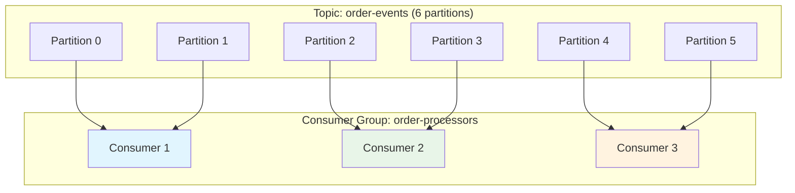
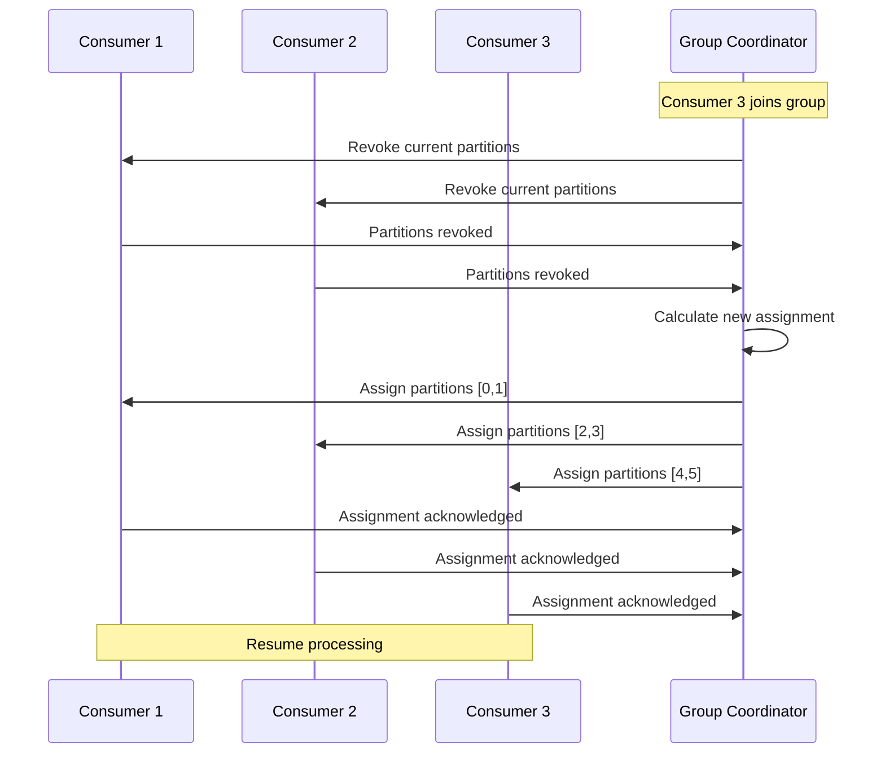
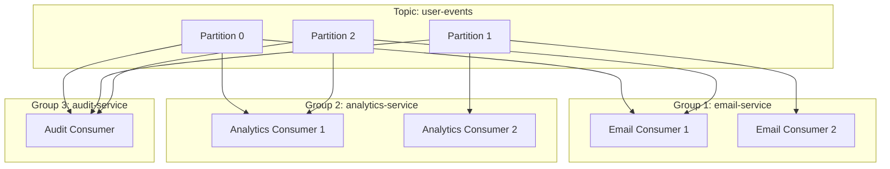

# Concept

## Consumer Groups & Load Balancing - Scaling Kafka Consumers

## 🎯 Objective

Master consumer groups for horizontal scaling, fault tolerance, and load balancing in Kafka applications. Learn partition assignment strategies, rebalancing protocols, and production scaling patterns.

## 🧱 **Consumer Groups: The Scaling Foundation**

Consumer groups enable **horizontal scaling** by distributing partition consumption across multiple consumer instances.



**Key Benefits:**
- ✅ **Parallel processing** - Multiple consumers process simultaneously
- ✅ **Fault tolerance** - Failed consumers trigger rebalancing
- ✅ **Elastic scaling** - Add/remove consumers dynamically
- ✅ **Load distribution** - Even partition assignment across consumers

## 🔄 **Consumer Group Mechanics**

### 1. **Group Membership & Coordination**

```kotlin
@KafkaListener(
    topics = ["order-events"],
    groupId = "order-processing-group", // Consumer group identifier
    concurrency = "3"                  // Number of consumer threads
)
fun processOrder(
    @Payload order: OrderEvent,
    @Header(KafkaHeaders.RECEIVED_PARTITION) partition: Int,
    @Header(KafkaHeaders.CONSUMER_ID) consumerId: String
) {
    logger.info("Consumer $consumerId processing order from partition $partition")
    // Process order
}
```

### 2. **Partition Assignment Strategies**

#### **Range Assignor (Default)**
```
Topic: orders (partitions 0-5), 3 consumers
Consumer 1: [0, 1]    # First 2 partitions
Consumer 2: [2, 3]    # Next 2 partitions  
Consumer 3: [4, 5]    # Last 2 partitions
```

#### **Round Robin Assignor**
```
Topic: orders (partitions 0-5), 3 consumers  
Consumer 1: [0, 3]    # Every 3rd partition starting from 0
Consumer 2: [1, 4]    # Every 3rd partition starting from 1
Consumer 3: [2, 5]    # Every 3rd partition starting from 2
```

#### **Sticky Assignor**
```
# Minimizes partition movement during rebalancing
Initial:  C1:[0,1], C2:[2,3], C3:[4,5]
C2 fails: C1:[0,1], C3:[2,4,5]  # Sticky keeps existing assignments
```

### 3. **Configuration for Different Strategies**

```yaml
spring:
  kafka:
    consumer:
      group-id: order-processing-group
      properties:
        # Range Assignor (default)
        partition.assignment.strategy: org.apache.kafka.clients.consumer.RangeAssignor
        
        # Round Robin Assignor
        # partition.assignment.strategy: org.apache.kafka.clients.consumer.RoundRobinAssignor
        
        # Sticky Assignor (best for rebalancing)
        # partition.assignment.strategy: org.apache.kafka.clients.consumer.StickyAssignor
        
        # Cooperative Sticky (incremental rebalancing)
        # partition.assignment.strategy: org.apache.kafka.clients.consumer.CooperativeStickyAssignor
```

## ⚖️ **Consumer Rebalancing Deep Dive**

### 1. **Rebalancing Triggers**
- **New consumer joins** the group
- **Existing consumer leaves** (graceful shutdown)
- **Consumer failure** (heartbeat timeout)
- **Topic metadata changes** (partition addition)

### 2. **Rebalancing Process**



### 3. **Rebalancing Listener Implementation**

```kotlin
@Component
class RebalanceAwareConsumer : ConsumerRebalanceListener {
    
    private val logger = LoggerFactory.getLogger(RebalanceAwareConsumer::class.java)
    
    override fun onPartitionsRevoked(partitions: Collection<TopicPartition>) {
        logger.info("Partitions revoked: {}", partitions.map { "${it.topic()}-${it.partition()}" })
        
        // Graceful shutdown: finish processing current messages
        finishCurrentProcessing()
        
        // Commit any pending offsets
        commitPendingOffsets()
        
        // Clean up resources
        cleanupResources(partitions)
    }
    
    override fun onPartitionsAssigned(partitions: Collection<TopicPartition>) {
        logger.info("Partitions assigned: {}", partitions.map { "${it.topic()}-${it.partition()}" })
        
        // Initialize resources for new partitions
        initializeResources(partitions)
        
        // Set up state for new assignments
        setupPartitionState(partitions)
    }
    
    @KafkaListener(
        topics = ["order-events"],
        groupId = "rebalance-aware-group"
    )
    fun processOrder(
        @Payload order: OrderEvent,
        @Header(KafkaHeaders.RECEIVED_PARTITION) partition: Int,
        acknowledgment: Acknowledgment
    ) {
        try {
            // Process order
            orderService.processOrder(order)
            
            // Acknowledge after successful processing
            acknowledgment.acknowledge()
            
        } catch (e: Exception) {
            logger.error("Failed to process order: ${order.orderId}", e)
            // Don't acknowledge - message will be retried
        }
    }
}
```

## 📊 **Scaling Patterns & Best Practices**

### 1. **Optimal Consumer Count**

```kotlin
// Rule of thumb: consumers ≤ partitions
val topicPartitions = 12
val optimalConsumers = min(topicPartitions, availableCpuCores)

// Over-provisioning consumers wastes resources
val consumers = 15  // ❌ Only 12 will be active
val consumers = 8   // ✅ All consumers active, room for scaling
```

### 2. **Consumer Configuration for Scaling**

```yaml
spring:
  kafka:
    consumer:
      # Faster rebalancing
      session-timeout-ms: 10000      # Default: 30000
      heartbeat-interval-ms: 3000    # Default: 3000
      
      # Processing optimization  
      max-poll-records: 100          # Default: 500
      max-poll-interval-ms: 300000   # Default: 300000
      
      # Memory and performance
      fetch-min-size: 50000          # Default: 1
      fetch-max-wait-ms: 500         # Default: 500
```

### 3. **Dynamic Scaling Implementation**

```kotlin
@Component
class DynamicConsumerScaler {
    
    @Autowired
    private lateinit var kafkaListenerEndpointRegistry: KafkaListenerEndpointRegistry
    
    @Scheduled(fixedRate = 60000) // Check every minute
    fun checkAndScale() {
        val consumerLag = getConsumerLag("order-processing-group")
        val currentConcurrency = getCurrentConcurrency()
        
        when {
            consumerLag > 1000 && currentConcurrency < maxConcurrency -> {
                scaleUp()
                logger.info("Scaled up consumers due to high lag: $consumerLag")
            }
            consumerLag < 100 && currentConcurrency > minConcurrency -> {
                scaleDown()
                logger.info("Scaled down consumers due to low lag: $consumerLag")
            }
        }
    }
    
    private fun scaleUp() {
        val container = kafkaListenerEndpointRegistry.getListenerContainer("order-processor")
        container?.let {
            it.concurrency = it.concurrency + 1
            logger.info("Increased concurrency to: ${it.concurrency}")
        }
    }
    
    private fun scaleDown() {
        val container = kafkaListenerEndpointRegistry.getListenerContainer("order-processor")
        container?.let {
            if (it.concurrency > 1) {
                it.concurrency = it.concurrency - 1
                logger.info("Decreased concurrency to: ${it.concurrency}")
            }
        }
    }
}
```

## 🔧 **Advanced Consumer Group Management**

### 1. **Multiple Consumer Groups per Topic**



```kotlin
// Email service consumer
@KafkaListener(
    topics = ["user-events"],
    groupId = "email-service-group"
)
fun processForEmail(@Payload event: UserEvent) {
    emailService.sendWelcomeEmail(event)
}

// Analytics service consumer
@KafkaListener(
    topics = ["user-events"],
    groupId = "analytics-service-group"
)
fun processForAnalytics(@Payload event: UserEvent) {
    analyticsService.trackUserEvent(event)
}

// Audit service consumer
@KafkaListener(
    topics = ["user-events"],
    groupId = "audit-service-group"
)
fun processForAudit(@Payload event: UserEvent) {
    auditService.logUserEvent(event)
}
```

### 2. **Consumer Group Monitoring**

```kotlin
@Component
class ConsumerGroupMonitor {
    
    @Autowired
    private lateinit var adminClient: AdminClient
    
    fun getConsumerGroupInfo(groupId: String): ConsumerGroupInfo {
        val groupDescription = adminClient.describeConsumerGroups(listOf(groupId))
            .all()
            .get()
            .getValue(groupId)
        
        val groupOffsets = adminClient.listConsumerGroupOffsets(groupId)
            .partitionsToOffsetAndMetadata()
            .get()
        
        return ConsumerGroupInfo(
            groupId = groupId,
            state = groupDescription.state().toString(),
            members = groupDescription.members().map { member ->
                ConsumerMemberInfo(
                    memberId = member.consumerId(),
                    clientId = member.clientId(),
                    host = member.host(),
                    assignment = member.assignment().topicPartitions().map { 
                        "${it.topic()}-${it.partition()}" 
                    }
                )
            },
            totalLag = calculateTotalLag(groupOffsets)
        )
    }
    
    @Scheduled(fixedRate = 30000)
    fun monitorConsumerGroups() {
        val groups = listOf("email-service-group", "analytics-service-group", "audit-service-group")
        
        groups.forEach { groupId ->
            try {
                val info = getConsumerGroupInfo(groupId)
                logger.info("Consumer group $groupId: state=${info.state}, members=${info.members.size}, lag=${info.totalLag}")
                
                if (info.totalLag > 1000) {
                    logger.warn("High consumer lag detected for group $groupId: ${info.totalLag}")
                    // Trigger alert or scaling action
                }
                
            } catch (e: Exception) {
                logger.error("Failed to monitor consumer group $groupId", e)
            }
        }
    }
}
```

### 3. **Consumer Group Reset & Management**

```kotlin
@RestController
@RequestMapping("/api/consumer-groups")
class ConsumerGroupController {
    
    @Autowired
    private lateinit var adminClient: AdminClient
    
    @PostMapping("/{groupId}/reset")
    fun resetConsumerGroup(
        @PathVariable groupId: String,
        @RequestParam strategy: ResetStrategy = ResetStrategy.EARLIEST
    ): ResponseEntity<String> {
        
        return try {
            // Stop consumers first (in production, coordinate this carefully)
            stopConsumers(groupId)
            
            // Reset offsets based on strategy
            when (strategy) {
                ResetStrategy.EARLIEST -> resetToEarliest(groupId)
                ResetStrategy.LATEST -> resetToLatest(groupId)
                ResetStrategy.TIMESTAMP -> resetToTimestamp(groupId, Instant.now().minusSeconds(3600))
            }
            
            ResponseEntity.ok("Consumer group $groupId reset successfully")
            
        } catch (e: Exception) {
            ResponseEntity.status(500).body("Failed to reset consumer group: ${e.message}")
        }
    }
    
    @GetMapping("/{groupId}/lag")
    fun getConsumerGroupLag(@PathVariable groupId: String): ResponseEntity<Map<String, Long>> {
        return try {
            val lag = calculateConsumerGroupLag(groupId)
            ResponseEntity.ok(lag)
        } catch (e: Exception) {
            ResponseEntity.status(500).body(emptyMap())
        }
    }
}
```

## ⚠️ **Common Pitfalls & Solutions**

### 1. **Rebalancing Storms**

```kotlin
// ❌ Problem: Frequent rebalancing due to long processing
@KafkaListener(topics = ["slow-topic"])
fun slowProcessor(event: Event) {
    Thread.sleep(60000) // 1 minute processing
    // Exceeds max.poll.interval.ms, triggers rebalancing
}

// ✅ Solution: Optimize processing or increase timeout
@KafkaListener(topics = ["slow-topic"])
fun optimizedProcessor(event: Event) {
    // Break down processing into smaller chunks
    processInChunks(event)
    
    // Or increase max.poll.interval.ms in configuration
}
```

### 2. **Uneven Partition Distribution**

```kotlin
// ❌ Problem: Hot partitions with uneven load
val userKey = event.userId // Some users much more active

// ✅ Solution: Better partition key strategy
val partitionKey = "${event.userId}-${event.timestamp % 1000}" // Spread load
```

### 3. **Consumer Lag Accumulation**

```kotlin
// ❌ Problem: Single slow consumer blocks entire group
@KafkaListener(topics = ["mixed-load-topic"], concurrency = "1")
fun slowConsumer(event: Event) { /* slow processing */ }

// ✅ Solution: Separate fast and slow processing
@KafkaListener(topics = ["fast-events"], concurrency = "5")
fun fastConsumer(event: FastEvent) { /* quick processing */ }

@KafkaListener(topics = ["slow-events"], concurrency = "2")  
fun slowConsumer(event: SlowEvent) { /* deliberate slow processing */ }
```

## 📈 **Performance Optimization**

### 1. **Batching for Efficiency**

```kotlin
@Component
class BatchProcessor {
    
    private val batch = mutableListOf<OrderEvent>()
    private val batchSize = 100
    
    @KafkaListener(topics = ["orders"])
    fun processOrder(@Payload event: OrderEvent, acknowledgment: Acknowledgment) {
        synchronized(batch) {
            batch.add(event)
            
            if (batch.size >= batchSize) {
                processBatch(batch.toList())
                batch.clear()
            }
        }
        
        acknowledgment.acknowledge()
    }
    
    @Scheduled(fixedRate = 5000) // Process remaining every 5 seconds
    fun processRemainingBatch() {
        synchronized(batch) {
            if (batch.isNotEmpty()) {
                processBatch(batch.toList())
                batch.clear()
            }
        }
    }
}
```

### 2. **Memory-Efficient Processing**

```yaml
spring:
  kafka:
    consumer:
      # Limit memory usage
      max-poll-records: 50           # Smaller batches
      fetch-max-bytes: 52428800      # 50MB max fetch
      
      # Optimize for throughput
      fetch-min-size: 100000         # Wait for more data
      fetch-max-wait-ms: 1000        # But not too long
```

## ✅ **Best Practices Summary**

### 🎯 **Consumer Group Design**
- **Align partitions with expected consumer count**
- **Use meaningful group IDs** that reflect business purpose
- **Plan for scaling** - start with fewer consumers than partitions
- **Monitor rebalancing frequency** and optimize accordingly

### ⚖️ **Rebalancing Optimization**
- **Use Cooperative Sticky Assignor** for minimal disruption
- **Implement graceful shutdown** in rebalance listeners
- **Optimize processing time** to avoid timeouts
- **Monitor and alert on rebalancing events**

### 📊 **Scaling Strategy**
- **Start small and scale up** based on lag monitoring
- **Use multiple small groups** rather than one large group
- **Implement automatic scaling** based on metrics
- **Test scaling scenarios** in development

### 🔍 **Monitoring & Alerting**
- **Track consumer lag** per partition and group
- **Monitor rebalancing frequency and duration**
- **Alert on consumer failures** and group instability
- **Measure processing throughput and latency**

## 🚀 **What's Next?**

You've mastered consumer scaling and load balancing! Next, learn how to handle failures gracefully in [Lesson 8: Retry Strategies & Dead Letter Topics](../lesson_8/concept.md), where you'll implement robust error handling and recovery patterns.

---

*Consumer groups are the foundation of scalable Kafka architectures. With proper group management and scaling strategies, you can build systems that handle millions of events while maintaining reliability and performance.*