# Concept

## Retry Strategies & Dead Letter Topics - Bulletproof Error Handling

## 🎯 Objective

Master robust error handling in Kafka applications through retry strategies, dead letter topics, and poison message management. Build resilient systems that gracefully handle failures while maintaining data integrity and system stability.

## ⚠️ **The Challenge: Failure is Inevitable**

In distributed systems, failures happen constantly:

```kotlin
@KafkaListener(topics = ["payment-events"])
fun processPayment(payment: PaymentEvent) {
    // What happens when these fail?
    val customer = customerService.getCustomer(payment.customerId)     // ❌ Customer service down
    val validation = fraudService.validatePayment(payment)            // ❌ Fraud service timeout  
    val result = paymentGateway.processPayment(payment)              // ❌ Gateway returns 503
    val notification = emailService.sendConfirmation(customer)        // ❌ Email service unavailable
}
```

**Without proper error handling:**
- 💥 **Message loss** - Failed messages disappear forever
- 🔄 **Infinite retries** - System gets stuck in retry loops
- 🐛 **Poison messages** - One bad message blocks entire topic
- 📊 **No visibility** - Failures happen silently

## 🛡️ **Error Handling Strategy Framework**

```mermaid
graph TB
    subgraph "Message Processing Pipeline"
        MSG[Incoming Message]
        PROC[Process Message]
        SUCCESS[✅ Success]
        FAIL[❌ Failure]
        
        subgraph "Error Classification"
            TEMP[Temporary Error<br/>Network timeout, Service unavailable]
            PERM[Permanent Error<br/>Invalid data, Business rule violation]
            POISON[Poison Message<br/>Malformed data, Serialization error]
        end
        
        subgraph "Retry Strategy"
            RETRY[Retry with Backoff]
            MAX[Max Retries Reached]
        end
        
        subgraph "Final Destination"
            DLT[Dead Letter Topic]
            ALERT[Alert & Monitor]
        end
    end
    
    MSG --> PROC
    PROC --> SUCCESS
    PROC --> FAIL
    
    FAIL --> TEMP
    FAIL --> PERM
    FAIL --> POISON
    
    TEMP --> RETRY
    RETRY --> PROC
    RETRY --> MAX
    
    PERM --> DLT
    POISON --> DLT
    MAX --> DLT
    
    DLT --> ALERT
```



## 🔄 **Retry Strategies & Implementation**

### 1. **Fixed Delay Retry**

```kotlin
@Component
class PaymentProcessor {
    
    @Retryable(
        value = [TemporaryException::class],
        maxAttempts = 3,
        backoff = Backoff(delay = 1000) // 1 second fixed delay
    )
    @KafkaListener(topics = ["payment-events"])
    fun processPayment(payment: PaymentEvent, acknowledgment: Acknowledgment) {
        try {
            // Process payment
            val result = paymentService.process(payment)
            
            // Acknowledge success
            acknowledgment.acknowledge()
            
        } catch (e: TemporaryException) {
            logger.warn("Temporary failure processing payment ${payment.id}, will retry", e)
            throw e // Trigger retry
            
        } catch (e: PermanentException) {
            logger.error("Permanent failure processing payment ${payment.id}, sending to DLT", e)
            sendToDeadLetterTopic(payment, e)
            acknowledgment.acknowledge() // Don't retry permanent errors
        }
    }
    
    @Recover
    fun recoverPayment(ex: TemporaryException, payment: PaymentEvent) {
        logger.error("Max retries exceeded for payment ${payment.id}, sending to DLT", ex)
        sendToDeadLetterTopic(payment, ex)
    }
}
```

### 2. **Exponential Backoff Retry**

```kotlin
@Component
class OrderProcessor {
    
    @Retryable(
        value = [RetryableException::class],
        maxAttempts = 5,
        backoff = Backoff(
            delay = 1000,      // Start with 1 second
            multiplier = 2.0,  // Double each time: 1s, 2s, 4s, 8s, 16s
            maxDelay = 30000   // Cap at 30 seconds
        )
    )
    @KafkaListener(topics = ["order-events"])
    fun processOrder(order: OrderEvent) {
        try {
            // Validate order
            orderValidator.validate(order)
            
            // Process with external service
            val result = externalOrderService.process(order)
            
            // Update inventory
            inventoryService.updateStock(order.items)
            
        } catch (e: ValidationException) {
            // Permanent error - don't retry
            throw PermanentException("Order validation failed", e)
            
        } catch (e: ServiceUnavailableException) {
            // Temporary error - retry with backoff
            throw RetryableException("External service unavailable", e)
        }
    }
}
```

### 3. **Custom Retry Logic with Manual Control**

```kotlin
@Component  
class CustomRetryProcessor {
    
    private val retryTemplate = RetryTemplate.builder()
        .maxAttempts(3)
        .exponentialBackoff(1000, 2.0, 10000)
        .retryOn(RetryableException::class.java)
        .build()
    
    @KafkaListener(topics = ["complex-events"])
    fun processComplexEvent(
        event: ComplexEvent,
        @Header(KafkaHeaders.RECEIVED_TOPIC) topic: String,
        @Header(KafkaHeaders.RECEIVED_PARTITION) partition: Int,
        @Header(KafkaHeaders.OFFSET) offset: Long,
        acknowledgment: Acknowledgment
    ) {
        try {
            retryTemplate.execute<Unit, Exception> { context ->
                logger.info("Processing attempt ${context.retryCount + 1} for event ${event.id}")
                
                // Complex processing logic
                processEvent(event)
                
                logger.info("Successfully processed event ${event.id}")
            }
            
            acknowledgment.acknowledge()
            
        } catch (e: Exception) {
            logger.error("All retries exhausted for event ${event.id}", e)
            
            // Send to dead letter topic with retry metadata
            sendToDeadLetterTopicWithMetadata(event, e, topic, partition, offset)
            acknowledgment.acknowledge()
        }
    }
}
```

## 💀 **Dead Letter Topics (DLT) Implementation**

### 1. **DLT Topic Naming Convention**

```
Original Topic: payment-events
Dead Letter Topic: payment-events.DLT

Original Topic: order-processing  
Dead Letter Topic: order-processing.DLT

Original Topic: user-notifications
Dead Letter Topic: user-notifications.DLT
```

### 2. **Enhanced DLT Message with Metadata**

```kotlin
data class DeadLetterMessage<T>(
    val originalMessage: T,
    val originalTopic: String,
    val originalPartition: Int,
    val originalOffset: Long,
    val failureTimestamp: Instant,
    val failureReason: String,
    val exceptionClass: String,
    val exceptionMessage: String,
    val stackTrace: String,
    val retryAttempts: Int,
    val processingHistory: List<ProcessingAttempt>
)

data class ProcessingAttempt(
    val attemptNumber: Int,
    val timestamp: Instant,
    val errorMessage: String,
    val processingDuration: Long
)
```

### 3. **DLT Producer Service**

```kotlin
@Component
class DeadLetterTopicProducer {
    
    @Autowired
    private lateinit var kafkaTemplate: KafkaTemplate<String, Any>
    
    fun <T> sendToDeadLetter(
        originalMessage: T,
        exception: Exception,
        originalTopic: String,
        partition: Int,
        offset: Long,
        retryAttempts: Int = 0,
        processingHistory: List<ProcessingAttempt> = emptyList()
    ) {
        val dltTopic = "$originalTopic.DLT"
        
        val deadLetterMessage = DeadLetterMessage(
            originalMessage = originalMessage,
            originalTopic = originalTopic,
            originalPartition = partition,
            originalOffset = offset,
            failureTimestamp = Instant.now(),
            failureReason = classifyFailure(exception),
            exceptionClass = exception.javaClass.simpleName,
            exceptionMessage = exception.message ?: "Unknown error",
            stackTrace = exception.stackTraceToString(),
            retryAttempts = retryAttempts,
            processingHistory = processingHistory
        )
        
        // Use original message key for DLT
        val messageKey = extractKey(originalMessage)
        
        kafkaTemplate.send(dltTopic, messageKey, deadLetterMessage)
            .thenAccept { result ->
                logger.info(
                    "Sent message to DLT: topic=$dltTopic, " +
                    "partition=${result.recordMetadata.partition()}, " +
                    "offset=${result.recordMetadata.offset()}"
                )
                
                // Update metrics
                updateDltMetrics(dltTopic, exception)
            }
            .exceptionally { failure ->
                logger.error("Failed to send message to DLT topic $dltTopic", failure)
                // This is critical - consider alerting
                alertDltFailure(dltTopic, originalMessage, failure)
                null
            }
    }
    
    private fun classifyFailure(exception: Exception): String {
        return when (exception) {
            is ValidationException -> "VALIDATION_ERROR"
            is BusinessRuleException -> "BUSINESS_RULE_VIOLATION"
            is SerializationException -> "SERIALIZATION_ERROR"
            is TimeoutException -> "TIMEOUT_ERROR"
            is SecurityException -> "SECURITY_ERROR"
            else -> "UNKNOWN_ERROR"
        }
    }
}
```

## 🔧 **Advanced Error Handling Patterns**

### 1. **Circuit Breaker Pattern**

```kotlin
@Component
class ResilientPaymentProcessor {
    
    private val circuitBreaker = CircuitBreaker.ofDefaults("payment-service")
    
    init {
        circuitBreaker.eventPublisher
            .onStateTransition { event ->
                logger.info("Circuit breaker state transition: ${event.stateTransition}")
            }
    }
    
    @KafkaListener(topics = ["payment-events"])
    fun processPayment(payment: PaymentEvent, acknowledgment: Acknowledgment) {
        try {
            val result = circuitBreaker.executeSupplier {
                paymentService.process(payment)
            }
            
            acknowledgment.acknowledge()
            
        } catch (e: CallNotPermittedException) {
            logger.warn("Circuit breaker OPEN, skipping payment ${payment.id}")
            // Send to retry topic or DLT based on business rules
            handleCircuitBreakerOpen(payment)
            acknowledgment.acknowledge()
            
        } catch (e: Exception) {
            logger.error("Payment processing failed: ${payment.id}", e)
            sendToDeadLetterTopic(payment, e)
            acknowledgment.acknowledge()
        }
    }
}
```

### 2. **Poison Message Detection**

```kotlin
@Component
class PoisonMessageDetector {
    
    private val failureTracker = ConcurrentHashMap<String, AtomicInteger>()
    private val poisonThreshold = 5
    
    fun trackFailure(messageKey: String, exception: Exception): Boolean {
        val failureCount = failureTracker.computeIfAbsent(messageKey) { AtomicInteger(0) }
        val currentCount = failureCount.incrementAndGet()
        
        if (currentCount >= poisonThreshold) {
            logger.error("Poison message detected: key=$messageKey, failures=$currentCount")
            return true
        }
        
        return false
    }
    
    fun clearFailure(messageKey: String) {
        failureTracker.remove(messageKey)
    }
    
    @KafkaListener(topics = ["user-events"])
    fun processUserEvent(
        @Payload event: UserEvent,
        @Header(KafkaHeaders.RECEIVED_KEY) messageKey: String,
        acknowledgment: Acknowledgment
    ) {
        try {
            userService.processEvent(event)
            clearFailure(messageKey) // Clear on success
            acknowledgment.acknowledge()
            
        } catch (e: Exception) {
            if (trackFailure(messageKey, e)) {
                // This is a poison message
                logger.error("Marking message as poison: $messageKey", e)
                sendToPoisonMessageTopic(event, e, messageKey)
                acknowledgment.acknowledge() // Skip poison message
            } else {
                // Normal retry
                throw e
            }
        }
    }
}
```

### 3. **Retry Topic Pattern**

```kotlin
@Component
class RetryTopicProcessor {
    
    @KafkaListener(topics = ["order-events"])
    fun processOrder(order: OrderEvent, acknowledgment: Acknowledgment) {
        try {
            orderService.process(order)
            acknowledgment.acknowledge()
            
        } catch (e: RetryableException) {
            // Send to retry topic instead of immediate retry
            sendToRetryTopic(order, e, retryCount = 1)
            acknowledgment.acknowledge()
        }
    }
    
    @KafkaListener(topics = ["order-events.retry"])
    fun processRetryOrder(
        retryMessage: RetryMessage<OrderEvent>,
        acknowledgment: Acknowledgment
    ) {
        try {
            // Add delay based on retry count
            val delay = calculateRetryDelay(retryMessage.retryCount)
            Thread.sleep(delay)
            
            orderService.process(retryMessage.originalMessage)
            acknowledgment.acknowledge()
            
        } catch (e: Exception) {
            if (retryMessage.retryCount < maxRetries) {
                // Send to retry topic again
                sendToRetryTopic(
                    retryMessage.originalMessage, 
                    e, 
                    retryMessage.retryCount + 1
                )
            } else {
                // Max retries reached, send to DLT
                sendToDeadLetterTopic(retryMessage.originalMessage, e)
            }
            acknowledgment.acknowledge()
        }
    }
    
    private fun calculateRetryDelay(retryCount: Int): Long {
        return min(1000 * (2.0.pow(retryCount)).toLong(), 30000) // Cap at 30 seconds
    }
}
```

## 📊 **Monitoring & Alerting for Error Handling**

### 1. **Error Metrics Collection**

```kotlin
@Component
class ErrorMetricsCollector {
    
    private val errorCounter = Counter.builder("kafka.processing.errors")
        .description("Count of processing errors by type")
        .register(Metrics.globalRegistry)
    
    private val dltMessageCounter = Counter.builder("kafka.dlt.messages")
        .description("Count of messages sent to dead letter topics")
        .register(Metrics.globalRegistry)
    
    private val retryCounter = Counter.builder("kafka.processing.retries")
        .description("Count of retry attempts")
        .register(Metrics.globalRegistry)
    
    fun recordError(errorType: String, topic: String) {
        errorCounter.increment(
            Tags.of(
                Tag.of("error_type", errorType),
                Tag.of("topic", topic)
            )
        )
    }
    
    fun recordDltMessage(topic: String, errorType: String) {
        dltMessageCounter.increment(
            Tags.of(
                Tag.of("original_topic", topic),
                Tag.of("error_type", errorType)
            )
        )
    }
    
    fun recordRetry(topic: String, retryCount: Int) {
        retryCounter.increment(
            Tags.of(
                Tag.of("topic", topic),
                Tag.of("retry_count", retryCount.toString())
            )
        )
    }
}
```

### 2. **DLT Monitoring Dashboard**

```kotlin
@RestController
@RequestMapping("/api/dlt")
class DeadLetterTopicController {
    
    @GetMapping("/summary")
    fun getDltSummary(): DltSummary {
        val topics = listDltTopics()
        
        return DltSummary(
            totalDltTopics = topics.size,
            totalDltMessages = topics.sumOf { countMessages(it) },
            topErrorTypes = getTopErrorTypes(),
            recentFailures = getRecentFailures(),
            recoveryRate = calculateRecoveryRate()
        )
    }
    
    @GetMapping("/{topic}/messages")
    fun getDltMessages(
        @PathVariable topic: String,
        @RequestParam(defaultValue = "0") page: Int,
        @RequestParam(defaultValue = "50") size: Int
    ): Page<DeadLetterMessage<Any>> {
        return getDltMessagesFromTopic("$topic.DLT", page, size)
    }
    
    @PostMapping("/{topic}/reprocess")
    fun reprocessDltMessages(
        @PathVariable topic: String,
        @RequestParam messageIds: List<String>
    ): ResponseEntity<String> {
        return try {
            reprocessMessages(topic, messageIds)
            ResponseEntity.ok("Reprocessing initiated for ${messageIds.size} messages")
        } catch (e: Exception) {
            ResponseEntity.status(500).body("Reprocessing failed: ${e.message}")
        }
    }
}
```

### 3. **Automated Recovery & Reprocessing**

```kotlin
@Component
class DltRecoveryService {
    
    @Scheduled(fixedRate = 300000) // Every 5 minutes
    fun checkForRecoverableMessages() {
        val dltTopics = listDltTopics()
        
        dltTopics.forEach { dltTopic ->
            val recoverableMessages = findRecoverableMessages(dltTopic)
            
            if (recoverableMessages.isNotEmpty()) {
                logger.info("Found ${recoverableMessages.size} recoverable messages in $dltTopic")
                
                recoverableMessages.forEach { message ->
                    attemptRecovery(message)
                }
            }
        }
    }
    
    private fun findRecoverableMessages(dltTopic: String): List<DeadLetterMessage<Any>> {
        // Logic to identify messages that might now be processable
        // Examples:
        // - Network errors after service is back up
        // - Temporary unavailability that's now resolved
        // - Configuration issues that were fixed
        
        return emptyList() // Placeholder
    }
    
    private fun attemptRecovery(message: DeadLetterMessage<Any>) {
        try {
            // Attempt to reprocess the original message
            val originalTopic = message.originalTopic
            kafkaTemplate.send(originalTopic, message.originalMessage)
            
            logger.info("Successfully recovered message from DLT to $originalTopic")
            
        } catch (e: Exception) {
            logger.warn("Recovery attempt failed for message, keeping in DLT", e)
        }
    }
}
```

## ✅ **Best Practices Summary**

### 🎯 **Error Classification**
- **Distinguish temporary vs permanent errors** early in processing
- **Use specific exception types** for different error categories
- **Implement timeout handling** for external service calls
- **Validate input early** to catch permanent errors quickly

### 🔄 **Retry Strategy Design**
- **Use exponential backoff** to avoid overwhelming failing services
- **Set reasonable retry limits** (3-5 attempts typically)
- **Implement circuit breakers** for external dependencies
- **Consider retry topics** for complex retry scenarios

### 💀 **Dead Letter Topic Management**
- **Enrich DLT messages** with failure metadata and context
- **Monitor DLT growth** and set up alerting
- **Implement recovery processes** for transient failures
- **Regular cleanup** of old DLT messages

### 📊 **Monitoring & Operations**
- **Track error rates and types** with detailed metrics
- **Set up alerts** for DLT message spikes
- **Monitor retry success rates** and adjust strategies
- **Implement dashboards** for error visibility

## 🚀 **What's Next?**

You've mastered robust error handling! Next, learn about ensuring message processing reliability in [Lesson 9: Manual Acknowledgment & Idempotent Consumers](../lesson_9/concept.md), where you'll implement exactly-once processing patterns and prevent duplicate processing.

---

*Error handling is the difference between fragile and resilient systems. With proper retry strategies and dead letter topics, your Kafka applications can handle failures gracefully while maintaining data integrity and system stability.*