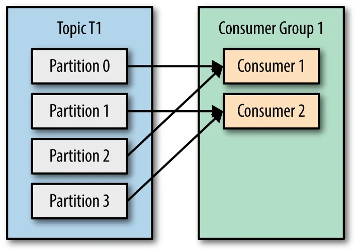
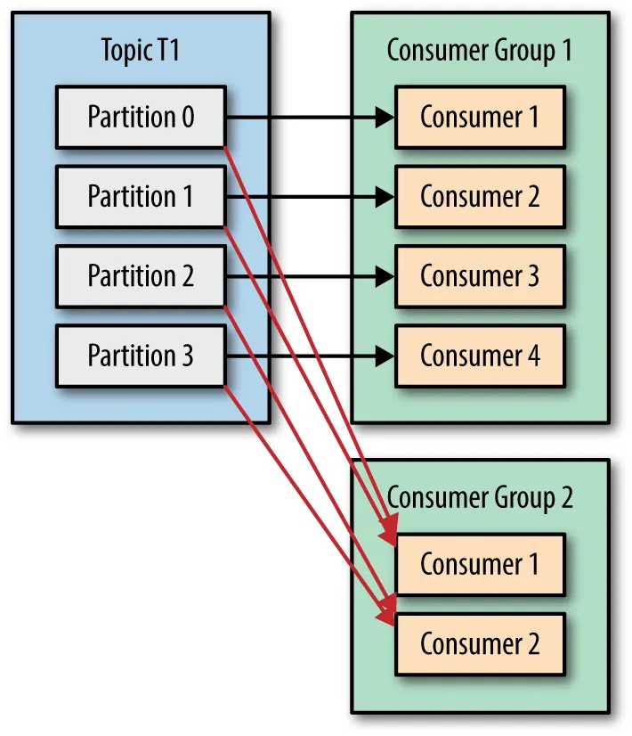
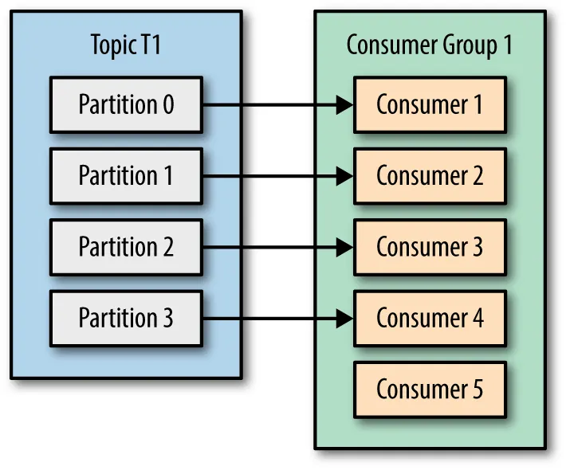

# Best Practices 

## Partition should be equal to the number of the consumers

### If partition is more than the number of consumers, the consumers will overwhelm
  
  
### If partition is evenly distributed, the consumers will not overwhelm (Best Practice)
  
### If partition is less than the number of consumers, some consumers will be idle
  

## Be careful what you've sent!
A record that has been produced to a Kafka topic can cause a claustrophobic to the system 

If it fails to be consumed or not handled properly, it is called a Poison Pill. 

### To prevent this, there are multiple ways that we can do:
- Send the invalid record to Dead Letter Queue
- Send the invalid record to another topic
- Send the invalid record to another topic and delete the record from the original topic
- Logging the invalid record
- etc. 

## Kafka UI
- https://medium.com/@vortj/ui-for-apache-kafka-clean-modern-and-easy-to-use-20041ecb5578

