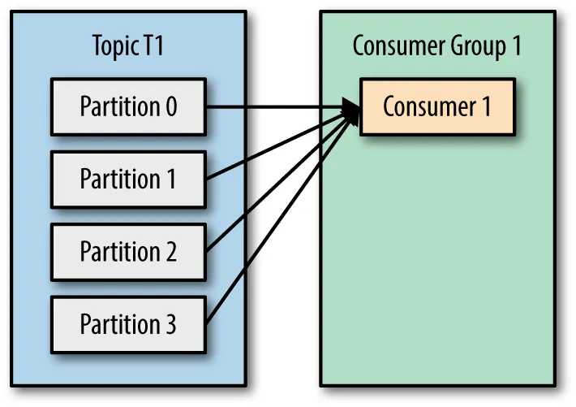

# Best Practices 

## Partition should be equal to the number of the consumers

### If partition is more than the number of consumers, the consumers will overwhelm
  
  
### If partition is evenly distributed, the consumers will not overwhelm (Best Practice)
  
### If partition is less than the number of consumers, some consumers will be idle
  

## Be careful what you've sent!
- 1 wrong deserialize can cause a claustrophobic to the system, DLQ & Error handling is necessary
