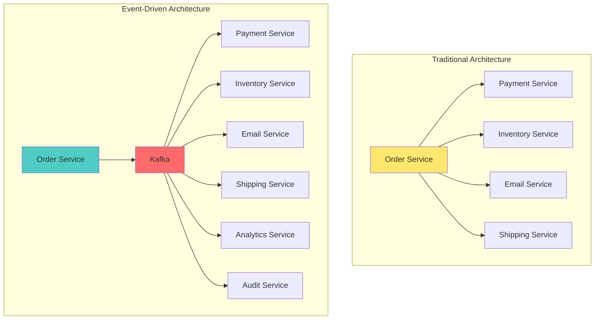

# Workshop: Why Kafka? Understanding Event-Driven Architecture

## 🎯 Objective
Understand the fundamentals of event-driven architecture and why Apache Kafka is the leading solution for building resilient, scalable systems.

## 📋 Workshop Tasks

### Task 1: Event-Driven vs Traditional Architecture Analysis
Complete the architecture comparison in `analysis/ArchitectureComparison.kt`

### Task 2: Identify Use Cases 
Fill in real-world scenarios where Kafka excels in `scenarios/KafkaUseCases.kt`

### Task 3: Design Event Flow
Create an event-driven design for an e-commerce system in `design/EventFlowDesign.kt`

## 🧠 Key Concepts to Understand
- Event-driven architecture principles
- Publish-subscribe pattern
- Event sourcing concepts
- System decoupling benefits
- Scalability through events

## ✅ Success Criteria
- [ ] Complete architecture comparison analysis
- [ ] Identify 5+ real-world Kafka use cases
- [ ] Design event flow for e-commerce scenario
- [ ] Understand why events > direct API calls
- [ ] Grasp decoupling benefits

## 🔍 Mermaid Diagram: Event-Driven Architecture

## 🚀 Next Steps
Move to [Lesson 2: Environment Setup](../lesson_2/README.md) to get your Kafka environment running!