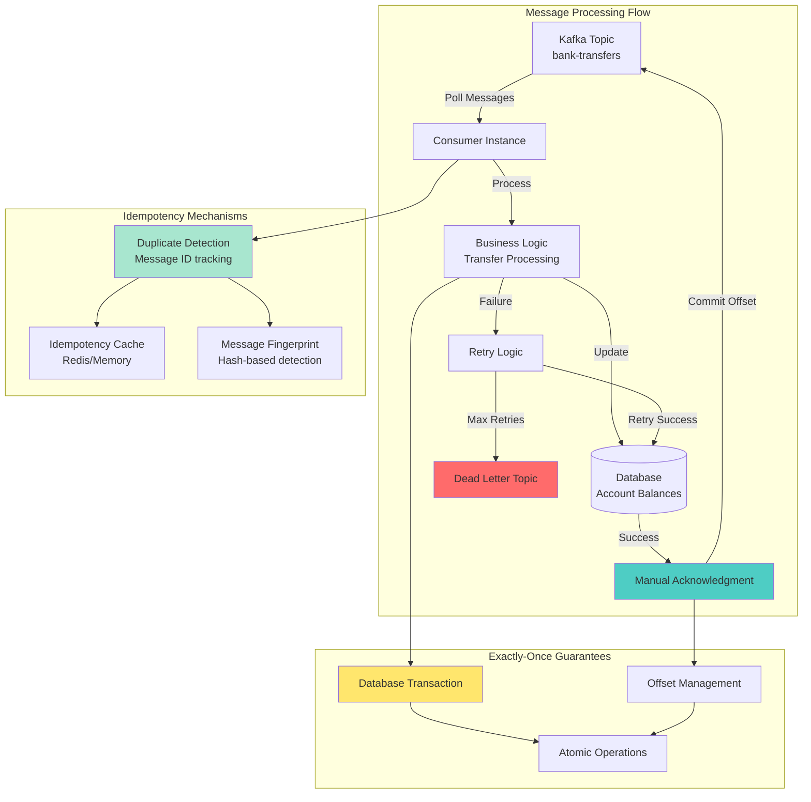
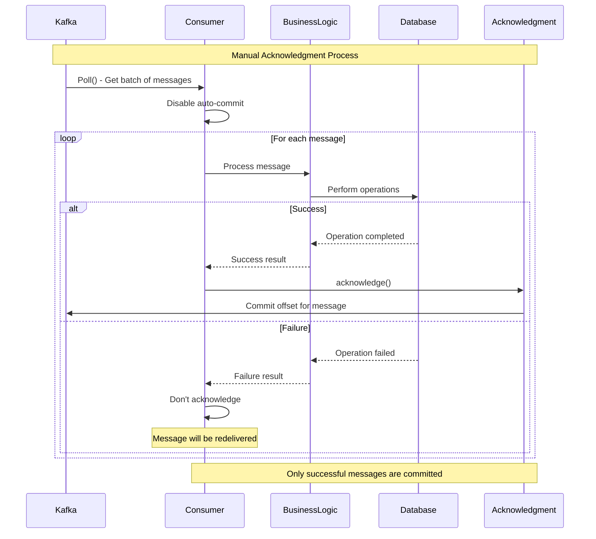
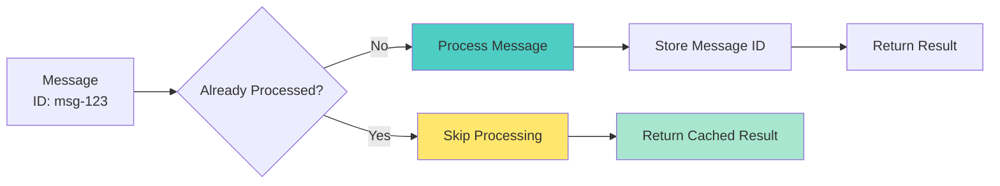
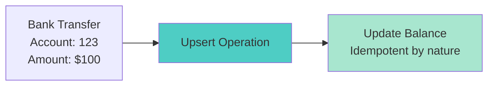
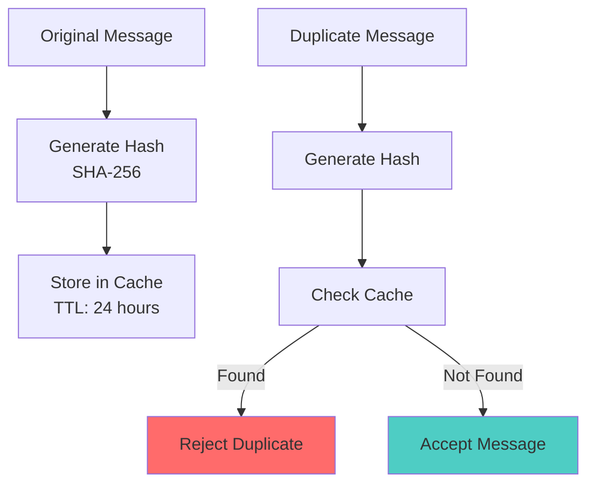
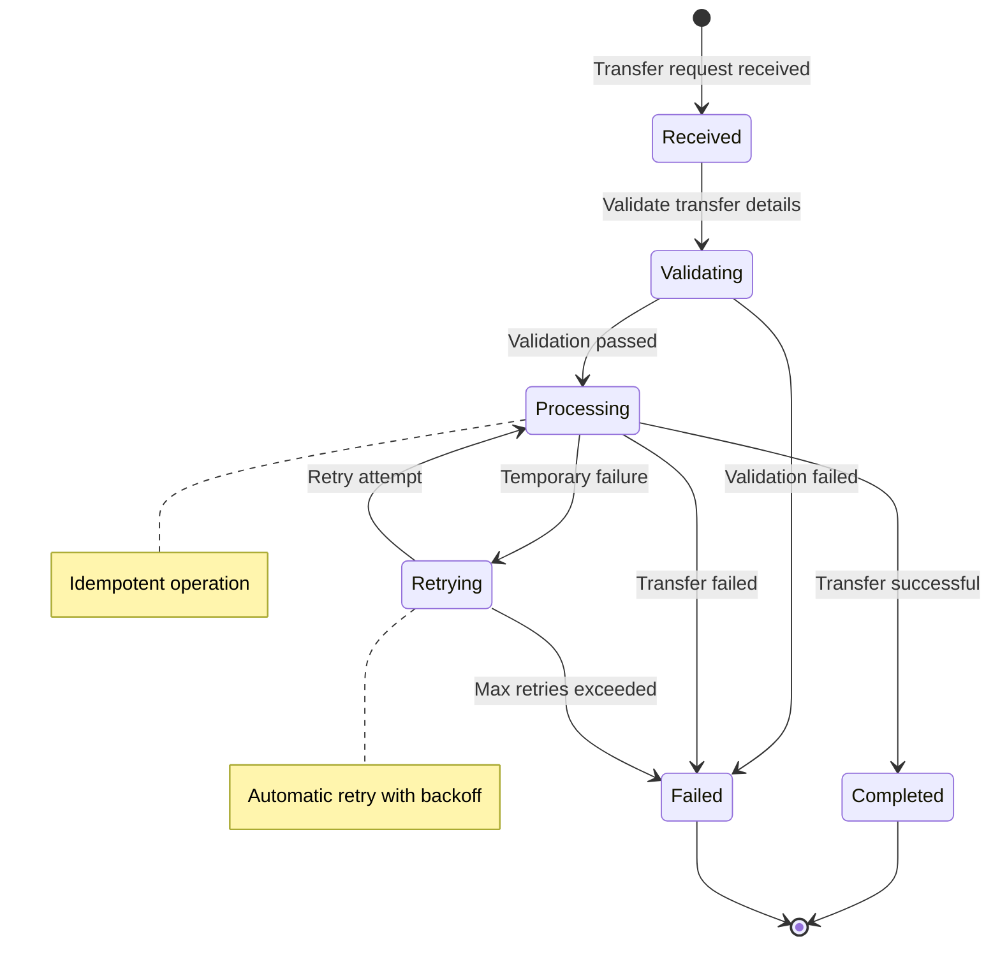

# Workshop: Manual Acknowledgment & Idempotent Consumers

## 🎯 Objective
Master precise message processing control with manual acknowledgment, implement idempotent consumers for exactly-once semantics, and handle duplicate messages gracefully in production systems.

## 📋 Workshop Tasks

### Task 1: Manual Acknowledgment Configuration
Configure manual ack in `config/ManualAckConfig.kt`

### Task 2: Idempotent Consumer Implementation
Build idempotent consumers in `consumer/IdempotentBankTransferConsumer.kt`

### Task 3: Duplicate Detection
Implement duplicate detection in `deduplication/DuplicateDetector.kt`

### Task 4: Transaction Management
Handle transactions in `transaction/TransactionManager.kt`

### Task 5: Exactly-Once Processing
Implement exactly-once in `exactlyonce/ExactlyOnceProcessor.kt`

## 🏗️ Manual Acknowledgment Architecture


## 🔄 Manual Acknowledgment Flow


## 🎯 Key Concepts

### **Manual Acknowledgment Benefits**
- **Precise Control**: Commit offsets only after successful processing
- **Fault Tolerance**: Failed messages are automatically retried
- **Data Integrity**: Prevents message loss during processing failures
- **Exactly-Once**: Combined with idempotency for exactly-once semantics

### **Idempotency Patterns**

#### **1. Message ID-Based Idempotency**


#### **2. Natural Key Idempotency**


#### **3. Fingerprint-Based Detection**


## 💰 Bank Transfer Use Case

### Transfer Processing States


### Bank Transfer Event Model
```kotlin
data class BankTransferEvent(
    val transferId: String,              // Unique transfer identifier
    val messageId: String,               // Idempotency key
    val fromAccount: String,             // Source account
    val toAccount: String,               // Destination account
    val amount: BigDecimal,              // Transfer amount
    val currency: String,                // Currency code
    val reference: String,               // Transfer reference
    val timestamp: Instant,              // Event timestamp
    val correlationId: String,           // Request correlation
    val version: Int = 1                 // Event version
) {
    fun generateFingerprint(): String {
        return "$transferId:$fromAccount:$toAccount:$amount:$currency".sha256()
    }
}
```

## ⚙️ Manual Acknowledgment Configuration

### Consumer Configuration
```kotlin
@Configuration
class ManualAckConsumerConfig {
    
    @Bean
    fun manualAckConsumerFactory(): ConsumerFactory<String, BankTransferEvent> {
        val props = mapOf(
            ConsumerConfig.BOOTSTRAP_SERVERS_CONFIG to "localhost:9092",
            ConsumerConfig.GROUP_ID_CONFIG to "bank-transfer-processors",
            ConsumerConfig.KEY_DESERIALIZER_CLASS_CONFIG to StringDeserializer::class.java,
            ConsumerConfig.VALUE_DESERIALIZER_CLASS_CONFIG to JsonDeserializer::class.java,
            
            // Manual acknowledgment settings
            ConsumerConfig.ENABLE_AUTO_COMMIT_CONFIG to false,
            ConsumerConfig.MAX_POLL_RECORDS_CONFIG to 1,  // Process one at a time
            ConsumerConfig.AUTO_OFFSET_RESET_CONFIG to "earliest",
            
            // Performance tuning
            ConsumerConfig.FETCH_MIN_BYTES_CONFIG to 1,
            ConsumerConfig.FETCH_MAX_WAIT_MS_CONFIG to 1000,
            ConsumerConfig.SESSION_TIMEOUT_MS_CONFIG to 30000,
            ConsumerConfig.HEARTBEAT_INTERVAL_MS_CONFIG to 3000
        )
        
        return DefaultKafkaConsumerFactory(props)
    }
    
    @Bean
    fun manualAckListenerContainerFactory(): ConcurrentKafkaListenerContainerFactory<String, BankTransferEvent> {
        val factory = ConcurrentKafkaListenerContainerFactory<String, BankTransferEvent>()
        factory.consumerFactory = manualAckConsumerFactory()
        
        // Enable manual acknowledgment
        factory.containerProperties.ackMode = ContainerProperties.AckMode.MANUAL_IMMEDIATE
        
        // Configure error handling
        factory.setCommonErrorHandler(
            DefaultErrorHandler(
                DeadLetterPublishingRecoverer(kafkaTemplate()) { record, _ ->
                    TopicPartition("bank-transfers-dlt", record.partition())
                }
            ).apply {
                setRetryTemplate(retryTemplate())
            }
        )
        
        return factory
    }
}
```

### Consumer Implementation with Manual Ack
```kotlin
@Component
class BankTransferConsumer {
    
    @KafkaListener(
        topics = ["bank-transfers"],
        containerFactory = "manualAckListenerContainerFactory"
    )
    fun processBankTransfer(
        @Payload transfer: BankTransferEvent,
        @Header(KafkaHeaders.RECEIVED_TOPIC) topic: String,
        @Header(KafkaHeaders.RECEIVED_PARTITION_ID) partition: Int,
        @Header(KafkaHeaders.OFFSET) offset: Long,
        acknowledgment: Acknowledgment
    ) {
        logger.info("Processing transfer ${transfer.transferId} from $topic:$partition:$offset")
        
        try {
            // Check for duplicate
            if (duplicateDetector.isDuplicate(transfer.messageId)) {
                logger.info("Duplicate transfer detected: ${transfer.transferId}")
                acknowledgment.acknowledge() // Acknowledge duplicate
                return
            }
            
            // Process transfer idempotently
            val result = bankTransferService.processTransfer(transfer)
            
            if (result.isSuccess) {
                // Mark as processed to prevent future duplicates
                duplicateDetector.markProcessed(transfer.messageId, result)
                
                // Acknowledge successful processing
                acknowledgment.acknowledge()
                logger.info("Successfully processed transfer: ${transfer.transferId}")
            } else {
                // Don't acknowledge - message will be retried
                logger.warn("Transfer processing failed: ${transfer.transferId}, reason: ${result.errorMessage}")
            }
            
        } catch (e: Exception) {
            logger.error("Error processing transfer: ${transfer.transferId}", e)
            // Don't acknowledge - let error handler manage retries
        }
    }
}
```

## 🔍 Duplicate Detection Implementation

### Redis-Based Duplicate Detector
```kotlin
@Component
class DuplicateDetector {
    
    @Autowired
    private lateinit var redisTemplate: RedisTemplate<String, String>
    
    private val duplicateKeyPrefix = "transfer:processed:"
    private val defaultTtl = Duration.ofHours(24)
    
    fun isDuplicate(messageId: String): Boolean {
        val key = duplicateKeyPrefix + messageId
        return redisTemplate.hasKey(key)
    }
    
    fun markProcessed(messageId: String, result: TransferResult, ttl: Duration = defaultTtl) {
        val key = duplicateKeyPrefix + messageId
        val value = objectMapper.writeValueAsString(
            ProcessedTransfer(
                messageId = messageId,
                result = result,
                processedAt = Instant.now()
            )
        )
        
        redisTemplate.opsForValue().set(key, value, ttl)
        logger.debug("Marked transfer as processed: $messageId")
    }
    
    fun getProcessedResult(messageId: String): TransferResult? {
        val key = duplicateKeyPrefix + messageId
        val value = redisTemplate.opsForValue().get(key)
        
        return value?.let { 
            val processed = objectMapper.readValue(it, ProcessedTransfer::class.java)
            processed.result
        }
    }
    
    fun removeProcessedMarker(messageId: String) {
        val key = duplicateKeyPrefix + messageId
        redisTemplate.delete(key)
    }
}
```

## ✅ Success Criteria
- [ ] Manual acknowledgment working correctly - failed messages are retried
- [ ] Idempotent consumer handles duplicate messages gracefully
- [ ] Bank transfer processing maintains data consistency
- [ ] Duplicate detection prevents double processing
- [ ] Exactly-once semantics achieved for critical operations
- [ ] Performance impact of manual ack is acceptable
- [ ] Error scenarios (network issues, DB failures) handled properly

## 🚀 Getting Started

### 1. Configure Manual Acknowledgment
```kotlin
@Service
class BankTransferService {
    
    @Transactional
    fun processTransfer(transfer: BankTransferEvent): TransferResult {
        return try {
            // Validate transfer
            validateTransfer(transfer)
            
            // Check account balances
            val fromAccount = accountService.getAccount(transfer.fromAccount)
            if (fromAccount.balance < transfer.amount) {
                return TransferResult.failure("Insufficient balance")
            }
            
            // Perform transfer (idempotent operations)
            accountService.debitAccount(transfer.fromAccount, transfer.amount)
            accountService.creditAccount(transfer.toAccount, transfer.amount)
            
            // Record transfer
            transferRepository.recordTransfer(transfer)
            
            TransferResult.success(transfer.transferId)
            
        } catch (e: Exception) {
            logger.error("Transfer processing failed", e)
            TransferResult.failure("Processing error: ${e.message}")
        }
    }
}
```

### 2. Test Duplicate Handling
```bash
# Send same transfer twice
curl -X POST http://localhost:8090/api/transfers \
  -H "Content-Type: application/json" \
  -d '{
    "transferId": "TXN-123",
    "messageId": "MSG-456", 
    "fromAccount": "ACC-111",
    "toAccount": "ACC-222",
    "amount": 100.00,
    "currency": "USD"
  }'

# Send exact duplicate (should be detected)
curl -X POST http://localhost:8090/api/transfers \
  -H "Content-Type: application/json" \
  -d '{
    "transferId": "TXN-123",
    "messageId": "MSG-456",
    "fromAccount": "ACC-111", 
    "toAccount": "ACC-222",
    "amount": 100.00,
    "currency": "USD"
  }'
```

### 3. Monitor Processing
```bash
# Check processed transfers
redis-cli KEYS "transfer:processed:*"

# Monitor consumer group
kafka-consumer-groups --bootstrap-server localhost:9092 \
  --group bank-transfer-processors --describe

# Check dead letter topic
kafka-console-consumer --topic bank-transfers-dlt \
  --from-beginning --bootstrap-server localhost:9092
```

## 🎯 Best Practices

### Manual Acknowledgment
- **Process one message at a time** for critical operations
- **Use transactions** to ensure atomicity
- **Handle retries gracefully** with exponential backoff
- **Monitor processing lag** to ensure performance

### Idempotency Design
- **Use business-meaningful keys** when possible
- **Cache results** for quick duplicate detection
- **Set appropriate TTLs** to prevent cache bloat
- **Handle cache failures** gracefully

### Error Handling
- **Distinguish retryable vs non-retryable errors**
- **Implement circuit breakers** for downstream services
- **Use dead letter topics** for poison messages
- **Monitor error rates** and alert on anomalies

## 🔍 Troubleshooting

### Common Issues
1. **Processing lag** - Increase consumer instances or optimize processing
2. **Duplicate cache misses** - Check Redis connectivity and TTL settings  
3. **Transaction deadlocks** - Optimize database queries and locking
4. **Memory leaks** - Monitor message acknowledgment and cleanup

### Debug Commands
```bash
# Check Redis cache
redis-cli GET "transfer:processed:MSG-456"

# Monitor processing metrics
curl http://localhost:8090/actuator/metrics/kafka.consumer

# Check database transactions
SELECT * FROM transfers WHERE transfer_id = 'TXN-123';
```

## 🚀 Next Steps
Manual acknowledgment mastered? Time to transform and route messages! Move to [Lesson 10: Message Transformation & Filtering](../lesson_11/README.md) to learn data processing pipelines.