# Workshop: Message Transformation & Filtering

## 🎯 Objective
Master message transformation patterns, content-based routing, field mapping, data enrichment, and filtering strategies for building flexible data processing pipelines with Kafka.

## 📋 Workshop Tasks

### Task 1: Message Transformation
Implement transformations in `transformation/MessageTransformer.kt`

### Task 2: Content-Based Filtering
Build filtering logic in `filtering/ContentBasedFilter.kt`

### Task 3: Data Enrichment
Create enrichment service in `enrichment/DataEnricher.kt`

### Task 4: Field Mapping
Implement field mapping in `mapping/FieldMapper.kt`

### Task 5: Pipeline Orchestration
Build processing pipeline in `pipeline/TransformationPipeline.kt`

## 🏗️ Transformation Pipeline Architecture


## 🔄 Message Transformation Flow


## 🎯 Key Concepts

### **Message Transformation Patterns**

#### **1. Field Mapping & Format Conversion**

```mermaid
graph LR
    INPUT[Input Message<br/>userName: john_doe<br/>emailAddr: john@email.com<br/>accountId: 12345] 
    
    MAPPING[Field Mapping<br/>userName → user.name<br/>emailAddr → user.email<br/>accountId → account.id]
    
    OUTPUT[Output Message<br/>user.name: john_doe<br/>user.email: john@email.com<br/>account.id: 12345]
    
    INPUT --> MAPPING
    MAPPING --> OUTPUT
    
    style MAPPING fill:#4ecdc4
```


#### **2. Data Enrichment**


#### **3. Content-Based Filtering**


### **Transformation Models**

#### **User Activity Transformation**
```kotlin
// Input: Raw user activity event
data class RawUserActivity(
    val uid: String,                    // Legacy user ID format
    val act: String,                    // Abbreviated action
    val ts: Long,                       // Unix timestamp
    val attrs: Map<String, String>      // Mixed attributes
)

// Output: Standardized user activity event  
data class StandardUserActivity(
    val user: UserInfo,
    val activity: ActivityInfo,
    val metadata: EventMetadata
)

data class UserInfo(
    val userId: String,
    val username: String,
    val segment: String,
    val tier: String
)

data class ActivityInfo(
    val action: String,
    val category: String,
    val resource: String,
    val timestamp: Instant
)

data class EventMetadata(
    val eventId: String,
    val source: String,
    val version: String,
    val correlationId: String
)
```

## ⚙️ Message Transformer Implementation

### Core Transformation Engine
```kotlin
@Component
class MessageTransformationEngine {
    
    fun transform(
        input: Any,
        transformationRules: List<TransformationRule>
    ): TransformationResult {
        
        var currentMessage = input
        val appliedTransformations = mutableListOf<String>()
        
        try {
            for (rule in transformationRules) {
                if (rule.isApplicable(currentMessage)) {
                    currentMessage = rule.apply(currentMessage)
                    appliedTransformations.add(rule.name)
                }
            }
            
            return TransformationResult.success(
                transformedMessage = currentMessage,
                appliedRules = appliedTransformations
            )
            
        } catch (e: Exception) {
            return TransformationResult.failure(
                originalMessage = input,
                error = e.message ?: "Unknown transformation error",
                appliedRules = appliedTransformations
            )
        }
    }
}

interface TransformationRule {
    val name: String
    fun isApplicable(message: Any): Boolean
    fun apply(message: Any): Any
}
```

### Field Mapping Rules
```kotlin
@Component
class FieldMappingRule : TransformationRule {
    override val name = "FieldMapping"
    
    private val fieldMappings = mapOf(
        "uid" to "user.userId",
        "uname" to "user.username", 
        "email" to "user.email",
        "act" to "activity.action",
        "ts" to "activity.timestamp",
        "prod_id" to "product.productId",
        "cat" to "product.category"
    )
    
    override fun isApplicable(message: Any): Boolean {
        return message is Map<*, *> && fieldMappings.keys.any { 
            message.containsKey(it) 
        }
    }
    
    override fun apply(message: Any): Any {
        if (message !is Map<*, *>) return message
        
        val result = mutableMapOf<String, Any?>()
        
        message.forEach { (key, value) ->
            val mappedKey = fieldMappings[key.toString()] ?: key.toString()
            setNestedValue(result, mappedKey, value)
        }
        
        return result
    }
    
    private fun setNestedValue(map: MutableMap<String, Any?>, path: String, value: Any?) {
        val parts = path.split(".")
        var current = map
        
        for (i in 0 until parts.size - 1) {
            val part = parts[i]
            if (!current.containsKey(part)) {
                current[part] = mutableMapOf<String, Any?>()
            }
            @Suppress("UNCHECKED_CAST")
            current = current[part] as MutableMap<String, Any?>
        }
        
        current[parts.last()] = value
    }
}
```

## 🔍 Content-Based Filtering

### Filter Rule Engine
```kotlin
@Component
class ContentBasedFilterEngine {
    
    fun applyFilters(
        message: Any,
        filterRules: List<FilterRule>
    ): FilterResult {
        
        val matchedRules = mutableListOf<String>()
        var routingDestination = "default"
        
        for (rule in filterRules) {
            if (rule.matches(message)) {
                matchedRules.add(rule.name)
                routingDestination = rule.destination
                
                if (rule.isTerminal) {
                    break // Stop processing on terminal rule
                }
            }
        }
        
        return FilterResult(
            shouldProcess = matchedRules.isNotEmpty(),
            destination = routingDestination,
            matchedRules = matchedRules,
            metadata = mapOf(
                "filterAppliedAt" to Instant.now(),
                "rulesEvaluated" to filterRules.size
            )
        )
    }
}

interface FilterRule {
    val name: String
    val destination: String
    val isTerminal: Boolean
    fun matches(message: Any): Boolean
}
```

### Business Rule Examples
```kotlin
@Component
class HighValueCustomerFilter : FilterRule {
    override val name = "HighValueCustomer"
    override val destination = "high-priority-topic"
    override val isTerminal = false
    
    override fun matches(message: Any): Boolean {
        return when (message) {
            is Map<*, *> -> {
                val customerTier = message["customer.tier"] as? String
                val orderAmount = message["order.amount"] as? Number
                
                customerTier == "GOLD" || 
                customerTier == "PLATINUM" || 
                (orderAmount?.toDouble() ?: 0.0) > 1000.0
            }
            is StandardUserActivity -> {
                message.user.tier in listOf("GOLD", "PLATINUM")
            }
            else -> false
        }
    }
}

@Component  
class SecurityAlertFilter : FilterRule {
    override val name = "SecurityAlert"
    override val destination = "security-alerts-topic"
    override val isTerminal = true // Terminal rule - stops further processing
    
    override fun matches(message: Any): Boolean {
        return when (message) {
            is Map<*, *> -> {
                val riskScore = message["risk.score"] as? Number
                val suspiciousFlags = message["security.flags"] as? List<*>
                
                (riskScore?.toInt() ?: 0) > 80 ||
                (suspiciousFlags?.size ?: 0) > 0
            }
            else -> false
        }
    }
}
```

## 🌟 Data Enrichment Service

### User Profile Enrichment
```kotlin
@Component
class UserProfileEnricher {
    
    @Autowired
    private lateinit var userProfileService: UserProfileService
    
    @Autowired
    private lateinit var cacheManager: CacheManager
    
    fun enrichWithUserProfile(message: Any): Any {
        return when (message) {
            is Map<*, *> -> enrichMapMessage(message)
            is StandardUserActivity -> enrichUserActivity(message)
            else -> message
        }
    }
    
    private fun enrichUserActivity(activity: StandardUserActivity): StandardUserActivity {
        val userId = activity.user.userId
        val cachedProfile = getCachedUserProfile(userId)
        
        val profile = cachedProfile ?: run {
            val fetchedProfile = userProfileService.getUserProfile(userId)
            cacheUserProfile(userId, fetchedProfile)
            fetchedProfile
        }
        
        return activity.copy(
            user = activity.user.copy(
                username = profile.username,
                segment = profile.segment,
                tier = profile.tier
            )
        )
    }
    
    @Cacheable("userProfiles", key = "#userId")
    private fun getCachedUserProfile(userId: String): UserProfile? {
        return cacheManager.getCache("userProfiles")?.get(userId, UserProfile::class.java)
    }
    
    private fun cacheUserProfile(userId: String, profile: UserProfile) {
        cacheManager.getCache("userProfiles")?.put(userId, profile)
    }
}
```

## ✅ Success Criteria
- [ ] Message transformation correctly maps fields between formats
- [ ] Content-based filtering routes messages to appropriate destinations  
- [ ] Data enrichment enhances messages with external data
- [ ] Field mapping handles nested object transformations
- [ ] Pipeline processes messages without data loss
- [ ] Performance meets throughput requirements (&gt;1000 msg/sec)
- [ ] Error handling captures and routes failed transformations

## 🚀 Getting Started

### 1. Configure Transformation Pipeline
```kotlin
@Service
class TransformationPipelineService {
    
    @KafkaListener(topics = ["raw-events"])
    fun processRawEvent(
        @Payload rawEvent: String,
        @Header(KafkaHeaders.RECEIVED_TOPIC) topic: String
    ) {
        try {
            // Parse raw message
            val parsedMessage = objectMapper.readValue(rawEvent, Map::class.java)
            
            // Apply transformations
            val transformationRules = getTransformationRules(topic)
            val transformResult = transformationEngine.transform(parsedMessage, transformationRules)
            
            if (transformResult.isSuccess) {
                // Apply filters
                val filterRules = getFilterRules()
                val filterResult = filterEngine.applyFilters(transformResult.transformedMessage, filterRules)
                
                if (filterResult.shouldProcess) {
                    // Enrich data
                    val enrichedMessage = dataEnricher.enrich(transformResult.transformedMessage)
                    
                    // Send to destination
                    kafkaTemplate.send(filterResult.destination, enrichedMessage)
                    
                    logger.info("Successfully processed message to ${filterResult.destination}")
                }
            } else {
                // Send to DLQ with error details
                sendToDeadLetterQueue(rawEvent, transformResult.error)
            }
            
        } catch (e: Exception) {
            logger.error("Failed to process raw event", e)
            sendToDeadLetterQueue(rawEvent, e.message)
        }
    }
}
```

### 2. Test Transformation Pipeline
```bash
# Send raw event
kafka-console-producer --topic raw-events --bootstrap-server localhost:9092 \
  --property "parse.key=true" --property "key.separator=:"

# Input: user-123:{"uid":"123","act":"view","ts":1645123456,"prod_id":"456"}

# Monitor transformed output
kafka-console-consumer --topic analytics-events --from-beginning --bootstrap-server localhost:9092
kafka-console-consumer --topic high-priority-topic --from-beginning --bootstrap-server localhost:9092
```

### 3. Monitor Transformation Metrics
```bash
# Check processing metrics
curl http://localhost:8090/actuator/metrics/kafka.transformation

# View transformation rules
curl http://localhost:8090/api/transformation/rules

# Check enrichment cache
curl http://localhost:8090/api/enrichment/cache/stats
```

## 🎯 Best Practices

### Transformation Design
- **Keep transformations stateless** for scalability
- **Use schemas** to validate input and output formats
- **Cache enrichment data** to reduce external service calls
- **Handle missing fields** gracefully with defaults

### Performance Optimization
- **Batch transformations** when possible
- **Use appropriate serialization** for performance
- **Monitor transformation latency** and optimize bottlenecks
- **Implement circuit breakers** for external enrichment services

### Error Handling
- **Validate inputs** before transformation
- **Preserve original messages** in error scenarios
- **Use dead letter queues** for failed transformations
- **Include transformation metadata** in output messages

## 🔍 Troubleshooting

### Common Issues
1. **Slow transformations** - Check enrichment service latency and caching
2. **Data loss** - Verify error handling and dead letter queue setup
3. **Memory leaks** - Monitor object creation in transformation rules
4. **Cache misses** - Tune cache TTL and eviction policies

### Debug Commands
```bash
# Check transformation cache
redis-cli INFO keyspace

# Monitor transformation performance
curl http://localhost:8090/actuator/metrics/transformation.time

# View DLQ messages
kafka-console-consumer --topic transformation-dlq --from-beginning --bootstrap-server localhost:9092
```

## 🚀 Next Steps
Message transformation mastered? Time to build notification systems! Move to [Lesson 11: Fan-out Pattern & Notification Systems](../lesson_12/README.md) to learn one-to-many messaging patterns.