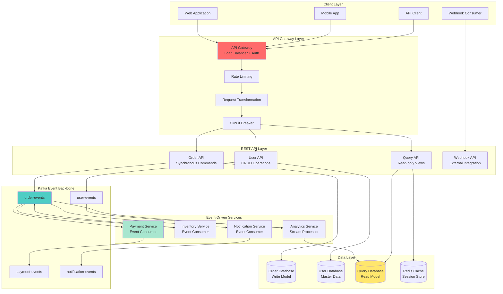
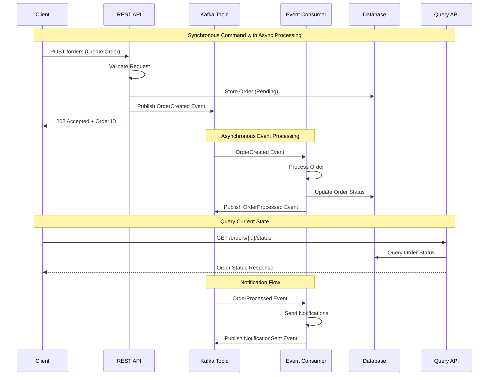
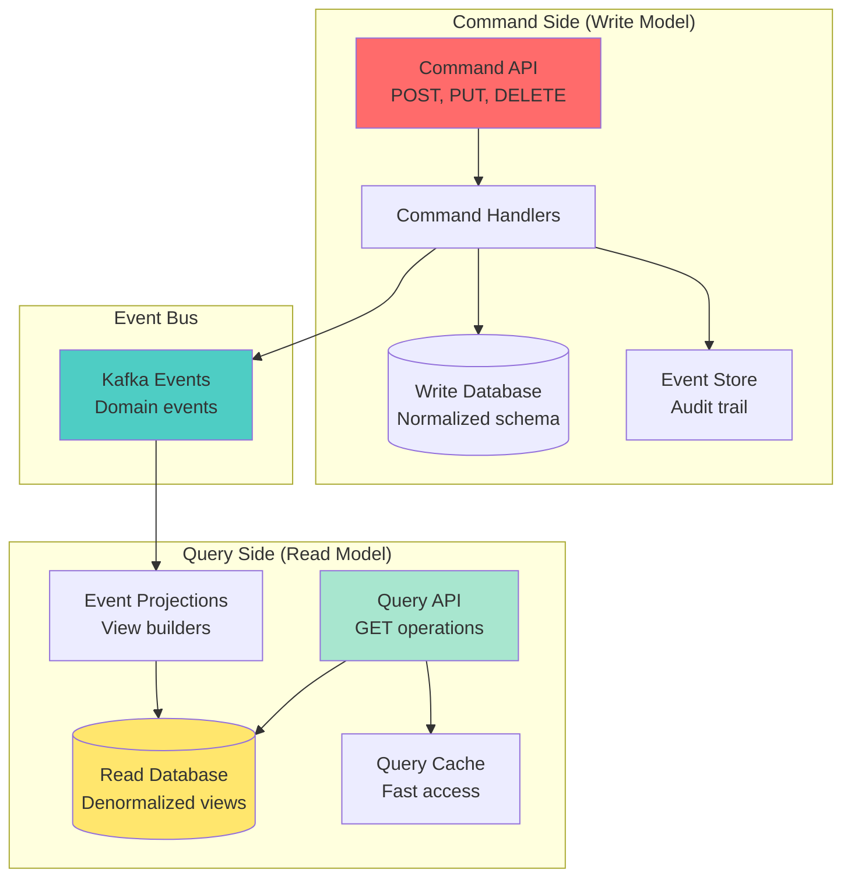
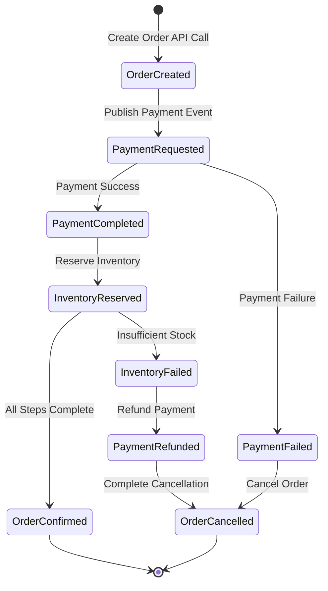
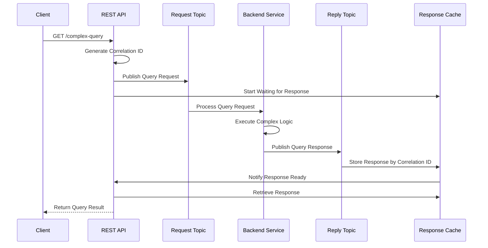

# Workshop: Hybrid REST + Kafka Architecture

## 🎯 Objective
Master hybrid architectures that seamlessly combine REST APIs with Kafka event streaming, implementing command-query separation, event-driven microservices, and synchronous-asynchronous integration patterns.

## 📋 Workshop Tasks

### Task 1: REST to Kafka Bridge
Implement API gateway in `rest/KafkaRestBridge.kt`

### Task 2: Command-Query Separation
Build CQRS pattern in `cqrs/CommandQuerySeparation.kt`

### Task 3: Event-Driven Workflows
Create workflows in `workflow/EventDrivenWorkflow.kt`

### Task 4: Synchronous Response Handling
Implement sync responses in `sync/SynchronousResponseHandler.kt`

### Task 5: API Composition
Build composite APIs in `composition/APICompositionService.kt`

## 🏗️ Hybrid Architecture Pattern


## 🔄 REST to Kafka Integration Flow


## 🎯 Key Concepts

### **Command-Query Responsibility Segregation (CQRS)**


### **Event-Driven Workflow Patterns**

#### **Saga Orchestration**


#### **Request-Reply Pattern**


## ⚙️ REST-Kafka Bridge Implementation

### Command API with Event Publishing
```kotlin
@RestController
@RequestMapping("/api/orders")
class OrderCommandController {
    
    @Autowired
    private lateinit var orderService: OrderService
    
    @Autowired
    private lateinit var kafkaTemplate: KafkaTemplate<String, Any>
    
    @PostMapping
    fun createOrder(@RequestBody @Valid request: CreateOrderRequest): ResponseEntity<OrderResponse> {
        return try {
            // Validate request
            validateOrderRequest(request)
            
            // Store in database (write model)
            val order = orderService.createOrder(request)
            
            // Publish event to Kafka
            val orderEvent = OrderCreatedEvent(
                orderId = order.id,
                customerId = order.customerId,
                items = order.items,
                totalAmount = order.totalAmount,
                timestamp = Instant.now(),
                correlationId = MDC.get("correlationId")
            )
            
            kafkaTemplate.send("order-events", order.id, orderEvent)
                .whenComplete { result, throwable ->
                    if (throwable != null) {
                        logger.error("Failed to publish order event: ${order.id}", throwable)
                        // Consider compensation logic
                    } else {
                        logger.info("Order event published successfully: ${order.id}")
                    }
                }
            
            // Return immediate response
            ResponseEntity.accepted()
                .header("Location", "/api/orders/${order.id}")
                .body(OrderResponse(
                    orderId = order.id,
                    status = OrderStatus.PENDING,
                    message = "Order created and queued for processing"
                ))
                
        } catch (e: ValidationException) {
            ResponseEntity.badRequest()
                .body(ErrorResponse("VALIDATION_ERROR", e.message))
        } catch (e: Exception) {
            logger.error("Failed to create order", e)
            ResponseEntity.status(HttpStatus.INTERNAL_SERVER_ERROR)
                .body(ErrorResponse("INTERNAL_ERROR", "Order creation failed"))
        }
    }
    
    @PutMapping("/{orderId}/cancel")
    fun cancelOrder(@PathVariable orderId: String): ResponseEntity<OrderResponse> {
        return try {
            val order = orderService.getOrder(orderId)
                ?: return ResponseEntity.notFound().build()
            
            // Check if cancellation is allowed
            if (!order.isCancellable()) {
                return ResponseEntity.badRequest()
                    .body(ErrorResponse("INVALID_STATE", "Order cannot be cancelled"))
            }
            
            // Update order status
            orderService.cancelOrder(orderId)
            
            // Publish cancellation event
            val cancellationEvent = OrderCancelledEvent(
                orderId = orderId,
                customerId = order.customerId,
                reason = "Customer requested cancellation",
                timestamp = Instant.now()
            )
            
            kafkaTemplate.send("order-events", orderId, cancellationEvent)
            
            ResponseEntity.ok(OrderResponse(
                orderId = orderId,
                status = OrderStatus.CANCELLED,
                message = "Order cancellation initiated"
            ))
            
        } catch (e: Exception) {
            logger.error("Failed to cancel order: $orderId", e)
            ResponseEntity.status(HttpStatus.INTERNAL_SERVER_ERROR)
                .body(ErrorResponse("INTERNAL_ERROR", "Order cancellation failed"))
        }
    }
}
```

### Query API with Read Models
```kotlin
@RestController
@RequestMapping("/api/orders")
class OrderQueryController {
    
    @Autowired
    private lateinit var orderQueryService: OrderQueryService
    
    @Autowired
    private lateinit var cacheManager: CacheManager
    
    @GetMapping("/{orderId}")
    fun getOrder(@PathVariable orderId: String): ResponseEntity<OrderView> {
        return try {
            val orderView = orderQueryService.getOrderView(orderId)
                ?: return ResponseEntity.notFound().build()
            
            ResponseEntity.ok(orderView)
            
        } catch (e: Exception) {
            logger.error("Failed to retrieve order: $orderId", e)
            ResponseEntity.status(HttpStatus.INTERNAL_SERVER_ERROR).build()
        }
    }
    
    @GetMapping
    fun getOrdersByCustomer(
        @RequestParam customerId: String,
        @RequestParam(defaultValue = "0") page: Int,
        @RequestParam(defaultValue = "20") size: Int,
        @RequestParam(required = false) status: OrderStatus?
    ): ResponseEntity<PagedResponse<OrderSummary>> {
        
        val cacheKey = "orders:$customerId:$page:$size:${status?.name ?: "ALL"}"
        
        // Try cache first
        val cachedResult = cacheManager.getCache("order-queries")
            ?.get(cacheKey, PagedResponse::class.java)
        
        if (cachedResult != null) {
            return ResponseEntity.ok(cachedResult as PagedResponse<OrderSummary>)
        }
        
        // Query from read model
        val result = orderQueryService.getOrdersByCustomer(
            customerId = customerId,
            page = page,
            size = size,
            status = status
        )
        
        // Cache the result
        cacheManager.getCache("order-queries")?.put(cacheKey, result)
        
        return ResponseEntity.ok(result)
    }
    
    @GetMapping("/{orderId}/timeline")
    fun getOrderTimeline(@PathVariable orderId: String): ResponseEntity<OrderTimeline> {
        return try {
            val timeline = orderQueryService.getOrderTimeline(orderId)
                ?: return ResponseEntity.notFound().build()
            
            ResponseEntity.ok(timeline)
            
        } catch (e: Exception) {
            logger.error("Failed to retrieve order timeline: $orderId", e)
            ResponseEntity.status(HttpStatus.INTERNAL_SERVER_ERROR).build()
        }
    }
}
```

## 🔄 Event-Driven Workflow Engine

### Saga Orchestrator
```kotlin
@Component
class OrderProcessingSaga {
    
    @KafkaListener(topics = ["order-events"])
    fun handleOrderEvent(
        @Payload event: OrderEvent,
        @Header(KafkaHeaders.RECEIVED_TOPIC) topic: String
    ) {
        when (event) {
            is OrderCreatedEvent -> initiateOrderProcessing(event)
            is PaymentCompletedEvent -> continueAfterPayment(event)
            is PaymentFailedEvent -> handlePaymentFailure(event)
            is InventoryReservedEvent -> continueAfterInventoryReservation(event)
            is InventoryReservationFailedEvent -> handleInventoryFailure(event)
            is OrderConfirmedEvent -> completeOrderProcessing(event)
            is OrderCancelledEvent -> handleOrderCancellation(event)
        }
    }
    
    private fun initiateOrderProcessing(event: OrderCreatedEvent) {
        logger.info("Starting order processing saga: ${event.orderId}")
        
        try {
            // Step 1: Request payment processing
            val paymentRequest = PaymentRequestEvent(
                orderId = event.orderId,
                customerId = event.customerId,
                amount = event.totalAmount,
                correlationId = event.correlationId
            )
            
            kafkaTemplate.send("payment-requests", event.orderId, paymentRequest)
            
            // Update saga state
            sagaStateService.createSagaState(
                sagaId = event.orderId,
                currentStep = SagaStep.PAYMENT_REQUESTED,
                sagaData = event
            )
            
        } catch (e: Exception) {
            logger.error("Failed to initiate payment for order: ${event.orderId}", e)
            handleSagaFailure(event.orderId, "Payment initiation failed")
        }
    }
    
    private fun continueAfterPayment(event: PaymentCompletedEvent) {
        logger.info("Payment completed for order: ${event.orderId}")
        
        try {
            // Step 2: Reserve inventory
            val inventoryRequest = InventoryReservationEvent(
                orderId = event.orderId,
                items = getOrderItems(event.orderId),
                correlationId = event.correlationId
            )
            
            kafkaTemplate.send("inventory-requests", event.orderId, inventoryRequest)
            
            // Update saga state
            sagaStateService.updateSagaState(
                sagaId = event.orderId,
                currentStep = SagaStep.INVENTORY_REQUESTED
            )
            
        } catch (e: Exception) {
            logger.error("Failed to request inventory for order: ${event.orderId}", e)
            // Compensate: refund payment
            initiatePaymentRefund(event.orderId)
        }
    }
    
    private fun handlePaymentFailure(event: PaymentFailedEvent) {
        logger.warn("Payment failed for order: ${event.orderId}, reason: ${event.reason}")
        
        // Cancel the order
        val cancellationEvent = OrderCancelledEvent(
            orderId = event.orderId,
            customerId = event.customerId,
            reason = "Payment failed: ${event.reason}",
            timestamp = Instant.now()
        )
        
        kafkaTemplate.send("order-events", event.orderId, cancellationEvent)
        
        // Update saga state
        sagaStateService.completeSaga(
            sagaId = event.orderId,
            status = SagaStatus.FAILED,
            reason = "Payment failed"
        )
    }
}
```

## 🔄 Synchronous-Asynchronous Bridging

### Request-Reply Pattern Implementation
```kotlin
@Component
class SynchronousQueryBridge {
    
    @Autowired
    private lateinit var kafkaTemplate: KafkaTemplate<String, Any>
    
    @Autowired
    private lateinit var responseWaitingService: ResponseWaitingService
    
    fun executeComplexQuery(query: ComplexQuery): CompletableFuture<QueryResult> {
        val correlationId = UUID.randomUUID().toString()
        val future = CompletableFuture<QueryResult>()
        
        try {
            // Register response handler
            responseWaitingService.registerResponseHandler(correlationId) { response ->
                try {
                    val result = objectMapper.readValue(response, QueryResult::class.java)
                    future.complete(result)
                } catch (e: Exception) {
                    future.completeExceptionally(e)
                }
            }
            
            // Send query request
            val queryRequest = QueryRequest(
                queryId = correlationId,
                query = query,
                requestedAt = Instant.now(),
                replyTopic = "query-responses",
                timeout = Duration.ofSeconds(30)
            )
            
            kafkaTemplate.send("query-requests", correlationId, queryRequest)
            
            // Set timeout
            CompletableFuture.delayedExecutor(30, TimeUnit.SECONDS).execute {
                if (!future.isDone) {
                    responseWaitingService.removeResponseHandler(correlationId)
                    future.completeExceptionally(TimeoutException("Query timeout"))
                }
            }
            
        } catch (e: Exception) {
            future.completeExceptionally(e)
        }
        
        return future
    }
}

@Component
class ResponseWaitingService {
    
    private val responseHandlers = ConcurrentHashMap<String, (String) -> Unit>()
    
    @KafkaListener(topics = ["query-responses"])
    fun handleQueryResponse(
        @Payload response: String,
        @Header(KafkaHeaders.RECEIVED_MESSAGE_KEY) correlationId: String
    ) {
        val handler = responseHandlers.remove(correlationId)
        handler?.invoke(response)
            ?: logger.warn("No handler found for correlation ID: $correlationId")
    }
    
    fun registerResponseHandler(correlationId: String, handler: (String) -> Unit) {
        responseHandlers[correlationId] = handler
    }
    
    fun removeResponseHandler(correlationId: String) {
        responseHandlers.remove(correlationId)
    }
}
```

## ✅ Success Criteria
- [ ] REST APIs correctly publish events to Kafka topics
- [ ] Command-query separation maintains data consistency
- [ ] Event-driven workflows handle complex business processes
- [ ] Synchronous response handling works for real-time queries
- [ ] API composition provides unified interfaces
- [ ] Error handling and compensation logic prevents data corruption
- [ ] Performance meets requirements for hybrid workloads

## 🚀 Getting Started

### 1. Configure Hybrid Architecture
```kotlin
@Configuration
class HybridArchitectureConfig {
    
    @Bean
    fun restToKafkaInterceptor(): RestToKafkaInterceptor {
        return RestToKafkaInterceptor(kafkaTemplate())
    }
    
    @Bean
    fun sagaOrchestrator(): SagaOrchestrator {
        return SagaOrchestrator(
            kafkaTemplate = kafkaTemplate(),
            sagaStateService = sagaStateService(),
            compensationService = compensationService()
        )
    }
    
    @Bean
    fun queryBridge(): SynchronousQueryBridge {
        return SynchronousQueryBridge(
            kafkaTemplate = kafkaTemplate(),
            responseWaitingService = responseWaitingService()
        )
    }
}
```

### 2. Test Hybrid Workflows
```bash
# Create order via REST API
curl -X POST http://localhost:8090/api/orders \
  -H "Content-Type: application/json" \
  -d '{
    "customerId": "CUST-123",
    "items": [
      {"productId": "PROD-456", "quantity": 2, "price": 29.99}
    ]
  }'

# Query order status
curl http://localhost:8090/api/orders/ORDER-789/status

# Monitor event flow
kafka-console-consumer --topic order-events --from-beginning --bootstrap-server localhost:9092
kafka-console-consumer --topic payment-events --from-beginning --bootstrap-server localhost:9092
```

### 3. Monitor Hybrid Performance
```bash
# Check REST API metrics
curl http://localhost:8090/actuator/metrics/http.server.requests

# Check Kafka integration metrics  
curl http://localhost:8090/actuator/metrics/kafka.producer

# Monitor saga execution
curl http://localhost:8090/api/sagas/ORDER-789/status
```

## 🎯 Best Practices

### API Design
- **Use appropriate HTTP status codes** (202 for async operations)
- **Provide correlation IDs** for request tracing
- **Implement proper error handling** with meaningful messages
- **Version your APIs** to support evolution

### Event Design
- **Use domain events** that reflect business operations
- **Include correlation IDs** for distributed tracing
- **Design for idempotency** to handle duplicate events
- **Version your events** for backward compatibility

### Integration Patterns
- **Separate commands from queries** for scalability
- **Use eventual consistency** where appropriate
- **Implement compensation** for failed operations
- **Monitor end-to-end latency** for user experience

## 🔍 Troubleshooting

### Common Issues
1. **Event ordering problems** - Use partition keys appropriately
2. **Duplicate processing** - Implement idempotent consumers
3. **Saga timeouts** - Configure appropriate timeouts and compensation
4. **Memory leaks** - Clean up response handlers and saga state

### Debug Commands
```bash
# Check saga state
curl http://localhost:8090/api/sagas/ORDER-123/state

# Monitor response handlers
curl http://localhost:8090/api/debug/response-handlers

# View event timeline
curl http://localhost:8090/api/orders/ORDER-123/events
```

## 🚀 Next Steps
Hybrid architecture mastered? Time to implement request-reply patterns! Move to [Lesson 13: Request-Reply Patterns with Kafka](../lesson_14/README.md) to learn synchronous communication over async messaging.