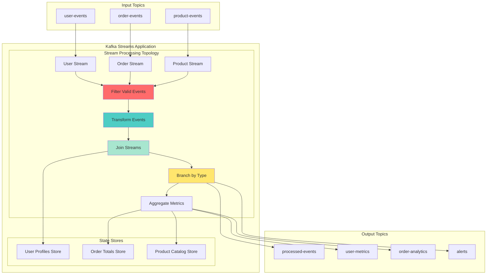
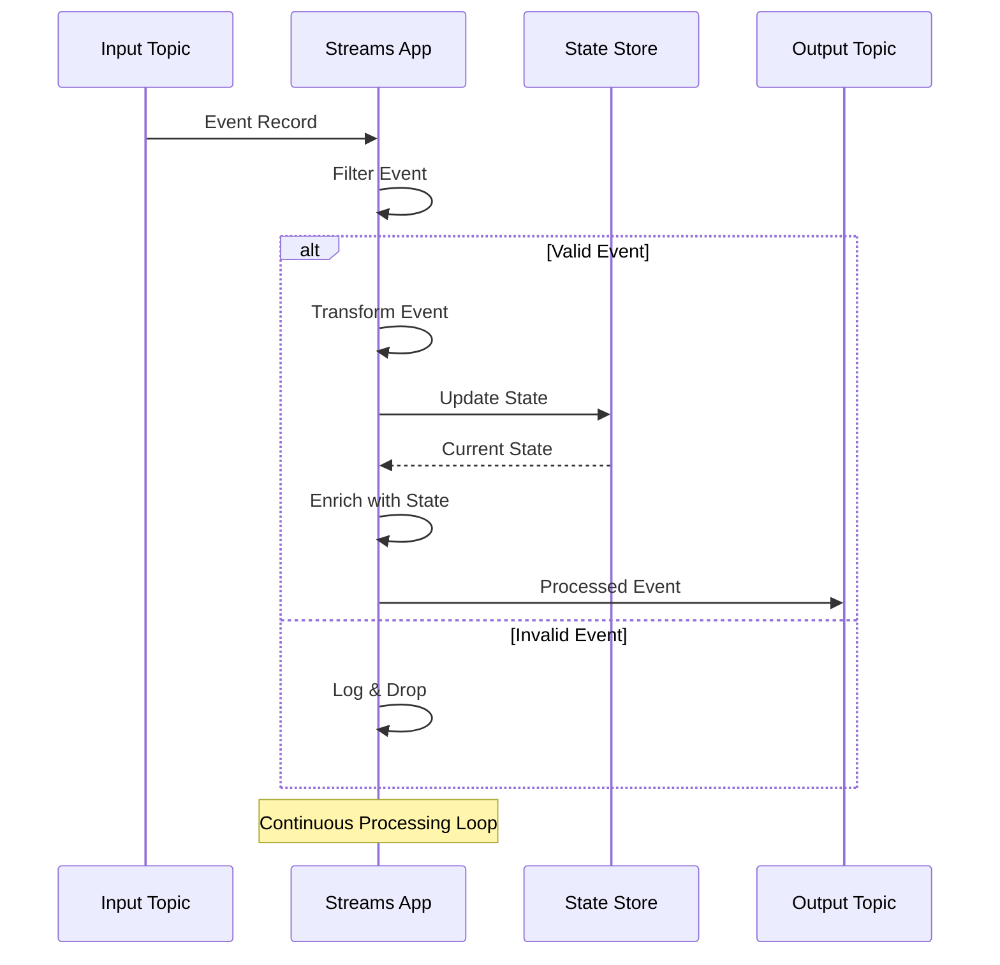

# Workshop: Kafka Streams API Introduction

## 🎯 Objective
Master Kafka Streams for real-time stream processing, building stateless transformations, filtering, and branching operations with the Streams DSL.

## 📋 Workshop Tasks

### Task 1: Streams Topology
Build basic stream topology in `streams/BasicStreamProcessor.kt`

### Task 2: Stateless Transformations
Implement transformations in `streams/StatelessTransformations.kt`

### Task 3: Stream Filtering & Branching
Create filtering logic in `streams/StreamFilterBrancher.kt`

### Task 4: Stream Joining
Implement stream joins in `streams/StreamJoiner.kt`

### Task 5: Testing Framework
Test streams with `test/StreamsTestFramework.kt`

## 🏗️ Kafka Streams Architecture


## 🌊 Stream Processing Flow


## 🎯 Key Concepts

### **Stream Processing Paradigm**
- **Continuous Processing**: Events processed as they arrive
- **Low Latency**: Sub-millisecond processing times
- **Fault Tolerant**: Automatic recovery from failures
- **Scalable**: Horizontal scaling through partitioning

### **Kafka Streams DSL**

#### **1. Stateless Transformations**
```mermaid
graph LR
    INPUT[Input Stream] --> FILTER[filter()]
    FILTER --> MAP[map()]
    MAP --> FLATMAP[flatMap()]
    FLATMAP --> FOREACH[foreach()]
    FOREACH --> OUTPUT[Output Stream]
    
    style FILTER fill:#ff6b6b
    style MAP fill:#4ecdc4
    style FLATMAP fill:#a8e6cf
    style FOREACH fill:#ffe66d
```

#### **2. Stateful Operations**
```mermaid
graph TB
    INPUT[Input Stream] --> GROUPBY[groupByKey()]
    GROUPBY --> WINDOW[windowedBy()]
    WINDOW --> AGG[aggregate()]
    AGG --> STORE[(State Store)]
    STORE --> OUTPUT[Output Stream]
    
    style GROUPBY fill:#ff6b6b
    style WINDOW fill:#4ecdc4
    style AGG fill:#a8e6cf
```

#### **3. Stream-Stream Joins**
```mermaid
graph TB
    STREAM1[User Events] --> JOIN[join()]
    STREAM2[Order Events] --> JOIN
    JOIN --> JOINED[Enriched Events]
    
    subgraph "Join Window"
        JW[10 minute window<br/>Events within window get joined]
    end
    
    JOIN --> JW
    JW --> JOINED
    
    style JOIN fill:#ffe66d
    style JOINED fill:#4ecdc4
```

## ⚡ Stream Processing Operations

### Basic Transformations
```kotlin
// Filter events
val validEvents = inputStream
    .filter { key, value -> value.isValid() }

// Transform events  
val enrichedEvents = validEvents
    .map { key, value -> 
        KeyValue(key, value.enrich()) 
    }

// FlatMap for one-to-many
val expandedEvents = enrichedEvents
    .flatMap { key, value ->
        value.expand().map { KeyValue(key, it) }
    }
```

### Stream Branching
```kotlin
val branches = inputStream
    .split(Named.as("branch-"))
    .branch({ key, value -> value.type == "USER" }, 
            Branched.as("users"))
    .branch({ key, value -> value.type == "ORDER" }, 
            Branched.as("orders"))
    .defaultBranch(Branched.as("others"))

val userStream = branches["branch-users"]
val orderStream = branches["branch-orders"]
val otherStream = branches["branch-others"]
```

### Stream Joins
```kotlin
// Stream-Stream Join
val joinedStream = userStream
    .join(orderStream,
        { user, order -> UserOrder(user, order) },
        JoinWindows.of(Duration.ofMinutes(10))
    )

// Stream-Table Join  
val enrichedStream = orderStream
    .join(userTable,
        { order, user -> order.enrichWith(user) }
    )
```

## 🔧 Topology Building

### Simple Processing Topology
```kotlin
@Component
class UserEventProcessor {
    
    @Autowired
    private lateinit var streamsBuilder: StreamsBuilder
    
    @Bean
    fun userEventProcessingTopology(): KStream<String, UserEvent> {
        
        val userEvents = streamsBuilder
            .stream<String, UserEvent>("user-events")
        
        // Filter valid events
        val validEvents = userEvents
            .filter { _, event -> 
                event.userId.isNotBlank() && event.eventType.isNotBlank() 
            }
        
        // Transform and enrich
        val enrichedEvents = validEvents
            .map { key, event ->
                KeyValue(key, event.copy(
                    timestamp = System.currentTimeMillis(),
                    enrichedData = fetchUserProfile(event.userId)
                ))
            }
        
        // Branch by event type
        val branches = enrichedEvents
            .split(Named.as("event-type-"))
            .branch({ _, event -> event.eventType == "LOGIN" },
                    Branched.as("logins"))
            .branch({ _, event -> event.eventType == "PURCHASE" },
                    Branched.as("purchases"))
            .defaultBranch(Branched.as("others"))
        
        // Send to different topics
        branches["event-type-logins"]?.to("user-logins")
        branches["event-type-purchases"]?.to("user-purchases")
        branches["event-type-others"]?.to("user-other-events")
        
        return enrichedEvents
    }
}
```

## ✅ Success Criteria
- [ ] Kafka Streams application starts and processes events
- [ ] Stateless transformations (filter, map, flatMap) working correctly
- [ ] Stream branching directs events to correct output topics
- [ ] Stream joins combine data from multiple input streams
- [ ] Topology testing framework validates processing logic
- [ ] Error handling and monitoring implemented
- [ ] Performance metrics show acceptable throughput and latency

## 🚀 Getting Started

### 1. Configure Kafka Streams
```kotlin
@Configuration
@EnableKafkaStreams
class KafkaStreamsConfig {
    
    @Bean
    fun streamsConfig(): KafkaStreamsConfiguration {
        val props = mapOf(
            StreamsConfig.APPLICATION_ID_CONFIG to "user-event-processor",
            StreamsConfig.BOOTSTRAP_SERVERS_CONFIG to "localhost:9092",
            StreamsConfig.DEFAULT_KEY_SERDE_CLASS_CONFIG to Serdes.String()::class.java,
            StreamsConfig.DEFAULT_VALUE_SERDE_CLASS_CONFIG to JsonSerde::class.java,
            StreamsConfig.PROCESSING_GUARANTEE_CONFIG to StreamsConfig.EXACTLY_ONCE,
            StreamsConfig.COMMIT_INTERVAL_MS_CONFIG to 1000,
            StreamsConfig.CACHE_MAX_BYTES_BUFFERING_CONFIG to 1024 * 1024 // 1MB
        )
        
        return KafkaStreamsConfiguration(props)
    }
}
```

### 2. Test Stream Processing
```bash
# Send test events
kafka-console-producer --topic user-events --bootstrap-server localhost:9092 \
  --property "parse.key=true" --property "key.separator=:"

# Input: user-123:{"userId":"123","eventType":"LOGIN","timestamp":1645123456}

# Monitor processed outputs
kafka-console-consumer --topic user-logins --from-beginning --bootstrap-server localhost:9092
kafka-console-consumer --topic user-purchases --from-beginning --bootstrap-server localhost:9092
```

### 3. Monitor Stream Metrics
```bash
# Check Kafka Streams metrics
curl http://localhost:8090/actuator/metrics/kafka.streams

# View topology description
curl http://localhost:8090/actuator/kafka-streams/topology
```

## 📊 Performance & Monitoring

### Stream Processing Metrics
```mermaid
graph TB
    subgraph "Throughput Metrics"
        TM1[Records Processed/sec]
        TM2[Records Consumed/sec]
        TM3[Records Produced/sec]
        TM4[Processing Rate]
    end
    
    subgraph "Latency Metrics"
        LM1[Processing Latency<br/>Avg/95th/99th percentile]
        LM2[Commit Latency]
        LM3[Punctuation Latency]
        LM4[End-to-End Latency]
    end
    
    subgraph "Error Metrics"
        EM1[Processing Errors/min]
        EM2[Deserialization Errors]
        EM3[Production Errors]
        EM4[State Store Errors]
    end
    
    subgraph "Resource Metrics"
        RM1[CPU Usage %]
        RM2[Memory Usage]
        RM3[Network I/O]
        RM4[Disk I/O (State)]
    end
    
    style TM1 fill:#4ecdc4
    style LM1 fill:#ffe66d
    style EM1 fill:#ff6b6b
    style RM1 fill:#a8e6cf
```

### Health Check Implementation
```kotlin
@Component
class StreamsHealthIndicator : HealthIndicator {
    
    @Autowired
    private lateinit var kafkaStreams: KafkaStreams
    
    override fun health(): Health {
        val state = kafkaStreams.state()
        val metrics = kafkaStreams.metrics()
        
        return when (state) {
            KafkaStreams.State.RUNNING -> {
                val throughput = metrics.values
                    .find { it.metricName().name() == "process-rate" }
                    ?.metricValue() as? Double ?: 0.0
                
                Health.up()
                    .withDetail("state", state.name)
                    .withDetail("throughput", "$throughput records/sec")
                    .withDetail("threads", kafkaStreams.localThreadsMetadata().size)
                    .build()
            }
            KafkaStreams.State.ERROR -> {
                Health.down()
                    .withDetail("state", state.name)
                    .withDetail("reason", "Streams application in error state")
                    .build()
            }
            else -> {
                Health.degraded()
                    .withDetail("state", state.name)
                    .withDetail("reason", "Streams application not running")
                    .build()
            }
        }
    }
}
```

## 🧪 Testing Streams Applications

### Unit Testing with TopologyTestDriver
```kotlin
@Test
fun `should filter and transform user events`() {
    val topology = userEventProcessor.buildTopology()
    val testDriver = TopologyTestDriver(topology, streamsConfig)
    
    val inputTopic = testDriver.createInputTopic(
        "user-events",
        Serdes.String().serializer(),
        JsonSerde<UserEvent>().serializer()
    )
    
    val outputTopic = testDriver.createOutputTopic(
        "user-logins", 
        Serdes.String().deserializer(),
        JsonSerde<UserEvent>().deserializer()
    )
    
    // Send test event
    val testEvent = UserEvent(
        userId = "123",
        eventType = "LOGIN",
        timestamp = System.currentTimeMillis()
    )
    
    inputTopic.pipeInput("user-123", testEvent)
    
    // Verify output
    val outputRecord = outputTopic.readValue()
    assertThat(outputRecord.userId).isEqualTo("123")
    assertThat(outputRecord.eventType).isEqualTo("LOGIN")
    
    testDriver.close()
}
```

## 🎯 Best Practices

### Topology Design
- **Keep transformations simple** - complex logic should be in separate processors
- **Use meaningful names** - name your streams and stores clearly
- **Plan for evolution** - design topology for future changes
- **Monitor performance** - track throughput and latency metrics

### Error Handling
- **Handle deserialization errors** - use try-catch or error handlers
- **Implement poison pill detection** - skip or DLT problematic messages
- **Use proper exception handling** - don't let streams applications crash
- **Log processing errors** - include context for debugging

### Performance Optimization
- **Tune buffer sizes** - balance memory usage and throughput
- **Configure commit intervals** - balance latency and throughput
- **Use appropriate serdes** - choose efficient serialization
- **Partition data effectively** - ensure even distribution

## 🔍 Troubleshooting

### Common Issues
1. **High latency** - Check commit interval and buffer settings
2. **Uneven processing** - Verify partition key distribution
3. **Memory issues** - Tune cache sizes and state store configs
4. **Rebalancing issues** - Check network stability and timeouts

### Debug Tools
```bash
# View streams application info
kafka-streams-application-reset --application-id user-event-processor \
  --bootstrap-servers localhost:9092

# Monitor consumer group (streams apps are consumers)
kafka-consumer-groups --bootstrap-server localhost:9092 \
  --group user-event-processor --describe

# Check state store contents
kafka-console-consumer --topic user-event-processor-store-changelog \
  --from-beginning --bootstrap-server localhost:9092
```

## 🚀 Next Steps
Streams basics mastered? Time for advanced temporal processing! Move to [Lesson 15: Windowing, Joins & Stateful Operations](../lesson_16/README.md) to learn time-based aggregations and complex event processing.