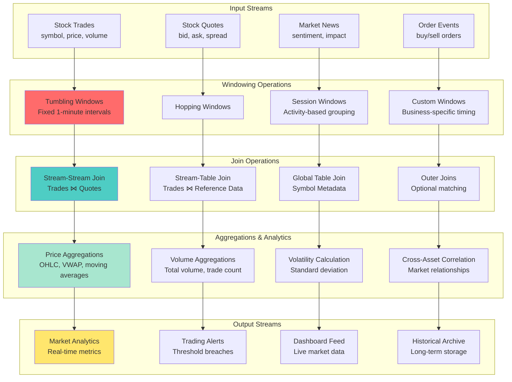
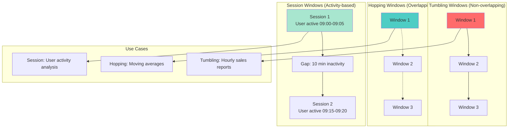
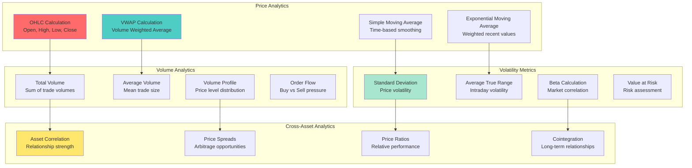

# Workshop: Windowing, Joins & Stateful Operations

## 🎯 Objective
Master advanced Kafka Streams operations including temporal windowing, stream-stream joins, stream-table joins, and stateful aggregations for complex real-time analytics and event processing.

## 📋 Workshop Tasks

### Task 1: Windowing Operations
Implement windowing in `windowing/WindowingProcessor.kt`

### Task 2: Stream-Stream Joins
Build stream joins in `joins/StreamJoinProcessor.kt`

### Task 3: Stream-Table Joins
Create table joins in `joins/StreamTableJoinProcessor.kt`

### Task 4: Temporal Aggregations
Implement aggregations in `aggregation/TemporalAggregator.kt`

### Task 5: Complex Event Processing
Build CEP patterns in `cep/ComplexEventProcessor.kt`

## 🏗️ Advanced Streams Architecture


## ⏰ Windowing Operations Deep Dive

### Window Types and Use Cases


### Windowing Implementation
```kotlin
@Component
class AdvancedWindowingProcessor {
    
    @Autowired
    private lateinit var streamsBuilder: StreamsBuilder
    
    @Bean
    fun stockAnalyticsTopology(): KStream<String, StockTrade> {
        
        // Input stream of stock trades
        val trades = streamsBuilder
            .stream<String, StockTrade>("stock-trades")
        
        // 1. Tumbling Window: 1-minute OHLC (Open, High, Low, Close)
        val ohlcData = trades
            .groupByKey()
            .windowedBy(TimeWindows.of(Duration.ofMinutes(1)))
            .aggregate(
                { OHLCData() },
                { key, trade, ohlc -> ohlc.update(trade) },
                Materialized.`as`<String, OHLCData, WindowStore<Bytes, ByteArray>>("ohlc-store")
            )
            .toStream()
            .map { windowedKey, ohlc ->
                KeyValue(
                    windowedKey.key(),
                    MarketAnalytics(
                        symbol = windowedKey.key(),
                        windowStart = windowedKey.window().start(),
                        windowEnd = windowedKey.window().end(),
                        open = ohlc.open,
                        high = ohlc.high,
                        low = ohlc.low,
                        close = ohlc.close,
                        volume = ohlc.volume
                    )
                )
            }
        
        // 2. Hopping Window: 5-minute moving average with 1-minute advance
        val movingAverages = trades
            .groupByKey()
            .windowedBy(TimeWindows.of(Duration.ofMinutes(5)).advanceBy(Duration.ofMinutes(1)))
            .aggregate(
                { PriceAccumulator() },
                { key, trade, acc -> acc.add(trade.price, trade.volume) },
                Materialized.`as`<String, PriceAccumulator, WindowStore<Bytes, ByteArray>>("moving-avg-store")
            )
            .toStream()
            .mapValues { accumulator -> 
                MovingAverage(
                    vwap = accumulator.getVWAP(),
                    simpleAverage = accumulator.getSimpleAverage(),
                    totalVolume = accumulator.totalVolume,
                    tradeCount = accumulator.tradeCount
                )
            }
        
        // 3. Session Window: Trading session analysis per user
        val tradingSessions = trades
            .groupBy { key, trade -> trade.traderId }
            .windowedBy(SessionWindows.with(Duration.ofMinutes(30))) // 30-minute inactivity gap
            .aggregate(
                { TradingSession() },
                { traderId, trade, session -> session.addTrade(trade) },
                { traderId, session1, session2 -> session1.merge(session2) },
                Materialized.`as`<String, TradingSession, SessionStore<Bytes, ByteArray>>("trading-sessions")
            )
            .toStream()
            .filter { _, session -> session.isComplete() }
        
        // Send results to output topics
        ohlcData.to("market-ohlc")
        movingAverages.to("market-moving-averages")
        tradingSessions.to("trading-sessions")
        
        return trades
    }
}
```

## 🔗 Stream Joins

### Join Types and Semantics

```mermaid
graph TB
    subgraph "Stream-Stream Join"
        SS1[Stock Trades Stream]
        SS2[Market News Stream]
        SS_RESULT[Trade-News Correlation<br/>Within join window]
        
        SS1 --> SS_RESULT
        SS2 --> SS_RESULT
    end
    
    subgraph "Stream-Table Join"
        ST_STREAM[Order Events Stream]
        ST_TABLE[User Profiles Table<br/>Latest state]
        ST_RESULT[Enriched Orders<br/>With user context]
        
        ST_STREAM --> ST_RESULT
        ST_TABLE --> ST_RESULT
    end
    
    subgraph "Global Table Join"
        GT_STREAM[Trade Events Stream]
        GT_TABLE[Symbol Reference Data<br/>Global view]
        GT_RESULT[Enriched Trades<br/>With symbol metadata]
        
        GT_STREAM --> GT_RESULT
        GT_TABLE --> GT_RESULT
    end
    
    subgraph "Join Windows"
        JW[Join Window<br/>Time-based correlation]
        JW_DESC[Events within window<br/>get joined together]
        
        JW --> JW_DESC
    end
    
    style SS_RESULT fill:#ff6b6b
    style ST_RESULT fill:#4ecdc4
    style GT_RESULT fill:#a8e6cf
    style JW fill:#ffe66d
```


### Join Implementation Examples
```kotlin
@Component
class AdvancedJoinProcessor {
    
    // Stream-Stream Join: Correlate trades with market news
    fun tradeNewsCorrelation(): KStream<String, TradeNewsCorrelation> {
        
        val trades = streamsBuilder
            .stream<String, StockTrade>("stock-trades")
            .selectKey { _, trade -> trade.symbol } // Re-key by symbol
        
        val news = streamsBuilder
            .stream<String, MarketNews>("market-news")
            .selectKey { _, news -> news.symbol } // Re-key by symbol
        
        return trades.join(
            news,
            { trade, newsItem -> 
                TradeNewsCorrelation(
                    symbol = trade.symbol,
                    trade = trade,
                    news = newsItem,
                    correlationTime = Instant.now(),
                    potentialImpact = calculateImpact(trade, newsItem)
                )
            },
            JoinWindows.of(Duration.ofMinutes(10)) // 10-minute correlation window
        )
    }
    
    // Stream-Table Join: Enrich trades with trader profiles
    fun enrichTradesWithTraderProfiles(): KStream<String, EnrichedTrade> {
        
        val trades = streamsBuilder
            .stream<String, StockTrade>("stock-trades")
            .selectKey { _, trade -> trade.traderId }
        
        val traderProfiles = streamsBuilder
            .table<String, TraderProfile>("trader-profiles")
        
        return trades.join(
            traderProfiles,
            { trade, profile ->
                EnrichedTrade(
                    trade = trade,
                    traderProfile = profile,
                    riskCategory = profile.riskCategory,
                    tradingLimit = profile.dailyLimit,
                    enrichmentTime = Instant.now()
                )
            }
        )
    }
    
    // Global Table Join: Add symbol reference data
    fun enrichWithSymbolMetadata(): KStream<String, EnrichedTrade> {
        
        val trades = streamsBuilder
            .stream<String, StockTrade>("stock-trades")
        
        val symbolMetadata = streamsBuilder
            .globalTable<String, SymbolMetadata>("symbol-metadata")
        
        return trades.join(
            symbolMetadata,
            { _, trade -> trade.symbol }, // KeyValueMapper to extract foreign key
            { trade, metadata ->
                EnrichedTrade(
                    trade = trade,
                    symbolMetadata = metadata,
                    sector = metadata.sector,
                    industry = metadata.industry,
                    marketCap = metadata.marketCap
                )
            }
        )
    }
    
    // Left Join: Include trades even without matching news
    fun tradesWithOptionalNews(): KStream<String, TradeWithOptionalNews> {
        
        val trades = streamsBuilder
            .stream<String, StockTrade>("stock-trades")
            .selectKey { _, trade -> trade.symbol }
        
        val news = streamsBuilder
            .stream<String, MarketNews>("market-news")
            .selectKey { _, news -> news.symbol }
        
        return trades.leftJoin(
            news,
            { trade, newsItem -> 
                TradeWithOptionalNews(
                    trade = trade,
                    relatedNews = newsItem, // Can be null
                    hasNewsImpact = newsItem != null
                )
            },
            JoinWindows.of(Duration.ofMinutes(5))
        )
    }
}
```

## 📊 Complex Aggregations

### Multi-Dimensional Analytics


### Complex Aggregation Implementation
```kotlin
@Component
class ComplexAggregationProcessor {
    
    fun buildMarketAnalyticsPipeline(): KStream<String, MarketAnalytics> {
        
        val trades = streamsBuilder
            .stream<String, StockTrade>("stock-trades")
        
        // Multi-level aggregation: Symbol -> Time Window -> Analytics
        val marketAnalytics = trades
            .groupByKey()
            .windowedBy(TimeWindows.of(Duration.ofMinutes(1)))
            .aggregate(
                { MarketDataAccumulator() },
                { symbol, trade, accumulator -> 
                    accumulator.addTrade(trade)
                },
                Materialized.`as`<String, MarketDataAccumulator, WindowStore<Bytes, ByteArray>>("market-analytics")
                    .withValueSerde(JsonSerde(MarketDataAccumulator::class.java))
            )
            .toStream()
            .map { windowedKey, accumulator ->
                KeyValue(
                    windowedKey.key(),
                    MarketAnalytics(
                        symbol = windowedKey.key(),
                        windowStart = windowedKey.window().start(),
                        windowEnd = windowedKey.window().end(),
                        
                        // Price metrics
                        ohlc = accumulator.getOHLC(),
                        vwap = accumulator.getVWAP(),
                        movingAverage = accumulator.getMovingAverage(),
                        
                        // Volume metrics
                        totalVolume = accumulator.getTotalVolume(),
                        averageTradeSize = accumulator.getAverageTradeSize(),
                        tradeCount = accumulator.getTradeCount(),
                        
                        // Volatility metrics
                        volatility = accumulator.getVolatility(),
                        priceRange = accumulator.getPriceRange(),
                        
                        // Statistical measures
                        standardDeviation = accumulator.getStandardDeviation(),
                        skewness = accumulator.getSkewness(),
                        kurtosis = accumulator.getKurtosis()
                    )
                )
            }
        
        return marketAnalytics
    }
    
    // Cross-asset correlation analysis
    fun buildCorrelationAnalysis(): KStream<String, CorrelationMatrix> {
        
        val priceUpdates = streamsBuilder
            .stream<String, StockTrade>("stock-trades")
            .map { _, trade -> KeyValue("ALL_STOCKS", trade) }
        
        return priceUpdates
            .groupByKey()
            .windowedBy(TimeWindows.of(Duration.ofHours(1)))
            .aggregate(
                { CorrelationAccumulator() },
                { _, trade, accumulator -> 
                    accumulator.addPrice(trade.symbol, trade.price)
                },
                Materialized.`as`<String, CorrelationAccumulator, WindowStore<Bytes, ByteArray>>("correlations")
            )
            .toStream()
            .mapValues { accumulator -> accumulator.calculateCorrelationMatrix() }
    }
    
    // Real-time risk metrics
    fun buildRiskMetrics(): KStream<String, RiskMetrics> {
        
        val portfolioPositions = streamsBuilder
            .stream<String, PositionUpdate>("portfolio-positions")
        
        val marketData = streamsBuilder
            .stream<String, MarketAnalytics>("market-analytics")
        
        return portfolioPositions
            .join(
                marketData,
                { position, marketData ->
                    RiskCalculator.calculateRisk(position, marketData)
                },
                JoinWindows.of(Duration.ofSeconds(30))
            )
            .groupBy { _, riskMetrics -> riskMetrics.portfolioId }
            .windowedBy(TimeWindows.of(Duration.ofMinutes(5)))
            .aggregate(
                { PortfolioRiskAccumulator() },
                { portfolioId, riskMetrics, accumulator ->
                    accumulator.addRiskMetrics(riskMetrics)
                },
                Materialized.`as`<String, PortfolioRiskAccumulator, WindowStore<Bytes, ByteArray>>("portfolio-risk")
            )
            .toStream()
            .mapValues { accumulator -> accumulator.calculateAggregateRisk() }
    }
}
```

## ✅ Success Criteria
- [ ] Windowing operations correctly group events by time
- [ ] Stream-stream joins correlate events within join windows
- [ ] Stream-table joins enrich streams with latest reference data
- [ ] Complex aggregations produce accurate financial metrics
- [ ] Late-arriving data handled appropriately with grace periods
- [ ] Performance handles high-frequency trading data (&gt;100k events/sec)
- [ ] Memory usage remains stable during large window operations

## 🚀 Getting Started

### 1. Configure Advanced Streams Application
```kotlin
@Configuration
@EnableKafkaStreams
class AdvancedStreamsConfig {
    
    @Bean
    fun streamsConfig(): KafkaStreamsConfiguration {
        val props = mapOf(
            StreamsConfig.APPLICATION_ID_CONFIG to "advanced-market-analytics",
            StreamsConfig.BOOTSTRAP_SERVERS_CONFIG to "localhost:9092",
            
            // Windowing and join configurations
            StreamsConfig.DEFAULT_WINDOWED_KEY_SERDE_INNER_CLASS to Serdes.String()::class.java,
            StreamsConfig.DEFAULT_WINDOWED_VALUE_SERDE_INNER_CLASS to JsonSerde::class.java,
            
            // State store configurations
            StreamsConfig.STATE_DIR_CONFIG to "/tmp/kafka-streams-advanced",
            StreamsConfig.CACHE_MAX_BYTES_BUFFERING_CONFIG to 10 * 1024 * 1024, // 10MB
            
            // Exactly-once processing
            StreamsConfig.PROCESSING_GUARANTEE_CONFIG to StreamsConfig.EXACTLY_ONCE,
            
            // Performance tuning
            StreamsConfig.COMMIT_INTERVAL_MS_CONFIG to 1000,
            StreamsConfig.NUM_STREAM_THREADS_CONFIG to 4
        )
        
        return KafkaStreamsConfiguration(props)
    }
}
```

### 2. Test Windowing and Joins
```bash
# Send stock trade data
kafka-console-producer --topic stock-trades --bootstrap-server localhost:9092 \
  --property "parse.key=true" --property "key.separator=:"

# Input: AAPL:{"symbol":"AAPL","price":150.25,"volume":1000,"traderId":"T123","timestamp":1645123456}

# Send market news
kafka-console-producer --topic market-news --bootstrap-server localhost:9092 \
  --property "parse.key=true" --property "key.separator=:"

# Input: AAPL:{"symbol":"AAPL","headline":"Strong earnings report","sentiment":"POSITIVE","timestamp":1645123500}

# Monitor windowed aggregations
kafka-console-consumer --topic market-ohlc --from-beginning --bootstrap-server localhost:9092
```

### 3. Monitor Stream Processing
```bash
# Check streams application metrics
curl http://localhost:8090/actuator/metrics/kafka.streams

# View window store contents
curl http://localhost:8090/api/streams/windows/ohlc-store/AAPL

# Monitor join operations
curl http://localhost:8090/api/streams/joins/trade-news-correlation/metrics
```

## 🎯 Best Practices

### Windowing Strategy
- **Choose appropriate window sizes** based on business requirements
- **Handle late-arriving data** with grace periods
- **Monitor window memory usage** for large windows
- **Use session windows** for activity-based analysis

### Join Design
- **Co-partition data** for stream-stream joins
- **Use global tables** for reference data joins
- **Size join windows** appropriately for data arrival patterns
- **Handle join failures** with outer joins when needed

### Performance Optimization
- **Tune buffer sizes** for high-throughput scenarios
- **Use custom serdes** for efficient serialization
- **Monitor state store sizes** and implement cleanup
- **Optimize aggregation functions** for computational efficiency

## 🔍 Troubleshooting

### Common Issues
1. **Out-of-order events** - Increase grace period for windows
2. **High memory usage** - Tune cache sizes and commit intervals
3. **Join failures** - Verify co-partitioning and data arrival timing
4. **Slow aggregations** - Optimize aggregation logic and state stores

### Debug Commands
```bash
# Check stream thread health
kafka-streams-application-reset --application-id advanced-market-analytics \
  --bootstrap-servers localhost:9092 --dry-run

# Monitor windowed state stores
kafka-console-consumer --topic advanced-market-analytics-ohlc-store-changelog \
  --from-beginning --bootstrap-server localhost:9092

# View processing topology
curl http://localhost:8090/actuator/kafka-streams/topology
```

## 🚀 Next Steps
Advanced streams operations mastered? Time to persist state reliably! Move to [Lesson 16: Local State Stores & Fault Tolerance](../lesson_17/README.md) to learn stateful stream processing.