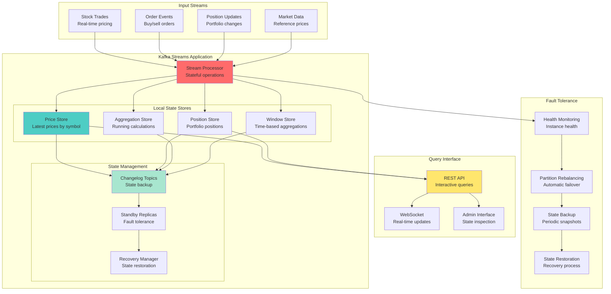
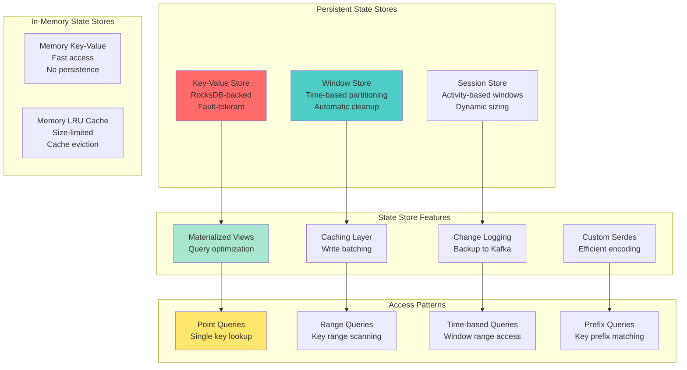

# Workshop: Local State Stores & Fault Tolerance

## 🎯 Objective
Master stateful stream processing with Kafka Streams local state stores, implement fault tolerance mechanisms, state backup and recovery, and build resilient stream applications that maintain state consistency across failures.

## 📋 Workshop Tasks

### Task 1: State Store Configuration
Configure state stores in `statestore/StateStoreConfig.kt`

### Task 2: Stateful Processing
Implement stateful operations in `stateful/StatefulProcessor.kt`

### Task 3: Fault Tolerance
Build fault tolerance in `faulttolerance/FaultToleranceManager.kt`

### Task 4: State Recovery
Create recovery mechanisms in `recovery/StateRecoveryService.kt`

### Task 5: Interactive Queries
Implement queries in `queries/InteractiveQueryService.kt`

## 🏗️ Stateful Streams Architecture


## 🗄️ State Store Types

### State Store Categories


## 💾 State Store Implementation

### Portfolio Position Manager
```kotlin
@Component
class PortfolioStateManager {
    
    companion object {
        const val POSITION_STORE = "portfolio-positions"
        const val PRICE_STORE = "latest-prices"  
        const val PNL_STORE = "profit-loss-calculations"
    }
    
    @Autowired
    private lateinit var streamsBuilder: StreamsBuilder
    
    @Bean
    fun portfolioTrackingTopology(): KStream<String, TradeEvent> {
        
        // Input streams
        val trades = streamsBuilder.stream<String, TradeEvent>("trade-events")
        val prices = streamsBuilder.stream<String, PriceUpdate>("price-updates")
        
        // State stores configuration
        val positionStoreBuilder = Stores.keyValueStoreBuilder(
            Stores.persistentKeyValueStore(POSITION_STORE),
            Serdes.String(),
            JsonSerde(Position::class.java)
        ).withCachingEnabled()
         .withLoggingEnabled(mapOf(
            TopicConfig.CLEANUP_POLICY_CONFIG to TopicConfig.CLEANUP_POLICY_COMPACT,
            TopicConfig.MIN_COMPACTION_LAG_MS_CONFIG to "60000"
        ))
        
        val priceStoreBuilder = Stores.keyValueStoreBuilder(
            Stores.persistentKeyValueStore(PRICE_STORE),
            Serdes.String(),
            JsonSerde(Price::class.java)
        ).withCachingEnabled()
         .withLoggingEnabled(emptyMap())
        
        // Register state stores
        streamsBuilder.addStateStore(positionStoreBuilder)
        streamsBuilder.addStateStore(priceStoreBuilder)
        
        // Process price updates
        prices.process(
            ProcessorSupplier { PriceUpdateProcessor() },
            PRICE_STORE
        )
        
        // Process trades and update positions
        val updatedPositions = trades.process(
            ProcessorSupplier { TradeProcessor() },
            POSITION_STORE, PRICE_STORE
        )
        
        // Calculate P&L with windowed aggregations
        val pnlCalculations = updatedPositions
            .groupByKey()
            .windowedBy(TimeWindows.of(Duration.ofMinutes(1)))
            .aggregate(
                { PnLAccumulator() },
                { symbol, position, accumulator -> 
                    accumulator.updatePosition(position)
                },
                Materialized.`as`<String, PnLAccumulator, WindowStore<Bytes, ByteArray>>(PNL_STORE)
                    .withValueSerde(JsonSerde(PnLAccumulator::class.java))
                    .withRetention(Duration.ofHours(24))
            )
        
        // Output real-time P&L updates
        pnlCalculations.toStream()
            .map { windowedKey, accumulator ->
                KeyValue(
                    windowedKey.key(),
                    PnLUpdate(
                        symbol = windowedKey.key(),
                        windowStart = windowedKey.window().start(),
                        windowEnd = windowedKey.window().end(),
                        unrealizedPnL = accumulator.getUnrealizedPnL(),
                        realizedPnL = accumulator.getRealizedPnL(),
                        totalPnL = accumulator.getTotalPnL()
                    )
                )
            }
            .to("portfolio-pnl-updates")
        
        return trades
    }
}

class TradeProcessor : Processor<String, TradeEvent, String, Position> {
    
    private lateinit var positionStore: KeyValueStore<String, Position>
    private lateinit var priceStore: KeyValueStore<String, Price>
    private lateinit var context: ProcessorContext<String, Position>
    
    override fun init(context: ProcessorContext<String, Position>) {
        this.context = context
        this.positionStore = context.getStateStore(PortfolioStateManager.POSITION_STORE)
        this.priceStore = context.getStateStore(PortfolioStateManager.PRICE_STORE)
        
        // Schedule periodic commit
        context.schedule(Duration.ofSeconds(30), PunctuationType.WALL_CLOCK_TIME) { timestamp ->
            commitPositions(timestamp)
        }
    }
    
    override fun process(record: Record<String, TradeEvent>) {
        val trade = record.value()
        val symbol = trade.symbol
        
        // Get current position
        var position = positionStore.get(symbol) ?: Position.empty(symbol)
        
        // Update position based on trade
        position = when (trade.side) {
            TradeSide.BUY -> position.addPosition(trade.quantity, trade.price)
            TradeSide.SELL -> position.reducePosition(trade.quantity, trade.price)
        }
        
        // Get current market price for mark-to-market
        val currentPrice = priceStore.get(symbol)
        if (currentPrice != null) {
            position = position.markToMarket(currentPrice.price)
        }
        
        // Store updated position
        positionStore.put(symbol, position)
        
        // Forward updated position
        context.forward(record.withValue(position))
        
        logger.debug("Updated position for $symbol: ${position.quantity} shares")
    }
    
    private fun commitPositions(timestamp: Long) {
        // Periodic commit for consistency
        positionStore.flush()
        logger.debug("Committed position updates at $timestamp")
    }
}
```

### State Store Configuration
```kotlin
@Configuration
class StateStoreConfiguration {
    
    @Bean
    fun rocksDBConfig(): RocksDBConfigSetter {
        return RocksDBConfigSetter { name, options ->
            // Optimize for read-heavy workloads
            options.setIncreaseParallelism(Runtime.getRuntime().availableProcessors())
            options.setCreateIfMissing(true)
            options.setCreateMissingColumnFamilies(true)
            
            // Memory settings
            options.setDbWriteBufferSize(64 * 1024 * 1024) // 64MB
            options.setWriteBufferSize(32 * 1024 * 1024)   // 32MB
            options.setMaxWriteBufferNumber(3)
            
            // Compression
            options.setCompressionType(CompressionType.LZ4_COMPRESSION)
            
            // Background compaction
            options.setMaxBackgroundCompactions(2)
            options.setMaxBackgroundFlushes(2)
            
            // Block cache for better read performance
            val blockCache = LRUCache(256 * 1024 * 1024) // 256MB cache
            val blockBasedTableConfig = BlockBasedTableConfig()
            blockBasedTableConfig.setBlockCache(blockCache)
            blockBasedTableConfig.setBlockSize(16 * 1024) // 16KB blocks
            options.setTableFormatConfig(blockBasedTableConfig)
        }
    }
    
    @Bean
    fun stateStoreMetrics(): StateStoreMetrics {
        return StateStoreMetrics()
    }
}

@Component
class StateStoreMetrics {
    
    @Autowired
    private lateinit var meterRegistry: MeterRegistry
    
    @EventListener
    fun handleStateStoreMetrics(kafkaStreams: KafkaStreams) {
        Gauge.builder("kafka.streams.state.store.size")
            .tag("store", "portfolio-positions")
            .register(meterRegistry) {
                getStateStoreSize(kafkaStreams, "portfolio-positions")
            }
        
        Gauge.builder("kafka.streams.state.store.records")
            .tag("store", "portfolio-positions")
            .register(meterRegistry) {
                getStateStoreRecordCount(kafkaStreams, "portfolio-positions")
            }
    }
    
    private fun getStateStoreSize(streams: KafkaStreams, storeName: String): Double {
        return try {
            val store = streams.store(
                StoreQueryParameters.fromNameAndType(storeName, QueryableStoreTypes.keyValueStore<String, Any>())
            )
            
            store.approximateNumEntries().toDouble()
        } catch (e: Exception) {
            0.0
        }
    }
}
```

## 🛡️ Fault Tolerance Implementation

### Standby Replicas and Recovery
```kotlin
@Component
class FaultToleranceManager {
    
    @Autowired
    private lateinit var kafkaStreams: KafkaStreams
    
    @Value("\${kafka.streams.num.standby.replicas:1}")
    private var numStandbyReplicas: Int = 1
    
    @PostConstruct
    fun configureFaultTolerance() {
        // Configure standby replicas
        val streamsConfig = Properties().apply {
            put(StreamsConfig.NUM_STANDBY_REPLICAS_CONFIG, numStandbyReplicas)
            put(StreamsConfig.ACCEPTABLE_RECOVERY_LAG_CONFIG, 10000L) // 10 seconds
            put(StreamsConfig.MAX_WARMUP_REPLICAS_CONFIG, 2)
            put(StreamsConfig.PROBING_REBALANCE_INTERVAL_MS_CONFIG, 600000L) // 10 minutes
        }
        
        // Monitor stream state changes
        kafkaStreams.setStateListener { newState, oldState ->
            handleStateChange(newState, oldState)
        }
        
        // Handle uncaught exceptions
        kafkaStreams.setUncaughtExceptionHandler { thread, exception ->
            logger.error("Uncaught exception in stream thread: ${thread.name}", exception)
            handleStreamException(exception)
        }
    }
    
    private fun handleStateChange(newState: KafkaStreams.State, oldState: KafkaStreams.State) {
        logger.info("Kafka Streams state changed: $oldState -> $newState")
        
        when (newState) {
            KafkaStreams.State.RUNNING -> {
                logger.info("Kafka Streams application is running")
                notifyHealthy()
            }
            KafkaStreams.State.REBALANCING -> {
                logger.warn("Kafka Streams application is rebalancing")
                notifyRebalancing()
            }
            KafkaStreams.State.ERROR -> {
                logger.error("Kafka Streams application entered error state")
                notifyError()
                initiateRecovery()
            }
            KafkaStreams.State.NOT_RUNNING -> {
                logger.warn("Kafka Streams application is not running")
                notifyNotRunning()
            }
            else -> {
                logger.debug("Kafka Streams state: $newState")
            }
        }
    }
    
    private fun handleStreamException(exception: Throwable): StreamsUncaughtExceptionHandler.StreamThreadExceptionResponse {
        return when (exception) {
            is InvalidStateStoreException -> {
                logger.warn("State store not available, will retry")
                StreamsUncaughtExceptionHandler.StreamThreadExceptionResponse.REPLACE_THREAD
            }
            is StreamsException -> {
                logger.error("Streams processing error", exception)
                StreamsUncaughtExceptionHandler.StreamThreadExceptionResponse.REPLACE_THREAD
            }
            else -> {
                logger.error("Unexpected exception, shutting down", exception)
                StreamsUncaughtExceptionHandler.StreamThreadExceptionResponse.SHUTDOWN_APPLICATION
            }
        }
    }
    
    private fun initiateRecovery() {
        CompletableFuture.runAsync {
            try {
                logger.info("Initiating Kafka Streams recovery")
                
                // Clean up corrupted state if needed
                cleanupCorruptedState()
                
                // Restart streams
                restartStreamsApplication()
                
            } catch (e: Exception) {
                logger.error("Recovery failed", e)
            }
        }
    }
    
    private fun cleanupCorruptedState() {
        // Implementation would check for corrupted state stores
        // and clean them up if necessary
        logger.info("Checking for corrupted state stores")
        
        val stateDir = File(kafkaStreams.allLocalStorePartitionLags().keys.first())
        if (stateDir.exists() && isStateCorrupted(stateDir)) {
            logger.warn("Corrupted state detected, cleaning up")
            stateDir.deleteRecursively()
        }
    }
    
    private fun isStateCorrupted(stateDir: File): Boolean {
        // Simple heuristic: check if state directory is empty or has lock files
        return stateDir.listFiles()?.isEmpty() ?: true
    }
    
    private fun restartStreamsApplication() {
        try {
            kafkaStreams.close(Duration.ofSeconds(30))
            kafkaStreams.start()
            logger.info("Kafka Streams application restarted successfully")
        } catch (e: Exception) {
            logger.error("Failed to restart Kafka Streams application", e)
        }
    }
}
```

## 🔍 Interactive Queries

### Real-time State Queries
```kotlin
@RestController
@RequestMapping("/api/state")
class InteractiveQueryController {
    
    @Autowired
    private lateinit var kafkaStreams: KafkaStreams
    
    @GetMapping("/positions/{symbol}")
    fun getPosition(@PathVariable symbol: String): ResponseEntity<Position> {
        return try {
            val store = kafkaStreams.store(
                StoreQueryParameters.fromNameAndType(
                    PortfolioStateManager.POSITION_STORE,
                    QueryableStoreTypes.keyValueStore<String, Position>()
                )
            )
            
            val position = store.get(symbol)
            if (position != null) {
                ResponseEntity.ok(position)
            } else {
                ResponseEntity.notFound().build()
            }
            
        } catch (e: InvalidStateStoreException) {
            ResponseEntity.status(HttpStatus.SERVICE_UNAVAILABLE)
                .body(null)
        }
    }
    
    @GetMapping("/positions")
    fun getAllPositions(
        @RequestParam(required = false) minQuantity: Double?
    ): ResponseEntity<List<Position>> {
        
        return try {
            val store = kafkaStreams.store(
                StoreQueryParameters.fromNameAndType(
                    PortfolioStateManager.POSITION_STORE,
                    QueryableStoreTypes.keyValueStore<String, Position>()
                )
            )
            
            val positions = mutableListOf<Position>()
            store.all().use { iterator ->
                while (iterator.hasNext()) {
                    val keyValue = iterator.next()
                    val position = keyValue.value
                    
                    if (minQuantity == null || position.quantity >= minQuantity) {
                        positions.add(position)
                    }
                }
            }
            
            ResponseEntity.ok(positions)
            
        } catch (e: InvalidStateStoreException) {
            ResponseEntity.status(HttpStatus.SERVICE_UNAVAILABLE)
                .body(emptyList())
        }
    }
    
    @GetMapping("/pnl/{symbol}/window")
    fun getWindowedPnL(
        @PathVariable symbol: String,
        @RequestParam from: Long,
        @RequestParam to: Long
    ): ResponseEntity<List<WindowedPnL>> {
        
        return try {
            val store = kafkaStreams.store(
                StoreQueryParameters.fromNameAndType(
                    PortfolioStateManager.PNL_STORE,
                    QueryableStoreTypes.windowStore<String, PnLAccumulator>()
                )
            )
            
            val fromTime = Instant.ofEpochMilli(from)
            val toTime = Instant.ofEpochMilli(to)
            
            val windowedPnL = mutableListOf<WindowedPnL>()
            store.fetch(symbol, fromTime, toTime).use { iterator ->
                while (iterator.hasNext()) {
                    val keyValue = iterator.next()
                    val window = keyValue.key
                    val accumulator = keyValue.value
                    
                    windowedPnL.add(
                        WindowedPnL(
                            symbol = symbol,
                            windowStart = window.start(),
                            windowEnd = window.end(),
                            unrealizedPnL = accumulator.getUnrealizedPnL(),
                            realizedPnL = accumulator.getRealizedPnL(),
                            totalPnL = accumulator.getTotalPnL()
                        )
                    )
                }
            }
            
            ResponseEntity.ok(windowedPnL)
            
        } catch (e: InvalidStateStoreException) {
            ResponseEntity.status(HttpStatus.SERVICE_UNAVAILABLE)
                .body(emptyList())
        }
    }
    
    @GetMapping("/health")
    fun getStateStoreHealth(): ResponseEntity<StateStoreHealthReport> {
        return try {
            val allLocalStorePartitionLags = kafkaStreams.allLocalStorePartitionLags()
            val healthy = allLocalStorePartitionLags.values.all { lag -> lag <= 1000 }
            
            val report = StateStoreHealthReport(
                isHealthy = healthy,
                storeCount = allLocalStorePartitionLags.size,
                maxLag = allLocalStorePartitionLags.values.maxOrNull() ?: 0,
                avgLag = allLocalStorePartitionLags.values.average(),
                streamsState = kafkaStreams.state().name
            )
            
            ResponseEntity.ok(report)
            
        } catch (e: Exception) {
            ResponseEntity.status(HttpStatus.INTERNAL_SERVER_ERROR)
                .body(StateStoreHealthReport(isHealthy = false))
        }
    }
}
```

## ✅ Success Criteria
- [ ] Local state stores persist data across application restarts
- [ ] Fault tolerance handles instance failures gracefully
- [ ] State recovery restores consistent state from changelog topics
- [ ] Interactive queries provide real-time access to state
- [ ] Performance remains acceptable with large state stores (&gt;1GB)
- [ ] Standby replicas enable fast failover (&lt;30 seconds)
- [ ] State store health monitoring detects issues proactively

## 🚀 Getting Started

### 1. Configure Stateful Streams Application
```kotlin
@Configuration
@EnableKafkaStreams
class StatefulStreamsConfig {
    
    @Bean
    fun streamsConfig(): KafkaStreamsConfiguration {
        val props = mapOf(
            StreamsConfig.APPLICATION_ID_CONFIG to "stateful-portfolio-tracker",
            StreamsConfig.BOOTSTRAP_SERVERS_CONFIG to "localhost:9092",
            
            // State store configuration
            StreamsConfig.STATE_DIR_CONFIG to "/tmp/kafka-streams-state",
            StreamsConfig.NUM_STANDBY_REPLICAS_CONFIG to 1,
            StreamsConfig.ACCEPTABLE_RECOVERY_LAG_CONFIG to 10000L,
            
            // RocksDB optimization
            StreamsConfig.ROCKSDB_CONFIG_SETTER_CLASS_CONFIG to RocksDBConfigSetter::class.java,
            StreamsConfig.CACHE_MAX_BYTES_BUFFERING_CONFIG to 50 * 1024 * 1024, // 50MB
            
            // Fault tolerance
            StreamsConfig.PROCESSING_GUARANTEE_CONFIG to StreamsConfig.EXACTLY_ONCE_V2,
            StreamsConfig.COMMIT_INTERVAL_MS_CONFIG to 1000
        )
        
        return KafkaStreamsConfiguration(props)
    }
}
```

### 2. Test Stateful Processing
```bash
# Send trade events
kafka-console-producer --topic trade-events --bootstrap-server localhost:9092 \
  --property "parse.key=true" --property "key.separator=:"

# Input: AAPL:{"symbol":"AAPL","side":"BUY","quantity":100,"price":150.25,"timestamp":1645123456}

# Query current position
curl http://localhost:8090/api/state/positions/AAPL

# Query all positions
curl http://localhost:8090/api/state/positions

# Check state store health
curl http://localhost:8090/api/state/health
```

### 3. Monitor State Store Performance
```bash
# Check state store metrics
curl http://localhost:8090/actuator/metrics/kafka.streams.state.store

# Monitor changelog topics
kafka-console-consumer --topic stateful-portfolio-tracker-portfolio-positions-changelog \
  --from-beginning --bootstrap-server localhost:9092

# Check recovery lag
curl http://localhost:8090/api/state/health
```

## 🎯 Best Practices

### State Store Design
- **Choose appropriate store types** based on access patterns
- **Configure caching** to reduce I/O for frequently accessed data
- **Use custom serdes** for efficient serialization
- **Monitor state store sizes** and implement cleanup policies

### Fault Tolerance Strategy
- **Configure standby replicas** for fast failover
- **Monitor recovery lag** to ensure timely replication
- **Implement health checks** for state store availability
- **Test recovery scenarios** regularly

### Performance Optimization
- **Tune RocksDB settings** for your workload characteristics
- **Use appropriate commit intervals** to balance latency and throughput
- **Configure proper cleanup policies** for changelog topics
- **Monitor memory usage** and adjust cache sizes accordingly

## 🔍 Troubleshooting

### Common Issues
1. **Slow state store access** - Tune RocksDB configuration and increase cache
2. **High recovery times** - Reduce changelog topic retention and increase replicas
3. **Out of memory errors** - Reduce cache sizes and optimize serialization
4. **Corrupted state stores** - Implement proper cleanup and recovery procedures

### Debug Commands
```bash
# Check state directory contents
ls -la /tmp/kafka-streams-state/

# Monitor RocksDB statistics
curl http://localhost:8090/api/debug/rocksdb/stats

# Check changelog topic offsets
kafka-run-class kafka.tools.GetOffsetShell \
  --broker-list localhost:9092 \
  --topic stateful-portfolio-tracker-portfolio-positions-changelog
```

## 🚀 Next Steps
State stores mastered? Time to build real-time dashboards! Move to [Lesson 17: Building a Real-time Dashboard Application](../lesson_17/README.md) to create interactive data visualizations.