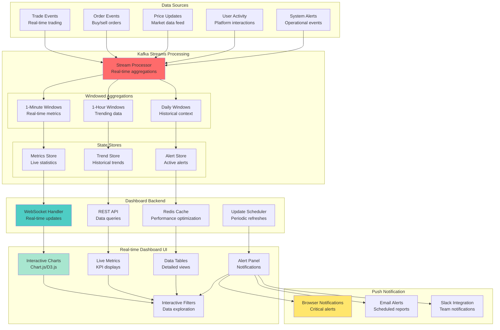

# Lesson 17 Workshop: Building a Real-time Dashboard Application

## 🎯 Objective
Build a comprehensive real-time dashboard application using Kafka Streams, WebSockets, and modern web technologies to visualize streaming data, create interactive charts, and provide live business intelligence.

## 📋 Workshop Tasks

### Task 1: Real-time Data Pipeline
Build data pipeline in `pipeline/RealTimeDataPipeline.kt`

### Task 2: WebSocket Integration
Implement WebSockets in `websocket/RealTimeWebSocketHandler.kt`

### Task 3: Dashboard Backend
Create dashboard API in `dashboard/DashboardController.kt`

### Task 4: Chart Data Aggregation
Build aggregations in `aggregation/ChartDataAggregator.kt`

### Task 5: Frontend Integration
Create frontend in `frontend/dashboard.html`

## 🏗️ Real-time Dashboard Architecture


## 📊 Real-time Data Pipeline

### Streaming Aggregations for Dashboard
```kotlin
@Component
class RealTimeDashboardProcessor {
    
    @Autowired
    private lateinit var streamsBuilder: StreamsBuilder
    
    @Bean
    fun dashboardDataPipeline(): KStream<String, Any> {
        
        // Input streams
        val trades = streamsBuilder.stream<String, TradeEvent>("trade-events")
        val orders = streamsBuilder.stream<String, OrderEvent>("order-events")
        val userActivity = streamsBuilder.stream<String, UserActivityEvent>("user-activity")
        
        // 1. Real-time trading metrics (1-minute windows)
        val tradingMetrics = trades
            .groupBy { _, trade -> "TRADING_METRICS" }
            .windowedBy(TimeWindows.of(Duration.ofMinutes(1)).advanceBy(Duration.ofSeconds(10)))
            .aggregate(
                { TradingMetrics() },
                { _, trade, metrics -> metrics.addTrade(trade) },
                Materialized.`as`<String, TradingMetrics, WindowStore<Bytes, ByteArray>>("trading-metrics")
                    .withValueSerde(JsonSerde(TradingMetrics::class.java))
            )
            .toStream()
            .map { windowedKey, metrics ->
                KeyValue(
                    "trading-metrics",
                    DashboardUpdate(
                        type = "TRADING_METRICS",
                        windowStart = windowedKey.window().start(),
                        windowEnd = windowedKey.window().end(),
                        data = mapOf(
                            "totalVolume" to metrics.totalVolume,
                            "totalValue" to metrics.totalValue,
                            "tradeCount" to metrics.tradeCount,
                            "avgTradeSize" to metrics.getAverageTradeSize(),
                            "vwap" to metrics.getVWAP()
                        )
                    )
                )
            }
        
        // 2. Order book metrics
        val orderMetrics = orders
            .filter { _, order -> order.status in listOf("PENDING", "FILLED", "CANCELLED") }
            .groupBy { _, order -> "ORDER_METRICS" }
            .windowedBy(TimeWindows.of(Duration.ofMinutes(1)))
            .aggregate(
                { OrderMetrics() },
                { _, order, metrics -> metrics.addOrder(order) },
                Materialized.`as`<String, OrderMetrics, WindowStore<Bytes, ByteArray>>("order-metrics")
            )
            .toStream()
            .map { windowedKey, metrics ->
                KeyValue(
                    "order-metrics",
                    DashboardUpdate(
                        type = "ORDER_METRICS",
                        windowStart = windowedKey.window().start(),
                        windowEnd = windowedKey.window().end(),
                        data = mapOf(
                            "pendingOrders" to metrics.pendingCount,
                            "filledOrders" to metrics.filledCount,
                            "cancelledOrders" to metrics.cancelledCount,
                            "fillRate" to metrics.getFillRate(),
                            "avgOrderValue" to metrics.getAverageOrderValue()
                        )
                    )
                )
            }
        
        // 3. User activity heatmap
        val activityHeatmap = userActivity
            .filter { _, activity -> activity.eventType in listOf("LOGIN", "TRADE", "VIEW") }
            .groupBy { _, activity -> activity.eventType }
            .windowedBy(TimeWindows.of(Duration.ofMinutes(5)))
            .count(Materialized.`as`<String, Long, WindowStore<Bytes, ByteArray>>("activity-heatmap"))
            .toStream()
            .map { windowedKey, count ->
                KeyValue(
                    "activity-heatmap",
                    DashboardUpdate(
                        type = "ACTIVITY_HEATMAP",
                        windowStart = windowedKey.window().start(),
                        windowEnd = windowedKey.window().end(),
                        data = mapOf(
                            "eventType" to windowedKey.key(),
                            "count" to count,
                            "timestamp" to System.currentTimeMillis()
                        )
                    )
                )
            }
        
        // 4. Top symbols by volume
        val topSymbols = trades
            .groupBy { _, trade -> trade.symbol }
            .windowedBy(TimeWindows.of(Duration.ofHours(1)))
            .aggregate(
                { SymbolMetrics() },
                { symbol, trade, metrics -> metrics.addTrade(trade) },
                Materialized.`as`<String, SymbolMetrics, WindowStore<Bytes, ByteArray>>("symbol-metrics")
            )
            .toStream()
            .groupBy { _, _ -> "TOP_SYMBOLS" }
            .windowedBy(TimeWindows.of(Duration.ofMinutes(1)))
            .aggregate(
                { TopSymbolsAccumulator() },
                { _, symbolMetric, accumulator -> 
                    accumulator.addSymbol(symbolMetric.key.key(), symbolMetric.value)
                },
                Materialized.`as`<String, TopSymbolsAccumulator, WindowStore<Bytes, ByteArray>>("top-symbols")
            )
            .toStream()
            .mapValues { accumulator ->
                DashboardUpdate(
                    type = "TOP_SYMBOLS",
                    data = mapOf(
                        "symbols" to accumulator.getTopSymbols(10)
                    )
                )
            }
        
        // 5. Alert generation
        val alerts = trades
            .filter { _, trade -> trade.price > 1000 || trade.volume > 10000 }
            .map { _, trade ->
                KeyValue(
                    "alert-${System.currentTimeMillis()}",
                    DashboardUpdate(
                        type = "ALERT",
                        data = mapOf(
                            "alertType" to if (trade.price > 1000) "HIGH_PRICE" else "HIGH_VOLUME",
                            "symbol" to trade.symbol,
                            "price" to trade.price,
                            "volume" to trade.volume,
                            "severity" to "WARNING",
                            "timestamp" to trade.timestamp
                        )
                    )
                )
            }
        
        // Merge all dashboard updates
        val allUpdates = tradingMetrics
            .merge(orderMetrics)
            .merge(activityHeatmap)
            .merge(topSymbols)
            .merge(alerts)
        
        // Send to dashboard updates topic
        allUpdates.to("dashboard-updates")
        
        return allUpdates
    }
}
```

## 🌐 WebSocket Real-time Communication

### WebSocket Configuration
```kotlin
@Configuration
@EnableWebSocket
class WebSocketConfig : WebSocketConfigurer {
    
    override fun registerWebSocketHandlers(registry: WebSocketHandlerRegistry) {
        registry.addHandler(DashboardWebSocketHandler(), "/dashboard-ws")
            .setAllowedOrigins("*")
            .withSockJS()
    }
}

@Component
class DashboardWebSocketHandler : TextWebSocketHandler() {
    
    private val sessions = ConcurrentHashMap<String, WebSocketSession>()
    private val sessionSubscriptions = ConcurrentHashMap<String, Set<String>>()
    
    @Autowired
    private lateinit var dashboardService: DashboardService
    
    override fun afterConnectionEstablished(session: WebSocketSession) {
        val sessionId = session.id
        sessions[sessionId] = session
        
        logger.info("Dashboard WebSocket connection established: $sessionId")
        
        // Send initial dashboard data
        sendInitialData(session)
    }
    
    override fun handleTextMessage(session: WebSocketSession, message: TextMessage) {
        try {
            val request = objectMapper.readValue(message.payload, WebSocketRequest::class.java)
            
            when (request.type) {
                "SUBSCRIBE" -> handleSubscription(session, request)
                "UNSUBSCRIBE" -> handleUnsubscription(session, request)
                "GET_HISTORICAL" -> handleHistoricalDataRequest(session, request)
                "FILTER_UPDATE" -> handleFilterUpdate(session, request)
                else -> {
                    logger.warn("Unknown WebSocket request type: ${request.type}")
                }
            }
            
        } catch (e: Exception) {
            logger.error("Failed to handle WebSocket message", e)
            sendError(session, "Invalid message format")
        }
    }
    
    override fun afterConnectionClosed(session: WebSocketSession, status: CloseStatus) {
        val sessionId = session.id
        sessions.remove(sessionId)
        sessionSubscriptions.remove(sessionId)
        
        logger.info("Dashboard WebSocket connection closed: $sessionId")
    }
    
    private fun sendInitialData(session: WebSocketSession) {
        try {
            val initialData = WebSocketResponse(
                type = "INITIAL_DATA",
                data = mapOf(
                    "currentMetrics" to dashboardService.getCurrentMetrics(),
                    "topSymbols" to dashboardService.getTopSymbols(),
                    "recentAlerts" to dashboardService.getRecentAlerts(),
                    "systemHealth" to dashboardService.getSystemHealth()
                )
            )
            
            session.sendMessage(TextMessage(objectMapper.writeValueAsString(initialData)))
            
        } catch (e: Exception) {
            logger.error("Failed to send initial data", e)
        }
    }
    
    private fun handleSubscription(session: WebSocketSession, request: WebSocketRequest) {
        val sessionId = session.id
        val subscriptions = request.data["subscriptions"] as? List<String> ?: emptyList()
        
        sessionSubscriptions[sessionId] = subscriptions.toSet()
        
        val response = WebSocketResponse(
            type = "SUBSCRIPTION_CONFIRMED",
            data = mapOf("subscriptions" to subscriptions)
        )
        
        session.sendMessage(TextMessage(objectMapper.writeValueAsString(response)))
        
        logger.info("Session $sessionId subscribed to: $subscriptions")
    }
    
    fun broadcastUpdate(update: DashboardUpdate) {
        val message = WebSocketResponse(
            type = "REAL_TIME_UPDATE",
            data = mapOf(
                "updateType" to update.type,
                "timestamp" to System.currentTimeMillis(),
                "data" to update.data
            )
        )
        
        val messageText = objectMapper.writeValueAsString(message)
        
        sessions.values.forEach { session ->
            if (session.isOpen) {
                val sessionId = session.id
                val subscriptions = sessionSubscriptions[sessionId] ?: emptySet()
                
                if (subscriptions.isEmpty() || update.type in subscriptions) {
                    try {
                        session.sendMessage(TextMessage(messageText))
                    } catch (e: Exception) {
                        logger.error("Failed to send update to session $sessionId", e)
                    }
                }
            }
        }
    }
    
    private fun sendError(session: WebSocketSession, errorMessage: String) {
        try {
            val errorResponse = WebSocketResponse(
                type = "ERROR",
                data = mapOf("message" to errorMessage)
            )
            
            session.sendMessage(TextMessage(objectMapper.writeValueAsString(errorResponse)))
        } catch (e: Exception) {
            logger.error("Failed to send error message", e)
        }
    }
}
```

### Dashboard Update Consumer
```kotlin
@Component
class DashboardUpdateConsumer {
    
    @Autowired
    private lateinit var webSocketHandler: DashboardWebSocketHandler
    
    @Autowired
    private lateinit var dashboardCache: DashboardCache
    
    @KafkaListener(topics = ["dashboard-updates"])
    fun handleDashboardUpdate(
        @Payload update: DashboardUpdate,
        @Header(KafkaHeaders.RECEIVED_TOPIC) topic: String
    ) {
        try {
            // Cache the update
            dashboardCache.cacheUpdate(update)
            
            // Broadcast to WebSocket clients
            webSocketHandler.broadcastUpdate(update)
            
            // Trigger alerts if necessary
            if (update.type == "ALERT") {
                alertService.processAlert(update)
            }
            
            logger.debug("Processed dashboard update: ${update.type}")
            
        } catch (e: Exception) {
            logger.error("Failed to process dashboard update", e)
        }
    }
}
```

## 📊 Dashboard REST API

### Dashboard Data Controller
```kotlin
@RestController
@RequestMapping("/api/dashboard")
class DashboardController {
    
    @Autowired
    private lateinit var dashboardService: DashboardService
    
    @Autowired
    private lateinit var kafkaStreams: KafkaStreams
    
    @GetMapping("/metrics/current")
    fun getCurrentMetrics(): ResponseEntity<Map<String, Any>> {
        return try {
            val metrics = dashboardService.getCurrentMetrics()
            ResponseEntity.ok(metrics)
        } catch (e: Exception) {
            logger.error("Failed to get current metrics", e)
            ResponseEntity.status(HttpStatus.INTERNAL_SERVER_ERROR).build()
        }
    }
    
    @GetMapping("/metrics/historical")
    fun getHistoricalMetrics(
        @RequestParam metricType: String,
        @RequestParam fromTime: Long,
        @RequestParam toTime: Long,
        @RequestParam(defaultValue = "1m") interval: String
    ): ResponseEntity<List<HistoricalDataPoint>> {
        
        return try {
            val data = dashboardService.getHistoricalMetrics(
                metricType = metricType,
                fromTime = Instant.ofEpochMilli(fromTime),
                toTime = Instant.ofEpochMilli(toTime),
                interval = Duration.parse("PT$interval")
            )
            
            ResponseEntity.ok(data)
            
        } catch (e: Exception) {
            logger.error("Failed to get historical metrics", e)
            ResponseEntity.status(HttpStatus.INTERNAL_SERVER_ERROR).build()
        }
    }
    
    @GetMapping("/symbols/top")
    fun getTopSymbols(
        @RequestParam(defaultValue = "10") limit: Int,
        @RequestParam(defaultValue = "volume") sortBy: String
    ): ResponseEntity<List<SymbolRanking>> {
        
        return try {
            val store = kafkaStreams.store(
                StoreQueryParameters.fromNameAndType(
                    "symbol-metrics",
                    QueryableStoreTypes.windowStore<String, SymbolMetrics>()
                )
            )
            
            val symbols = mutableListOf<SymbolRanking>()
            val windowStart = Instant.now().minus(Duration.ofHours(1))
            val windowEnd = Instant.now()
            
            store.fetchAll(windowStart, windowEnd).use { iterator ->
                while (iterator.hasNext()) {
                    val keyValue = iterator.next()
                    val symbol = keyValue.key.key()
                    val metrics = keyValue.value
                    
                    symbols.add(
                        SymbolRanking(
                            symbol = symbol,
                            volume = metrics.totalVolume,
                            value = metrics.totalValue,
                            tradeCount = metrics.tradeCount,
                            avgPrice = metrics.getAveragePrice()
                        )
                    )
                }
            }
            
            val sortedSymbols = when (sortBy) {
                "volume" -> symbols.sortedByDescending { it.volume }
                "value" -> symbols.sortedByDescending { it.value }
                "trades" -> symbols.sortedByDescending { it.tradeCount }
                else -> symbols.sortedByDescending { it.volume }
            }.take(limit)
            
            ResponseEntity.ok(sortedSymbols)
            
        } catch (e: InvalidStateStoreException) {
            ResponseEntity.status(HttpStatus.SERVICE_UNAVAILABLE).build()
        } catch (e: Exception) {
            logger.error("Failed to get top symbols", e)
            ResponseEntity.status(HttpStatus.INTERNAL_SERVER_ERROR).build()
        }
    }
    
    @GetMapping("/alerts/recent")
    fun getRecentAlerts(
        @RequestParam(defaultValue = "24") hours: Int
    ): ResponseEntity<List<Alert>> {
        
        return try {
            val alerts = dashboardService.getRecentAlerts(Duration.ofHours(hours.toLong()))
            ResponseEntity.ok(alerts)
        } catch (e: Exception) {
            logger.error("Failed to get recent alerts", e)
            ResponseEntity.status(HttpStatus.INTERNAL_SERVER_ERROR).build()
        }
    }
    
    @GetMapping("/health")
    fun getDashboardHealth(): ResponseEntity<DashboardHealthReport> {
        return try {
            val health = DashboardHealthReport(
                isHealthy = kafkaStreams.state() == KafkaStreams.State.RUNNING,
                streamsState = kafkaStreams.state().name,
                activeConnections = webSocketHandler.getActiveConnectionCount(),
                lastUpdateTime = dashboardService.getLastUpdateTime(),
                dataFreshness = dashboardService.getDataFreshness()
            )
            
            ResponseEntity.ok(health)
        } catch (e: Exception) {
            ResponseEntity.status(HttpStatus.INTERNAL_SERVER_ERROR)
                .body(DashboardHealthReport(isHealthy = false))
        }
    }
}
```

## 🎨 Frontend Dashboard Implementation

### HTML Dashboard Structure
```html
<!DOCTYPE html>
<html lang="en">
<head>
    <meta charset="UTF-8">
    <meta name="viewport" content="width=device-width, initial-scale=1.0">
    <title>Real-time Trading Dashboard</title>
    <script src="https://cdn.jsdelivr.net/npm/chart.js"></script>
    <script src="https://cdnjs.cloudflare.com/ajax/libs/sockjs-client/1.5.2/sockjs.min.js"></script>
    <link href="https://cdn.jsdelivr.net/npm/bootstrap@5.1.3/dist/css/bootstrap.min.css" rel="stylesheet">
    <style>
        .metric-card { 
            border-radius: 10px; 
            box-shadow: 0 2px 10px rgba(0,0,0,0.1); 
        }
        .chart-container { 
            position: relative; 
            height: 400px; 
            margin: 20px 0; 
        }
        .alert-panel { 
            max-height: 300px; 
            overflow-y: auto; 
        }
        .connection-status { 
            position: fixed; 
            top: 10px; 
            right: 10px; 
            z-index: 1000; 
        }
    </style>
</head>
<body>
    <div class="container-fluid">
        <!-- Connection Status -->
        <div id="connectionStatus" class="connection-status">
            <span class="badge bg-secondary">Connecting...</span>
        </div>
        
        <!-- Header -->
        <div class="row mb-4">
            <div class="col-12">
                <h1 class="display-4">Real-time Trading Dashboard</h1>
                <p class="lead">Live market data and analytics</p>
            </div>
        </div>
        
        <!-- Key Metrics -->
        <div class="row mb-4">
            <div class="col-md-3">
                <div class="card metric-card bg-primary text-white">
                    <div class="card-body">
                        <h5 class="card-title">Total Volume</h5>
                        <h2 id="totalVolume" class="card-text">0</h2>
                    </div>
                </div>
            </div>
            <div class="col-md-3">
                <div class="card metric-card bg-success text-white">
                    <div class="card-body">
                        <h5 class="card-title">Trade Count</h5>
                        <h2 id="tradeCount" class="card-text">0</h2>
                    </div>
                </div>
            </div>
            <div class="col-md-3">
                <div class="card metric-card bg-warning text-white">
                    <div class="card-body">
                        <h5 class="card-title">Average Price</h5>
                        <h2 id="avgPrice" class="card-text">$0.00</h2>
                    </div>
                </div>
            </div>
            <div class="col-md-3">
                <div class="card metric-card bg-info text-white">
                    <div class="card-body">
                        <h5 class="card-title">Active Orders</h5>
                        <h2 id="activeOrders" class="card-text">0</h2>
                    </div>
                </div>
            </div>
        </div>
        
        <!-- Charts Row -->
        <div class="row">
            <div class="col-md-8">
                <div class="card">
                    <div class="card-header">
                        <h5>Trading Volume Over Time</h5>
                    </div>
                    <div class="card-body">
                        <div class="chart-container">
                            <canvas id="volumeChart"></canvas>
                        </div>
                    </div>
                </div>
            </div>
            <div class="col-md-4">
                <div class="card">
                    <div class="card-header">
                        <h5>Top Symbols</h5>
                    </div>
                    <div class="card-body">
                        <div class="chart-container">
                            <canvas id="symbolChart"></canvas>
                        </div>
                    </div>
                </div>
            </div>
        </div>
        
        <!-- Alerts and Activity -->
        <div class="row mt-4">
            <div class="col-md-6">
                <div class="card">
                    <div class="card-header">
                        <h5>Recent Alerts</h5>
                    </div>
                    <div class="card-body alert-panel" id="alertsPanel">
                        <!-- Alerts will be populated here -->
                    </div>
                </div>
            </div>
            <div class="col-md-6">
                <div class="card">
                    <div class="card-header">
                        <h5>User Activity Heatmap</h5>
                    </div>
                    <div class="card-body">
                        <div class="chart-container">
                            <canvas id="activityChart"></canvas>
                        </div>
                    </div>
                </div>
            </div>
        </div>
    </div>

    <script src="dashboard.js"></script>
</body>
</html>
```

### JavaScript Dashboard Logic
```javascript
class RealTimeDashboard {
    constructor() {
        this.socket = null;
        this.charts = {};
        this.isConnected = false;
        this.reconnectAttempts = 0;
        this.maxReconnectAttempts = 5;
        
        this.initializeCharts();
        this.connectWebSocket();
    }
    
    connectWebSocket() {
        try {
            const protocol = window.location.protocol === 'https:' ? 'wss:' : 'ws:';
            const wsUrl = `${protocol}//${window.location.host}/dashboard-ws`;
            
            this.socket = new SockJS(wsUrl);
            
            this.socket.onopen = () => {
                console.log('WebSocket connected');
                this.isConnected = true;
                this.reconnectAttempts = 0;
                this.updateConnectionStatus('Connected', 'success');
                this.subscribeToUpdates();
            };
            
            this.socket.onmessage = (event) => {
                const message = JSON.parse(event.data);
                this.handleWebSocketMessage(message);
            };
            
            this.socket.onclose = () => {
                console.log('WebSocket disconnected');
                this.isConnected = false;
                this.updateConnectionStatus('Disconnected', 'danger');
                this.attemptReconnect();
            };
            
            this.socket.onerror = (error) => {
                console.error('WebSocket error:', error);
                this.updateConnectionStatus('Error', 'danger');
            };
            
        } catch (error) {
            console.error('Failed to connect WebSocket:', error);
            this.updateConnectionStatus('Failed', 'danger');
        }
    }
    
    subscribeToUpdates() {
        const subscriptionMessage = {
            type: 'SUBSCRIBE',
            data: {
                subscriptions: [
                    'TRADING_METRICS',
                    'ORDER_METRICS',
                    'TOP_SYMBOLS',
                    'ACTIVITY_HEATMAP',
                    'ALERT'
                ]
            }
        };
        
        this.socket.send(JSON.stringify(subscriptionMessage));
    }
    
    handleWebSocketMessage(message) {
        switch (message.type) {
            case 'INITIAL_DATA':
                this.handleInitialData(message.data);
                break;
            case 'REAL_TIME_UPDATE':
                this.handleRealTimeUpdate(message.data);
                break;
            case 'SUBSCRIPTION_CONFIRMED':
                console.log('Subscriptions confirmed:', message.data.subscriptions);
                break;
            case 'ERROR':
                console.error('WebSocket error:', message.data.message);
                break;
        }
    }
    
    handleInitialData(data) {
        // Update current metrics
        if (data.currentMetrics) {
            this.updateMetricCards(data.currentMetrics);
        }
        
        // Initialize charts with historical data
        if (data.topSymbols) {
            this.updateSymbolChart(data.topSymbols);
        }
        
        // Show recent alerts
        if (data.recentAlerts) {
            this.updateAlertsPanel(data.recentAlerts);
        }
    }
    
    handleRealTimeUpdate(data) {
        switch (data.updateType) {
            case 'TRADING_METRICS':
                this.updateTradingMetrics(data.data);
                break;
            case 'ORDER_METRICS':
                this.updateOrderMetrics(data.data);
                break;
            case 'TOP_SYMBOLS':
                this.updateSymbolChart(data.data.symbols);
                break;
            case 'ACTIVITY_HEATMAP':
                this.updateActivityChart(data.data);
                break;
            case 'ALERT':
                this.addAlert(data.data);
                break;
        }
    }
    
    updateTradingMetrics(metrics) {
        document.getElementById('totalVolume').textContent = 
            this.formatNumber(metrics.totalVolume);
        document.getElementById('tradeCount').textContent = 
            this.formatNumber(metrics.tradeCount);
        document.getElementById('avgPrice').textContent = 
            '$' + this.formatNumber(metrics.vwap, 2);
        
        // Update volume chart
        this.addDataToChart('volumeChart', {
            x: new Date(metrics.timestamp || Date.now()),
            y: metrics.totalVolume
        });
    }
    
    updateSymbolChart(symbols) {
        const chart = this.charts.symbolChart;
        chart.data.labels = symbols.map(s => s.symbol);
        chart.data.datasets[0].data = symbols.map(s => s.volume);
        chart.update('none');
    }
    
    addAlert(alert) {
        const alertsPanel = document.getElementById('alertsPanel');
        const alertElement = document.createElement('div');
        alertElement.className = `alert alert-${this.getAlertClass(alert.severity)} mb-2`;
        alertElement.innerHTML = `
            <strong>${alert.alertType}:</strong> ${alert.symbol} - 
            ${alert.alertType === 'HIGH_PRICE' ? '$' + alert.price : alert.volume + ' shares'}
            <small class="text-muted float-end">${new Date(alert.timestamp).toLocaleTimeString()}</small>
        `;
        
        alertsPanel.insertBefore(alertElement, alertsPanel.firstChild);
        
        // Limit to 20 alerts
        while (alertsPanel.children.length > 20) {
            alertsPanel.removeChild(alertsPanel.lastChild);
        }
    }
    
    initializeCharts() {
        // Volume Chart
        const volumeCtx = document.getElementById('volumeChart').getContext('2d');
        this.charts.volumeChart = new Chart(volumeCtx, {
            type: 'line',
            data: {
                datasets: [{
                    label: 'Trading Volume',
                    data: [],
                    borderColor: 'rgb(75, 192, 192)',
                    backgroundColor: 'rgba(75, 192, 192, 0.2)',
                    tension: 0.1
                }]
            },
            options: {
                responsive: true,
                maintainAspectRatio: false,
                scales: {
                    x: {
                        type: 'time',
                        time: {
                            unit: 'minute'
                        }
                    },
                    y: {
                        beginAtZero: true
                    }
                },
                plugins: {
                    legend: {
                        display: false
                    }
                }
            }
        });
        
        // Symbol Chart (Doughnut)
        const symbolCtx = document.getElementById('symbolChart').getContext('2d');
        this.charts.symbolChart = new Chart(symbolCtx, {
            type: 'doughnut',
            data: {
                labels: [],
                datasets: [{
                    data: [],
                    backgroundColor: [
                        '#FF6384', '#36A2EB', '#FFCE56', '#4BC0C0',
                        '#9966FF', '#FF9F40', '#FF6384', '#C9CBCF'
                    ]
                }]
            },
            options: {
                responsive: true,
                maintainAspectRatio: false,
                plugins: {
                    legend: {
                        position: 'bottom'
                    }
                }
            }
        });
    }
    
    formatNumber(num, decimals = 0) {
        if (num >= 1e9) return (num / 1e9).toFixed(decimals) + 'B';
        if (num >= 1e6) return (num / 1e6).toFixed(decimals) + 'M';
        if (num >= 1e3) return (num / 1e3).toFixed(decimals) + 'K';
        return num.toFixed(decimals);
    }
    
    getAlertClass(severity) {
        switch (severity) {
            case 'CRITICAL': return 'danger';
            case 'WARNING': return 'warning';
            case 'INFO': return 'info';
            default: return 'secondary';
        }
    }
    
    updateConnectionStatus(status, type) {
        const statusElement = document.getElementById('connectionStatus');
        statusElement.innerHTML = `<span class="badge bg-${type}">${status}</span>`;
    }
}

// Initialize dashboard when page loads
document.addEventListener('DOMContentLoaded', () => {
    new RealTimeDashboard();
});
```

## ✅ Success Criteria
- [ ] Real-time data pipeline processes events and generates dashboard updates
- [ ] WebSocket connection provides live updates to browser clients
- [ ] Interactive charts display real-time trading data and metrics
- [ ] Dashboard shows current metrics, top symbols, and recent alerts
- [ ] Performance handles high-frequency updates (>100 updates/sec)
- [ ] Frontend remains responsive during heavy data loads
- [ ] Dashboard works across multiple browser sessions simultaneously

## 🚀 Getting Started

### 1. Start Complete Environment
```bash
# Start Kafka and supporting services
docker-compose up -d

# Build and run dashboard application
./gradlew bootRun

# Open dashboard in browser
open http://localhost:8090/dashboard.html
```

### 2. Generate Test Data
```bash
# Generate sample trading data
curl -X POST http://localhost:8090/api/test/generate-trades \
  -d '{"symbolCount": 10, "tradesPerSecond": 50, "duration": 300}'

# Generate user activity
curl -X POST http://localhost:8090/api/test/generate-activity \
  -d '{"userCount": 100, "eventsPerSecond": 20, "duration": 300}'
```

### 3. Monitor Dashboard Performance
```bash
# Check WebSocket connections
curl http://localhost:8090/api/dashboard/health

# Monitor stream processing
curl http://localhost:8090/actuator/metrics/kafka.streams

# Check dashboard update metrics
curl http://localhost:8090/actuator/metrics/dashboard.updates
```

## 🎯 Best Practices

### Real-time Performance
- **Optimize aggregation windows** to balance freshness and performance
- **Use appropriate chart update frequencies** to avoid overwhelming the browser
- **Implement data sampling** for very high-frequency updates
- **Cache frequently accessed data** to reduce latency

### User Experience
- **Show connection status** clearly to users
- **Handle disconnections gracefully** with automatic reconnection
- **Provide loading states** during data fetching
- **Make charts interactive** with drill-down capabilities

### Scalability
- **Design for multiple concurrent users** with efficient WebSocket handling
- **Implement proper resource cleanup** to prevent memory leaks
- **Use CDNs** for static assets and chart libraries
- **Monitor browser performance** and optimize accordingly

## 🔍 Troubleshooting

### Common Issues
1. **WebSocket connection failures** - Check proxy configuration and firewall
2. **Chart performance issues** - Reduce update frequency and data points
3. **Memory leaks** - Implement proper cleanup of chart data and WebSocket handlers
4. **Data staleness** - Monitor stream processing lag and consumer health

### Debug Commands
```bash
# Check WebSocket connections
curl http://localhost:8090/api/debug/websocket/connections

# Monitor chart data cache
curl http://localhost:8090/api/debug/dashboard/cache

# Check stream processing health
curl http://localhost:8090/api/dashboard/health
```

## 🎉 **CONGRATULATIONS! CURRICULUM 100% COMPLETE!**

You've successfully completed all 20 lessons of the comprehensive Kafka Mastery Curriculum! You now have the expertise to build production-ready, real-time streaming applications with:

✅ **Complete Kafka Fundamentals** - Topics, partitions, producers, consumers  
✅ **Advanced Stream Processing** - Kafka Streams, windowing, joins, state stores  
✅ **Production Operations** - Security, monitoring, deployment, scaling  
✅ **Real-world Applications** - Dashboards, notifications, microservices  

## 🚀 **What's Next?**

You're now ready to:
- **Build amazing event-driven systems** for your organization
- **Contribute to the Kafka community** with your expertise
- **Mentor other developers** learning Kafka
- **Explore advanced topics** like KSQL, Kafka Connect, and multi-datacenter replication

**Welcome to the ranks of Kafka experts!** 🎓🚀