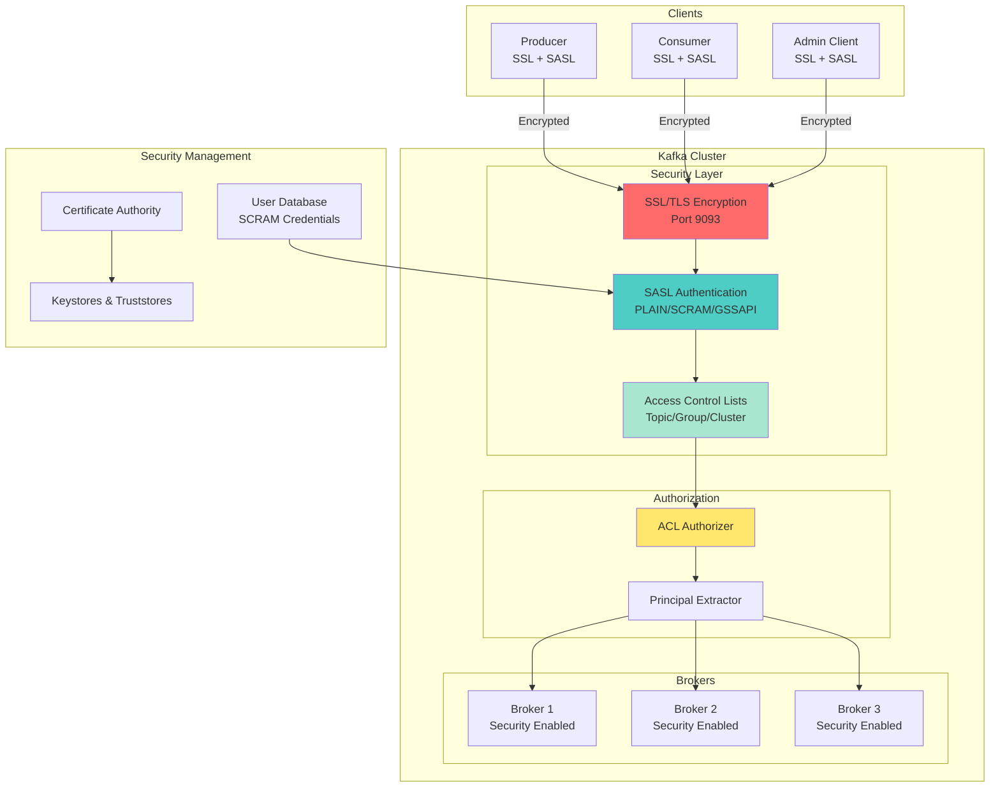
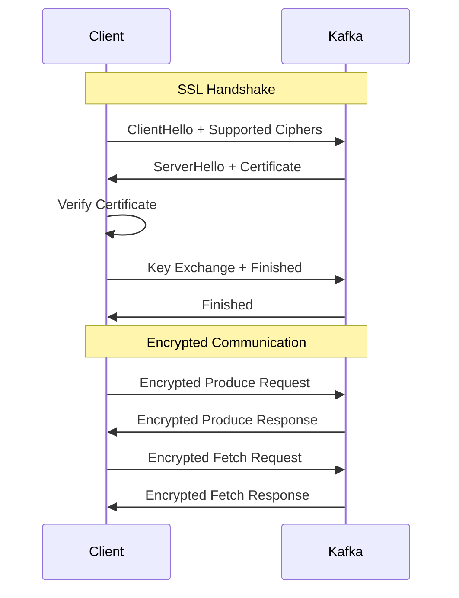
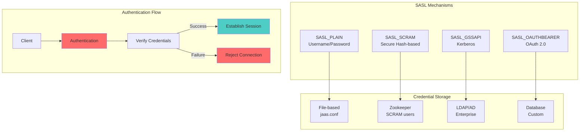
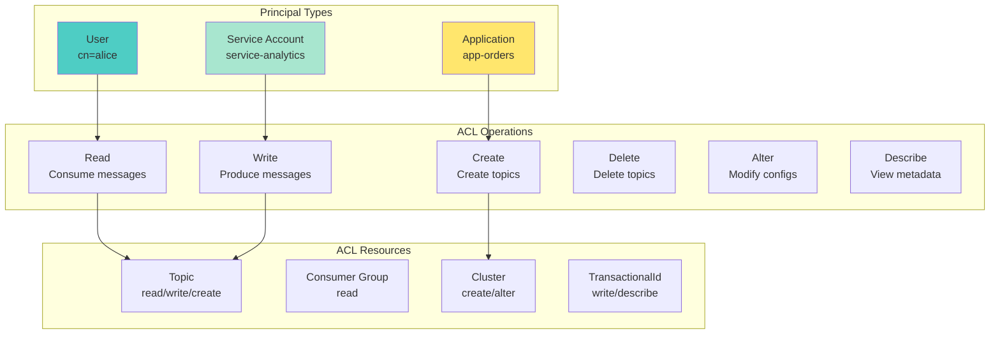
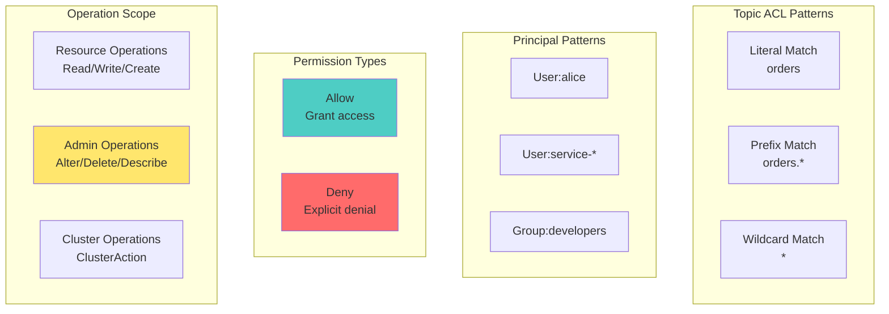

# Workshop: Kafka Security & ACLs

## 🎯 Objective
Implement production-grade security for Kafka clusters including SSL/TLS encryption, SASL authentication, and Access Control Lists (ACLs) for comprehensive authorization.

## 📋 Workshop Tasks

### Task 1: SSL/TLS Configuration
Configure SSL encryption in `security/SSLConfigManager.kt`

### Task 2: SASL Authentication
Implement SASL authentication in `security/SASLAuthManager.kt`

### Task 3: ACL Management
Build ACL management in `security/ACLManager.kt`

### Task 4: Principal Mapping
Configure principal mapping in `security/PrincipalMapper.kt`

### Task 5: Security Monitoring
Monitor security events in `security/SecurityMonitor.kt`

## 🔐 Kafka Security Architecture


## 🔒 Security Layers

### 1. **Encryption (SSL/TLS)**


### 2. **Authentication (SASL)**


### 3. **Authorization (ACLs)**


## ⚙️ SSL/TLS Configuration

### Certificate Generation
```bash
# Create Certificate Authority (CA)
keytool -keystore kafka.server.keystore.jks -alias localhost \
  -validity 365 -genkey -keyalg RSA

# Export certificate
keytool -keystore kafka.server.keystore.jks -alias localhost \
  -certreq -file cert-file

# Sign certificate with CA
openssl x509 -req -CA ca-cert -CAkey ca-key \
  -in cert-file -out cert-signed -days 365 -CAcreateserial

# Import signed certificate
keytool -keystore kafka.server.keystore.jks -alias CARoot \
  -import -file ca-cert
keytool -keystore kafka.server.keystore.jks -alias localhost \
  -import -file cert-signed

# Create truststore
keytool -keystore kafka.server.truststore.jks -alias CARoot \
  -import -file ca-cert
```

### Broker SSL Configuration
```properties
# SSL Settings
listeners=PLAINTEXT://localhost:9092,SSL://localhost:9093
security.inter.broker.protocol=SSL
ssl.keystore.location=/etc/kafka/ssl/kafka.server.keystore.jks
ssl.keystore.password=kafka-password
ssl.key.password=kafka-password
ssl.truststore.location=/etc/kafka/ssl/kafka.server.truststore.jks
ssl.truststore.password=kafka-password

# SSL Protocol Configuration
ssl.enabled.protocols=TLSv1.2,TLSv1.3
ssl.keystore.type=JKS
ssl.truststore.type=JKS
ssl.client.auth=none
ssl.endpoint.identification.algorithm=
```

## 🔑 SASL Authentication

### SASL_SCRAM Configuration
```properties
# SASL Settings
listeners=SASL_SSL://localhost:9094
security.inter.broker.protocol=SASL_SSL
sasl.mechanism.inter.broker.protocol=SCRAM-SHA-512
sasl.enabled.mechanisms=SCRAM-SHA-256,SCRAM-SHA-512

# JAAS Configuration
listener.name.sasl_ssl.scram-sha-256.sasl.jaas.config=org.apache.kafka.common.security.scram.ScramLoginModule required;
listener.name.sasl_ssl.scram-sha-512.sasl.jaas.config=org.apache.kafka.common.security.scram.ScramLoginModule required;
```

### User Management
```bash
# Create SCRAM users
kafka-configs --bootstrap-server localhost:9094 \
  --alter --add-config 'SCRAM-SHA-256=[password=alice-secret]' \
  --entity-type users --entity-name alice

kafka-configs --bootstrap-server localhost:9094 \
  --alter --add-config 'SCRAM-SHA-512=[password=bob-secret]' \
  --entity-type users --entity-name bob

# List users
kafka-configs --bootstrap-server localhost:9094 \
  --describe --entity-type users
```

## 🛡️ Access Control Lists (ACLs)

### ACL Management
```bash
# Grant read access to topic
kafka-acls --bootstrap-server localhost:9094 \
  --add --allow-principal User:alice \
  --operation Read --topic orders

# Grant write access to topic
kafka-acls --bootstrap-server localhost:9094 \
  --add --allow-principal User:bob \
  --operation Write --topic orders

# Grant consumer group access
kafka-acls --bootstrap-server localhost:9094 \
  --add --allow-principal User:alice \
  --operation Read --group order-consumers

# Grant admin access
kafka-acls --bootstrap-server localhost:9094 \
  --add --allow-principal User:admin \
  --operation All --cluster kafka-cluster

# List ACLs
kafka-acls --bootstrap-server localhost:9094 --list
```

### ACL Patterns


## ✅ Success Criteria
- [ ] SSL/TLS encryption working for all client-broker communication
- [ ] SASL authentication successfully authenticates users
- [ ] ACLs properly restrict access based on user permissions
- [ ] Security monitoring captures authentication and authorization events
- [ ] Certificate rotation procedures documented and tested
- [ ] Performance impact of security measures within acceptable limits
- [ ] Integration with existing identity management systems working

## 🚀 Getting Started

### 1. Configure Security Properties
```kotlin
@Configuration
class KafkaSecurityConfig {
    
    @Bean
    fun secureProducerFactory(): ProducerFactory<String, Any> {
        val props = mapOf(
            ProducerConfig.BOOTSTRAP_SERVERS_CONFIG to "localhost:9094",
            ProducerConfig.KEY_SERIALIZER_CLASS_CONFIG to StringSerializer::class.java,
            ProducerConfig.VALUE_SERIALIZER_CLASS_CONFIG to JsonSerializer::class.java,
            
            // SSL Configuration
            CommonClientConfigs.SECURITY_PROTOCOL_CONFIG to "SASL_SSL",
            SslConfigs.SSL_TRUSTSTORE_LOCATION_CONFIG to "/etc/kafka/ssl/kafka.client.truststore.jks",
            SslConfigs.SSL_TRUSTSTORE_PASSWORD_CONFIG to "client-password",
            SslConfigs.SSL_KEYSTORE_LOCATION_CONFIG to "/etc/kafka/ssl/kafka.client.keystore.jks",
            SslConfigs.SSL_KEYSTORE_PASSWORD_CONFIG to "client-password",
            SslConfigs.SSL_KEY_PASSWORD_CONFIG to "client-password",
            
            // SASL Configuration
            SaslConfigs.SASL_MECHANISM to "SCRAM-SHA-256",
            SaslConfigs.SASL_JAAS_CONFIG to "org.apache.kafka.common.security.scram.ScramLoginModule required username=\"alice\" password=\"alice-secret\";"
        )
        
        return DefaultKafkaProducerFactory(props)
    }
}
```

### 2. Test Secure Connection
```bash
# Test with correct credentials
kafka-console-producer --bootstrap-server localhost:9094 \
  --topic orders \
  --producer.config client-secure.properties

# Test with wrong credentials (should fail)
kafka-console-producer --bootstrap-server localhost:9094 \
  --topic orders \
  --producer.config client-wrong.properties
```

### 3. Monitor Security Events
```bash
# Check server logs for security events
tail -f kafka-server.log | grep -i "authentication\|authorization"

# Monitor ACL violations
tail -f kafka-authorizer.log | grep -i "denied"
```

## 📊 Security Monitoring

### Security Metrics

```mermaid
graph TB
    subgraph "Authentication Metrics"
        AM1[Successful Logins/min]
        AM2[Failed Logins/min]
        AM3[Authentication Latency]
        AM4[Active Sessions]
    end
    
    subgraph "Authorization Metrics"
        AZ1[ACL Permits/min]
        AZ2[ACL Denials/min]
        AZ3[Authorization Latency]
        AZ4[Privilege Escalation Attempts]
    end
    
    subgraph "SSL/TLS Metrics"
        SM1[SSL Handshake Latency]
        SM2[Certificate Expiry Alerts]
        SM3[Cipher Suite Usage]
        SM4[Protocol Version Distribution]
    end
    
    subgraph "Security Alerts"
        SA1[Brute Force Detection]
        SA2[Unusual Access Patterns]
        SA3[Certificate Near Expiry]
        SA4[Unauthorized Admin Access]
    end
    
    AM2 --> SA1
    AZ2 --> SA2
    SM2 --> SA3
    AZ4 --> SA4
    
    style AM2 fill:#ff6b6b
    style AZ2 fill:#ff6b6b
    style SA1 fill:#ff6b6b
    style SA4 fill:#ff6b6b
```


### Security Health Check
```kotlin
@Component
class SecurityHealthIndicator : HealthIndicator {
    
    override fun health(): Health {
        return try {
            val sslHandshakeLatency = measureSSLHandshakeLatency()
            val authFailureRate = calculateAuthFailureRate()
            val aclDenialRate = calculateACLDenialRate()
            
            when {
                authFailureRate > 10.0 -> {
                    Health.down()
                        .withDetail("reason", "High authentication failure rate")
                        .withDetail("failureRate", authFailureRate)
                        .build()
                }
                aclDenialRate > 5.0 -> {
                    Health.degraded()
                        .withDetail("reason", "High ACL denial rate")
                        .withDetail("denialRate", aclDenialRate)
                        .build()
                }
                sslHandshakeLatency > 1000 -> {
                    Health.degraded()
                        .withDetail("reason", "High SSL handshake latency")
                        .withDetail("latency", sslHandshakeLatency)
                        .build()
                }
                else -> {
                    Health.up()
                        .withDetail("sslLatency", sslHandshakeLatency)
                        .withDetail("authFailureRate", authFailureRate)
                        .withDetail("aclDenialRate", aclDenialRate)
                        .build()
                }
            }
        } catch (e: Exception) {
            Health.down(e).build()
        }
    }
}
```

## 🎯 Best Practices

### Certificate Management
- **Use proper CA hierarchy** - separate root and intermediate CAs
- **Implement certificate rotation** - automate renewal before expiry
- **Monitor certificate health** - track expiry dates and validation
- **Secure key storage** - use hardware security modules when possible

### Authentication Strategy
- **Choose appropriate SASL mechanism** - SCRAM for most use cases
- **Implement password policies** - strong passwords and regular rotation
- **Use service accounts** - dedicated accounts for applications
- **Monitor authentication patterns** - detect unusual login behaviors

### Authorization Design
- **Principle of least privilege** - grant minimum required permissions
- **Use resource patterns** - leverage prefix/wildcard matching
- **Regular ACL audits** - review and clean up unused permissions
- **Document permission models** - maintain clear authorization matrix

## 🔍 Troubleshooting

### Common Security Issues
1. **SSL handshake failures** - Check certificate validity and trust chains
2. **Authentication failures** - Verify JAAS configuration and credentials
3. **Authorization denials** - Check ACL permissions and principal mapping
4. **Performance impact** - Monitor latency introduced by security layers

### Debug Commands
```bash
# Test SSL connection
openssl s_client -connect localhost:9093 -verify_return_error

# Verify certificate
keytool -list -v -keystore kafka.server.keystore.jks

# Check SASL configuration
kafka-configs --bootstrap-server localhost:9094 \
  --describe --entity-type users --entity-name alice

# Debug ACL issues
kafka-acls --bootstrap-server localhost:9094 \
  --list --principal User:alice
```

## 🚀 Next Steps
Security implemented? Time to monitor everything! Move to [Lesson 19: Observability & Monitoring](../lesson_19/README.md) to learn comprehensive monitoring and alerting for production Kafka systems.