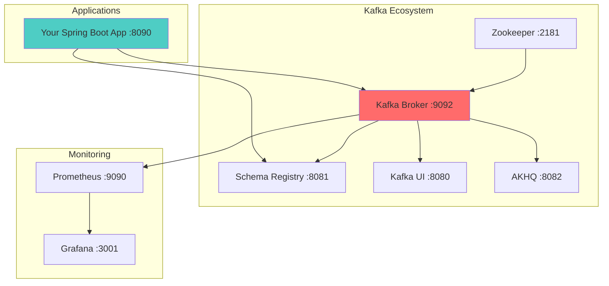

# Workshop: Environment Setup & Kafka Infrastructure

## 🎯 Objective
Set up a complete Kafka development environment and validate that all components are working correctly.

## 📋 Workshop Tasks

### Task 1: Docker Environment Setup
Complete the environment validation in `validation/EnvironmentValidator.kt`

### Task 2: Kafka Configuration Analysis
Analyze and understand Kafka configurations in `config/KafkaConfigAnalyzer.kt`

### Task 3: Topic Management
Practice topic operations in `topics/TopicManager.kt`

### Task 4: Health Monitoring Setup
Implement health checks in `monitoring/HealthChecker.kt`

## 🧠 Key Concepts to Understand
- Kafka broker configuration
- Zookeeper coordination
- Schema Registry setup
- Topic creation and management
- Producer/Consumer configuration
- Monitoring and health checks

## 🐳 Infrastructure Architecture


## ✅ Success Criteria
- [ ] All Docker services running and healthy
- [ ] Kafka broker accessible on port 9092
- [ ] Schema Registry accessible on port 8081
- [ ] Kafka UI accessible on port 8080
- [ ] Can create and list topics
- [ ] Producer/Consumer test successful
- [ ] Health checks passing

## 🚀 Getting Started

### 1. Start Infrastructure
```bash
cd docker
docker-compose up -d
```

### 2. Verify Services
```bash
# Check all services are running
docker-compose ps

# Test Kafka connectivity
docker exec kafka-starter-broker kafka-topics --list --bootstrap-server localhost:9092
```

### 3. Complete Workshop Exercises
Work through the validation exercises in the workshop files.

## 🔍 Troubleshooting

### Common Issues:
- **Port conflicts**: Make sure ports 9092, 8080, 8081 are available
- **Memory issues**: Increase Docker memory to 4GB+
- **Slow startup**: Services may take 1-2 minutes to be fully ready

### Verification Commands:
```bash
# Check Kafka is ready
kafka-broker-api-versions --bootstrap-server localhost:9092

# Check Schema Registry
curl http://localhost:8081/subjects

# Check Kafka UI
curl http://localhost:8080
```

## 🚀 Next Steps
Once your environment is validated, move to [Lesson 3: First Producer/Consumer](../lesson_3/README.md)!